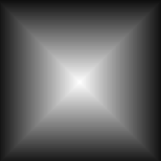

# Form

<table>
<tr style="border: 0;">
<td width="33.33%" style="border: 0;" valign="top">

{width="128px"}

<b>In:</b> Texturen > Muster generieren

</td>
<td width="100.00%" style="border: 0;" valign="top">

## Beschreibung

Generiert eine Vielzahl prozeduraler Formen mit Optionen zum Ändern von Grundformen. Die Formen sind immer perfekt interpoliert und präzise.

Trotz seiner Einfachheit ist dies ein sehr nützlicher Knoten: Es ist der Baustein der prozeduralsten Höhenkartengeneration! Wenn Sie Grundformen mit transformieren Knoten kombinieren, können Sie eine vollständig prozedurale Höhenkarte erstellen, die viel präziser ist als jede Bitmap.

</td>
</tr>
</table>

## Parameter

|  |  |
|:---|:---|
| <b>Kachelung</b> <i>1 - 16</i> | Legt fest, wie oft das Ergebnis gekachelt werden soll. |
| <b>Muster</b> <i>Quadrat, Datenträger, Paraboloid, Glocke, Gaußsch, Dorn, Pyramide, Ziegel, Abstufung, Wellen, Halbglocke, Rändelglocke, Kreskant, Kapsel, Kegel, Hemisphäre</i> | Wählt die zu verwendende Musterform aus. |
| <b>Musterspezifisch</b> <i>0.0 - 1.0</i> | Hier können Sie die Form des ausgewählten Musters ändern. Der Effekt hängt vom ausgewählten Muster ab. |
| <b>Skalierung</b> <i>0.0 - 1.0</i> | Skaliert die gesamte Form. |
| <b>Größe</b> <i>0.0 - 1.0</i> | Ermöglicht eine ungleichmäßige Skalierung über die X- oder Y-Achse. |
| <b>Winkel</b> <i>0.0 - 1.0</i> | Dreht die gesamte Form. |
| <b>Drehung 45°</b> <i>False/True</i> | Dreht sich bei voreingestellten 45 Grad. |
| <b>Quadratische Ausbreitung</b> <i>False/True</i> | Ermöglicht die Kompensation von Quetsch und Dehnung bei nicht quadratischen Verhältnissen. |
| <b>Nicht quadratische Kachelung</b> <i>False/True</i> | Wenn die Quadratische Ausbreitung aktiviert ist, wird die Form ohne Quetschen gekachelt. |

## Beispiele

<table style="margin-top: 32px; margin-bottom: 32px">
    <tr style="border: 0">
        <td style="border: 0; background: transparent">
            
        </td>
    </tr>
</table>
