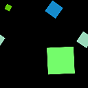

# Spritzer

<table>
<tr style="border: 0;">
<td width="33.33%" style="border: 0;" valign="top">

<b>In:</b> Texturgeneratoren > Muster

</td>
<td width="100.00%" style="border: 0;" valign="top">

## Beschreibung

Splatter ist ein Mustergenerator, der für die zufällige Platzierung eines Karteneingangs vorgesehen ist. Es verfügt über viele Steuerelemente für die geometrisch gemusterte Platzierung und ist einfacher in der Verwendung als [Tile Generator](../../../../../../compositing-graphs/nodes-reference-for-com/node-library/texture-generators/patterns/tile-generator/tile-generator.md). Letzteres kann ähnliche Ergebnisse erzielen, ist aber viel komplexer.

Spritzer eignen sich gut, um schnell einige Formen zu stempeln, ohne dass zu viele Anpassungen erforderlich sind.

Beachten Sie, dass die standardmäßigen Splatter-Parameter überhaupt nicht zufällig aussehen: Sie müssen einige von ihnen anpassen, um randomisiert zu werden (hauptsächlich die Parameter der Störung). Beachten Sie auch, dass Splatter eine Map-Eingabe erfordert, um zu arbeiten.

</td>
</tr>
</table>

## Parameter

|  |  |
|:---|:---|
| <b>Breite der Mustergröße</b> <i>0.0 - 1000.0</i> | Anzahl der auf der X-Achse zu verwendenden Muster. |
| <b>Height der Mustergröße</b> <i>0.0 - 1000.0</i> | Anzahl der auf der Y-Achse zu verwendenden Muster. |
| <b>Drehung</b> <i>-360.0 - 360.0</i> | Dreht jedes Muster um einen bestimmten Wert. |
| <b>Drehungsvariation</b> <i>0.0 - 360.0</i> | Führt eine zufällige Drehung für jede separate Form ein. |
| <b>Zoom</b> <i>100.0 - 10000.0</i> | Vergrößert das Endergebnis Behalte im Hinterkopf, dass das die Kachelung zerstört! |
| <b>Verstärkung</b> <i>0.0 - 10.0</i> | Passt die Mischverstärkung für jedes Muster an. Sie heben sich besser ab. |
| <b>Schwenken X</b> <i>-100.0 - 100.0</i> | Schwenk das ganze Ergebnis auf X-Achse. |
| <b>Pan Y</b> <i>-100.0 - 100.0</i> | Schwenken des ganzen Ergebnisses auf der Y-Achse. |
| <b>Störung</b> <i>0.0 - 100.0</i> | Verschiebt Formen zufällig. |
| <b>Raster-Nummer</b> <i>0 - 8</i> | Wechselt durch verschiedene Raster-Größen, um die Ergebnisskala anzupassen. Bewahrt die Kachelung. |
| <b>Störungswinkel</b> <i>0.0 - 360.0</i> | Steuert den Winkel der Disorder Shift. |
| <b>Zufallsstörung</b> <i>False/True</i> | Randomisiert den Winkel der Störung und sorgt für mehr Chaos. |
| <b>Mustergröße</b> <i>5 - 12</i> |  |
| <b>Größenänderung</b> <i>0.0 - 100.0</i> | Führt eine zufällige Skalierung für jede Form ein. |
| <b>Filterungen zur Bildeingabe (nur Engine > v4)</b> <i>Bilinear + Mipmaps, Bilinear, Nächste</i> | Welche Filterung auf das Eingabebild angewendet werden soll. |
| <b>Min. für Ausgangspegel</b> <i>0.0 - 1.0</i> | Keine Anpassung des Mindestniveaus. |
| <b>Max. Ausgangspegel</b> <i>0.0 - 1.0</i> | Maximale Pegelanpassung vorbei. |
| <b>Hintergrundfarbe</b> <i>(Graustufenwert)</i> | Legt eine einfarbige Hintergrundfarbe fest. |
| <b>Variation der Luminanz</b> <i>0.0 - 1.0 (nur Graustufenversion)</i> | Einführung in die Variation von Luminanzen. |
| <b>Farbvariation</b> <i>0.0 - 1.0 (Nur Farbversion)</i> | Einführung in Farbvariationen. |

## Beispiele

<table style="margin-top: 32px; margin-bottom: 32px">
    <tr style="border: 0">
        <td style="border: 0; background: transparent">
            
        </td>
    </tr>
</table>
