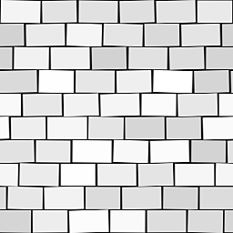

# Kachelgenerator

<table>
<tr style="border: 0;">
<td width="33.33%" style="border: 0;" valign="top">

{width="128px"}

<b>In:</b> Texturgeneratoren > Muster

</td>
<td width="100.00%" style="border: 0;" valign="top">

## Beschreibung

Tile Generator ist einer der am weitesten fortgeschrittenen Knoten in der Bibliothek. Wenn du lernst, es zu beherrschen, kannst du jede Art von Muster erstellen (innerhalb einiger Einschränkungen). Seit Version 2017 2.1 wurden einige große Updates veröffentlicht, die diesen Knoten mehr in Einklang mit den Möglichkeiten von [Sampler anordnen](../../../../../../compositing-graphs/nodes-reference-for-com/node-library/texture-generators/patterns/tile-sampler/tile-sampler.md) bringen.

Dieser Knoten ist für eine Vielzahl von Szenarien sehr nützlich. Beachten Sie jedoch, dass Sie beim Lesen von Parametern nicht vollständig lernen können, wie Sie sie verwenden. Wir empfehlen Ihnen, auch zu experimentieren!

Für 99% aller Fälle wird die Farbversion NICHT benötigt!

Einige allgemeine Tipps zur Verwendung:

* Sie können mit einer Grundform beginnen, aber wenn Sie über eine benutzerdefinierte Eingabe verfügen (legen Sie **Mustertyp** auf *Bildeingabe* fest), erstellen Sie diese zuerst! Es bestimmt einen großen Teil des Aussehens.
* Beginnen Sie mit der korrekten Einstellung der X- und Y-Werte.
* Finden Sie den richtigen **Size**-Modus: Relative Modi wie **Interstice** verhalten sich ganz anders als **Absolute** Modi.
* Globale **Skalierung** und nicht einheitliche **Größe** als Nächstes anpassen.
* Passen Sie schließlich jeden **-Parameter &quot;Variation&quot;** an, bis er Ihren Anforderungen entspricht. Subtilität ist der Schlüssel zur Variation!

</td>
</tr>
</table>

## Eingaben

|  |  |
|:---|:---|
| <b>Mustereingabe 1-6</b> <i>Graustufen-Eingabe</i> | Benutzerdefiniertes Musterbild, das verwendet wird, wenn der Parameter &quot;Muster&quot; auf &quot;Bildeingabe&quot; eingestellt ist. |
| <b>Hintergrund</b> <i>Graustufen-Eingabe</i> | Der zu verwendende Hintergrund anstelle der Volltonfarbe. |

## Parameter

|  |  |
|:---|:---|
| <b>X Betrag</b> <i>1 - 64</i> | Anzahl der X-Wiederholungen des Musters. |
| <b>Y Betrag</b> <i>1 - 64</i> | Anzahl der Y-Wiederholungen des Musters. |
| <b>Quadratische Ausbreitung</b> <i>False/True</i> | Ermöglicht die Kompensation von Quetsch und Dehnung bei nicht quadratischen Verhältnissen. |
| <b>Muster</b> |  |
| <b>Muster</b> <i>Bildeingabe, Quadrat, Datenträger, Paraboloid, Glockensymbol, Gaußsch, Dorn, Pyramide, Ziegel, Abstufung, Wellen, Halbglocke, Rändelglocke, Mondsichel, Kapsel, Kegel</i> | Wählt die zu verwendende Musterform aus. |
| <b>Mustereingabenummer</b> <i>1 - 6</i> | Anzahl der zu verwendenden verschiedenen Bildeingaben. Nur verfügbar, wenn oben &quot;<i>Image Input</i>&quot; ausgewählt wurde. |
| <b>Mustereingabeverteilung</b> <i>Zufällig, nach Musternummer</i> | Wählen Sie zwischen den verschiedenen Bildeingängen, wenn mehr als 1 ausgewählt ist. |
| <b>Musterspezifisch</b> <i>0.0 - 1.0</i> | Hier können Sie die Form des ausgewählten Musters ändern. Der Effekt hängt vom ausgewählten Muster ab. |
| <b>Filterungen zur Bildeingabe (nur Engine >v4)</b> <i>Bilinear + Mipmaps, Bilinear, Nächste</i> |  |
| <b>Drehung</b> <i>0, 90, 180, 270</i> | Dreht alle Kacheln global um einen bestimmten Winkel in Schritten von 90 Grad. |
| <b>Drehung zufällig</b> <i>0.0 - 1.0</i> | Dreht eine Kachel zufällig um einen von vier 90-Grad-Schritten. |
| <b>Quincunx Flip</b> <i>False/True</i> | Dreht jede zweite Kachel um 90 Grad. |
| <b>Symmetrie zufällig</b> <i>0.0 - 1.0</i> | Spiegelt zufällig bestimmte Muster durch die ausgewählte Symmetrie Zufallsmodus. Je höher dieser Wert, desto mehr Muster werden gespiegelt. |
| <b>Zufallsmodus der Symmetrie</b> <i>Horizontal + Vertikal, Horizontal, Vertikal</i> | Bestimmt das Spiegelungsverhalten, wenn die zufällige Symmetrie größer als 0 ist. |
| <b>Größe</b> |  |
| <b>Größenmodus</b> <i>Normal - Abstand, Normal - Größe, Verhältnis beibehalten, Absolut, Pixel</i> | Legt das allgemeine Verhalten der Mustergröße fest.  Normal: In der Zwischenablage können Sie den Abstand zwischen den Musterelementen definieren. Er wird durch den X- und Y-Wert beeinflusst.  Normal: Mit &quot;Größe&quot; können Sie die Größe der Musterelemente definieren, unabhängig von der Lücke. Er wird durch den X- und Y-Wert beeinflusst.  Mit &quot;Verhältnis beibehalten&quot; können Sie eine Größe festlegen, die von der Größe X und Y beeinflusst wird. Das Verhältnis X und Y zwischen den beiden bleibt jedoch erhalten.  Mit &quot;Absolut&quot; können Sie eine absolute Größe festlegen, die nicht durch den X- und Y-Wert beeinflusst wird.Mit   Pixel können Sie eine absolute Größe in Pixeln festlegen, die von der X- und Y-Größe nicht beeinflusst wird. Eine Änderung der Auflösung wirkt sich auf die Größe der Elemente aus. |
| <b>Mittlere Größe</b> <i>0.0 - 1.0</i> | Ändert die Größe abwechselnd auf Spalten- und Zeilenbasis. |
| <b>Interstice X/Y</b> <i>0.0 - 1.0</i> | Nur verfügbar im Modus &quot;Normal&quot; - &quot;Schnittstellengröße&quot;. Ändert die Lücke in der Lücke. Wirkt sich auf die Naht zwischen Formen aus und ermöglicht eine ungleichmäßige Steuerung im Gegensatz zu <b>Skalierung</b>. |
| <b>Größe (Absolut/Pixel)</b> <i>0.0 - 1.0</i> | Nur außerhalb von &quot;Normal&quot; verfügbar - Schnittstellengrößenmodus. Legt im Gegensatz zu <b>Skalierung</b> eine nicht einheitliche Größe fest. |
| <b>Skalierung</b> <i>0.0 - 2.0</i> | Legt die globale Skalierung fest. |
| <b>Zufällige Skalierung</b> <i>0.0 - 1.0</i> | Legt die globale Skalierungsvariation pro Kachel fest. |
| <b>Zufallsverteilung skalieren</b> <i>0 - 1000</i> | Verschiebt die Skalierungsvariationsgeschwindigkeit. |
| <b>Position</b> |  |
| <b>Offset</b> <i>0.0 - 1.0</i> | Verschiebt das gesamte Muster schrittweise über alle aufeinander folgenden Zeilen oder Spalten hinweg (das Verhalten hängt von dem Parameter &quot;Vertikaler Versatz&quot; ab). |
| <b>Offset zufällig</b> <i>0.0 - 1.0</i> | Zufallsverteilung der Zeilenverschiebung. |
| <b>Zufallsverteilung versetzen</b> <i>0 - 1000</i> | Ändert die relative Geschwindigkeit für den zufälligen Versatzeffekt. |
| <b>Vertikaler Versatz</b> <i>False/True</i> | Legt fest, ob der Versatzeffekt auf Zeilen oder Zeilen angewendet wird. Horizontal oder Vertikal. |
| <b>Position zufällig</b> <i>0.0 - 1.0</i> | Uneinheitlich zufällige Positionierung mit separater Steuerung für X und Y. |
| <b>Globaler Offset</b> <i>0.0 - 1.0</i> | Verschiebt das gesamte Ergebnis über X- und Y-Achsen. |
| <b>Drehung</b> |  |
| <b>Drehung</b> <i>0.0 - 1.0</i> | Ermöglicht eine gleichmäßige freie Drehung aller Musterelemente. |
| <b>Drehung zufällig</b> <i>0.0 - 1.0</i> | Randomisiert die freie Drehung aller Kacheln. Je höher dieser Wert ist, desto mehr Kacheln können gedreht werden. |
| <b>Farbe</b> |  |
| <b>Farbe</b> <i>(Graustufenwert)</i> | Legt die Volltonfarbe für Kacheln fest. |
| <b>Luminanz/Farbzufall</b> <i>0.0 - 1.0</i> | Führt die Variation von Farbe oder Luminanz pro Kachel ein. |
| <b>Luminanz nach Nummer</b> <i>False/True</i> | Verblasst die Luminanz über das gesamte Muster. |
| <b>Luminanz nach Skalierung</b> <i>False/True</i> | Macht die Variation der Luminanz von der Kachelgröße abhängig. |
| <b>Prüfmaske</b> <i>False/True</i> | Blendet alle anderen Kacheln aus. |
| <b>Horizontale Maske</b> <i>False/True</i> | Blendet jede zweite Spalte aus. |
| <b>Vertikale Maske</b> <i>False/True</i> | Blendet jede zweite Zeile aus. |
| <b>Zufallsmaske</b> <i>0.0 - 1.0</i> | Blendet Kacheln zufällig aus. Je höher dieser Wert ist, desto mehr Kacheln werden ausgeblendet. |
| <b>Maske umkehren</b> <i>False/True</i> | Kehrt das Ergebnis aller Maskierungseffekte aus diesem Abschnitt um. |
| <b>Füllmethode</b> <i>Hinzufügen, Max, Sub hinzufügen</i> | Legt fest, welche Füllmethode verwendet wird. |
| <b>Hintergrundfarbe</b> <i>(Graustufenwert)</i> | Legt eine einfarbige Hintergrundfarbe fest. |
| <b>Globale Deckkraft</b> <i>0.0 - 1.0</i> | Legt die Deckkraft globaler Kacheln fest. |
| <b>Renderreihenfolge umkehren</b> <i>False/True</i> | Die Kacheln werden nach vorne gerendert oder umgekehrt. |

## Beispiele

<table style="margin-top: 32px; margin-bottom: 32px">
    <tr style="border: 0">
        <td style="border: 0; background: transparent">
            
        </td>
        <td style="border: 0; background: transparent">
            
        </td>
        <td style="border: 0; background: transparent">
            
        </td>
        <td style="border: 0; background: transparent">
            
        </td>
    </tr>
</table>
