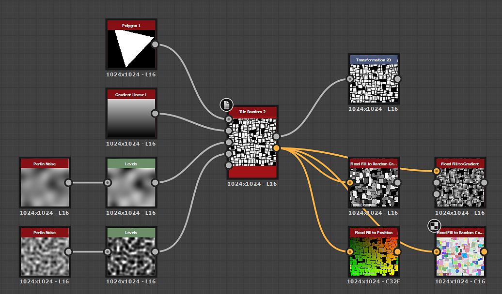

# Kachel zufällig 2

<table>
<tr style="border: 0;">
<td width="41.60%" style="border: 0;" valign="top">

{width="200px"}

**In:** *Texturgeneratoren* */Muster*

**Komplex**

</td>
<td width="58.30%" style="border: 0;" valign="top">

## Beschreibung

Der Knoten **Kachelzufall 2** generiert benachbarte Kacheln mit zufälligen Größen und Height-zu-Breite-Verhältnissen.

Das Raster kann durch zufällige *Neigung* der Seiten der Formen verfeinert werden, um die Winkel aufzubrechen.

Formen können mit Optionen für *Skalierung*, *Abgeflachte Kante*, *Abrundung der Ecken* sowie *verzerrte Drehung* angepasst werden.

Diese Anpassungen können durch *Eingabemaps* gesteuert werden.

Mit einer dedizierten Ausgabe können Sie die **UVs** der Form in **Flood Fill für (...)** eingeben. Knoten zur Anwendung zusätzlicher Variationen.

</td>
</tr>
</table>

## Parameter

### Eingaben

* **Karte zufälliger Größe** *Graustufen*\
  Das Graustufen-Eingabebild, das den zufälligen Maßstab der Formen steuert.\
  Die Auswirkungen werden durch den **Random Size Input Map Multiplier**-Parameter gesteuert.
* **Karte mit zufälliger Neigung** *Graustufen* Das Graustufen-Eingabebild, das die zufällige Neigung der Formen steuert.\
  Die Auswirkungen werden durch den Parameter **Zufällige Schrägeingabe-Zuordnungsmultiplikator** gesteuert.
* **Abgerundete Ecken, Radiuskarte** *Graustufen*\
  Das Graustufen-Eingabebild, das den Radius der abgerundeten Ecken der Formen steuert.\
  Die Auswirkungen werden von der **Rundungsecken-Radius-Eingabemaske Mult.** gesteuert. -Parameter.
* **Abgeflachte Abstands-Map** *Graustufen*\
  Das Graustufen-Eingabebild, das die Abschrägung der Formen steuert.\
  Die Auswirkungen werden von der **Abgeflachte Kante - Einzugszuordnung (Inputmap) Mult.** gesteuert -Parameter.
* **Maskenzuordnung** *Graustufen*\
  Das Graustufen-Eingabebild, das die Maskierung der Formen steuert.\
  Die Auswirkungen werden durch die Parameter **Mask Map Input Start** und **Mask Map Input End** gesteuert.

### Parameter

* **Betrag X** *Ganzzahl*\
  Die Anzahl der Zellen auf der Achse **X**.
* **Betrag Y** *Ganzzahl*\
  Die Anzahl der Zellen auf der Achse **Y**.
* Größe
  * **Zufallsgrößenmultiplikator** *Gleitend*\
    Wendet eine *globale*-Anpassung auf die Intensität der zufälligen Skalierung an.
  * **Zuordnungsmultiplikator für Zufallsgröße** *Gleitkomma*\
    Passt die Intensität der zufälligen Skalierung unter Verwendung der Werte *, die* von der **Karte zufälliger Größe** eingegeben wurden, an.
  * **Zufallsgröße X** *Gleitend*\
    Passt die Intensität der zufälligen Skalierung auf der **X**-Achse *nur* an.
  * **Zufallsgröße Y** *Gleitend*\
    Passt die Intensität der zufälligen Skalierung auf der **Y**-Achse *nur* an.
  * **Verteilung zufälliger Größen** *Ganze Zahl*\
    Steuert die Methode zur Verteilung zufälliger Skalierungswerte:
    * *Einheitlich*: Die zufällige Skala wird *auf die gleiche Weise* auf alle Zellen angewendet.
    * *Blaues Rauschen*: die zufällige Skala *angepasst* wird, indem ein blaues Rauschmuster verwendet wird
* Formenaspekt - Transformieren
  * **Interstice-Thickness** *Gleitend* Passt die Thickness des Abstands zwischen Formen an. Sie ist *gleich für alle* Formen.
  * **Zufallspositionsmultiplikator** *Gleitkomma*\
    Wendet einen zufälligen Positionsoffset auf das Shape an, bis es *den Zellenrand erfüllt*.
  * **Radius abgerundeter Ecken** *Gleitend* Passt den *Radius* der abgerundeten Ecken der Formen an. Ein Wert von **0** bedeutet, dass keine Rundung angewendet wird.\
    *Hinweis*: Dieser Effekt kann nicht angewendet werden, wenn der Parameter &quot;**Aktivieren pro Achse - Bevel Control**&quot; auf &quot;*True*&quot; festgelegt ist.
  * **Runde Ecken, Radius, Eingabemaske, Mult.** *Gleitend* Passt die Intensität an, mit der die **Karte mit dem abgerundeten Eckenradius**-Eingabemap den Radius der abgerundeten Ecken beeinflusst.\
    Die Karte fungiert als *Multiplikator pro Pixel* für den Parameter **Radius abgerundeter Ecken**.\
    *Hinweis*: Dieser Effekt kann nicht angewendet werden, wenn der Parameter &quot;**Aktivieren pro Achse - Bevel Control**&quot; auf &quot;*True*&quot; festgelegt ist.
  * **Skalierungsmultiplikator** *Gleitend*\
    Passt die Größe jeder Form proportional zum *-Bereich ihrer Zelle* an.
  * **Zufällige Skalierung** *Unverankert* Passt die Intensität an, mit der eine zufällige Skalierung auf die *jede*-Form angewendet wird.
  * **Drehung** *Schwebendes Objekt* Dreht Formen in ihren Zellen, indem jede *Ecke* an ihren *Nachbarn* entlang des Zellenrandes verschoben wird.\
    Diese Methode führt dazu, dass ein gewisser Betrag von *Verzerrung* und *Skalierung* auf die Form angewendet wird, wenn sie gedreht wird.
  * **Drehung zufällig** *Unverankert* Passt die Intensität an, um die eine zufällige Drehung auf jede Form angewendet wird.\
    Die Rotationsmethode wird im Parameter **Drehung** beschrieben.
  * **Ecken Zufällige Position** *Unverankert* Verzerrt die Formen, indem ein zufälliger Betrag von *Versatz* auf jede ihrer *Ecken* entlang des Zellenrands angewendet wird.
* Neigung
  * **Zufallsneigungsmultiplikator** *Gleitkomma*\
    Wendet eine *globale*-Anpassung auf die Intensität der zufälligen Neigung an.
  * **Zufällige Schrägeingabe-Zuordnungsmultiplikator** *Gleitkomma*\
    Passt die Intensität der zufälligen Neigung mit den Werten *in* von der **Karte mit zufälliger Neigung** an.
  * **Zufällige Neigung X** *Gleitkomma*\
    Passt die Intensität der zufälligen Neigung an.\
    auf der **X**-Achse *nur*.
  * **Zufällige Neigung Y** *Gleitkomma*\
    Passt die Intensität der zufälligen Neigung an.\
    auf der **Y**-Achse *nur*.
  * **Zufallsverteilung** *Ganzzahl*\
    Steuert die Methode zur Verteilung zufälliger Schrägwerte:
    * *Einheitlich*: Die zufällige Neigung wird *auf die gleiche Weise* auf alle Zellen angewendet.
    * *Blaues Rauschen*: Die zufällige Neigung wird *angepasst*, wobei ein blaues Rauschmuster verwendet wird.
* Abgeflachte Kante
  * **Abgeflachter Abstandsmodus** *Ganzzahl*\
    Legt die Methode für *fest, um den Abstand* zu erfassen, um den Formen abgeschrägt werden sollen:
    * *Relativ zur Rastergröße*: Formen werden nach dem angegebenen *Anteil ihrer Rastergröße abgeschrägt*- *Relativ zur Formgröße*: Die Formen werden nach dem angegebenen *Verhältnis ihrer Größe abgeschrägt*
    * *Relativ zur Bildgröße*: Die Formen werden um die angegebene *Proportion des Bildes abgeschrägt*.
  * **Multiplikator für die Abflachung** *Gleitend*\
    Wendet eine *globale*-Anpassung auf den Abstand der Abschrägung an.
  * **Eingegebene Abstandszuordnung für abgeflachte Kante.** *Gleitend*\
    Passt den Abstand der Abschrägung mithilfe der Eingabezuordnung **Abgeflachte Abstands-Map** als *Multiplikator pro Pixel* an.
  * **Abgeflachte abgerundete Kurve** *Gleitend*\
    Passt die Intensität der Rundung an, die auf den Abflachungswinkel angewendet wird, um ihn *konvexer* zu machen.
  * **Aktivieren pro Achse Bevel Control** *Boolean*\
    Wenn *True*, kann die Abschrägung separat *angewendet und angepasst werden* auf den Achsen **X** und **Y**.\
    *Hinweis*: Dadurch *wird* der Effekt **Abgerundete Ecken** abgebrochen.
  * **Abgeflachte Kante X** *Gleitend*\
    Passt den Abstand der Abschrägung auf der **X**-Achse *nur* an. Dieser Abstand hängt vom Wert des Parameters **Abgeflachte Kante - Modus** ab.\
    *Hinweis*: Dieser Parameter ist nur verfügbar, wenn der Parameter &quot;**Aktivieren pro Achse (Bevel Control)**&quot; auf &quot;*True*&quot; festgelegt ist.
  * **Abschrägungsabstand Y** *Gleitend*\
    Passt den Abstand der Abschrägung auf der **Y**-Achse *nur* an. Dieser Abstand hängt vom Wert des Parameters **Abgeflachte Kante - Modus** ab.\
    *Hinweis*: Dieser Parameter ist nur verfügbar, wenn der Parameter &quot;**Aktivieren pro Achse (Bevel Control)**&quot; auf &quot;*True*&quot; festgelegt ist.
* Maske
  * **Zufällige Maskenumkehrung** *Boolesch*\
    Kehrt die zufällige Maskierung von Formen um.
  * **Zufallsstart maskieren** *Gleitkomma*\
    Für eine gegebene **Zufallsverteilung** wird eine pseudozufällige Maskierung in einer *spezifischen Reihenfolge* von einer Startform auf eine Endform angewendet. Mit diesem Parameter können Sie *den Index* der *Start*-Form versetzen.\
    *Hinweis*: Dadurch wird ein Grenzwert für den *Wertebereich* für die Maskierung festgelegt. Der Wert kann daher *größer* als der **Wert für zufälliges Maskenende** sein.
  * **Zufälliges Maskenende** *Unverankert* Für ein gegebenes **Zufälliges Objekt** wird eine pseudozufällige Maskierung nach einer *spezifischen Reihenfolge* von einer Startform auf eine Endform angewendet. Mit diesem Parameter können Sie *den Index* der Form *Ende* versetzen.\
    *Hinweis*: Dadurch wird ein Grenzwert für den *Wertebereich* für die Maskierung festgelegt. Der Wert kann daher *größer* als der **Wert für zufälligen Start maskieren** sein.
  * **Maske nach Zellenbereichsumkehr** *Boolesch*\
    Kehrt die Maskierung von Formen nach dem Bereich ihrer Zellen um.
  * **Maske nach Zellenbereichsstart** *Gleitend*\
    Passt den Bereichsschwellenwert der Zelle *Minimum* zum Maskieren von Formen an.\
    *Hinweis*: Dadurch wird ein Grenzwert für den *Wertebereich* für die Maskierung festgelegt. Der Wert kann daher *größer* als der Wert **Maske durch Zellenbereichsende** sein.
  * **Maske nach Zellenende** *Unverankert* Passt den Bereichsschwellenwert der Zelle *Maximum* zum Maskieren von Formen an.\
    *Hinweis*: Dadurch wird ein Grenzwert für den *Wertebereich* für die Maskierung festgelegt. Der Wert kann daher *niedriger* sein als der Wert **Maske durch Zellenbereichsstart**.
  * **Umkehrung der Maskenzuordnungs-Eingabe** *Boolesch*\
    Kehrt die Maskierung von Formen durch die Eingabezuordnung **Maskieren** um.
  * **Beginn der Maskenzuordnungseingabe** *Gleitkomma*\
    Passt den *minimalen Graustufenwert*-Schwellenwert in der **Maskenzuordnung**-Eingabezuordnung zum Maskieren von Formen an.\
    *Hinweis*: Dadurch wird ein Grenzwert für den *Wertebereich* für die Maskierung festgelegt. Der Wert kann daher *größer* als der **Wert für das Ende der Maskenzuordnung** sein.
  * **Ende der Maskenzuordnungs-Eingabe** *Gleitkomma* Passt den *maximalen Graustufenwert*-Schwellenwert in der **Maskenzuordnung**-Eingabemap zum Maskieren von Formen an.\
    *Hinweis*: Dadurch wird ein Grenzwert für den *Wertebereich* für die Maskierung festgelegt. Der Wert kann daher *niedriger* sein als der **Wert für den Beginn der Maskenzuordnung**.

## Beispielbilder

<table>
<tr style="border: 0;">
<td style="border: 0;" valign="top">

{width="256px"}

</td>
<td style="border: 0;" valign="top">

{width="256px"}

</td>
<td style="border: 0;" valign="top">

{width="256px"}

</td>
<td style="border: 0;" valign="top">

{width="512px"}

</td>
<td style="border: 0;" valign="top">

{width="512px"}

</td>
<td style="border: 0;" valign="top">

{width="512px"}

</td>
<td style="border: 0;" valign="top">

{width="340px"}

</td>
</tr>
</table>
