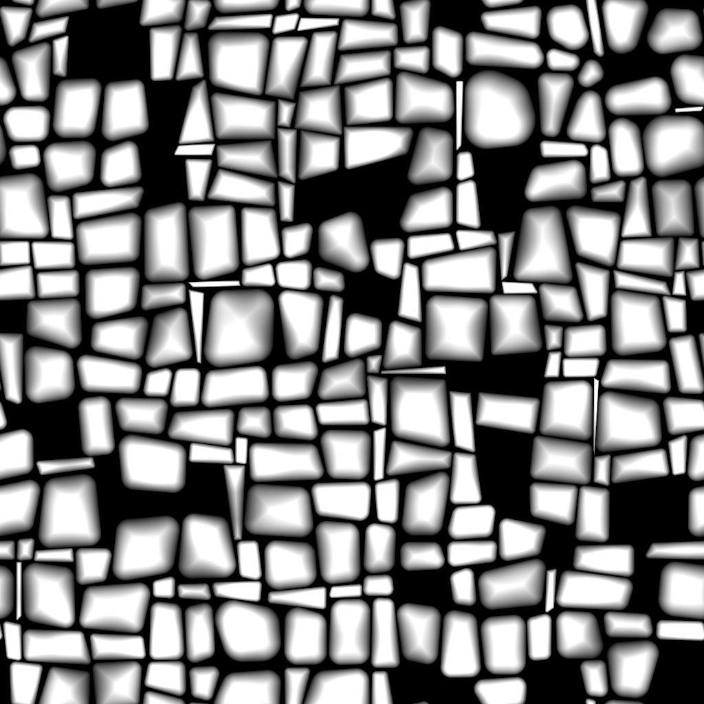

# Kachel zufällig 2

<table>
<tr style="border: 0;">
<td width="33.33%" style="border: 0;" valign="top">

{width="200px"}

<b>In:</b> Texturgeneratoren > Muster

</td>
<td width="100.00%" style="border: 0;" valign="top">

## Beschreibung

Der Knoten **Kachelzufall 2** generiert benachbarte Kacheln mit zufälligen Größen und Height-zu-Breite-Verhältnissen.

Der Raster kann durch zufällige *Schrägstellung* an den Seiten der Formen verfeinert werden, um die Winkel aufzubrechen.

Formen können mit Optionen für *Skalierung*, *Abgeflachte Kante*, *Abrundung der Ecken* sowie *verzerrte Drehung* angepasst werden.

Diese Korrekturen können von *Eingabe-Map* gesteuert werden.

Mit einer dedizierten Ausgabe können Sie die **UVs** der Form in **Flood Fill für (...)** eingeben. Knoten zur Anwendung zusätzlicher Variationen.

</td>
</tr>
</table>

## Eingaben

|  |  |
|:---|:---|
| <b>Karte zufälliger Größe</b> <i>Graustufen</i> | Das Graustufen-Eingabebild, das die zufällige Skalierung der Formen steuert.  Die Auswirkungen werden durch den Parameter <b>Zufällige Größe Eingabe-Map-Multiplikator</b> gesteuert. |
| <b>Zufällige Schrägzuordnung</b> <i>Graustufen</i> | Das Graustufen-Eingabebild, das die zufällige Neigung der Formen steuert.  Die Auswirkungen werden durch den Parameter <b>Zufällige Neigung des Eingabe-Map-Multiplikators</b> gesteuert. |
| <b>Abgerundete Ecken, Radiuszuordnung</b> <i>Graustufen</i> | Das Graustufen-Eingabebild, das den Radius der abgerundeten Ecken der Formen steuert.  Die Auswirkungen werden durch die Eingabe-Map-Mult.</b> für abgerundete Ecken mit dem Radius <b>festgelegt. -Parameter. |
| <b>Abgeflachte Abstands-Map</b> <i>Graustufen</i> | Das Graustufen-Eingabebild, das die Abschrägung der Formen steuert.  Die Auswirkungen werden durch die Eingabe-Map-Mult.</b> für die <b>Abschrägungsdistanz gesteuert. -Parameter. |
| <b>Maskenzuordnung</b> <i>Graustufen</i> | Das Graustufen-Eingabebild, das die Maskierung der Formen steuert.  Die Auswirkungen werden durch die Parameter <b>Mask Map Input Start</b> und <b>Mask Map Input End</b> gesteuert. |

## Parameter

|  |  |
|:---|:---|
| <b>Betrag X</b> <i>Integer</i> | Die Anzahl der Zellen auf der Achse <b>X</b>. |
| <b>Betrag Y</b> <i>Integer</i> | Die Anzahl der Zellen auf der Achse <b>Y</b>. |
| <b>Größe</b> |  |
| <b>Zufallsgrößenmultiplikator</b> <i>Gleitend</i> | Wendet eine <i>globale</i>-Anpassung auf die Intensität der zufälligen Skalierung an. |
| <b>Eingabe-Map-Multiplikator für zufällige Größe</b> <i>Gleitend</i> | Passt die Intensität der zufälligen Skalierung unter Verwendung der Werte <i>, die </i> von der <b>Karte zufälliger Größe</b> eingegeben wurden, an. |
| <b>Zufallsgröße X</b> <i>Gleitend</i> | Passt die Intensität der zufälligen Skalierung auf der <b>X</b>-Achse <i>nur</i> an. |
| <b>Zufallsgröße Y</b> <i>Gleitend</i> | Passt die Intensität der zufälligen Skalierung auf der <b>Y</b>-Achse <i>only</i> an. |
| <b>Verteilung zufälliger Größen</b> <i>Integer</i> | Steuert die Methode zur Verteilung zufälliger Skalierungswerte:  - <i>Uniform</i>: Die zufällige Skala wird <i>auf alle Zellen  - <i>Blue-Rauschen </i> auf dieselbe Weise </i> angewendet: Die zufällige Skala wird <i>angepasst</i> mit einem blauen Rauschen-Muster. |
| <b>Formaspekt - Transformieren</b> |  |
| <b>Interstice-Thickness</b> <i>Gleitend</i> | Passt die Thickness des Zwischenraums zwischen Formen an. Sie ist <i>gleich für alle </i> Formen. |
| <b>Zufallspositionsmultiplikator</b> <i>Gleitend</i> | Wendet einen zufälligen Positionsoffset auf das Shape an, bis es <i>den Zellenrand erfüllt</i>. |
| <b>Radius abgerundeter Ecken</b> <i>Gleitend</i> | Passt den <i>Radius</i> der abgerundeten Ecken der Formen an. Ein Wert von <b>0</b> bedeutet, dass keine Rundung angewendet wird.  <i>Hinweis</i>: Dieser Effekt kann nicht angewendet werden, wenn der Parameter <b>Aktivieren pro Achse Bevel Control</b> auf <i>True</i> festgelegt ist. |
| <b>Radius abgerundeter Ecken Eingabe-Map Mult.</b> <i>Gleitend</i> | Passt die Intensität an, mit der die <b>Rundungswinkel-Radiuszuordnung</b>-Eingabe-Map den Radius der abgerundeten Ecken beeinflusst.  Die Karte fungiert als <i>Multiplikator pro Pixel</i> für den Parameter <b>Radius abgerundeter Ecken</b>.  <i>Hinweis</i>: Dieser Effekt kann nicht angewendet werden, wenn der Parameter <b>Aktivieren pro Achse Bevel Control</b> auf <i>True</i> festgelegt ist. |
| <b>Skalierungsmultiplikator</b> <i>Gleitend</i> | Passt die Größe jeder Form proportional zum <i>-Bereich ihrer Zelle </i> an. |
| <b>Zufällige Skalierung</b> <i>Gleitend</i> | Passt die Intensität an, mit der eine zufällige Skalierung auf <i>jede</i>-Form angewendet wird. |
| <b>Drehung</b> <i>Gleitend</i> | Dreht Formen in ihren Zellen, indem jede <i>Ecke</i> an ihren <i>Nachbarn</i> entlang des Zellenrahmens verschoben wird.  Diese Methode führt dazu, dass ein gewisser Betrag von <i>Verzerrung</i> und <i>Skalierung</i> auf die Form angewendet wird, wenn sie sich dreht. |
| <b>Drehung zufällig</b> <i>Gleitend</i> | Passt die Intensität an, mit der eine zufällige Drehung auf jede Form angewendet wird.  Die Rotationsmethode wird im Parameter <b>Drehung</b> beschrieben. |
| <b>Ecken, Position zufällig</b> <i>Gleitend</i> | Verzerrt die Formen, indem ein zufälliger Betrag von <i>offset</i> auf jede ihrer <i>Ecken</i> entlang des Zellenrands angewendet wird. |
| <b>Neigung</b> |  |
| <b>Zufallsschrägen-Multiplikator</b> <i>Gleitend</i> | Wendet eine <i>globale</i>-Anpassung auf die Intensität der zufälligen Neigung an. |
| <b>Zufällige Neigung des Eingabe-Map-Multiplikators</b> <i>Gleitend</i> | Passt die Intensität der zufälligen Neigung mit den Werten <i>in </i> von der <b>Karte mit zufälliger Neigung</b> an. |
| <b>Zufällige Neigung X</b> <i>Gleitend</i> | Passt die Intensität der zufälligen Neigung auf der <b>X</b>-Achse <i>only</i> an. |
| <b>Zufällige Neigung Y</b> <i>Gleitend</i> | Passt die Intensität der zufälligen Neigung auf der <b>Y</b>-Achse <i>only</i> an. |
| <b>Verteilung der zufälligen Neigung</b> <i>Integer</i> | Steuert die Methode zum Verteilen zufälliger Schrägwerte:  - <i>Gleichmäßig</i>: Die zufällige Neigung wird <i>auf alle Zellen  - <i>Blue Rauschen</i> auf die gleiche Weise </i> angewendet: Die zufällige Neigung wird <i>angepasst</i>, wobei ein blaues Rauschen-Muster verwendet wird. |
| <b>Abgeflachte Kante</b> |  |
| <b>Modus &quot;Abgeflachte Kante&quot;</b> <i>Integer</i> | Legt die Methode für <i> fest, um den Abstand </i> zu erfassen, um den Formen abgeschrägt werden sollen:  - <i>Relativ zur Größe des Rasters</i>: Die Formen sind nach dem angegebenen <i>Verhältnis ihrer Raster-Größe abgeschrägt</i> - <i>Relativ zur Formgröße</i>: Die Formen sind nach dem angegebenen <i>Verhältnis ihrer Größe abgeschrägt</i> - <i>Relativ zur Bildgröße</i>: Die Formen werden um die angegebene <i>Proportion des Bildes abgeschrägt</i>. |
| <b>Abstandsmultiplikator für abgeflachte Kante</b> <i>Gleitend</i> | Wendet eine <i>globale</i>-Anpassung auf den Abstand der Abschrägung an. |
| <b>Eingegebene Abstandszuordnung für abgeflachte Kante.</b> <i>Gleitend</i> | Passt den Abstand der Abschrägung mithilfe der Eingabezuordnung <b>Abgeflachte Abstands-Map</b> als <i>Multiplikator pro Pixel</i> an. |
| <b>Abgeflachte abgerundete Kurve</b> <i>Gleitend</i> | Passt die Intensität der Rundung an, die auf den Abflachungswinkel angewendet wird, um ihn <i>konvexer</i> zu machen. |
| <b>Aktivieren pro Achse Bevel Control</b> <i>Boolescher Wert</i> | Wenn <i>True</i>, kann die Abschrägung separat <i>angewendet und angepasst werden</i> für die Achsen <b>X</b> und <b>Y</b>.  <i>Hinweis</i>: Dieser <i>Bricht den <b>Effekt &quot;Abgerundete Ecken</b>&quot; ab</i>. |
| <b>Abgeflachte Kante, Abstand X</b> <i>Gleitend</i> | Passt den Abstand der Abschrägung auf der <b>X</b>-Achse <i>nur</i> an. Dieser Abstand hängt vom Wert des Parameters <b>Abgeflachte Kante, Modus</b> ab.  <i>Hinweis</i>: Dieser Parameter ist nur verfügbar, wenn der Parameter <b>Aktivieren pro Achse Bevel Control</b> auf <i>True</i> festgelegt ist. |
| <b>Abgeflachte Kante, Abstand Y</b> <i>Gleitend</i> | Passt den Abstand der Abschrägung auf der <b>Y</b>-Achse <i>nur</i> an. Dieser Abstand hängt vom Wert des Parameters <b>Abgeflachte Kante, Modus</b> ab.  <i>Hinweis</i>: Dieser Parameter ist nur verfügbar, wenn der Parameter <b>Aktivieren pro Achse Bevel Control</b> auf <i>True</i> festgelegt ist. |
| <b>Maske</b> |  |
| <b>Zufällige Umkehrung der Maske</b> <i>Boolescher Wert</i> | Kehrt die zufällige Maskierung von Formen um. |
| <b>Zufallsstart maskieren</b> <i>Gleitend</i> | Für eine gegebene <b>Zufallsverteilung</b> wird eine pseudozufällige Maskierung in einer <i>spezifischen Reihenfolge</i> von einer Startform auf eine Endform angewendet. Mit diesem Parameter können Sie <i>den Index</i> der <i>Start</i>-Form versetzen.  <i>Hinweis</i>: Dadurch wird ein Grenzwert für den <i>Wertebereich</i> für die Maskierung festgelegt. Der Wert kann daher <i>größer</i> als der <b>Wert für zufälliges Maskenende</b> sein. |
| <b>Zufälliges Maskenende</b> <i>Gleitend</i> | Für eine gegebene <b>Zufallsverteilung</b> wird eine pseudozufällige Maskierung in einer <i>spezifischen Reihenfolge</i> von einer Startform auf eine Endform angewendet. Mit diesem Parameter können Sie <i>den Index</i> der <i>Ende</i>-Form versetzen.  <i>Hinweis</i>: Dadurch wird ein Grenzwert für den <i>Wertebereich</i> für die Maskierung festgelegt. Der Wert kann daher <i>größer</i> als der <b>Wert für zufälligen Start maskieren</b> sein. |
| <b>Maske nach Zellenbereichsumkehr</b> <i>Boolescher Wert</i> | Kehrt die Maskierung von Formen nach dem Bereich ihrer Zellen um. |
| <b>Maske nach Zellenbereichsstart</b> <i>Gleitend</i> | Passt den Bereichsschwellenwert der Zelle <i>Minimum</i> zum Maskieren von Formen an.  <i>Hinweis</i>: Dadurch wird ein Grenzwert für den <i>Wertebereich</i> für die Maskierung festgelegt. Der Wert kann daher <i>größer</i> als der Wert <b>Maske durch Zellenbereichsende</b> sein. |
| <b>Maske nach Zellenbereichsende</b> <i>Gleitend</i> | Passt den Bereichsschwellenwert der Zelle <i>Maximum</i> zum Maskieren von Formen an.  <i>Hinweis</i>: Dadurch wird ein Grenzwert für den <i>Wertebereich</i> für die Maskierung festgelegt. Der Wert kann daher <i>niedriger</i> sein als der Wert <b>Maske durch Zellenbereichsstart</b>. |
| <b>Umkehrung der Maskenzuordnungs-Eingabe</b> <i>Boolescher Wert</i> | Kehrt die Maskierung von Formen durch die Eingabezuordnung <b>Maskieren</b> um. |
| <b>Beginn der Maskenzuordnungseingabe</b> <i>Gleitend</i> | Passt den <i>Graustufenmindestwert</i> in der <b>Maskenzuordnung</b>-Eingabe-Map zum Maskieren von Formen an.  <i>Hinweis</i>: Dadurch wird ein Grenzwert für den <i>Wertebereich</i> für die Maskierung festgelegt. Der Wert kann daher <i>größer</i> als der <b>Wert für das Ende der Maskenzuordnung</b> sein. |
| <b>Ende der Maskenzuordnungseingabe</b> <i>Gleitend</i> | Passt den <i>maximalen Graustufenwert</i> in der <b>Maskenzuordnung</b>-Eingabe-Map zum Maskieren von Formen an.  <i>Hinweis</i>: Dadurch wird ein Grenzwert für den <i>Wertebereich</i> für die Maskierung festgelegt. Der Wert kann daher <i>niedriger</i> sein als der <b>Wert für den Beginn der Maskenzuordnung</b>. |

## Beispiele

<table style="margin-top: 32px; margin-bottom: 32px">
    <tr style="border: 0">
        <td style="border: 0; background: transparent">
            
        </td>
        <td style="border: 0; background: transparent">
            
        </td>
        <td style="border: 0; background: transparent">
            
        </td>
        <td style="border: 0; background: transparent">
            
        </td>
        <td style="border: 0; background: transparent">
            
        </td>
        <td style="border: 0; background: transparent">
            
        </td>
        <td style="border: 0; background: transparent">
            
        </td>
    </tr>
</table>
