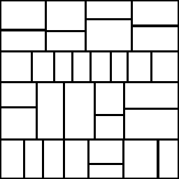

# Kachelzufall

<table>
<tr style="border: 0;">
<td style="border: 0;" valign="top">

{width="128px"}

## Kachelzufall (Farbe)

**In:** *Generatoren/Muster*

**Komplex**

</td>
<td style="border: 0;" valign="top">

## Beschreibung

&quot;Kachelzufall&quot; generiert ein prozedurales Kachelmuster, das etwas mehr Chaos in den Kachelformen aufweist als sein Gegenstück, [Tile Generator](../../../../../../compositing-graphs/nodes-reference-for-com/node-library/texture-generators/patterns/tile-generator/tile-generator.md). Dies geschieht durch zufälliges Aufteilen bestimmter Kacheln in kleinere Kacheln. Wir empfehlen Ihnen, sich zunächst mit dem Tile Generator vertraut zu machen, bevor Sie sich mit Tile Random befassen, da viele Konzepte ähnlich sind.

Anstelle von [Tile Generator](../../../../../../compositing-graphs/nodes-reference-for-com/node-library/texture-generators/patterns/tile-generator/tile-generator.md) wird &quot;Zufällig&quot; verwendet, wenn das Ziel ein älteres, weniger strukturiertes Muster ist. Es hat jedoch seine Einschränkungen. Daher sollten Sie [Sampler ](../../../../../../compositing-graphs/nodes-reference-for-com/node-library/texture-generators/patterns/tile-sampler/tile-sampler.md) für andere erweiterte Anforderungen anordnen.

## Parameter

### Eingaben

* **Mustereingabe**: *Graustufeneingabe (Farbeingabe)*\
  Benutzerdefiniertes Musterbild, das verwendet wird, wenn der Parameter &quot;Muster&quot; auf &quot;Bildeingabe&quot; eingestellt ist.
* **Hintergrundeingabe**: *Graustufeneingabe (Farbeingabe)*

### Parameter

* **X Betrag**: *1 - 64*\
  Anzahl der X-Wiederholungen des Musters.
* **Y Betrag**: *1 - 64*\
  Anzahl der Y-Wiederholungen des Musters.
* **Quadratische Ausbreitung**: *False/True*\
  Ermöglicht die Kompensation von Quetsch und Dehnung bei nicht quadratischen Verhältnissen.
* **Muster**
  * **Muster**: *Mustereingabe, Quadrat, Disc, Paraboloid, Glocke, Gaußsch, Dorn, Pyramide, Ziegel, Abstufung, Wellen, Halbglocke, Gekrächelte Glocke, Halbmond, Kapsel, Kegel*\
    Wählt die zu verwendende Musterform aus.
  * **Image Input Filtering (Engine > v4)**: *Bilinear + Mipmaps, Bilinear, Nächste*
  * **Musterspezifisch**: *0.0 - 1.0*\
    Hier können Sie die Form des ausgewählten Musters ändern. Der Effekt hängt vom ausgewählten Muster ab.
  * **Musterspezifische Zufallszahl**: *0.0 - 1.0* Der Randomisierungseffekt ist vom ausgewählten Muster abhängig.
  * **Drehung**: *0, 90, 180, 270, zufällig horizontal, zufällig vertikal* Legt die Drehung in Schritten von 90 Grad fest, mit optionaler Randomisierung.
  * **Drehung zufällig**: *0.0 - 1.0* Fügt eine zufällige freie Drehung hinzu.
  * **Symmetrie zufällig**:  **0.0 - 1.0** Spiegelt zufällig bestimmte Muster durch den ausgewählten Zufallsmodus der Symmetrie. Je höher dieser Wert, desto mehr Muster werden gespiegelt.
  * **Zufallssymmetriemodus**: *Horizontal + Vertikal, Horizontal, Vertikal* Bestimmt das Spiegelungsverhalten, wenn die zufällige Symmetrie größer als 0 ist.
* **Aufspaltung**
  * **Modus**: *keine, automatisch, automatisch horizontal, automatisch vertikal, zufällig h+v* Legt die Regel zum Teilen von Kacheln fest.
  * **Schwellenwert**: *0.0 - 1.0* Größenschwellenwert für den Zeitpunkt des Teilens einer Kachel.
  * **Multiplikator**: *0 - 10* Multiplikator wird aufgeteilt. Je höher dieser Wert, desto mehr Teilungen.
* **Größe**
  * **Zufälliges X**: *0.0 - 1.0* Randomisiert eine ungleichmäßige Skalierung über die X-Achse.
  * **Zufall Y**: *0.0 - 1.0* Randomisiert eine ungleichmäßige Skalierung über die Y-Achse.
* **Interstice**
  * **Modus**: *Relativ zum kleinsten Stein, Relativ zum größten Stein* Legt fest, auf welchen Stein die Zwischenräume der Stein-Größe relativ sind.
  * **Betrag**: *0.0 - 1.0* Legt die Lückengröße zwischen den Steinen fest.
* **Form**
  * **Skalierung**: *0.0 - 1.0* Skaliert jede Kachel global.
  * **Zufällige Skalierung**: *0.0 - 1.0* Zufällige Skalierung pro Kachel.
  * **Drehung**: *0.0 - 1.0* Globale Drehung für jede Kachel.
  * **Drehung zufällig**: *0.0 - 1.0* Rotiert willkürlich auf Kachelbasis.
  * **Drehungseinschränkung**: *Falsch/Wahr* Beschränkt die Skalierung, sodass sich gedrehte Kacheln nie überlappen.
* **Position**
  * **Offset**: *0.0 - 1.0*\
    Verschiebt oder verschiebt die Kacheln global, gleitet nur über die X-Achse
  * **Offset zufällig**: *0.0 - 1.0* Randomisiert den Versatz pro Kachel, nur Folien über die X-Achse
  * **Zufällig**: *0.0 - 1.0* Randomisiert die Position, die Kacheln bewegen sich sowohl auf der X- als auch auf der Y-Achse.
  * **Random Constraints**: *Falsch/Wahr* Beschränkt die Skalierung so, dass sich die Kacheln berühren, aber nicht überlappen. Reduziert den Effekt &quot;Zufällige Position&quot; erheblich.
* **Farbe**
  * **Farbe**: *(Graustufenwert) / (Farbwert)*Legt die Volltonfarbe für alle Kacheln fest.
  * **Farbzufall**: *0.0 - 1.0* Randomisiert die Farbe auf Kachelbasis.
  * **Farbparametrisierung**: *keine, Fläche, Größe x, Größe y* Macht die Farbvariation von einer dieser Einstellungen abhängig.
  * **Intensität der Farbparametrisierung**: *0.0 - 1.0* Multiplikator für den obigen Parametrisierungseffekt.
  * **Farbparametrisierungseffekt (nur für Farbe):** **RGB+Alpha, nur RGB, nur Alpha** Bestimmt den Farbparametrisierungseffekt.
  * **Hintergrundfarbe**: *(Graustufenwert) / (Farbwert)*Legt die Volltonhintergrundfarbe fest.
  * **Füllmethode**: *Hinzufügen/Sub, Max. /* Hinzufügen/Sub, Alpha Blend (Color)**Legt den Mischmodus für Kacheln auf dem Hintergrund fest.
* **Maske**
  * **Zufällig**: *0.0 - 1.0* Beginnt zufällig mit dem Ausblenden von Kacheln. Je höher der Wert, desto mehr Kacheln verschwinden.
  * **Umkehren**: *False/True*\
    Kehrt das Maskenergebnis um.

## Beispielbilder

| 

 |
| --- |
|  |

</td>
</tr>
</table>
