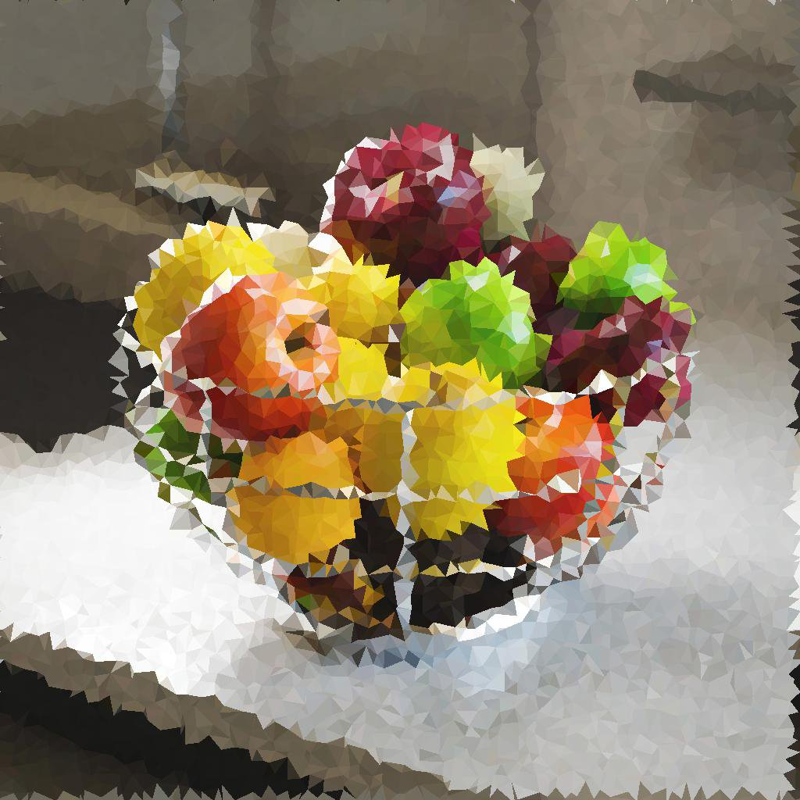
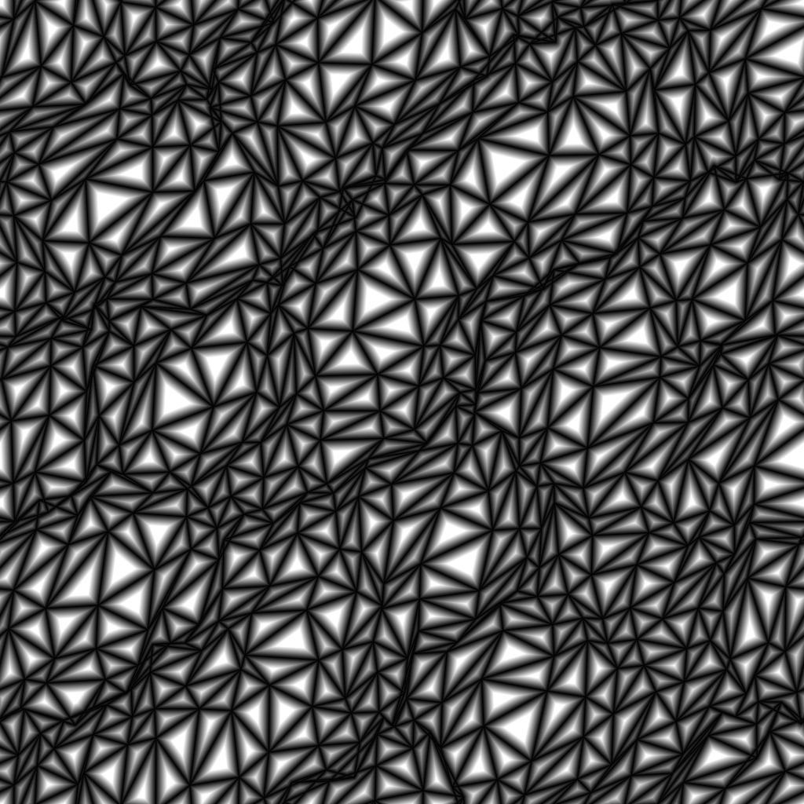

# Triangle Grid

<table>
<tr style="border: 0;">
<td width="41.60%" style="border: 0;" valign="top">

{width="200px"}

{width="200px"}

<b>In:</b> Texturgeneratoren > Muster

</td>
<td width="58.30%" style="border: 0;" valign="top">

## Beschreibung

Der Knoten **Triangle Grid** generiert eine Graustufendarstellung einer *triangulierten Fläche* aus *Scheitelpunkten* im 3D-Raum, wobei eine orthografische Z-Down-Projektion verwendet wird.

Mit dem Parameter **Farbausgabe** können Sie die für die Darstellung verwendeten Daten auswählen, was zu verschiedenen visuellen Stilen führt.\
Die *Positionen* der Eckpunkte können angepasst werden, was sich auf das generierte Gitter auswirkt.

</td>
</tr>
</table>

## Eingaben

|  |  |
|:---|:---|
| <b>Height</b> <i>Graustufen</i> PRIMÄR | Die Graustufenbildeingabe, die zum Zuordnen des *Heights* - d. h. der Z-Position - der Scheitelpunkte verwendet wird.    Der Einfluss dieser Eingabe wird durch den Parameter &#39;Height Input Multiplier&#39; gesteuert. |
| <b>Vektorzuordnung</b> <i>Farbe</i> | Die Farbbildeingabe, die zum Zuordnen des *Versatzes* der Scheitelpunkte auf der X- und Y-Achse verwendet wird.    Die X/Y-Versätze werden jeweils den R/G-Kanälen des Bildes zugeordnet.    Der Einfluss dieser Eingabe wird über den Parameter &quot;Vector Map Versatz&quot; gesteuert. |
| <b>Farbeingabe</b> <i>Farbe</i> | Die Farbbildeingabe, die zum Zuordnen der *Farbe* der Scheitelpunkte, Segmente oder Dreiecke verwendet wird.    Diese Eingabe wird verwendet, wenn der Parameter &quot;Farbquelle&quot; auf &quot;Farbeingabe&quot; festgelegt ist. |

## Ausgaben

|  |  |
|:---|:---|
| <b>Ausgabe</b> <i>Farbe</i> | Das Ausgabebild. |

## Parameter

|  |  |
|:---|:---|
| <b>Farbausgabe</b> *Integer* | Verfahren zur Darstellung der triangulierten Oberfläche:<ul data-preserve-html="true"> <li data-preserve-html="true"><b>Pro Scheitelpunkt:</b> Jedem Scheitelpunkt wird eine Farbe zugewiesen und über die Oberfläche des Dreiecks interpoliert.</li> <li data-preserve-html="true"><b>Pro Dreieck:</b> Jedem Dreieck ist eine Flächenfarbe zugewiesen</li> <li data-preserve-html="true"><b>Dünne Linie</b><b>:</b> wendet eine Kontur auf die Segmente zwischen Scheitelpunkten an</li> <li data-preserve-html="true"><b>Abstand zu Kante</b><b>:</b> gibt den Abstand zum nächstgelegenen Segment in jedem Dreieck wieder</li> <li data-preserve-html="true"><b>Mitte</b><b>:</b> rendert den normalisierten Abstand zum Mittelpunkt jedes Dreiecks</li> </ul> |
| <b>Triangulation</b> *Integer* | Legt die Triangulationsmethode für die Oberfläche fest, d. h. welches *Paar gegenüberliegender Scheitelpunkte* in einem Quad verbunden werden soll:<ul data-preserve-html="true"> <li data-preserve-html="true"><b>Auto:</b> wählt automatisch das Paar Scheitelpunkte aus, was zu Dreiecken <i> führt, die am wenigsten von der Kamera weggerichtet sind</i>  <b>45°:</b> verbinden einander gegenüberliegende Scheitelpunkte, was zu einer Linie <i>führt, die um 45 Grad</i> relativ zur X-rechten Achse gedreht ist</li> <li data-preserve-html="true"><b>-45°:</b> verbinden einander gegenüberliegende Scheitelpunkte, was zu einer Linie <i> führt, die um -45 Grad</i> relativ zur X-rechten Achse gedreht ist</li> <li data-preserve-html="true"><b>Quincux horizontal:</b> alterniert die Triangulationsausrichtung <i>jede zweite Zeile</i> von Scheitelpunkten</li> <li data-preserve-html="true"><b>Quincux vertikal:</b> alterniert die Triangulationsausrichtung <i>jede zweite Spalte</i> von Scheitelpunkten  </li> </ul> |
| <b>X Betrag</b> *Integer* | Die Anzahl der auf der X-Achse erzeugten Scheitelpunkte. |
| <b>Y Betrag</b> *Integer* | Die Anzahl der auf der Y-Achse erzeugten Scheitelpunkte. |
| <b>Zufallspositionsmultiplikator</b> *Gleitend* | Passt die Intensität des Verkrümmungseffekts an. |
| <b>Zufällige Position</b> *Float2* | Passt die Intensität des zufälligen Versatzes an, der auf die X- und Y-Positionen jedes Scheitelpunkts angewendet wird, relativ zur *Größe ihrer Zelle* im Raster.   Dieser Offset *stapelt* mit den Parametern <b>Quincux Offset</b> und <b>Vector Map Versatz</b>. |
| <b>Vektordarstellung-Versatz</b> *Gleitend* | Passt den *globalen* Versatz an, der auf jeden Scheitelpunkt angewendet wird, indem die Werte *gesampelt* aus der <b>Vektorzuordnung</b> verwendet werden.    Dieser Offset *stapelt* mit den Parametern <b>Zufällige Position</b> und <b>Quincux-Offset</b>. |
| <b>Quincux-Versatz X</b> *Gleitend* | Wendet den angegebenen Versatzbetrag auf *jede zweite Zeile* von Scheitelpunkten an, relativ zur *Größe ihrer Zelle* im Raster.   Dieser Offset *stapelt* mit den Parametern <b>Zufällige Position</b> und <b>Vektorzuordnungs-Versatz</b>. |
| <b>Quincux-Versatz Y</b> *Gleitend* | Wendet den angegebenen Versatzbetrag auf *jede zweite Spalte* von Scheitelpunkten an, relativ zur *Größe ihrer Zelle* im Raster.    Dieser Offset *stapelt* mit den Parametern <b>Zufällige Position</b> und <b>Vektorzuordnungs-Versatz</b>. |
| <b>Drehung</b> *Gleitend* | Wendet die angegebene **-Drehung auf jeden Scheitelpunkt um seine *Grundposition* an, d. h. seine Position *vor dem zufälligen Versatz* und dem Versatz.    Diese Drehung *stapelt* mit dem Parameter <b>Drehungsstörung</b>. |
| <b>Rotationsstörung</b> *Gleitend* | Wendet eine *zufällige* Drehung auf jeden Scheitelpunkt um seine *Grundposition* an, d. h. seine Position *vor dem* zufälligen Versatz und Versatz.    Diese Drehung *stapelt* mit dem Parameter <b>Drehung</b>. |
| <b>Height-Eingangsmultiplikator</b> *Gleitend* | Passt die Z-Position jedes Scheitelpunkts mithilfe der Werte *in* aus der Eingabe <b>Height</b> an.    Dieser Offset *Stapel* mit dem Parameter <b>Height Random</b>. |
| <b>Height zufällig</b> *Gleitend* | Wendet einen zufälligen Versatz auf die Z-Position jedes Scheitelpunktes an.  Dieser Offset *stapelt* mit dem <b>Height-Eingangsmultiplikator</b>. |
| <b>Füllmethode</b> *Integer* | Legt die Methode zum Mischen der Werte von *überlappenden Dreiecken* fest. Im Modus können Sie effektiv *auswählen, welche* der Dreiecke sichtbar sein sollen: <ul data-preserve-html="true"> <li data-preserve-html="true"><b>Min.:</b> Text</li> <li data-preserve-html="true"><b>Max.:</b> Text</li> <li data-preserve-html="true"><b>Tiefe-Test</b>: Text</li> <li data-preserve-html="true"><b>Alpha-Überblendung:</b> Text</li> </ul>Hinweis: Die verfügbaren Füllmethoden hängen vom Wert des Parameters <b>Farbausgabe</b> ab. |
| <b>Farbquelle</b> *Ganzzahl* *Verfügbar, wenn der Parameter &quot;Farbausgabe&quot; auf &quot;Pro Scheitelpunkt&quot;, &quot;Pro Dreieck&quot; oder &quot;Dünne Zeile&quot; festgelegt ist.* | Legt die Methode für *zum Erfassen der Farbe* fest, d. h. der Luminanz, die dem Scheitelpunkt, dem Dreieck oder dem Segment zugewiesen werden soll, abhängig vom ausgewählten <b>Farbausgabe</b>-Modus:<ul data-preserve-html="true"> <li data-preserve-html="true"><b>Height</b><b>:</b> verwendet das Height des Scheitelpunkts als Luminanz</li> <li data-preserve-html="true"><b>Zufällig</b><b>:</b> verwendet einen zufälligen Luminanzwert</li> <li data-preserve-html="true"><b>Farbeingabe</b><b>:</b> verwendet den von der <b style="">Farbeingabe</b>-Eingabe aufgenommenen Wert</li> </ul> |
| <b>Farbquellendeckkraft</b> *Fließkommazahl* *Verfügbar, wenn der Parameter &quot;Farbausgabe&quot; auf &quot;Dünne Zeile&quot; festgelegt ist.* | Steuert das *override* des <b>Linienfarbe</b>-Werts mit den Werten, die sich aus der ausgewählten <b>Farbquelle</b> ergeben.   Hinweis: Wenn dieser Wert auf 1 festgelegt ist, hat der Parameter <b>Linienfarbe</b> keine Auswirkungen. |
| <b>Entfernung zur Edge-Thickness</b> *Fließkommazahl* *Verfügbar, wenn der Parameter &quot;Farbausgabe&quot; auf &quot;Abstand zu Kante&quot; festgelegt ist.* | Legt die Thickness des Abstandsverlaufs fest. Ein niedrigerer Wert führt zu einem *kürzeren* Verlauf. |
| <b>Linienfarbe</b> *Fließkommazahl/Fließkommazahl4* *Verfügbar, wenn der Parameter &quot;Farbausgabe&quot; auf &quot;Dünne Zeile&quot; festgelegt ist.* | Der Luminanzwert der Segmente.   Hinweis: Wenn der Wert <b>Farbquellendeckkraft</b> auf 1 festgelegt ist, hat dieser Parameter keine Auswirkungen. |
| <b>Hintergrundfarbe</b> *Fließkommazahl/Fließkommazahl4* *Verfügbar, wenn der Parameter &quot;Farbausgabe&quot; auf &quot;Dünne Zeile&quot; festgelegt ist.* | Der Luminanzwert des zwischen den Segmenten sichtbaren Hintergrunds.   Hinweis: Wenn der <b>Überblendmodus</b> auf *Max* festgelegt ist, überschreibt der Hintergrund die Segmente, in denen er *heller* ist, wie erwartet. |
| <b>Zufallsfarben-Startmodus</b> *Ganzzahl* *Verfügbar, wenn der Parameter &quot;Farbausgabe&quot; auf &quot;Pro Scheitelpunkt&quot;, &quot;Pro Dreieck&quot; oder &quot;Thin Line&quot; und der Parameter &quot;Farbquelle&quot; auf &quot;Zufällig&quot; festgelegt ist.* | Verfahren zur Gewinnung des in der pseudozufälligen Farbverteilung verwendeten Saatguts:<ul data-preserve-html="true"> <li data-preserve-html="true"><b>Globales Zufallssegment</b><b>:</b> erbt das Seed aus dem Diagramm des Knotens</li> <li data-preserve-html="true"><b>Manuelles Seed</b><b>:</b> verwendet ein benutzerdefiniertes, eigenständiges Seed</li> </ul> |
| <b>Zufallsfarbensamen</b> *Ganzzahl* *Verfügbar, wenn der Parameter &quot;Random Color Seed Mode&quot; auf &quot;Manual Seed&quot; und der Parameter &quot;Color Source&quot; auf &quot;Random&quot; festgelegt ist.* | Der Wert für den diskreten Ausgangswert, der in der pseudozufälligen Farbverteilung verwendet wird. |
| <b>Quadratische Ausbreitung</b> *Boolescher Wert* | Ermöglicht die Kompensation von Quetsch und Dehnung bei nicht quadratischen Verhältnissen. |

## Beispiele

<table>
<tr style="border: 0;">
<td style="border: 0;" valign="top">

{zoomable="yes"}

</td>
<td style="border: 0;" valign="top">

{zoomable="yes"}

</td>
<td style="border: 0;" valign="top">

{zoomable="yes"}

</td>
</tr>
</table>

<table>
<tr style="border: 0;">
<td style="border: 0;" valign="top">

{zoomable="yes"}

</td>
<td style="border: 0;" valign="top">

{zoomable="yes"}

</td>
<td style="border: 0;" valign="top">

{zoomable="yes"}

</td>
</tr>
</table>

<table>
<tr style="border: 0;">
<td style="border: 0;" valign="top">

{zoomable="yes"}

</td>
<td style="border: 0;" valign="top">

{zoomable="yes"}

</td>
</tr>
</table>
