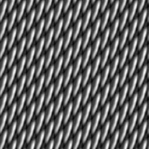

# Weben 2

<table>
<tr style="border: 0;">
<td style="border: 0;" valign="top">

{width="128px"}

## Weben 2

**In:** *Texturgeneratoren**/Muster*

**Einfach**

</td>
<td style="border: 0;" valign="top">

## Beschreibung

Erzeugt ein einfaches Webmuster. Verfügt über Steuerelemente für die Randomisierung. Bei maximaler Störung kann dies sogar als Rauschen verwendet werden.

## Parameter

* **Anordnen**: *1 - 16*\
  Legt fest, wie oft das Ergebnis gekachelt werden soll.
* **Störung**: *0.0 - 100.0*\
  Klumpt um die Maschen der Webart herum, um für Abwechslung zu sorgen.
* **Um 45 Grad drehen**: *Falsch/Wahr* Dreht sich zum voreingestellten Winkel.
* **Quadratische Ausbreitung**: *False/True*\
  Ermöglicht die Kompensation von Quetsch und Dehnung bei nicht quadratischen Verhältnissen.

## Beispielbilder

</td>
</tr>
</table>
