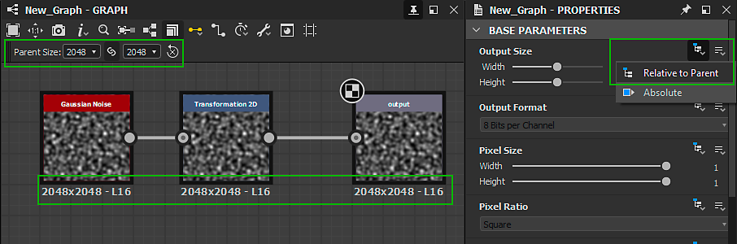

# Ausgabegröße

Es ist der erste der <b>Basisparameter</b> eines Diagramms und zusammen mit dem <b>Ausgabeformat</b> (oder der Bittiefe) ist wichtig, um gut zu verstehen, da es große Auswirkungen auf die Ausgabe eines Diagramms hat, sowohl in Designer als auch in anderen Anwendungen als [veröffentlichte Substance 3D Asset (SBSAR)](../publishing-asset-files/publishing-substance-3d-asset-files-sbsar.md)-Datei.

>[!TIP]
>
> Es wird dringend empfohlen, ein gutes Verständnis der [Vererbung in Substance-Graphen](../../compositing-graphs/inheritance-compositing/inheritance-in-substance-compositing-graphs.md) als Grundlage für die effiziente Verwendung der Eigenschaft &quot;Ausgabegröße&quot; zu erwerben.

>[!NOTE]
>
> Verwenden Sie die Sperrschaltfläche &quot;&quot;, damit der Wert für das Height &quot;*&quot; mit dem Wert für die Breite übereinstimmt*.

<table>
<tr style="border: 0;">
<td width="100.00%" style="border: 0;" valign="top">

## Leistung von 2 Werten

Der Parameter &quot;Ausgabegröße&quot; bestimmt die Auflösung der *Textur*-Ausgabe durch ein Diagramm oder einen Knoten.

Eine Textur, die ein Objekt in der Grafikberechnung ist, das durch einige Einschränkungen durch die Art und Weise, wie die Grafikverarbeitungshardware ihre Berechnungen ausführt, gebunden ist. Eine dieser Einschränkungen ist, dass die Textur ein Bild darstellen sollte, dessen Pixelanzahl in X und Y eine *Potenz von zwei* ist.

</td>
<td width="33.33%" style="border: 0;" valign="top">

| Leistung von 2 | Pixel |
| --- | --- |
| 7 | 128 |
| 8 | 256 |
| 9 | 512 |
| 10 | 1024 |
| 11 | 2048 |
| 12 | 4096 |
| 13 | 8192 |

</td>
</tr>
</table>

Die Eigenschaft &quot;Ausgabegröße&quot; verwendet *logarithmische Schritte*, um Leistungssteigerungen von zwei (z. B. 256, 512, 1024, ...) einfach zuzuordnen. auf eine *lineare Skalierung* (z. B. 8, 9, 10, ...). Das bedeutet, dass das Erhöhen oder Verringern des Werts der Ausgabegröße in X oder Y um 1 dem Multiplizieren oder Dividieren der aktuellen Auflösung mit 2 gleichkommt.

Dies gilt auch, wenn der Wert für die Ausgabegröße von einer [Funktion](../../function-graphs/function-graphs.md) gesteuert wird, wobei die Funktion anstelle der Zielauflösung die logarithmischen Zielwerte (relativ oder absolut) ausgeben sollte.

>[!IMPORTANT]
>
> Durch Erhöhen oder Verringern der Auflösung in X und Y wird die Pixelanzahl mit *4* multipliziert oder dividiert, was sich erheblich auf die *Leistung* und den *Speicherbedarf* eines Diagramms auswirkt.\
> Daher wird dringend empfohlen, die *niedrigste Auflösung* zu verwenden, die tatsächlich benötigt wird, um das gewünschte Ergebnis zu erzielen. Lösungen unter Kontrolle zu halten ist einer von vielen unserer [Richtlinien zur Leistungsoptimierung](../../best-practices/performance-optimization/performance-optimization-guidelines.md).

>[!NOTE]
>
> In [Funktionsdiagrammen](../../function-graphs/function-graphs.md) geben die `$size` und `$sizelog2` [Systemvariablen](../../function-graphs/variables/system-variables/system-variables.md) einen Float2-Wert zurück, der der aktuellen Auflösung des Knotens oder Diagramms entspricht, und zwar als unformatierte Pixelanzahl bzw. als Potenz von zwei.\
> Beispiel: Für ein 1024\*512-Bild gibt `$size` `(1024,512)` zurück, während `$sizelog2` `(10,9)` zurückgibt.

## Relative Größe

Wenn die Eigenschaft &quot;Ausgabegröße&quot; eine *Relative zu verwendet...* [Vererbungsmethode](../../compositing-graphs/inheritance-compositing/inheritance-in-substance-compositing-graphs.md), ihr Wert wird als Modifizierer *relativ zum geerbten logarithmischen Wert* ausgedrückt.

Modifizierer im Verhältnis zum übernommenen Auflösungsbereich von -12 bis +12 auf einer logarithmischen Skala, mit dem Standardwert 0. Dies bedeutet, dass jeder Schritt darüber oder darunter zu einer Verdoppelung oder Halbierung der Auflösung führt. Die Tabelle auf der rechten Seite zeigt anhand eines Beispiels, wie sich die relative Auflösung in einer Dimension ändert, bei einem übernommenen Wert von 9 (d. h. 512 = 2^9) und 11 (d. h. 2048 = 2^11):

Beachten Sie, dass die Größe über 8196 *begrenzt* ist. Diese Obergrenze wird durch die Einstellung <b>Größe der Zubereitung begrenzen</b> im Abschnitt <b>Allgemein</b> der [Voreinstellungen](../../interface/preferences-window/preferences-window.md) gesteuert. Beachten Sie, dass die Arbeit mit sehr großen Auflösungen mit einem proportionalen Leistungsaufwand und einem exponentiellen Speicherbedarf einhergeht. Darüber hinaus setzen Beschränkungen in der Grafikverarbeitung eine harte Grenze für die maximale Größe einer Textur.

| -5 | -4 | -3 | -2 | -1 | 0 | +1 | +2 | +3 | +4 | +5 |
| --- | --- | --- | --- | --- | --- | --- | --- | --- | --- | --- |
| 16 | 32 | 64 | 128 | 256 | <b>512</b> | 1024 | 2048 | 4096 | 8196 | 8196 |
| 64 | 128 | 256 | 512 | 1024 | <b>2048</b> | 4096 | 8196 | 8196 | 8196 | 8196 |

>[!NOTE]
>
> Unter 16 ist die Auflösung *nicht* begrenzt, es wird jedoch nicht empfohlen, nach unten zu gehen, da unter diesem Schwellenwert keine Leistungssteigerungen auftreten. Im Gegenteil, die Leistung *sinkt* aufgrund der spezifischen Implementierung des <b>Substance-Moduls</b>. Verwenden Sie daher 16x16 als allgemeine Mindestauflösung in Substance-Graphen.

## Ändern der Vererbungsmethode

In den meisten Fällen ist die standardmäßige [-Vererbungsmethode &#x200B;](../../compositing-graphs/inheritance-compositing/inheritance-in-substance-compositing-graphs.md) für die Eigenschaft &quot;Ausgabegröße&quot; je nach Element die folgende:

* Diagramm: *Relativ zu übergeordnetem Element*
* Knoten: *Relativ zur Eingabe*: Die von der [primären Eingabe](../../compositing-graphs/inheritance-compositing/inheritance-in-substance-compositing-graphs.md) des Knotens geerbten Werte werden in diesem Fall verwendet.
* [Bitmap](../../compositing-graphs/nodes-reference-for-com/atomic-nodes/bitmap/bitmap.md)-Knoten: *Absolut* - Lesen Sie die Seite [Bitmapressource](../../resources/bitmap-resource/bitmap-resource.md) und [Richtlinien zur Leistungsoptimierung](../../best-practices/performance-optimization/performance-optimization-guidelines.md), um zu erfahren, warum dies der Fall ist

Zeigen Sie die Eigenschaften eines Knotens oder Diagramms an, indem Sie auf dieses Element klicken. Suchen Sie dann im Bereich [Eigenschaften](../../interface/properties/properties.md) die Eigenschaft <b>Ausgabegröße</b> im Abschnitt <b>Basisparameter</b>. Wählen Sie im Dropdown-Menü Vererbungsmethode die gewünschte Vererbungsmethode aus.

{width="512px"}

## Beispielprobleme

Wenn Sie ein neuer [Adobe Substance 3D Designer](https://www.adobe.com/de/products/substance3d-designer.html)-Benutzer sind, treten möglicherweise einige häufige Probleme auf. Im Folgenden finden Sie einige Beispiele sowie Lösungen.

+++Problem 1
** Problem**

Die Einstellung **Übergeordnete Größe** ist *ausgegraut*, und das Diagramm verwendet eine unerwünschte Auflösung von 256\*256.

In den Eigenschaften des Diagramms wurde die Vererbungsmethode der Eigenschaft &quot;Ausgabegröße&quot; auf *Absolut* festgelegt, wodurch die Vererbung zu Gunsten eines beliebigen Werts beendet wird.

** Lösung**

Legen Sie die Vererbungsmethode für die Ausgabegröße des Diagramms auf *Relativ zu übergeordnetem Element* fest.

+++

+++Problem 2
** Problem**

Oben sehen Sie einen Fall, in dem die Ausgabe eines Diagramms zu einer anderen Auflösung führt (512\*512) als im übergeordneten Diagramm festgelegt (1024\* 1024), obwohl das Diagramm auf *Relativ zum übergeordneten Diagramm* festgelegt ist.

Das Problem stammt vom Knoten [Bitmap](../../compositing-graphs/nodes-reference-for-com/atomic-nodes/bitmap/bitmap.md). Standardmäßig wird die *Absolute*-Vererbungsmethode verwendet und 512\*512 als Auflösung basierend auf der [Bitmapressource](../../resources/bitmap-resource/bitmap-resource.md) ausgewählt. Der mit ihm verbundene Knoten ist auf &quot;*Relativ zur Eingabe &quot;*&quot; festgelegt und erbt daher seine Ausgabegröße vom Bitmapknoten.

** Lösung**

Legen Sie die Vererbungsmethode der Ausgabegröße des Bitmapknotens auf *Relativ zu übergeordnetem Knoten* fest, um das Problem weiter unten in der Kette zu beheben.

+++

+++Problem 3
** Problem**

Oben sehen Sie ein Problem, bei dem die Auflösung in der Mitte der Kette viel höher springt, was zu einer viel höheren Ausgabeauflösung führt als von der übergeordneten Ebene definiert.

Das Problem wird durch einen relativen Modifizierer von 3 auf dem Knoten [Transformation 2D](../../compositing-graphs/nodes-reference-for-com/atomic-nodes/transformation-2d/transformation-2d.md) verursacht, wodurch die Ausgabe achtmal größer wird.

** Lösung**

Setze die relativen Modifikatoren für &quot;Breite&quot; und &quot;Height&quot; auf 0, sodass keine Hochskalierung stattfindet.

+++
