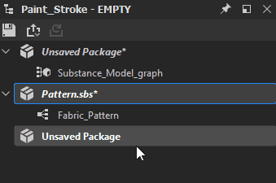

# Exportieren in Substance 3D-Asset-Dateien (SBSAR)

Auf dieser Seite wird erläutert, wie Substance 3D Designer Pakete als <b>Substance 3D-Asset-Dateien</b> veröffentlichen kann. Dabei handelt es sich um ein spezielles Dateiformat mit der Erweiterung <b>SBSAR</b>, das sowohl im Substance-Ökosystem als auch in anderen Anwendungen, die es unterstützen, verwendet wird.

In der Regel ist es besser, ein Substance 3D-Element anstelle von Bitmaps zu verwenden, da es viel flexibler und leichter ist. Wenn Sie sie in Substance 3D [Painter](https://experienceleague.adobe.com/de/docs/substance-3d-painter/using/home), [Sampler](https://helpx.adobe.com/de/substance-3d-sampler.html) oder [Player](https://helpx.adobe.com/substance-3d-player/home.html) verwenden, ist es schneller, [&#x200B; &quot;Senden an...&quot; zu verwenden. feature](../../interface/the-explorer-window/send-to-interoperability/send-to-interoperability.md).

## Publishing-Konzepte

Beim Veröffentlichen eines Substance-Grafen sollten Sie Folgendes beachten:

* Sie <b> veröffentlichen ein Paket </b> mit dem gesamten Inhalt, nicht einen individuellen [Substance-Graf &#x200B;](../../compositing-graphs/substance-compositing-graphs.md). Mit einem Substance 3D-Element können Sie dann Inhalte aus allen Substance-Grafen innerhalb dieses Pakets generieren.
* Veröffentlichte Pakete sind <b>vollständig eigenständig</b>: alle erforderlichen Ressourcen in die Datei eingebettet sind. Das bedeutet, dass sie viel einfacher zu teilen sind als SBS Dateien.
* Die Ausgabe aus Substance 3D-Assets kann <b>vollständig dynamisch</b> sein. [Die Auflösung ist nicht festgelegt. freigelegte Parameter können geändert werden.](../../compositing-graphs/compositing-graph-key-con/substance-compositing-graph-key-concepts.md) Die Bearbeitung des Grafen ist jedoch nicht mehr möglich.
* Substance 3D-Medienelemente können außerhalb von Designer in allen Adobe Substance 3D-Produkten, Adobe Dimension sowie in jeder anderen Anwendung mit [Substance-Integration](https://experienceleague.adobe.com/de/docs/substance-3d/ecosystem/home) verwendet werden.
* Das Veröffentlichen unterscheidet sich von [Exportieren](../../compositing-graphs/exporting-bitmaps/exporting-bitmaps.md). Vergewissern Sie sich, dass Sie den Unterschied gut verstehen.

## Veröffentlichung wird vorbereitet

Das Veröffentlichen erfordert etwas mehr Vorbereitung als das Exportieren von Bitmaps. Das liegt daran, dass Ihre veröffentlichten Substance 3D-Elemente dynamische Tools sind und nicht nur ein statischer Schnappschuss des aktuellen Zustands Ihrer Texturen. Insbesondere sollten Sie Folgendes beachten:

* Stellen Sie sicher, dass die Diagrammauflösungen ([Ausgabegröße](../../compositing-graphs/output-size/output-size.md)) auf die Vererbungsmethode *Relativ zu übergeordnetem* [festgelegt sind. Dies bedeutet, dass sie dynamisch sind und umgehend geändert werden können.](../../compositing-graphs/inheritance-compositing/inheritance-in-substance-compositing-graphs.md)
* Stellen Sie sicher, dass die [Diagrammausgaben](../../compositing-graphs/nodes-reference-for-com/atomic-nodes/output/output.md) korrekt mit Namen, Beschriftungen und Verwendungs-Tags eingerichtet sind.
* Stellen Sie sicher, dass [Parameter, falls erforderlich, organisiert und ordnungsgemäß benannt sind](../../compositing-graphs/manage-parameters/exposing-a-parameter/exposing-a-parameter.md).
* Wenn ein Diagramm ein Material beschreibt, legen Sie dessen [Materialmodell](../graph-parameters/graph-parameters.md)-Attribut auf das Modell dieses Materials fest.
* Stellen Sie sicher, dass die Eigenschaft [Ausgabegröße](../../compositing-graphs/output-size/output-size.md) aller [Bitmap](../../compositing-graphs/nodes-reference-for-com/atomic-nodes/bitmap/bitmap.md)-Knoten auf die *Absolute* [Vererbungsmethode](../../compositing-graphs/inheritance-compositing/inheritance-in-substance-compositing-graphs.md) festgelegt ist. Wenn dies nicht der Fall ist, wird die referenzierte [Bitmapressource](../../resources/bitmap-resource/bitmap-resource.md) in der Standardauflösung <b>256\*256</b> in der veröffentlichten Substance 3D-Asset-Datei gespeichert, was sich* auf die Qualität * einer oder mehrerer Ausgaben auswirkt.
* Wenn in dem Paket Diagramme enthalten sind, die außerhalb von Designer nicht verfügbar sein sollten (z. B. Hilfsgrafiken oder &quot;Tool&quot;-Untergrafiken, die nur in einem bestimmten Kontext funktionieren), richten Sie sie so ein, dass sie in ihren Eigenschaften ausgeblendet werden. Siehe weiter unten.

## Veröffentlichungsmethoden

Sobald Sie bereit zur Veröffentlichung sind, gibt es zwei Möglichkeiten, auf das Veröffentlichungsdialogfeld zuzugreifen, beide über den [Explorer](../../interface/the-explorer-window/the-explorer-window.md).

<table>
<tr style="border: 0;">
<td style="border: 0;" valign="top">

Klicken Sie im Explorer mit der rechten Maustaste auf das Paket, und wählen Sie  **Publish .sbsar-Datei...**, alternativer Hotkey Strg + P.

Nach der einmaligen Veröffentlichung mit Dialog können Sie auch  **Publish .sbsar-Datei wie zuvor** verwenden, um den Veröffentlichungsprozess zu wiederholen, ohne die Dialogfelder zu sehen, und sofort mit denselben Einstellungen veröffentlichen.

</td>
<td style="border: 0;" valign="top">

</td>
</tr>
</table>

<table>
<tr style="border: 0;">
<td style="border: 0;" valign="top">

Klicken Sie im Explorer auf die Publish-Schaltfläche &quot;&quot; in der oberen Symbolleiste.

Nach einmaliger Veröffentlichung mit Dialogfeld können Sie auch die Publish-Schaltfläche &quot;&quot; wie zuvor verwenden, um den Veröffentlichungsprozess zu wiederholen, ohne die Dialogfelder zu sehen, und sofort mit denselben Einstellungen veröffentlichen.

</td>
<td style="border: 0;" valign="top">

</td>
</tr>
</table>

<table>
<tr style="border: 0;">
<td style="border: 0;" valign="top">

## Optionen zur Veröffentlichung von Elementen

Bevor die Asset-Publish-Optionen angezeigt werden, werden Sie aufgefordert, die Substance 3D-Datei (SBS) zu speichern, falls dies nicht der Fall ist, und Sie werden aufgefordert, wo Sie das Substance 3D-Asset speichern möchten. Verwenden Sie <b>Publish wie oben beschrieben, um die Dateiaufforderungen und das Dialogfeld nicht anzuzeigen und die Datei nicht schneller zu löschen.</b>

</td>
<td style="border: 0;" valign="top">

</td>
</tr>
</table>

Die folgenden Optionen sind verfügbar:

<b>Dateipfad</b> öffnet ein Dateidialogfeld, in dem Sie auswählen können, wo die Substance 3D-Elementdatei gespeichert werden soll. Der Standardpfad ist das Benutzerdokument des Systems. Wenn das Paket gespeichert wurde, ist der Pfad der Paketspeicherort. Wenn das Paket während der Sitzung veröffentlicht wurde, ist der Pfad der letzte Veröffentlichungsort.

Die <b>Archivkomprimierung</b> legt Komprimierungsoptionen für das Archiv fest, wirkt sich auf die Dateigröße aus.

<b>Fehlende Symbole generieren</b> verwendet integrierte [PBR-Rendering](../../compositing-graphs/nodes-reference-for-com/node-library/material-filters/pbr-utilities/pbr-render/pbr-render.md)-Techniken, um Miniaturansichten für jedes Diagrammattribut zu erstellen.

<b>Verfügbare Diagramme </b> listet alle Diagramme auf, die in diesem Paket verfügbar gemacht werden, siehe unten zum Ausschließen von Diagrammen.

>[!NOTE]
>
> **Belichtung mit zufälligem Seed**
> 
> Die Belichtungseinstellungen für Zufallsverteilung sind im Dialogfeld &quot;Publish&quot; nicht mehr verfügbar. Stellen Sie stattdessen das Zufallssamenattribut des [Graphen auf &quot;Absolut&quot; statt auf &quot;Relativ&quot; ein, um zu verhindern, dass es verfügbar wird.](../../compositing-graphs/graph-parameters/graph-parameters.md)

## Ausschließen von Diagrammen aus veröffentlichten Elementen

Einige Diagramme in Ihrem Paket sind möglicherweise nicht für die Verwendung außerhalb des Pakets vorgesehen. Diese Untergraphen sind in der Regel als Teil eines größeren Ganzen, einer Unterroutine eines Hauptmaterials, gemeint.

<table>
<tr style="border: 0;">
<td style="border: 0;" valign="top">

Um auszuschließen, dass ein Diagramm in einer Substance 3D-Elementdatei sichtbar oder verwendbar wird, greifen Sie auf die Eigenschaften dieses Diagramms zu (doppelklicken Sie auf einen leeren Bereich in der Diagrammansicht oder klicken Sie im Explorer auf das Diagramm), und öffnen Sie dann das Rollout <b>Attribute</b>. Legen Sie <b>In SBSAR verfügbar gemacht</b> auf <b>Nein</b> fest, um es beim Veröffentlichen auszublenden.

</td>
<td style="border: 0;" valign="top">

</td>
</tr>
</table>

### Publish-Dialogfeldwarnungen

Das Dialogfeld &quot;Publish&quot; zeigt gelegentlich Warnmeldungen in Gelb an. Übliche sind unten aufgeführt, mit einer Erklärung und einer Lösung.

* Mindestens ein Diagramm hat keine Ausgabe\
  Diese Warnung bedeutet, dass Sie versuchen, ein Paket mit mindestens einem Diagramm ohne Ausgabeknoten zu veröffentlichen. Die Lösung besteht darin, den Diagrammen [Ausgabeknoten](../../compositing-graphs/nodes-reference-for-com/atomic-nodes/output/output.md) mit einem gelben Warndreieck hinzuzufügen.
* Einer oder mehrere Graphen haben einen Parameter, der nicht relativ zur übergeordneten Ausgabegröße ist\
  Diese Warnung bedeutet, dass ein oder mehrere Diagramme auf falsche Ausgabegrößen eingestellt wurden. Normalerweise sind es die Eigenschaften eines Graphen. Die Warnung bedeutet, dass Sie bei der Veröffentlichung keine dynamische Auflösungssteuerung für dieses Diagramm haben. Die Lösung besteht darin, in die Diagrammeigenschaften für Personen mit einem gelben Dreieck zu gehen und die [Vererbungsmethode der Ausgabegröße](../../compositing-graphs/inheritance-compositing/inheritance-in-substance-compositing-graphs.md) auf *Relativ zu übergeordneten Elementen* festzulegen.

## Einschränkungen für Substance 3D-Elemente

Das Substance 3D-Element ist zwar das leistungsstärkste und dynamischste Format im Substance-Ökosystem, es gibt jedoch einige kleine technische Einschränkungen, die zu beachten sind.

* Veröffentlichte Substance 3D-Elementpakete sind ein unidirektionales Dateiformat. Sie können ein Substance 3D-Element nicht wieder in eine Substance 3D-Datei (SBS) &quot;dekompilieren&quot;. Die einzige Möglichkeit, ein Substance 3D-Element zu &quot;bearbeiten&quot;, besteht darin, die Substance 3D-Originaldatei zu bearbeiten. Sie können den Inhalt des Substance 3D-Elementpakets weiterhin als Knoten in neuen Substance-Graphen verwenden (öffnen und ziehen und ablegen), dies ist also keine große Einschränkung.
* Substance 3D-Asset-Dateien weisen Versionen auf, die auf Kompatibilität schließen. Das zentrale Substance Engine wird von Zeit zu Zeit mit neuen Funktionen aktualisiert. Pakete, die diese Funktionen verwenden, müssen von Anwendungen gelesen werden, die diese neuen Funktionen unterstützen. Dies ist nicht für alle Substance-Anwendungen ein Problem, da sie alle gleichzeitig aktualisiert werden, aber bei Plug-ins und Integrationen kann es zu längeren Kompatibilitätsverzögerungen kommen.\
  Verwenden Sie die Anzeigeoptionen für die Kompatibilitätsanzeige in den [Projekteinstellungen](../../interface/preferences-window/project-settings/project-settings.md), um potenzielle Probleme zu ermitteln.
* Einige verfügbar gemachte Parameter - z. B. *static*-Parameter - sind *ausgeblendet*, sobald ein Diagramm als Teil eines Substance 3D-Assets veröffentlicht wurde. Eine Liste dieser Parameter finden Sie im Abschnitt [Einschränkungen](../../compositing-graphs/manage-parameters/exposing-a-parameter/exposing-a-parameter.md) auf der Seite [Verfügbarmachen eines Parameters](../../compositing-graphs/manage-parameters/exposing-a-parameter/exposing-a-parameter.md). Weitere Informationen zu statischen Parametern im Allgemeinen finden Sie unter.
