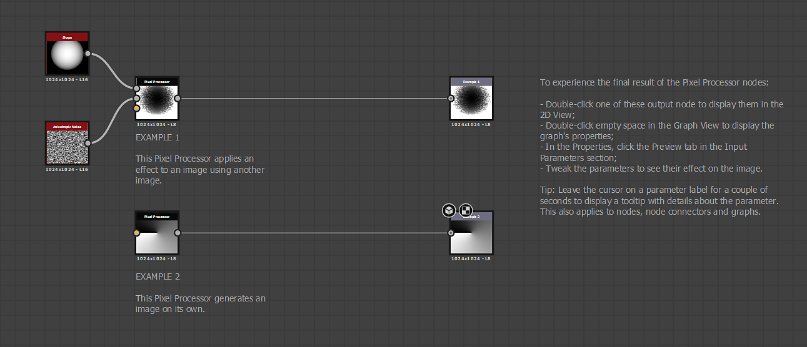

# Beispiel-Substance-Graphen

## Überblick

Auf dieser Seite werden die [Substance 3D Designer](https://www.adobe.com/de/products/substance3d-designer.html)-Beispieldateien aufgelistet, die heruntergeladen werden können. Diese Projekte enthalten mit Anmerkungen versehene Grafiken, die grundlegende Tools und Konzepte von [Substance-Grafiken](../../compositing-graphs/substance-compositing-graphs.md) darstellen.

<table>
<tr style="border: 0;">
<td style="border: 0;" valign="top">

## Filter

Dieses Projekt enthält eine einfache Diagrammeinrichtung, die als Filter in anderen Diagrammen verwendet werden kann. [Filter](../../compositing-graphs/nodes-reference-for-com/node-library/filters/filters.md) sind Knoten, die ein oder mehrere Eingabebilder ändern und/oder überblenden.

[{width="64px"}](https://shared-assets.adobe.com/link/f1509448-39d4-4b4a-5d3f-1e0ab0313335)

</td>
<td style="border: 0;" valign="top">

{zoomable="yes"}

</td>
</tr>
</table>

<table>
<tr style="border: 0;">
<td style="border: 0;" valign="top">

## Vererbung

Dieses Projekt veranschaulicht die Vererbungsmethoden, die in Substance-Graphen verfügbar sind, um wichtige Bildinformationen wie Auflösung und Bittiefe knotenübergreifend in einem Graphen zu propagieren.

Informationen zur Vererbung finden Sie in [dieser Seite](../../compositing-graphs/inheritance-compositing/inheritance-in-substance-compositing-graphs.md) unserer Dokumentation.

[{width="64px"}](https://shared-assets.adobe.com/link/9b155f58-74a1-40b6-47ed-d360b18e0bc4)

</td>
<td style="border: 0;" valign="top">

{zoomable="yes"}

</td>
</tr>
</table>

<table>
<tr style="border: 0;">
<td style="border: 0;" valign="top">

## Pixel-Prozessor

Der [Pixelprozessor](../../compositing-graphs/nodes-reference-for-com/atomic-nodes/pixel-processor/pixel-processor.md)-Knoten ist einer der komplexesten und dennoch leistungsstärksten Knoten in Designer. Wenn Sie die Funktionsweise des Knotens verstehen, erhalten Sie in Ihren Graphen eine beträchtliche Leistung und Flexibilität, sodass Sie vielfältigere benutzerdefinierte Knoten erstellen können.

Dieses Projekt veranschaulicht zwei einfache Anwendungsfälle für den Pixel-Prozessor: als Generator und als Filter. Sie ist auch ein Sprungbrett für mehr Möglichkeiten mit [Funktionsdiagrammen](../../function-graphs/function-graphs.md).

[{width="64px"}](https://shared-assets.adobe.com/link/ad8e013e-ae48-4290-740a-9b28387cab38)

</td>
<td style="border: 0;" valign="top">

{zoomable="yes"}

</td>
</tr>
</table>
