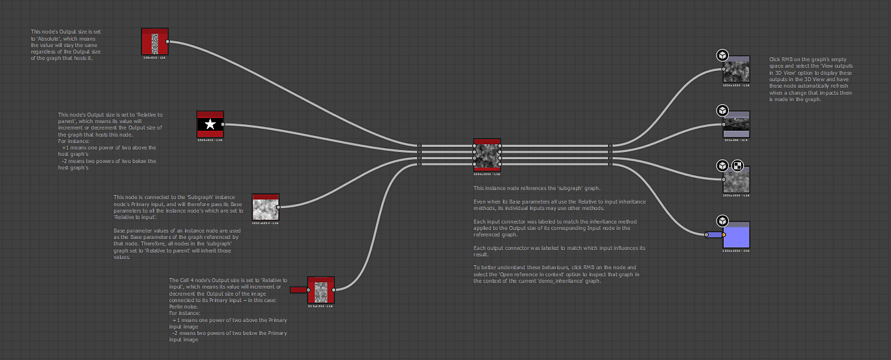

# Beispiel-Substance-Graphen

## Überblick

Auf dieser Seite werden die [Substance 3D Designer](https://www.adobe.com/products/substance3d-designer.html)-Beispieldateien aufgelistet, die heruntergeladen werden können. Diese Projekte enthalten Grafen mit Anmerkungen, die grundlegende Tools und Konzepte von [Substance-Grafen](../../compositing-graphs/substance-compositing-graphs.md) darstellen.

<table>
<tr style="border: 0;">
<td style="border: 0;" valign="top">

## Filter

Dieses Projekt enthält eine einfache Filtereinrichtung, die als Graf in anderen Grafen verwendet werden kann. [Filter](../../compositing-graphs/nodes-reference-for-com/node-library/filters/filters.md) sind Knoten, die ein oder mehrere Eingabebild ändern und/oder überblenden.

[{width="64px"}](https://shared-assets.adobe.com/link/f1509448-39d4-4b4a-5d3f-1e0ab0313335)

</td>
<td style="border: 0;" valign="top">

{zoomable="yes"}

</td>
</tr>
</table>

<table>
<tr style="border: 0;">
<td style="border: 0;" valign="top">

## Vererbung

Dieses Projekt veranschaulicht die in Substance-Grafen verfügbaren Knotenmethoden zum Verteilen wichtiger Bildinformationen wie Vererbung und Bittiefe über Graf hinweg.

Informationen zur Vererbung finden Sie in [dieser Seite](../../compositing-graphs/inheritance-compositing/inheritance-in-substance-compositing-graphs.md) unserer Dokumentation.

[{width="64px"}](https://shared-assets.adobe.com/link/9b155f58-74a1-40b6-47ed-d360b18e0bc4)

</td>
<td style="border: 0;" valign="top">

{zoomable="yes"}

</td>
</tr>
</table>

<table>
<tr style="border: 0;">
<td style="border: 0;" valign="top">

## Pixel-Prozessor

Der [Pixelprozessor](../../compositing-graphs/nodes-reference-for-com/atomic-nodes/pixel-processor/pixel-processor.md) ist einer der komplexesten und gleichzeitig leistungsfähigsten Knoten in Designer. Wenn Sie die Funktionsweise des Knotens verstehen, erhalten Sie eine beträchtliche Leistung und Flexibilität in Ihren Graf, sodass Sie vielfältigere benutzerdefinierte Knoten erstellen können.

Dieses Projekt veranschaulicht zwei einfache Anwendungsfälle für den Pixelprozessor: als Generator und als Filter. Sie ist auch ein Meilenstein, um mehr mit [Funktions-Grafen](../../function-graphs/function-graphs.md) zu tun.

[{width="64px"}](https://shared-assets.adobe.com/link/ad8e013e-ae48-4290-740a-9b28387cab38)

</td>
<td style="border: 0;" valign="top">

{zoomable="yes"}

</td>
</tr>
</table>
