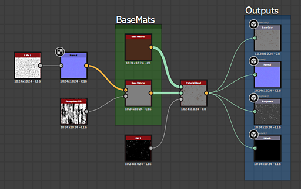

# Substance-Graphen

<table>
<tr style="border: 0;">
<td width="16.67%" style="border: 0;" valign="top">

[{width="120px"}](https://substance3d.adobe.com/)

</td>
<td width="100.00%" style="border: 0;" valign="top">

[Substance-Graf](https://substance3d.adobe.com/) sind der Haupttyp des in Substance 3D Designer erstellten Grafen. Ihr Zweck ist es, <b>2D-Bilddaten</b> zu generieren und zu verarbeiten, die nicht auf eine festgelegte Auflösung, Farbe oder Form beschränkt sind. Sie sind als äußerst vielseitige Bildverarbeitungs- und Generierungswerkzeuge gedacht und nicht nur als statische, voreingestellte Ergebnisse.

Die Ergebnisse können in Form eines einfachen Schwarzweißmusters, eines Filters, der nur auf anderen Bildern ausgeführt wird und keinen Inhalt für sich selbst erzeugt, oder sogar eines vollwertigen prozeduralen Materials mit mehreren Kanälen vorliegen.

Substance-Graf sind [&#x200B; der am weitesten unterstützte Graf](../getting-started/overview/overview.md)-Typ und können exportiert und in einer Vielzahl von verschiedenen Workflows verwendet werden.

</td>
</tr>
</table>

## Beispiele

Im Folgenden finden Sie einige typische Beispiele für häufige Anwendungsfälle.

+++Einfache Form
{width="512px"}

Eine einfache Maskenform für einen Aufkleber wird erstellt, indem [ein Textstück](../compositing-graphs/nodes-reference-for-com/atomic-nodes/text/text.md) und ein [Datenträgerform](../compositing-graphs/nodes-reference-for-com/node-library/texture-generators/patterns/shape/shape.md) generiert werden, [die Kante](../compositing-graphs/nodes-reference-for-com/node-library/filters/effects/edge-detect/edge-detect.md) von der Festplatte extrahiert wird und diese schließlich [zusammengemischt werden](../compositing-graphs/nodes-reference-for-com/atomic-nodes/blend/blend.md), bevor sie als endgültige [Ausgabe](../compositing-graphs/nodes-reference-for-com/atomic-nodes/output/output.md) festgelegt werden.

Der Text mit der Nummer oder die Thickness der Kante kann extern gelegt werden, um den Graf dynamischer zu gestalten.

+++

+++Einstellungsfilter
{width="512px"}

Ein Graf nimmt eine Normalen-Map als [Eingabe](../compositing-graphs/nodes-reference-for-com/atomic-nodes/input/input.md) (mit einer benutzerdefinierten Vorschau), [konvertiert sie in Krümmung](../compositing-graphs/nodes-reference-for-com/node-library/filters/effects/curvature-smooth/curvature-smooth.md) und [passt den Kontrast](../compositing-graphs/nodes-reference-for-com/node-library/filters/adjustments/histogram-scan/histogram-scan.md) an, um eine Maske mit konvexen Kanten als endgültige [Ausgabe](../compositing-graphs/nodes-reference-for-com/atomic-nodes/output/output.md) zu erstellen.

Die im Histogramm festgelegten Kontrastwerte können gelegt werden, sodass es sich um ein einfaches, aber brauchbares Filter in Verbindung mit dem dynamischen Eingangsschlitz handelt.

+++

+++Material
{width="512px"}

Ein komplizierterer Graf [fügt zwei Basismaterial ein](../compositing-graphs/nodes-reference-for-com/node-library/material-filters/blending-material/material-blend/material-blend.md). Eins[Basismaterial](../compositing-graphs/nodes-reference-for-com/node-library/material-filters/pbr-utilities/base-material/base-material.md) ist einfach gehalten, das andere verwendet einige benutzerdefinierte Eingaben, um Interesse hinzuzufügen. Mit einer Maske wird bestimmt, welches der beiden Material an welcher Stelle angezeigt wird, bevor es als endgültige [Ausgaben](../compositing-graphs/nodes-reference-for-com/atomic-nodes/output/output.md) festgelegt wird.

In diesem Beispiel werden [Verknüpfungserstellungsmodi](../interface/the-graph-view/link-creation-modes/link-creation-modes.md) zur Vereinfachung der Verwendung mehrerer Verknüpfungen verwendet.

+++
