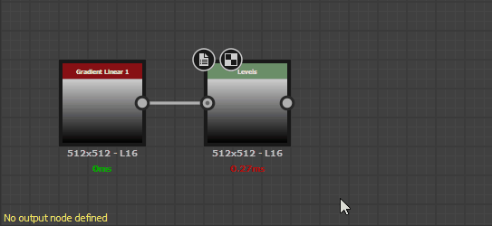
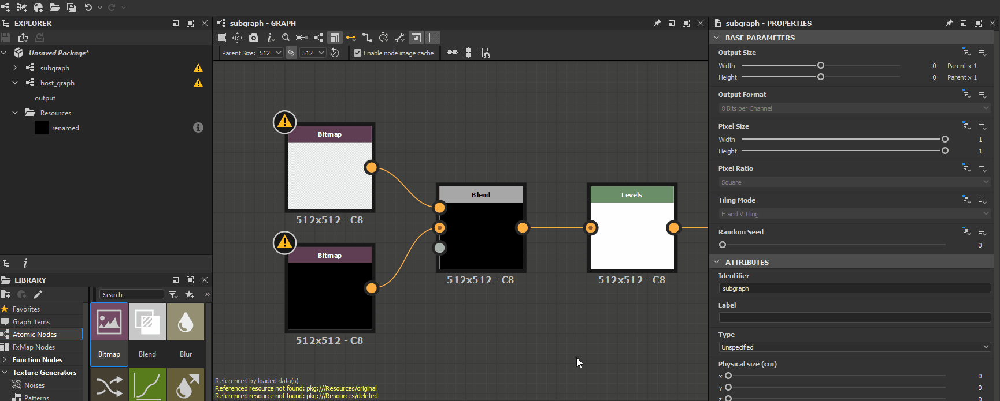

# Warnungen in Substance-Graphen

Auf dieser Seite werden Warnungen und Fehlermeldungen aufgelistet, die von [Substance-Grafen](../../compositing-graphs/substance-compositing-graphs.md) in Substance 3D Designer ausgelöst werden können, und es werden allgemeine Schritte zur Fehlerbehebung für jeden dieser Fehler angezeigt.

In der QuickInfo des Warnsymbols für die Graf-Ressource im Bedienfeld &quot;[Explorer](../../interface/the-explorer-window/the-explorer-window.md)&quot; sowie in der unteren linken Ecke der [Graphansicht](../../interface/the-graph-view/the-graph-view.md), wenn der Graf geladen ist, werden Warnungen angezeigt.

##  Kein Ausgabeknoten definiert

Der Graf hat keinen [Ausgabeknoten](../../compositing-graphs/nodes-reference-for-com/atomic-nodes/output/output.md).

** Lösung**

Fügen Sie dem Graf einen oder mehrere [Ausgabeknoten](../../compositing-graphs/nodes-reference-for-com/atomic-nodes/output/output.md) hinzu und verbinden Sie die Ausgabe des letzten Knotens in einem Stream mit diesem.

>[!NOTE]
>
> Die über das Dialogfeld &quot;[Neuer Graf](../creating-compositing-gra/creating-a-substance-compositing-graph.md)&quot; verfügbaren Graf-Vorlagen verfügen über voreingestellte Ausgabeknoten, die verwendet werden können.

{width="512px"}

###  Die Funktion des *[x]*-Parameters enthält einige Warnungen.

Der [Funktions-Graf &#x200B;](../../function-graphs/function-graphs.md), der auf den angegebenen Parameter des angegebenen Knotens angewendet wird, weist mindestens eine Warnung auf.\
Der Knotenparameter wird in eckigen Klammern nach der Knotenbezeichnung angegeben und folgt der Vorlage Node[Parameter].

E.g. Einheitliche Farbe[Ausgabefarbe], Pixelprozessor[pro Pixelfunktion]

** Lösung**

Suchen Sie den Knoten, der die Warnung ausgibt, nach seiner Bezeichnung und dem Warnzeichen in der [Graphansicht](../../interface/the-graph-view/the-graph-view.md), und wählen Sie ihn aus, um seine Eigenschaften im Bereich [Eigenschaften](../../interface/properties/properties.md) anzuzeigen. Suchen Sie den Parameter, der die Warnung ausgibt, und öffnen Sie seine Funktion, indem Sie auf die Schaltfläche **Funktion bearbeiten** klicken.

Überprüfen Sie dann die Warnmeldungen, die unten links in der Graphansicht aufgeführt sind, und beheben Sie die Probleme. Sie können auf der Seite [Warnungen in Funktions-Grafen](../../function-graphs/warnings-function-graphs/warnings-in-function-graphs.md) nach Fehlerbehebungswarnungen in Funktions-Grafen suchen.

###  Die referenzierten Daten enthalten einige Warnungen.

Die Ressource, auf die von einem Knoten verwiesen wird, enthält eine oder mehrere Warnungen. Im Folgenden finden Sie einige Knoten, die auf eine Ressource verweisen:

* Ein [Grapheninstanz](../../compositing-graphs/creating-compositing-gra/graph-instances-sub-gra/graph-instances-sub-graphs.md)-Knoten verweist auf einen Graf
* Ein [Bitmap](../../compositing-graphs/nodes-reference-for-com/atomic-nodes/bitmap/bitmap.md)-Knoten verweist auf eine [Bitmap-Ressource](../../resources/bitmap-resource/bitmap-resource.md).
* Ein [SVG](../../compositing-graphs/nodes-reference-for-com/atomic-nodes/svg/svg.md)-Knoten verweist auf eine [SVG-Ressource](../../resources/vector-graphics-svg-res/vector-graphics-svg-resource.md).
* Ein [Text](../../compositing-graphs/nodes-reference-for-com/atomic-nodes/text/text.md)-Knoten verweist auf eine [Font-Ressource](../../resources/font-resource/font-resource.md).

** Lösung**

Suchen Sie im Bereich [Explorer](../../interface/the-explorer-window/the-explorer-window.md) die referenzierte Ressource, und beheben Sie alle von der Ressource ausgelösten Warnungen:

* Weitere Diagramme finden Sie auf dieser Seite.
* Informationen zu anderen Ressourcentypen finden Sie auf der Seite [Warnungen von Abhängigkeiten](../../resources/warnings-from-dep/warnings-from-dependencies.md).

###  Referenzressource nicht gefunden

Die Ressource, auf die von einem Knoten verwiesen wird, wurde nicht in dem Pfad gefunden, der in der Datei &quot;[Substance 3D](https://www.adobe.com/products/substance3d/3d-augmented-reality.html)&quot; (SBS) gespeichert ist. Im Folgenden finden Sie einige Knoten, die auf eine Ressource verweisen:

* Ein [Grapheninstanz](../../compositing-graphs/creating-compositing-gra/graph-instances-sub-gra/graph-instances-sub-graphs.md)-Knoten verweist auf ein Diagramm.
* Ein [Bitmap](../../compositing-graphs/nodes-reference-for-com/atomic-nodes/bitmap/bitmap.md)-Knoten verweist auf eine [Bitmap-Ressource](../../resources/bitmap-resource/bitmap-resource.md).
* Ein [SVG](../../compositing-graphs/nodes-reference-for-com/atomic-nodes/svg/svg.md)-Knoten verweist auf eine [SVG-Ressource](../../resources/vector-graphics-svg-res/vector-graphics-svg-resource.md).
* Ein [Text](../../compositing-graphs/nodes-reference-for-com/atomic-nodes/text/text.md)-Knoten verweist auf eine [Font-Ressource](../../resources/font-resource/font-resource.md).

** Lösung**

Für [Grapheninstanz](../../compositing-graphs/creating-compositing-gra/graph-instances-sub-gra/graph-instances-sub-graphs.md) Knoten

Überprüfen Sie, ob das Quelldiagramm im Paket vorhanden ist, das sich in dem Pfad befindet, der in ihrem **Package**-Attribut gespeichert ist.\
Ist dies nicht der Fall, löschen Sie den Instanzknoten und ersetzen Sie ihn durch einen Instanzknoten, der auf ein gültiges Paket verweist. Alternativ können Sie das Paket und das Diagramm, auf das der Instanzknoten verweist, neu erstellen und dann das Hostpaket neu laden, indem Sie im Bedienfeld [Explorer](../../interface/the-explorer-window/the-explorer-window.md) auf RMB klicken und im Kontextmenü die Option **Neu laden** auswählen.

Für [Bitmap](../../compositing-graphs/nodes-reference-for-com/atomic-nodes/bitmap/bitmap.md)-, [SVG](../../compositing-graphs/nodes-reference-for-com/atomic-nodes/svg/svg.md)- oder [Text](../../compositing-graphs/nodes-reference-for-com/atomic-nodes/text/text.md)-Knoten

Suchen Sie die referenzierten Ressourcen im Explorer-Bedienfeld und überprüfen Sie, ob sie an dem Speicherort vorhanden sind, der in ihrem **Dateipfad**-Attribut gespeichert ist.\
Wenn dies nicht der Fall ist, klicken Sie auf RMB im Ressourcenelement im Explorer, und wählen Sie **Verschieben...Option &quot;**&quot; im Kontextmenü, um eine neue gültige Zieldatei für diese Ressource festzulegen.

###  Textknoten verwendet ungültige Schriftart

Ein [Text](../../compositing-graphs/nodes-reference-for-com/atomic-nodes/text/text.md)-Knoten verweist auf eine Schriftart, die nicht richtig geladen oder analysiert werden kann.

<b> Lösung</b>

Wählen Sie den Knoten [Text](../../compositing-graphs/nodes-reference-for-com/atomic-nodes/text/text.md) aus, und notieren Sie den Wert der Eigenschaft <b>Font</b>. Suchen Sie die Quelldatei für diese Schriftart auf Ihrem System und stellen Sie sicher, dass sie *fehlerfrei* ist, z. B. indem Sie sie in einer anderen Anwendung wie einem Texteditor verwenden. Ersetzen Sie die Schrift bei Bedarf durch eine fehlerfreie Schriftdatei oder wechseln Sie zum Knoten Text zu einer anderen Schrift.
