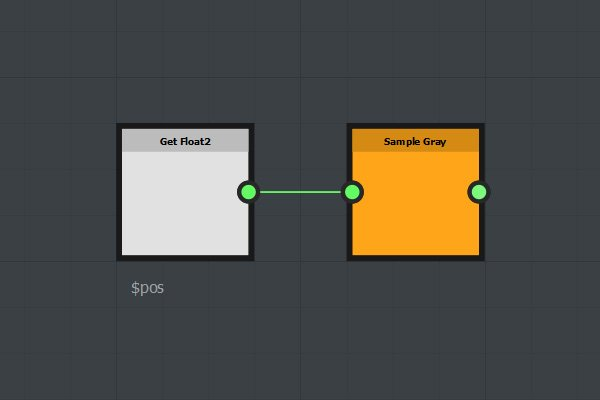
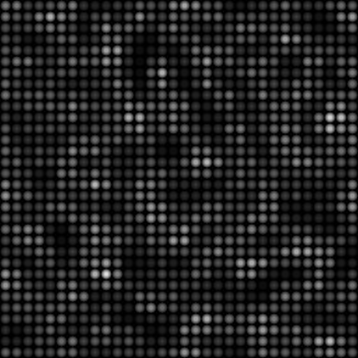

# Verwenden der Sampler-Knoten

Der Samplerknoten kann verwendet werden, um Pixelwerte in einem Bildeingang zu testen, der an den fx-map-Knoten angeschlossen ist. Die abgetasteten Werte können dann verwendet werden, um beliebige Parameter mit Funktionen zu steuern.

## einfaches Beispiel

In diesem Beispiel wurde eine Kette von Quadrantenknoten erstellt, um ein Musterraster zu generieren. Eine Funktion wird im Parameter &quot;Deckkraft/Luminanz&quot; des letzten Quadranten erstellt.

{width="300px"}{width="300px"}

Der Knoten Sample verwendet einen float2-Eingang als Sampling-Koordinaten (x, y). In diesem Beispiel haben wir die Variable $pos verwendet: für jedes Muster wird der Pixelwert an der Musterposition im ersten Bildeingang abgetastet, der an den FxMap-Knoten angeschlossen ist.

Der Knoten &quot;Beispielgrau&quot; gibt einen float1-Wert im Bereich 0,1 zurück.

Der Knoten &quot;Beispielfarbe&quot; gibt einen float4(rgba)-Wert im Bereich 0,1 zurück.

## Beispiel für Fortgeschrittene

Hier wird der Abtastwert mit einer Konstanten (0,3) verglichen. Wenn der aufgenommene Wert größer als 0,3 ist, gibt die Funktion 1 zurück, ansonsten 0.

{width="300px"}{width="300px"}

## Beispiel herunterladen

[{width="64px"}](https://shared-assets.adobe.com/link/d5f9adf3-0bb5-49a1-4eb9-a0506d4f3f32)
