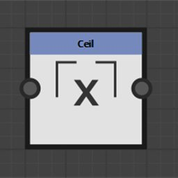
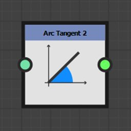

# Funktionsknoten

Funktionsknoten transformieren den Eingabewert entsprechend der mathematischen Funktion, die sie darstellen.

Obwohl ihre Eingangsanschlüsse im Allgemeinen nicht typisiert sind, unterstützen sie nicht alle Werttypen.

## Knotenliste

+++Pow

Gibt den ersten Eingang zurück, der mit der Leistung des zweiten Eingangs erhöht wurde: <b>X^Y</b>.

+++

+++2Pow

Gibt 2 an die Stärke des Eingangswerts zurück: <b>2^X</b>.

+++

+++Quadratwurzel

Gibt die Quadratwurzel des Eingabewerts zurück: <b>√X</b>.

+++

+++Exponentiell

Gibt den Exponentialwert des Eingabewerts zurück: <b>e^X</b>

<b>e</b> ist ungefähr gleich 2,7182818.

+++

+++Logarithmus

Gibt den natürlichen Logarithmus des Eingabewerts zurück: <b>ln(X)</b>.

+++

+++Logarithmusbasis 2

Gibt den Logarithmus zur Basis 2 des Eingabewerts zurück: <b>log2(X)</b>.

+++

+++Absolut

Gibt den absoluten Wert der Eingabe zurück: <b>abs(X)</b>.

+++

+++Aufrunden

Rundet den Eingabewert auf. Es gibt den kleinsten ganzzahligen Wert zurück, der nicht kleiner als X ist: <b>ceil(X)</b>.

+++

+++Floor

Rundet den Eingabewert ab. Es gibt den größten ganzzahligen Wert zurück, der nicht größer als X ist: <b>floor(X)</b>.

+++

+++Lineare Interpolation

Gibt die lineare Interpolation zwischen zwei Werten in Funktion eines Gleitkommawertes zurück: <b>(1 - X)\*A + X\*B</b>.

+++

+++Minimum

Gibt den niedrigsten der beiden Eingabewerte zurück: <b>Min(A, B)</b>.

+++

+++Maximum

Gibt den höchsten der beiden Eingabewerte zurück: <b>max(A, B)</b>.

+++

+++Cosine

Gibt den Kosinus des Eingabewerts in Bogenmaß zurück: <b>cos(X)</b>.

+++

+++Sine

Gibt den Sinus des Eingabewerts in Bogenmaß zurück: <b>sin(X)</b>.

+++

+++Tangent

Gibt die Tangente des Eingangswerts in Bogenmaß zurück: <b>tan(X)</b>.

+++

+++Arkustangens 2

Gibt den Winkel zwischen dem eingegebenen 2D-Vektor und der Horizontalen zurück.

Dies ist der reziproke Wert der <b>kartesischen</b>-Funktion.

Es ist nicht erforderlich, die X- und Y-Komponente des Eingangsvektors wie in der üblichen <b>atan2</b>-Funktion zu wechseln.

+++

+++Kartesisch

Konvertiert Polarkoordinaten in kartesische Koordinaten.

Dies ist der reziproke Wert der <b>Arc-Tangente 2 </b>-Funktion: <b>Länge \* Float2(cos(Angle), sin(Angle).</b>

Polarkoordinaten sind ein Abstand zum Ursprung und ein Winkel in Radianten zur Horizontalen.

+++

+++Zufallswert

Gibt einen zufälligen Wert zwischen 0 und dem Eingabewert <b>X</b> zurück.

+++
