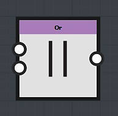
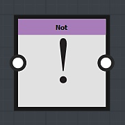

# Logische Knoten

Logische Knoten werden verwendet, um dem Graf mehrere Bedingungen hinzuzufügen:

## Der Knoten &quot;*and*&quot;

Der Und-Knoten nimmt zwei Boolesche Wert-Knoten als Eingabe an:

* Wenn beide Eingaben &quot;True&quot; sind, ist die Ausgabe des Knotens &quot;*And*&quot; *True*
* In jedem anderen Fall gibt der Knoten *And* *False* zurück.

## Der Knoten *Or*

Der Knoten Or nimmt zwei Boolesche Wert-Knoten als Eingabe an:

* Wenn mindestens einer der Eingaben True (1) ist, ist die Ausgabe des Knotens *Or* *True*
* Wenn beide Eingaben False sind, gibt der Knoten *Or* *False* zurück.

## Der Knoten *Not*

Der Node Not nimmt einen Boolesche Wert als Eingabe an: wird der Eingabewert überprüft und das Gegenteil zurückgegeben:

* *True*-Eingabe ergibt *False*-Ausgabe
* *False*-Eingabe ergibt *True*-Ausgabe
