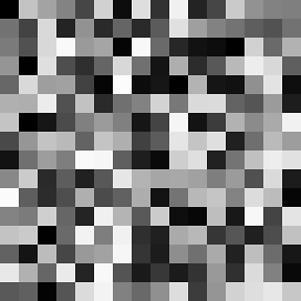

# Hash-Funktionen

<table>
<tr style="border: 0;">
<td width="33.33%" style="border: 0;" valign="top">

{width="200px"}

<b>In:</b> Funktionen > Zufällig

</td>
<td width="100.00%" style="border: 0;" valign="top">

## Beschreibung

Berechnet einen pseudozufälligen Wert zwischen 0 und 1 basierend auf einem Eingabewert, der als Seed verwendet wird.

Die Zahl im Titel zeigt den Typ des Werts in und Wert out an. Beispiel: Hash 23 nimmt einen float2-Wert als Eingang und gibt einen float3-Wert aus.

</td>
</tr>
</table>

Wenn ein Hash-Knoten einen Wert von mehreren Komponenten ausgibt, hat jede Komponente einen anderen pseudo-zufälligen Wert.

Verfügbare Versionen mit Eingabe- und Ausgabetyp:

<table>
<tr style="border: 0;">
<td style="border: 0;" valign="top">

<b>Hash 11:</b> Gleitkommawert → Gleitkommawert

<b>Hash 14:</b> Float → Float4

<b>Hash 21:</b> Float2 → Float

<b>Hash 22:</b> Float2 → Float2

</td>
<td style="border: 0;" valign="top">

<b>Hash 24:</b> Float2 → Float4

<b>Hash31:</b> Float3 → Float

<b>Hash 32:</b> Float3 → Float2

</td>
</tr>
</table>

## Eingangsanschlüsse

|  |  |
| --- | --- |
| <b>Eingabe</b> | Der Wert, der als Seed zur Berechnung der pseudozufälligen Ausgabe verwendet wird. |

## Beispiele

<table>
<tr style="border: 0;">
<td style="border: 0;" valign="top">

{zoomable="yes"}

</td>
<td style="border: 0;" valign="top">

{zoomable="yes"}

</td>
</tr>
</table>
