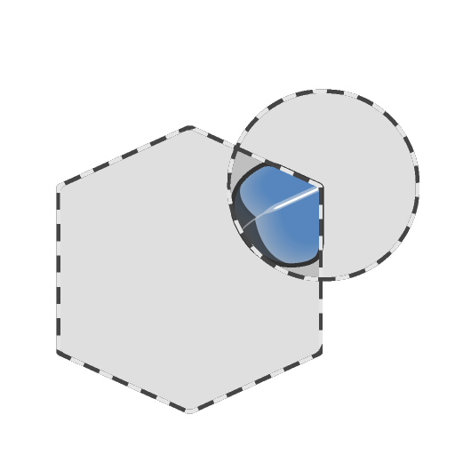

# Schnittmenge glätten

<table>
<tr style="border: 0;">
<td width="33.33%" style="border: 0;" valign="top">

<b>In:</b> SDF-Funktion > Operator

</td>
<td width="100.00%" style="border: 0;" valign="top">

## Beschreibung

Gibt das Volumen zurück, das zwei SDF-Formen gemeinsam ist. Dabei handelt es sich im Grunde um das Volumen, das an den Stellen erstellt wurde, an denen sich zwei Formen überlappen. Die Glättung der Kanten der Schnittpunkte kann angepasst werden.

</td>
</tr>
</table>

>[!INFO]
> 
> Weitere Informationen zu Konzepten und Workflows mit SDF-Funktionen finden Sie auf der entsprechenden Seite: [Arbeiten mit SDF-Funktionen](../../working-with-sdf-functions.md)

## Eingaben

|  |  |
| :--- | :--- |
| <b>SDF 1</b> *Gleitend* | Die erste SDF-Form. |
| <b>SDF 2</b> *Gleitend* | Die zweite SDF-Form. |
| <b>Smoothness</b> *Gleitend* | Die Smoothness der Kanten am Schnittpunkt der beiden SDF-Formen.  <i>Hinweis:</i> harte Kanten können dort auftreten, wo sich die Glättungsradien überschneiden.  <i>Standard: 0</i> |
