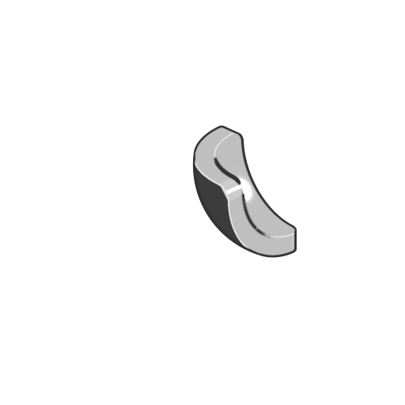

# Schnittfläche

<table>
<tr style="border: 0;">
<td width="33.33%" style="border: 0;" valign="top">

<b>In:</b> SDF-Funktion > Operator

</td>
<td width="100.00%" style="border: 0;" valign="top">

## Beschreibung

Gibt die Fläche des Bereichs einer SDF-Grundform zurück, der von einer anderen SDF-Form mit anpassbarer Thickness geschnitten wird.

</td>
</tr>
</table>

>[!INFO]
> 
> Weitere Informationen zu Konzepten und Workflows mit SDF-Funktionen finden Sie auf der entsprechenden Seite: [Arbeiten mit SDF-Funktionen](../../working-with-sdf-functions.md)

## Eingaben

|  |  |
| :--- | :--- |
| <b>Basis-SDF</b> *Gleitend* | Die SDF-Form, auf der die resultierende Oberfläche basiert. |
| <b>Schnittmenge mit SDF</b> bilden *Gleitend* | Die SDF-Form, die die Basis-SDF-Form schneidet. |
| <b>Thickness</b> *Gleitend* | Die Thickness der resultierenden Fläche.  <i>Standard: 0,02</i> |
