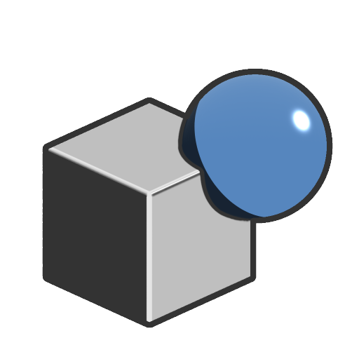

# Union

<table>
<tr style="border: 0;">
<td width="33.33%" style="border: 0;" valign="top">

<b>In:</b> SDF-Funktion > Operator

</td>
<td width="100.00%" style="border: 0;" valign="top">

## Beschreibung

Gibt die hinzugefügten Volumes zweier SDF-Formen zurück.

</td>
</tr>
</table>

>[!INFO]
> 
> Weitere Informationen zu Konzepten und Workflows mit SDF-Funktionen finden Sie auf der entsprechenden Seite: [Arbeiten mit SDF-Funktionen](../../working-with-sdf-functions.md)

## Eingaben

|  |  |
| :--- | :--- |
| <b>SDF 1</b> *Gleitend* | Die erste SDF-Form. |
| <b>SDF 2</b> *Gleitend* | Die zweite SDF-Form. |
