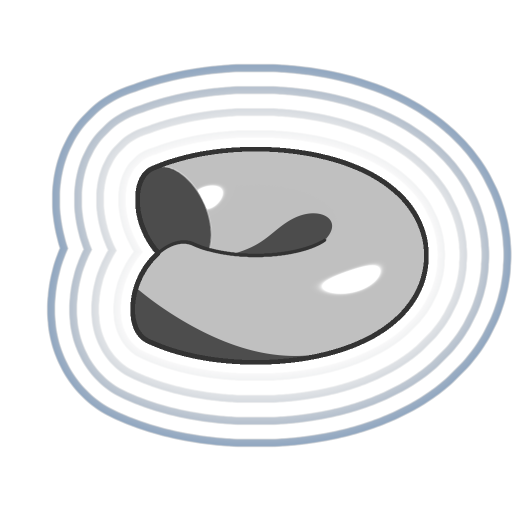

# Torus capped

<table>
<tr style="border: 0;">
<td width="33.33%" style="border: 0;" valign="top">

<b>In:</b> SDF-Funktion > Primitiv

</td>
<td width="100.00%" style="border: 0;" valign="top">

## Beschreibung

Eine SDF-Funktion für einen gedeckten Torus, bei der das Überstreichen des kleineren Kreises entlang eines größeren Kreises schräg gedeckt werden kann. Beide Kreise haben einen einstellbaren Radius.

</td>
</tr>
</table>

>[!INFO]
> 
> Weitere Informationen zu Konzepten und Workflows mit SDF-Funktionen finden Sie auf der entsprechenden Seite: [Arbeiten mit SDF-Funktionen](../../working-with-sdf-functions.md)

## Eingaben

|  |  |
| :--- | :--- |
| <b>Hauptradius</b> *Gleitend* | Der Radius des Hauptkreises, entlang dem der Nebenkreis gefegt wird, um die Oberfläche des Torus zu bilden.  <i>Standard: 0,5</i> |
| <b>Geringfügiger Radius</b> *Gleitend* | Der Radius des kleineren Kreises, der entlang des größeren Kreises gefegt wird, um die Oberfläche des Torus zu bilden.  <i>Standard: 0.2</i> |
| <b>Winkel</b> *Gleitend* | Der zentrale Winkel, der abwechselnd den Trimmbogen des Hauptkreises definiert, entlang dem der Nebenkreis nicht gefegt wird.  <i>Standard: 0,75</i> |
| <b>Winkelversatz</b> *Gleitend* | Der Versatz entlang des Hauptradius des Trimmbogens, entlang dem der Nebenkreis nicht überstrichen wird.  <i>Standard: 0</i> |
| <b>Symmetrisch</b> *Boolescher Wert* | Steuert, ob der Trimmbogen in eine oder zwei Richtungen gezeichnet werden soll.  <i>Standard: Wahr</i> |
| <b>Mittenposition</b> *Float3* | Die Weltraumposition des Drehpunkts des gedeckelten Torus.  <i>Standard: (0, 0, 0.5)</i> |
| <b>P</b> *Float3* | Die veränderte Weltraumposition. Verwenden Sie diese Eingabe, um zusätzliche Transformationen mit den Knoten <b>Offset P</b> und <b>Rotate P</b> anzuwenden.  <i>Standard: Die nicht transformierte Weltraumposition.</i> |
