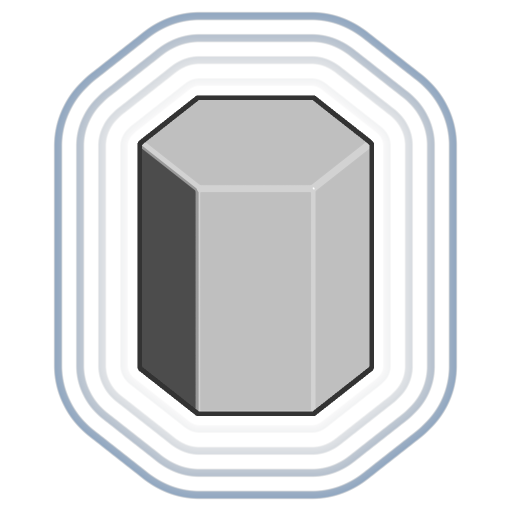

# Sechskantprisma

<table>
<tr style="border: 0;">
<td width="33.33%" style="border: 0;" valign="top">

<b>In:</b> SDF-Funktion > Primitiv

</td>
<td width="100.00%" style="border: 0;" valign="top">

## Beschreibung

Eine SDF-Funktion für ein 6-seitiges Prisma mit einstellbarem Height, Radiuseinstellung und Kantenabrundung.

</td>
</tr>
</table>

>[!INFO]
> 
> Weitere Informationen zu Konzepten und Workflows mit SDF-Funktionen finden Sie auf der entsprechenden Seite: [Arbeiten mit SDF-Funktionen](../../working-with-sdf-functions.md)

## Eingaben

|  |  |
| :--- | :--- |
| <b>Height</b> *Gleitend* | Das Z-Up-Height des sechseckigen Prismas von seiner Basis.  <i>Standard: 1</i> |
| <b>Radius</b> *Gleitend* | Der Radius des sechseckigen Prismas.  <i>Standard: 0,5</i> |
| <b>Rundung</b> *Gleitend* | Der Radius der abgerundeten Bögen, die auf die Kanten des sechseckigen Prismas angewendet werden.  <i>Hinweis:</i> harte Kanten können an den Schnittpunkten der abgerundeten Radien auftreten.  <i>Standard: 0</i> |
| <b>Mittenposition</b> *Float3* | Die Weltraumposition des Drehpunkts des sechseckigen Prismas.  <i>Standard: (0, 0, 0)</i> |
| <b>P</b> *Float3* | Die veränderte Weltraumposition. Verwenden Sie diese Eingabe, um zusätzliche Transformationen mit den Knoten <b>Offset P</b> und <b>Rotate P</b> anzuwenden.  <i>Standard: Die nicht transformierte Weltraumposition.</i> |
