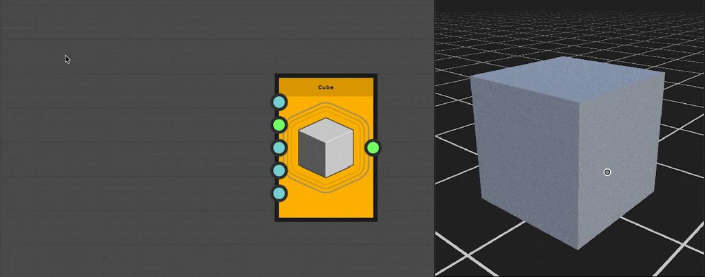
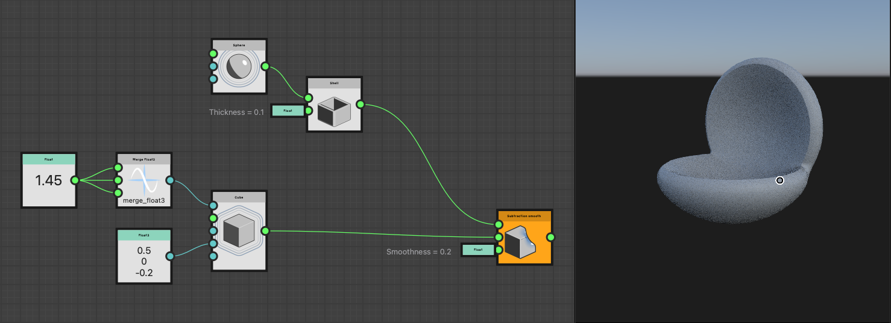
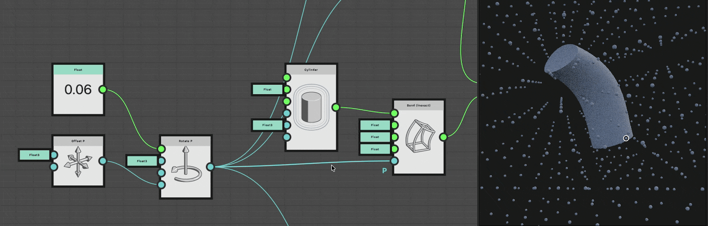
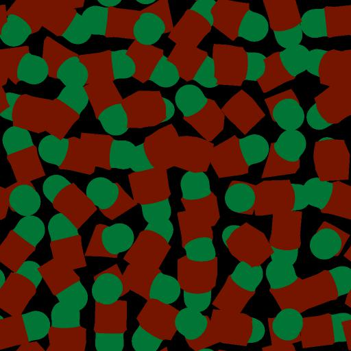

# Arbeiten mit SDF-Funktionen

In Version 16.0.0 hat Substance 3D Designer einen leistungsstarken Knotensatz für Authoring-SDF-Funktionen eingeführt, mit denen prozedurale 3D-Formen erstellt und bearbeitet werden können.

SDF-Funktionen sind Substance-Funktionsdiagramme, die in der Toolset verfügbare SDF-Knoten kombinieren und auf dedizierte Parameter in Knoten angewendet werden, die SDF-Funktionen unterstützen.

Beachten Sie als Ausgangspunkt den grundlegenden Arbeitsablauf, der wie folgt aussieht:

1. Erstellen Sie eine SDF-Funktion in einem [3D-Viewer](../../../../compositing-graphs/nodes-reference-for-com/node-library/filters/effects/3d-viewer/3d-viewer.md)-Knoten, um das Ergebnis zu visualisieren.
2. Kopieren Sie das finale Funktionsdiagramm (oder [instanziieren Sie es](../../../../glossary/glossary.md#instance-node)) in den SDF-Funktion-Parameter eines Knotens, der SDF-Funktionen unterstützt, wie z. B. [Shape splatter v2](../../../../compositing-graphs/nodes-reference-for-com/node-library/texture-generators/patterns/shape-splatter-v2/shape-splatter-v2.md).

## Was ist eine SDF-Funktion?

<table style="border: none">
    <tr style="border: 0">
        <td style="border: 0; vertical-align: top">
            
Genau wie mathematische Funktionen in 2D als Kurven aufgetragen werden können, können sie in 3D als Flächen aufgetragen werden.

Ein vorzeichenbehaftetes Abstandsfeld ist eine mathematische Funktion, die eine Oberfläche im 3D-Raum definiert, indem der Abstand von einem beliebigen Punkt im Raum zum nächsten Punkt auf der Oberfläche berechnet wird.

Teilen wir den Namen "Feld für signierte Abstände" auf, um ihn besser zu verstehen:<ul><li><b>Signiert</b> bedeutet, dass die Funktion einen positiven Wert zurückgibt, wenn sich der Punkt außerhalb/vor der Oberfläche befindet, einen negativen Wert, wenn sich der Punkt innerhalb/hinter der Oberfläche befindet, und Null, wenn sich der Punkt genau auf der Oberfläche befindet.</li><li><b>Abstand</b> bezieht sich auf die Tatsache, dass die Funktion den Abstand von einem beliebigen Punkt im Raum zum *nächstgelegenen* Punkt auf der Oberfläche berechnet.</li><li><b>Feld</b> bedeutet, dass die Funktion ein Feld mit Werten beschreibt, da jeder Punkt im Raum einen entsprechenden Wert hat, der den Abstand zur nächsten Fläche darstellt.</li></ul>

        </td>
        <td style="border: 0; width: 33%; vertical-align: top">
            
        </td>
    </tr>
</table>

Diese Funktionen haben viele Anwendungen in der Computergrafik, wie Zeichnungsoberflächen, Schattenwurf, Konturmaskierung, Kollisionserkennung und mehr.

In Substance 3D Designer werden SDF-Funktionen verwendet, um 3D-Formen auf prozedurale Weise zu erstellen und zu bearbeiten.

### Ausgabe und beabsichtigte Verwendung einer SDF-Funktion

SDF-Funktion-Nodes geben einen einzelnen Gleitkommawert aus: der vorzeichenbehaftete Abstand zur nächsten Fläche.

Aber sie haben noch mehr zu bieten: sie intern die Werte von Variablen abrufen und festlegen, die die Hostknoten definieren und/oder wissen müssen, um die resultierenden Formen zu bearbeiten und zu zeichnen.

Dies bedeutet, dass diese Knoten im Kontext von Knoten verwendet werden müssen, die *SDF-Funktionen* unterstützen, da sie diese Variablen kennen und nativ integrieren.

Die Knoten enthalten [Shape-Splatter v2](../../../../compositing-graphs/nodes-reference-for-com/node-library/texture-generators/patterns/shape-splatter-v2/shape-splatter-v2.md) und [3D-Viewer](../../../../compositing-graphs/nodes-reference-for-com/node-library/filters/effects/3d-viewer/3d-viewer.md).

### Das Funktionsdiagramm von Substance

SDF-Funktion-Nodes sind für die Verwendung in speziellen Substance-Funktionsgraphen vorgesehen und sind daher nur in diesem Diagrammtyp verfügbar.
Knotenparameter, die als Funktion ausgedrückt werden sollen, verwenden einen &#39;Edit function&#39;-Button.

Was Sie über Substance-Funktionsdiagramme wissen müssen:
* Ähnlich wie Substance-Graphen sind Knoten-Connectors *spezialisiert*, d. h., sie können nur mit anderen Connectors von *gleicher Farbe* [verbunden werden, die ihren Typ &#x200B;](../../function-nodes-overview/function-nodes-overview.md#color-coding) darstellen.
* Knoten haben keine Parameter, sie können nur Eingaben haben. (Mit einigen wenigen Ausnahmen)
* Das Diagramm hat einen einzelnen Ausgabeknoten. Klicken Sie mit der rechten Maustaste auf einen Knoten, und wählen Sie `Set as output` aus, um ihn als Ausgabeknoten festzulegen.
* Ähnlich wie Substance-Graphen gibt es *atomic* Nodes - die Basisbausteine - und *instance* Nodes, die andere Substance-Funktionsgraphen darstellen.
* Es gibt separate Operatoren (algebraisch, logisch und Vergleich), mit denen Sie Vorgänge für die Werte im Diagramm ausführen können. SDF-Knoten verfügen jedoch über [eigene Operatoren](#operators).

+++ Beispiel für ein Funktionsdiagramm, das eine SDF-Funktion definiert

+++

## Erste Schritte

Um SDF-Funktionen zu erstellen, müssen wir sie zunächst visualisieren, damit wir die Auswirkungen der Knoten und Parameter verstehen können, die wir anpassen.

Der Knoten [3D viewer](../../../../compositing-graphs/nodes-reference-for-com/node-library/filters/effects/3d-viewer/3d-viewer.md) verfügt über einen speziellen Modus zum Visualisieren von Formen, die mithilfe von SDF-Funktionen erstellt wurden: Setzen Sie den <b>Szenentyp</b> des Knotens auf `SDF function`, und klicken Sie auf die Schaltfläche **Funktion bearbeiten**, um das Funktionsdiagramm zu öffnen, in dem die SDF-Funktion selbst gehostet wird.

Der Node bietet spezielle Funktionen zur Visualisierung von Aspekten der SDF-Funktion, mit denen wir sie intuitiver und effizienter erstellen können, z. B. ein Begrenzungsrahmen und Isolinien.

Der Knoten [Physische Sonne/Himmel](../../../../compositing-graphs/nodes-reference-for-com/node-library/3d-view-library/hdri-tools/physical-sun-sky/physical-sun-sky.md) kann verwendet werden, um die Umgebungsbeleuchtung im 3D-Viewer schnell einzurichten.

>[!TIP]
> 
> <table style="border: none"><tr style="border: none"><td style="border: none; vertical-align: top">
Alle SDF-Funktion-Nodes sowie deren Eingabe-Connectors bieten QuickInfos, die Sie über ihren Zweck und ihre Verwendung informieren.

Schauen Sie sie sich an!
</td><td style="border: none; width: 33%; vertical-align: top"></td></tr></table>

### Knotenwerte festlegen

Wie bei allen Nodes in Substance-Funktionsgraphen verfügen SDF-Funktion Nodes nicht über Parameter, sondern nur über Eingangsanschlüsse, die als Parameter verwendet werden.

Um den Wert dieser Eingaben festzulegen, können Sie [konstante Knoten](../../atomic-function-nodes/constant-nodes/constant-nodes.md) verwenden, z. B. **Float**, **Float3** und **Integer3**.\
Sie können diese auf die übliche Weise über das Knotenmenü erstellen oder eine neue Verbindung aus den Connectors ziehen, um von einer gefilterten Liste von Knoten entsprechender Typen zu profitieren.

Die meisten Eingangsanschlüsse von SDF-Funktion-Nodes haben einen Standardwert, der in der QuickInfo angegeben ist.

>[!TIP]
> 
> <table style="border: none"><tr style="border: none"><td style="border: none; vertical-align: top">
Wenn Sie einige Werte nicht immer sichtbar halten müssen, docken Sie Knoten mit der Taste <code>D</code> an, um Platz zu sparen und das Diagramm zu optimieren.

Sie können die Werte auch mithilfe von Kommentaren verfolgen.
</td><td style="border: none; width: 67%; vertical-align: top"></td></tr></table>

### Der Begrenzungsrahmen

<table style="border: none">
    <tr style="border: none">
        <td style="border: none; vertical-align: top">
            
Der Begrenzungsrahmen ist ein Rahmen im 3D-Raum, der die <i>Grenzen</i> definiert, in denen die SDF-Funktion ausgewertet und im <a href="../../../../compositing-graphs/nodes-reference-for-com/node-library/texture-generators/patterns/shape-splatter-v2/shape-splatter-v2.md">Shape-Splutter v2</a>-Knoten gezeichnet wird.

Wenn der Begrenzungsrahmen zu klein ist, können Teile der Form zugeschnitten werden. Wenn er zu groß ist, kann er zu unnötigen Berechnungen und längeren Verarbeitungszeiten führen.

Mit dem Parameter <b>Begrenzungsrahmen</b> können Sie die Visualisierung des Begrenzungsrahmens aktivieren. Sie können dann die Größe des Begrenzungsrahmens anpassen, indem Sie die Werte des Parameters <b>Begrenzungsrahmengröße</b> ändern.

Verwenden Sie den Parameter <b>Aus Bild</b> einfärben, um die Bereiche außerhalb des Begrenzungsrahmens in kräftigem Rot darzustellen, damit Sie das Bild entsprechend anpassen können.

        </td>
        <td style="border: none; width: 33%; vertical-align: top">
            
        </td>
    </tr>
</table>

### Isolinien

<table style="border: none">
    <tr style="border: none">
        <td style="border: none; vertical-align: top">
            
Da das Transformieren von Formen tatsächlich das *Transformieren des Raums* beinhaltet, in dem sie gezeichnet werden, kann das Ergebnis von Knoten, die nach einigen Transformationen verwendet werden, überraschend sein. In diesen Fällen ist es hilfreich, den Raum selbst zu visualisieren. Dies kann durch <i>Visualisieren des Abstandsfelds</i> der Form erfolgen.

Dazu verwendet der 3D-Anzeigeknoten <i>Isolinien</i>, die sich wiederholende Konturlinien darstellen, die einen bestimmten Abstand von der Formoberfläche darstellen. Der <b>SDF-Isolinien</b>-Parameter aktiviert diese Visualisierung. Die Isolinien werden auf einer horizontalen Ebene gezeichnet, die sich an dem Height befindet, das durch den <b>SDF-Isolinienposition</b>-Parameter angegeben wird.

Wenn Sie sehen, wie Isolinien durch die auf die Form angewendeten Transformationen deformiert werden, können Sie besser verstehen, wie die Form selbst transformiert wird, und die Parameter der Knoten entsprechend anpassen.

        </td>
        <td style="border: none; width: 33%; vertical-align: top">
            
        </td>
    </tr>
</table>

## SDF-Funktion Knotenkategorien

SDF-Funktionen-Nodes werden in der Bibliothek nach Funktion und Zweck kategorisiert.

Sie können beliebig viele Bibliotheksansichten erstellen, um Ihren Arbeitsbereich so zu organisieren, dass die Werkzeuggruppe &quot;SDF-Funktionen&quot; nach Kategorien geordnet ist, wobei alles griffbereit bleibt. Wechseln Sie zur Ansicht **Windows > Neue Bibliothek**, um separate, unabhängige Ansichten der Bibliothek hinzuzufügen.

+++ Beispielarbeitsbereich

+++

### Volumengrundkörper

Die grundlegenden Bausteine von SDF-Funktionen, mit denen Sie Grundformen wie Kugeln, Rahmen und Zylinder erstellen können.

+++ Knoten

[Capped cone](./sdf-functions-primitives/3d-sdf-capped-cone/3d-sdf-capped-cone.md)\
[Gekappter Kegel (2 Punkte)](././sdf-functions-primitives/3d-sdf-capped-cone-2-points/3d-sdf-capped-cone-2-points.md)\
[Torus begrenzt](./sdf-functions-primitives/3d-sdf-capped-torus/3d-sdf-capped-torus.md)\
[Kapsel](./sdf-functions-primitives/3d-sdf-capsule/3d-sdf-capsule.md)\
[Konus](./sdf-functions-primitives/3d-sdf-cone/3d-sdf-cone.md)\
[Cube](./sdf-functions-primitives/3d-sdf-cube/3d-sdf-cube.md)\
[Zylinder](./sdf-functions-primitives/3d-sdf-cylinder/3d-sdf-cylinder.md)\
[Zylinder (2 Punkte)](./sdf-functions-primitives/3d-sdf-cylinder-2-points/3d-sdf-cylinder-2-points.md)\
[Ellipsoid](./sdf-functions-primitives/3d-sdf-ellipsoid/3d-sdf-ellipsoid.md)\
[Langgestreckter Zylinder](./sdf-functions-primitives/3d-sdf-elongated-cylinder/3d-sdf-elongated-cylinder.md)\
[Grundebene](./sdf-functions-primitives/3d-sdf-ground-plane/3d-sdf-ground-plane.md)\
[Helix](./sdf-functions-primitives/3d-sdf-helix/3d-sdf-helix.md)\
[Sechseckiges Prisma](./sdf-functions-primitives/3d-sdf-hexagonal-prism/3d-sdf-hexagonal-prism.md)\
[Unendliche Ebene](./sdf-functions-primitives/3d-sdf-infinite-plane/3d-sdf-infinite-plane.md)\
[Ebene](./sdf-functions-primitives/3d-sdf-plane/3d-sdf-plane.md)\
[Pyramide](./sdf-functions-primitives/3d-sdf-pyramid/3d-sdf-pyramid.md)\
[Pyramidenquadrat](./sdf-functions-primitives/3d-sdf-pyramid-square/3d-sdf-pyramid-square.md)\
[Rock](./sdf-functions-primitives/3d-sdf-rock/3d-sdf-rock.md)\
[Sphäre](./sdf-functions-primitives/3d-sdf-sphere/3d-sdf-sphere.md)\
[Torus](./sdf-functions-primitives/3d-sdf-torus/3d-sdf-torus.md)

+++

### Operatoren

Mit diesen Knoten können Sie Formen, die mit Grundformen erstellt wurden, kombinieren und ändern. Dazu gehören:
* **Boolesche Operatoren wie [Union](sdf-functions-operators/3d-sdf-op-union/3d-sdf-op-union.md), [Intersection](sdf-functions-operators/3d-sdf-op-intersection/3d-sdf-op-intersection.md) und [Subtraktion](sdf-functions-operators/3d-sdf-op-subtraction/3d-sdf-op-subtraction.md), mit denen Sie Formen auf verschiedene Weise kombinieren können.**
* **Verformen boolescher** Operatoren wie [Abrunden](sdf-functions-operators/3d-sdf-op-rounding/3d-sdf-op-rounding.md) und [Morph](sdf-functions-operators/3d-sdf-op-morph/3d-sdf-op-morph.md), mit denen Sie Formen mit einem Fülleffekt kombinieren können.
* **Weitere spezialisierte** Operatoren wie [Shell](sdf-functions-operators/3d-sdf-op-shell/3d-sdf-op-shell.md) und [Symmetry](sdf-functions-operators/3d-sdf-op-symmetry/3d-sdf-op-symmetry.md), mit denen Sie eine Form ändern und/oder duplizieren können.

+++ Knoten

[Schnittmenge](./sdf-functions-operators/3d-sdf-op-intersection/3d-sdf-op-intersection.md)\
[Schnittmenge glatt](./sdf-functions-operators/3d-sdf-op-intersection-smooth/3d-sdf-op-intersection-smooth.md)\
[Schnittfläche](./sdf-functions-operators/3d-sdf-op-intersection-surface/3d-sdf-op-intersection-surface.md)\
[Morph](./sdf-functions-operators/3d-sdf-op-morph/3d-sdf-op-morph.md)\
[Spiegel wiederholen](./sdf-functions-operators/3d-sdf-op-repeat-mirror/3d-sdf-op-repeat-mirror.md)\
[Rundung](./sdf-functions-operators/3d-sdf-op-rounding/3d-sdf-op-rounding.md)\
[Shell](./sdf-functions-operators/3d-sdf-op-shell/3d-sdf-op-shell.md)\
[Subtraktion](./sdf-functions-operators/3d-sdf-op-subtraction/3d-sdf-op-subtraction.md)\
[Subtraktion glatt](./sdf-functions-operators/3d-sdf-op-subtraction-smooth/3d-sdf-op-subtraction-smooth.md)\
[Symmetrie](./sdf-functions-operators/3d-sdf-op-symmetry/3d-sdf-op-symmetry.md)\
[Union](./sdf-functions-operators/3d-sdf-op-union/3d-sdf-op-union.md)\
[Fase der Union](./sdf-functions-operators/3d-sdf-op-union-chamfer/3d-sdf-op-union-chamfer.md)\
[Union glatt](./sdf-functions-operators/3d-sdf-op-union-smooth/3d-sdf-op-union-smooth.md)

+++

### Transformiert

Formen können auf verschiedene Weise transformiert werden, z. B. [übersetzt](sdf-functions-transforms/3d-sdf-transform-offset/3d-sdf-transform-offset.md), [gedreht](sdf-functions-transforms/3d-sdf-transform-rotate/3d-sdf-transform-rotate.md), [skaliert](sdf-functions-transforms/3d-sdf-transform-scale/3d-sdf-transform-scale.md), [verdreht](sdf-functions-transforms/3d-sdf-transform-twist/3d-sdf-transform-twist.md) und mehr.
Mit diesen Knoten können Sie diese Transformationen durchführen, indem Sie den Raum selbst *, in dem die Oberflächen definiert sind,* transformieren.

Dieser Bereich wird als `P` bezeichnet. Fahren Sie mit dem nächsten Abschnitt fort, um mehr darüber zu erfahren, was dies bedeutet und wie die Raumtransformation funktioniert.

+++ Knoten

[Biegung](./sdf-functions-transforms/3d-sdf-transform-bend/3d-sdf-transform-bend.md)\
[Länglich](./sdf-functions-transforms/3d-sdf-transform-elongate/3d-sdf-transform-elongate.md)\
[Spiegeln](./sdf-functions-transforms/3d-sdf-transform-flip/3d-sdf-transform-flip.md)\
[Offset](./sdf-functions-transforms/3d-sdf-transform-offset/3d-sdf-transform-offset.md)\
[Offset P](./sdf-functions-transforms/3d-sdf-transform-offset-p/3d-sdf-transform-offset-p.md)\
[Drehen](./sdf-functions-transforms/3d-sdf-transform-rotate/3d-sdf-transform-rotate.md)\
[P](./sdf-functions-transforms/3d-sdf-transform-rotate-p/3d-sdf-transform-rotate-p.md) drehen\
[Skalierung](./sdf-functions-transforms/3d-sdf-transform-scale/3d-sdf-transform-scale.md)\
[Drehung](./sdf-functions-transforms/3d-sdf-transform-twist/3d-sdf-transform-twist.md)

+++

### Material

Grundlegende Materialverwaltung ist für Formen verfügbar, die mit SDF-Funktionen erstellt wurden.

Sie können grundlegende Materialattribute definieren: Farbe, Raueit und Metallität, zur direkten Visualisierung im 3D-Betrachterknoten oder als Basis für Materialarbeiten im Shape-Splater v2-Knoten.\
Sie können auch Material-IDs verschiedenen Teilen einer Form zuweisen, um sie zu trennen.

Erfahren Sie mehr über Anwendungen dieser Knoten [unten](#material-id).

+++ Knoten

* [Materialkennung festlegen](./sdf-functions-material/set-id/set-id.md)
* [Material festlegen](./sdf-functions-material/set-material/set-material.md)
* [Festlegen der Farbe](./sdf-functions-material/set-color/set-color.md)
* [Metallität einstellen](./sdf-functions-material/set-metalness/set-metalness.md)
* [Festlegen der Raueit](./sdf-functions-material/set-roughness/set-roughness.md)

+++

## Die P-Eingabe

Wenn wir eine Transformation auf eine Form anwenden, wie z. B. einen Versatz oder eine Drehung, transformieren wir den Raum, in dem die Form definiert ist.

Wenn wir eine Transformation auf andere Formen übertragen wollen - wenn wir zum Beispiel mehrere Formen auf die gleiche Weise drehen wollen - müssen wir sicherstellen, dass sie alle den gleichen transformierten Raum verwenden.

Ein transformierter Space wird über Knoten gemeinsam genutzt, indem die dedizierten `P`-Eingaben verwendet werden, die Sie in den meisten SDF-Knoten finden.\
Das &#39;P&#39; steht für den Weltraum **P** position: Ein 3D-Vektor, der die Koordinaten eines Punktes im Weltraum darstellt.

Die Knoten [Offset P](sdf-functions-transforms/3d-sdf-transform-offset-p/3d-sdf-transform-offset-p.md) und [Rotate P](sdf-functions-transforms/3d-sdf-transform-rotate-p/3d-sdf-transform-rotate-p.md) transformieren den Raum und ermöglichen es Ihnen, diese Transformation auf alle Knoten zu übertragen, die ihn erben sollen.\
Beispielsweise können mehrere Formen gemeinsam gedreht werden, indem ihre `P`-Eingabe mit demselben Knoten &quot;P drehen&quot; verbunden werden.

Dies ist nicht nur eine Frage der Bequemlichkeit, sondern stellt sicher, dass SDF-Knoten mit den gleichen Positionen im Raum arbeiten.

Hier ist ein Beispiel:

Eine Kugel wird wiederholt, um den Raum als 3D-Raster darzustellen. Sie wird durch *Wiederholen des Leerzeichens* wiederholt.\
Ohne gemeinsam genutzte `P`-Elemente verwendet der gebogene Zylinder den von der Kugel verwendeten wiederholenden Raum.\
Mit einem freigegebenen `P` können Formen in einem freigegebenen gedrehten Raum korrekt definiert werden.

## Verwenden von SDF-Funktionen in den Knoten &quot;Shape splatter v2&quot;

Nachdem Sie eine SDF-Funktion im Kontext des 3D-Anzeigeknotens abgeschlossen haben, können Sie die gesamte Funktion kopieren und in den Knoten [Shape splatter v2](../../../../compositing-graphs/nodes-reference-for-com/node-library/texture-generators/patterns/shape-splatter-v2/shape-splatter-v2.md) einfügen, um sie als Formengenerator für diesen Knoten zu verwenden.

Setzen Sie den **Shape type**-Parameter auf `SDF function`. Wechseln Sie dann zum **Pattern SDF-Funktion**-Parameter, und klicken Sie auf die Schaltfläche **Edit function**, um das Funktionsdiagramm des Parameters zu öffnen.
Sie können dann die Funktion, die Sie vom 3D-Anzeigeknoten kopiert haben, in dieses Diagramm einfügen. (Vergessen Sie nicht, den Ausgabeknoten des Funktionsdiagramms erneut einzustellen!)

Stellen Sie sicher, dass Sie den Parameter **SDF-Begrenzungsrahmengröße** an den [Begrenzungsrahmen](#the-bounding-frame) anpassen, den Sie im 3D-Anzeigeknoten verwendet haben, und stellen Sie sicher, dass die Form ordnungsgemäß gezeichnet wird.

\
*Form platzieren v2 mit einem **Formentyp**, der auf `SDF function` festgelegt ist. Beachten Sie, dass die Größe des **SDF-Begrenzungsrahmens**&#x200B;an die Form angepasst wurde.*

>[!TIP]
> 
> Um eine SDF-Funktion einfach wiederzuverwenden, kopieren Sie sie in ein neues Funktionsdiagramm für Substance und verwenden Sie dieses Diagramm als **Instanzknoten** sowohl im 3D-Viewer als auch im Shape-Splater v2-Knoten.
> 
> Dies bietet mehrere Vorteile:
> * Alle Änderungen, die Sie an der Funktion vornehmen, werden in beiden Knoten widergespiegelt, ohne dass Sie sie erneut kopieren und einfügen müssen. Dies ist eine große Verbesserung der Lebensqualität für komplexe Formen.
> * Das Diagramm kann einen beschreibenden Namen haben, der in den Instanzknoten sichtbar ist, was die Verwendung Ihrer eigenen Bibliothek von SDF-Formen viel einfacher und Ihre Diagramme besser lesbar macht.
> * Sie können Eingaben für das Funktionsdiagramm erstellen, das Sie mit [Get](../../atomic-function-nodes/get-nodes/get-nodes.md)-Knoten verwenden können. Diese Eingaben werden als Eingangsverbindungen im Instanzknoten angezeigt und ermöglichen es Ihnen, ganz einfach Variationen Ihrer Formen zu erstellen.

### Material-ID

Einer SDF-Form kann eine Material-ID zugewiesen werden. Dies ist ein ganzzahliger Wert, mit dem Teile der Form unterschieden und ihnen in den Knoten [3D viewer](../../../../compositing-graphs/nodes-reference-for-com/node-library/filters/effects/3d-viewer/3d-viewer.md) und [Shape splatter v2](../../../../compositing-graphs/nodes-reference-for-com/node-library/texture-generators/patterns/shape-splatter-v2/shape-splatter-v2.md) unterschiedliche Materialien zugewiesen werden können.

Beachten Sie, dass Flächen mit unterschiedlichen Material-IDs über angeglichene Formen hinweg mit einer harten Kante geteilt werden, wie im folgenden Beispiel zu sehen ist.

Verwenden Sie den Knoten [Materialkennung einstellen](./sdf-functions-material/set-id/set-id.md) nach dem Teil einer Form, der mit einer bestimmten Materialkennung markiert werden soll, und verwenden Sie einen konstanten Knoten [Ganzzahl](../../atomic-function-nodes/constant-nodes/constant-nodes.md), um den gewünschten Materialkennungswert festzulegen.\
Setzen Sie im 3D-Anzeigeknoten den Parameter **Ausgabe** auf `Material ID`, um die Material-IDs der Formen anzuzeigen.

\
*Auf der rechten Seite werden die Ausgabe von zwei 3D-Anzeigeknoten zusammengestellt, um die Form (links) und ihre Material-IDs (rechts) anzuzeigen, um zu veranschaulichen, wie in gemischten Formen Materialien interpoliert werden, während Material-IDs geteilt werden.*

Material IDs können von Shape splatter v2 Companion Nodes genutzt werden:
* [Shape Splatter v2 Mapper](../../../../compositing-graphs/nodes-reference-for-com/node-library/texture-generators/patterns/shape-splatter-v2-mapper-color/shape-splatter-v2-mapper-color.md) Knoten können diese Material-IDs verwenden, um verschiedene Muster zuzuweisen.
* [Formspritzer v2 auf Maske &#x200B;](../../../../compositing-graphs/nodes-reference-for-com/node-library/texture-generators/patterns/shape-splatter-v2-to-mask/shape-splatter-v2-to-mask.md) kann Teile von Formen gemäß ihrer Material-ID maskieren.

<table style="border: none; margin-top: 32px">
    <tr style="border: 0">
        <td style="border: 0; width: 33%">
            <i>Für die Farbzuordnung verwendete Material-IDs in der Zuordnungsfarbe Shape Splater v2</i>
        </td>
        <td style="border: 0; width: 33%">
            <i>Material-IDs für triplanare Zuordnung  in der Formspritzer-v2-Zuordnungsfarbe </i>
        </td>
        <td style="border: 0; width: 33%">
             <i>Material-IDs zum Maskieren von  in Formspritzer v2 zur Maske von </i>
        </td>
    </tr>
</table>

### Farbe, Raueit und Metallität

Mit den Knoten [Farbe einstellen](./sdf-functions-material/set-color/set-color.md), [Raueit einstellen](./sdf-functions-material/set-roughness/set-roughness.md) und [Metalität einstellen](./sdf-functions-material/set-metalness/set-metalness.md) können Sie diese Materialattribute für Formen in der SDF-Funktion definieren.

Wenn Sie diese SDF-Funktion dann als Formtyp im Knoten [Shape splatter v2](../../../../compositing-graphs/nodes-reference-for-com/node-library/texture-generators/patterns/shape-splatter-v2/shape-splatter-v2.md) verwenden, sind diese Materialattribute als Maps in den **SDF-Farbausgaben**, **SDF-Raueit** und **SDF-Metalität** des Knotens verfügbar. Diese Karten können als Grundlage für komplexere Materialarbeiten mit anderen Knoten dienen.

Beachten Sie, dass Werte, die sich deutlich von Material-IDs unterscheiden, als Farbverlauf *interpoliert* werden, wie in den folgenden Beispielen zu sehen ist.

<table style="border: none; margin-top: 32px">
    <tr style="border: 0">
        <td style="border: 0; width: 33%">
            <i>SDF-Farbausgabe</i>
        </td>
        <td style="border: 0; width: 33%">
             <i>SDF-Rauhigkeitsausgabe</i>
        </td>
        <td style="border: 0; width: 33%">
            <i>SDF-Metalitätsausgabe</i>
        </td>
    </tr>
</table>

### Materialprobe

<table style="border: none">
    <tr style="border: none">
        <td style="border: none; vertical-align: top">
            
Die Materialprobe <b>Rusty bolts</b> <a href="../../../../compositing-graphs/creating-compositing-gra/material-samples/material-samples.md">Materialprobe</a> ist verfügbar, um in SDF-Funktionen zu springen, die im Kontext des Shape-Splutter-Knotens v2 angewendet wurden.

Das Diagramm ist so strukturiert und kommentiert, dass es Sie durch seine Struktur, Knoteneinstellungen und SDF-Funktion-Setups führt.

Es ist auch <i>vollständig bearbeitbar</i>, sodass es als Sandbox verwendet werden kann, um ein praktischeres Verständnis der Toolsets Shape Splater v2 und SDF-Funktionen zu erhalten. Du kannst beliebig viele Beispieldiagramme erstellen. Experimentiere einfach mit den Beispieldiagrammen.

        </td>
        <td style="border: none; width: 20%; vertical-align: top; text-align: right">
            
        </td>
    </tr>
</table>
