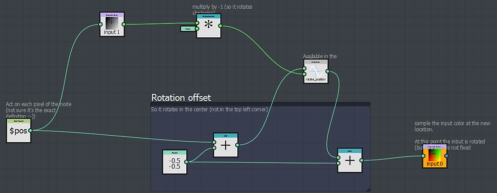
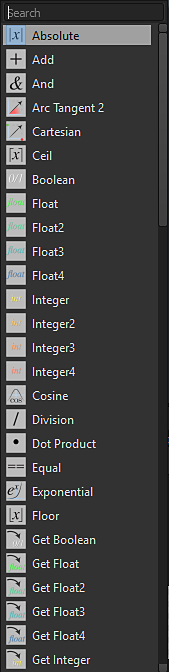

# Ähnlichkeiten mit einem Substance-Graf

Auf den ersten Blick ähnelt das Substance-Funktionsdiagramm einem Substance-Diagramm und der Arbeitsablauf ist fast der gleiche.

## Navigation ist ähnlich

Im Substance-Funktionsdiagramm können Sie Ihre Knoten genauso wie in einem Substance-Diagramm erstellen und organisieren.

können Sie auf dieselbe Weise auf die Knoten zugreifen:

* Aus der Bibliothek
* durch Drücken der Leertaste oder der Tabulatortaste
* indem Sie mit der rechten Maustaste klicken und das Menü Knoten hinzufügen verwenden

### Workflow ist ähnlich

Wie in der Substance-Grafik werden Sie Ihre Funktion aufbauen, indem Sie eine Reihe von Knoten verketten, die jeweils das Ergebnis verwenden, das von der/den vorherigen(n) generiert wurde.

Die Ausgabe definiert entweder den Wert eines Pixelprozessors oder die Ausgabe des Parameterknotens.

## Unterschiede bei einem Substance-Diagramm

<table>
<tr style="border: 0;">
<td width="100.00%" style="border: 0;" valign="top">

### Die Knoten

Die im Substance-Funktionsknoten verfügbaren Graf unterscheiden sich vollständig von denen, die in einem Substance-Graf auftreten würden.

</td>
<td width="25.00%" style="border: 0;" valign="top">

</td>
</tr>
</table>

<table>
<tr style="border: 0;">
<td style="border: 0;" valign="top">

### Die Ausgabe

Im Gegensatz zu Substance-Graphen kann eine Funktion nur einen Ausgang haben.

Beachten Sie außerdem, dass es keinen bestimmten Ausgabeknoten gibt, an den Sie das Endergebnis anschließen können. Stattdessen können Sie die Ausgabe direkt als Ausgabe markieren. Dabei handelt es sich um den Knoten, der das erwartete Ergebnis generiert:

</td>
<td style="border: 0;" valign="top">

Ausgabeknoten des 

</td>
</tr>
</table>

#### Wie wird der Ausgabeknoten definiert?

Klicken Sie zum Definieren der Ausgabe einfach mit der rechten Maustaste auf den Knoten, der die erwartete Ausgabe generiert, und klicken Sie auf *Als Ausgabeknoten festlegen:*

>[!WARNING]
>
> <b>Erneutes Überprüfen des generierten Ergebnistyps </b>
> 
> Wenn Sie bemerken, dass *Als Ausgabeknoten* festgelegt ausgegraut ist, bedeutet dies, dass der vom Knoten generierte Wert sich von dem vom Parameter oder vom Pixelprozessor erwarteten Wert unterscheidet.

<table>
<tr style="border: 0;">
<td style="border: 0;" valign="top">

Wie beim Substance von Graphen können Sie Funktionen importieren, die in einem anderen Graphen erstellt wurden. Sie können das Referenzdiagramm öffnen, indem Sie mit der rechten Maustaste darauf klicken und &quot;Referenz öffnen&quot; wählen:

</td>
<td style="border: 0;" valign="top">

</td>
</tr>
</table>

Wenn Sie ein SBS mit mehreren Funktionen haben, können Sie es direkt in ein Substance-Funktionsdiagramm ziehen und ablegen und in der angezeigten Liste die Funktion auswählen, die Sie importieren möchten:

