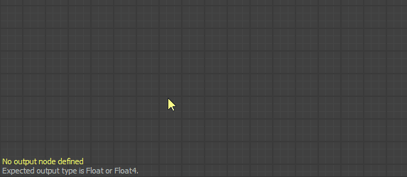

# Warnungen in Funktionsdiagrammen

Auf dieser Seite werden Warnungen und Fehlermeldungen aufgelistet, die von [Funktionsdiagrammen](../../function-graphs/function-graphs.md) in Substance 3D Designer ausgelöst werden können, und es werden allgemeine Schritte zur Fehlerbehebung für die einzelnen Funktionsdiagramme angezeigt.

Warnungen werden in der QuickInfo des Warnsymbols für die Diagrammressource im Bereich [Explorer](../../interface/the-explorer-window/the-explorer-window.md) sowie in der unteren linken Ecke der [Diagrammansicht](../../interface/the-graph-view/the-graph-view.md) angezeigt, wenn das Diagramm geladen ist.\
Wenn die Funktion *auf einen Parameter* in einem [Substance-Graphen ](../../compositing-graphs/substance-compositing-graphs.md) angewendet wird, wird jede Warnung dazu führen, dass die Warnung &quot;*Die Funktion des [x]-Parameters weist einige Fehler auf*&quot; für diesen Parameter ausgelöst wird.

##  Kein Ausgabeknoten definiert

Für die Funktion ist kein Ausgabeknoten definiert.

<table>
<tr style="border: 0;">
<td width="58.30%" style="border: 0;" valign="top">

** Lösung**

Wählen Sie einen beliebigen Knoten im Diagramm aus, der einen Wert ausgibt, dessen Typ dem erwarteten Typ für diese Funktion entspricht (falls vorhanden), klicken Sie dann auf RMB und wählen Sie im Kontextmenü die Option **Als Ausgabeknoten festlegen**.\
Der Ausgabeknoten eines Funktionsdiagramms hat die Farbe *Orange*.

>[!NOTE]
>
> Wenn eine Funktion einen erwarteten Ausgabewerttyp hat, werden Sie in einer Notiz in der unteren linken Ecke der [Diagrammansicht](../../interface/the-graph-view/the-graph-view.md) über diesen Typ informiert.

</td>
<td width="41.60%" style="border: 0;" valign="top">

</td>
</tr>
</table>

###  Der aktuelle Ausgabeknoten gibt einen Wert vom Typ *x* zurück.

Der Ausgabeknoten der Funktion gibt einen Wert zurück, dessen Typ nicht mit dem erwarteten Ausgabewerttyp für diese Funktion übereinstimmt.

<table>
<tr style="border: 0;">
<td width="58.30%" style="border: 0;" valign="top">

** Lösung**

Wählen Sie einen beliebigen Knoten im Diagramm aus, der einen Wert ausgibt, dessen Typ dem erwarteten Typ für diese Funktion entspricht. Klicken Sie dann auf RMB, und wählen Sie im Kontextmenü die Option **Als Ausgabeknoten festlegen**.\
Der Ausgabeknoten eines Funktionsdiagramms hat die Farbe *Orange*.

>[!NOTE]
>
> Wenn eine Funktion einen erwarteten Ausgabewerttyp hat, werden Sie in einer Notiz in der unteren linken Ecke der [Diagrammansicht](../../interface/the-graph-view/the-graph-view.md) über diesen Typ informiert.

</td>
<td width="41.60%" style="border: 0;" valign="top">

</td>
</tr>
</table>

###  Einige Get-Knoten haben keinen Variablennamen.

Ein oder mehrere [Get](../../function-graphs/nodes-reference-for-fun/atomic-function-nodes/get-nodes/get-nodes.md)-Knoten verfügen über ihre <b>Get...</b>-Eigenschaft leer gelassen, verweisen daher auf keine Variable.

<table>
<tr style="border: 0;">
<td width="58.30%" style="border: 0;" valign="top">

** Lösung**

Geben Sie eine Zeichenfolge, die dem Namen einer im Funktionsumfang *verfügbaren Variable* entspricht, in die **Get...**-Eigenschaft von Get-Knoten, die diese Warnung auslösen.

>[!NOTE]
>
> Die Eingabezeichenfolge ist &quot;*&quot;, die im Knoten &quot;*&quot; angezeigt wird. Dadurch können Knoten mit leeren Werten leicht gefunden werden.

</td>
<td width="41.60%" style="border: 0;" valign="top">

</td>
</tr>
</table>

###  Einige Set-Knoten haben keinen Variablennamen.

Bei mindestens einem [Set](../../function-graphs/fxmaps/using-functions-in-fxmaps/using-the-set-sequence/using-the-set-sequence-nodes.md)-Knoten bleibt die **Set**-Eigenschaft leer, sodass auf keine Variable verwiesen wird.

<table>
<tr style="border: 0;">
<td width="58.30%" style="border: 0;" valign="top">

** Lösung**

Geben Sie eine beliebige Zeichenfolge in die **Set**-Eigenschaft von Set-Knoten ein, die diese Warnung auslösen.

>[!NOTE]
>
> Die Eingabezeichenfolge ist &quot;*&quot;, die im Knoten &quot;*&quot; angezeigt wird. Dadurch können Knoten mit leeren Werten leicht gefunden werden.

>[!NOTE]
>
> Wenn die Zeichenfolge *nicht* mit einer im Funktionsumfang verfügbaren Variable übereinstimmt, wird eine *neue Variable innerhalb dieses Bereichs erstellt* und nach der Zeichenfolge benannt.

</td>
<td width="41.60%" style="border: 0;" valign="top">

</td>
</tr>
</table>
