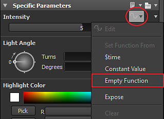

# Was ist eine Funktion?

Mit Funktionen in Substance 3D Designer können Sie Ergebnisse mit der Logik generieren, die Sie sonst in einer Programmiersprache finden würden.

Aber anstatt Codezeilen zu verwenden, verwenden Funktionen in Designer denselben knotenartigen Ansatz. Auf den ersten Blick sieht ein Graf wie ein normaler Graf aus.

Funktionen können in zwei Hauptfällen auftreten:

* das Ergebnis eines Parameters steuern
* wenn Sie einen Pixelprozessor bearbeiten

## Steuern des Ergebnisses eines Parameters

In Substance 3D Designer kann jeder Parameter über eine Funktion gesteuert werden.

Daher können Sie sich Regeln und Abhängigkeiten zwischen Teilen Ihres Grafen vorstellen, um einzigartige Ergebnisse zu erzielen.

So können Sie beispielsweise festlegen, dass die Deckkraft eines Überblendungsknotens die Hälfte der Intensität eines Verkrümmungsknotens beträgt:

Tatsächlich haben Sie möglicherweise bereits Funktionen erstellt, ohne sich dessen bewusst zu sein:

Wenn Sie einen Parameter gelegt haben, haben Sie automatisch eine Funktion und eine Variable erstellt: Die Funktion enthält einen get float -Knoten, der den Wert der neu erstellten Variablen abfängt:

