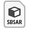

# Überblick

[Substance 3D Designer](https://www.adobe.com/products/substance3d-designer.html) ist eine Anwendung zum Erstellen von 2D-Texturen, -Materialien und -Filtern in einer knotenbasierten Oberfläche mit Schwerpunkt auf prozeduraler Generierung, Parametrisierung und nicht-destruktiven Arbeitsabläufen. Es ist die Anwendung mit der längsten Laufzeit im Substance 3D-Ökosystem. Die damit erstellten Ressourcen sind so vielseitig und dynamisch wie möglich.

Im Folgenden wird der Vergleich mit anderen Anwendungen erläutert:

|  | 

  Substance 3D Sampler | 

  Substance 3D Painter | 

  Substance 3D Designer |
| --- | --- | --- | --- |
| <b>Lernkurve</b> | Niedrig | Mittel | Hoch |
| <b>Autor-Materials</b> | Ja | Ja | Ja |
| <b>3D-Modelle erstellen</b> | Nein | Eingeschränkt\* | Eingeschränkt\* |
| <b>Autorenfilter, Muster und Effekte</b> | Nein | Eingeschränkt | Ja |
| <b>Parametrischen Inhalt exportieren</b> | Nein | Nein | Ja |

\*: Nur Versatz: Siehe <b>Funktion zum Exportieren von Szenen</b> im Abschnitt [3D-Ansicht](../../interface/3d-view/3d-view.md).

Kurz gesagt, Substance 3D Designer sollte als die technischste, fortschrittlichste Texturierungsanwendung gesehen werden, die es gibt.

Damit können Sie Inhalte für nahezu jeden Anwendungsfall oder jedes Szenario erstellen. Dies bedeutet, dass Sie nicht auf einen einzelnen Ausgabetyp beschränkt sind - z. B. ein eindeutiges Material/eine Reihe von Texturen für einen UV-Mapping-Mesh -, sondern dass Sie Inhalte für eine viel erweiterte Verwendungsgruppe erstellen können.

Beispielsweise wurden die meisten prozeduralen Smart-Inhalte in Painter und Sampler von Designer erstellt und exportiert. Dinge wie Pinsel-Alphas, Generatoren, Filter und Basismaterialien können alle in Designer erstellt werden.

## Workflow

Substance 3D Designer ist ein knotenbasierter Editor, mit dem Sie Inhalte auf viele verschiedene Arten mit unterschiedlichen Komplexitäten erstellen können. [Der Arbeitsablauf wird auf dedizierten Seiten weiter erläutert](../../getting-started/workflow-overview/workflow-overview.md), aber die folgenden Vorteile sind für die Arbeit mit der Software von Vorteil:

<b>[Nicht linear](../../compositing-graphs/substance-compositing-graphs.md) </b>: können Sie eine Vielzahl von Textur-Ausgaben gleichzeitig erstellen. Bearbeiten Sie eine Maske oder einen Schieberegler, und automatisch wird jede verknüpfte Ausgabe neu berechnet. Es ist nicht mehr erforderlich, Maps wie &quot;Grundfarbe&quot;, &quot;Rauheit&quot;, &quot;Normal&quot; usw. separat zu erstellen.

<b>[Nicht destruktiv](../../compositing-graphs/compositing-graph-key-con/substance-compositing-graph-key-concepts.md) </b>: Sie können jede Aktion *rückgängig machen, ohne dass Ihre Arbeit* verloren geht. Das Iterieren und Experimentieren wird viel schneller, da es noch effizientere Workflows ermöglicht.

<b>[Integriertes Baking](../../bakers/bakers.md) </b>: Greife direkt aus deiner Software heraus auf fortgeschrittene, extrem schnelle Mesh-Baking-Tools zu. Sie müssen nicht mehr in einer separaten Software Baking geführt und langwierige Import- und Exportprozesse durchgeführt werden.

<b>[Parametrisch](../../compositing-graphs/manage-parameters/exposing-a-parameter/exposing-a-parameter.md) </b>: kannst du nahezu jeden Aspekt einer Textur mit einem einzigen Schieberegler oder einer Dropdown-Liste steuern. Auf diese Weise können Sie einem einzelnen Asset endlose Kontrolle und Variation hinzufügen.

## Dateitypen

Die Anwendung und ihr Ökosystem verwenden 4 verschiedene Dateitypen. Zur Klarstellung: Dies sind Dateitypen, die <b> aus Substance 3D Designer</b> exportiert wurden und in einige oder alle anderen Substance 3D-Anwendungen importiert werden können.

<table>
<tr style="border: 0;">
<td style="border: 0;" valign="top">

### Substance 3D File

*(\*.SBS)*

Substance-Dateien sind die **Hauptquelldateien** für Designer. Wenn Sie eine Substance-Datei öffnen, können Sie **alle Knoten in einem Graf anzeigen und bearbeiten**. Sie werden als Pakete dargestellt, die eine beliebige Anzahl von Ressourcen enthalten können, wie z. B. Grafen, Funktionen, Bitmaps, Meshs usw. Sie sind schwieriger zu teilen und weniger schnell zu berechnen. Sie können nur in Substance 3D Designer und auf dem Substance Player geöffnet werden.

</td>
<td style="border: 0;" valign="top">

### Substance 3D Asset

*(\*.SBSAR)*

Substance-Archive sind <b> kompilierte, optimierte </b> Substance-Dateien. Sie sind viel schneller zu berechnen und können ohne Referenzprobleme leicht geteilt werden. Die Parameter können noch angepasst werden, aber die Bearbeitung des Diagramms ist <b>gesperrt</b>. Substance-Archive können in allen Substance 3D-Anwendungen und allen Anwendungen verwendet werden, die über eine [Substance 3D-Integration](https://experienceleague.adobe.com/en/docs/substance-3d/ecosystem/home) verfügen (einige mit einem externen Plug-in), z. B. Autodesk 3DS Max &amp; Maya, Unreal Engine oder Unity Engine.

</td>
<td style="border: 0;" valign="top">

{width="48px"}

### Statische Dateien

*(\*.TGA, \*.BMP, \*.PNG, \*.FBX, \*.OBJ usw.)*

Substance 3D Designer unterstützt immer den Export in statische Dateitypen. Ein 2D-Bild kann in eine Bitmapdatei exportiert werden, ein 3D-Modell kann in gängige 3D-Dateitypen exportiert werden. Beim Export in statische Dateien gehen **alle dynamischen Funktionen verloren**. Bilder sind in der Auflösung fixiert, 3D-Modelle in der Polyzahl.

</td>
</tr>
</table>

Das bedeutet in der Regel, dass Sie Ihre Arbeit im SBS-Format speichern, wenn Sie in Designer arbeiten. Sie exportieren in SBSAR, wenn das Ziel dies unterstützt (z. B. Painter), oder Sie verwenden statische Bitmapdateien, wenn SBSAR nicht benötigt wird oder nicht unterstützt wird.

## Ressourcenarten

Substance 3D-Dateien können eine Vielzahl von Ressourcen für verschiedene Zwecke enthalten. Einige Ressourcen können nur in Designer erstellt werden, andere stammen aus externen Anwendungen.

<table>
<tr style="border: 0;">
<td width="16.67%" style="border: 0;" valign="top">

[{width="150px"}](../../compositing-graphs/substance-compositing-graphs.md)

</td>
<td width="100.00%" style="border: 0;" valign="top">

### Substance-Graphen

Mit Substance-Graphen können Sie *2D-Bilddaten* generieren und verarbeiten und dann in einem oder mehreren Texturausgaben ausgeben. In vielen Anwendungsfällen dreht sich ein Projekt um ein oder mehrere Substance-Graphen.

[Gehen Sie zum Abschnitt Substance-Grafiken.](../../compositing-graphs/substance-compositing-graphs.md)

</td>
</tr>
</table>

<table>
<tr style="border: 0;">
<td width="16.67%" style="border: 0;" valign="top">

[{width="150px"}](../../function-graphs/function-graphs.md)

</td>
<td width="100.00%" style="border: 0;" valign="top">

### Substance-Funktionsdiagramme

<b>Funktionen</b> sind ein höheres Maß an Abstraktion und Komplexität: Anstatt Bilddaten (Sätze von Pixelwerten) zu verarbeiten, verarbeiten Sie *einzelne Werte* (Ganzzahlen, Gleitkommawerte, Vektoren). Funktionen werden verwendet, wenn Sie komplexere Vorgänge ausführen oder bestimmte Verhaltensweisen optimieren möchten. Funktionen funktionieren im Allgemeinen nicht eigenständig und werden nicht außerhalb des Kontexts von Substance-Graphen verwendet.

[Gehen Sie zum Abschnitt Substance von Funktionsdiagrammen.](../../function-graphs/function-graphs.md)

</td>
</tr>
</table>

<table>
<tr style="border: 0;">
<td width="16.67%" style="border: 0;" valign="top">

[{width="150px"}](../../resources/importing-linking-and-new/importing-linking-and-new-resources.md)

</td>
<td width="100.00%" style="border: 0;" valign="top">

### Ressourcen ohne Diagramm

Ressourcen ohne Diagramm können aus externen Anwendungen stammen (z. B. Photoshop oder Autodesk Maya), während einige auch *in Designer erstellt werden können*. Der Hauptunterschied besteht darin, dass es sich nicht um knotenbasierte Graphen handelt. Die meisten Elemente sind innerhalb oder neben den zuvor genannten Diagrammtypen zu verwenden.

Die folgenden Ressourcentypen sind vorhanden:

* [Bitmaps](../../resources/bitmap-resource/bitmap-resource.md)
* [Vektorgrafiken (SVG)](../../resources/vector-graphics-svg-res/vector-graphics-svg-resource.md)
* [3D-Szenen](../../resources/3d-scene-resource/3d-scene-resource.md)
* [Schriften](../../resources/font-resource/font-resource.md)
* [AxF-Dateien](../../resources/axf-appearance-exchange/axf-appearance-exchange-format.md)

</td>
</tr>
</table>
