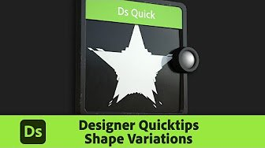

# Tutorials und Training

Die Dokumentation ist in erster Linie als gründliche, technische Referenz gedacht. Wenn du lieber mit Videos und anderen fokussierteren Materials arbeitest, sind diese Tutorials gut für den Einstieg geeignet.

## Tutorials

<table>
<tr style="border: 0;">
<td style="border: 0;" width="30%">

[Tutorial-Illustration ](https://creativecloud.adobe.com/cc/learn/substance-3d-designer/web/first-steps-with-substance-3d-designer?locale=en)

</td>
<td style="border: 0; vertical-align: top;">

### Erste Schritte

Einsteiger-Reihe mit dem Fokus auf die ersten Schritte mit Designer Stellt die Benutzeroberfläche und grundlegende Konzepte vor, geht dann auf die Kerntechniken über und erklärt schließlich, wie Parameter verfügbar gemacht und ein vollständiges Material erstellt werden. Er ist kurz und fokussiert, hält aber wenig Licht und ist somit der beste Einstieg für Einsteiger.

</td>
</tr>
</table>

<table>
<tr style="border: 0;">
<td style="border: 0;" width="30%">

[Tutorial-Illustration ](https://creativecloud.adobe.com/cc/learn/substance-3d-designer/web/getting-started-with-substance-3d-designer?locale=en)

</td>
<td style="border: 0; vertical-align: top;">

### Erstellen Ihres ersten Materials

Eine große Starter-Videoreihe, die dich durch den gesamten Prozess der Erstellung eines umfangreichen, vollständig prozeduralen Materials führt. Jeder Schritt des Prozesses wird abgedeckt und erklärt, sodass Sie nach Abschluss viel lernen, aber für absolute Anfänger intensiv sein können.

</td>
</tr>
</table>

<table>
<tr style="border: 0;">
<td style="border: 0;" width="30%">

[Tutorial-Illustration ](https://www.youtube.com/playlist?list=PLB0wXHrWAmCy457vxKM4rQuJ-nvYm9j4M)

</td>
<td style="border: 0; vertical-align: top;">

### Schnelltipps

Für jedes QuickInfo-Video wird eine Reihe von Knoten und Techniken in Beißgröße angezeigt. Wir erklären das Ergebnis, die Knoten sowie die wichtigsten Parameter und zeigen Ihnen dann einige Möglichkeiten, die Idee zu erweitern.

</td>
</tr>
</table>

## Artikel

<table>
<tr style="border: 0;">
<td style="border: 0;" width="30%">

</td>
<td style="border: 0; vertical-align: top;">

### Ihr Smartphone ist ein Material-Scanner

In-Tiefe-Artikel, der den gesamten Prozess des Fotografierens und ihrer Verarbeitung mit Designer beschreibt. Hier finden Sie ein gutes Beispiel für die Verwendung von Substance 3D Designer zur Automatisierung bestimmter Aufgaben.

</td>
</tr>
</table>
