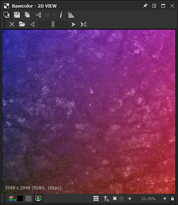
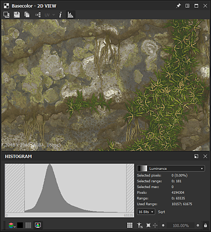
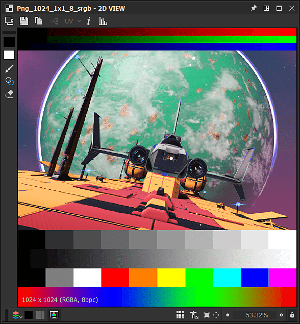

# 2D-Ansicht

Auf dieser Seite werden die Benutzeroberfläche und Funktionen des Bedienfelds &quot;**2D View**&quot; in Substance 3D Designer beschrieben.

## Überblick

Die [2D-Ansicht](https://substance3d.adobe.com/) ist eines der Hauptfenster der Benutzeroberfläche von Designer. Seine Hauptziele sind folgende:

* *Wert* oder *Bild* wird von einem angegebenen *Knoten* ausgegeben, oder der angegebene *Knotenkonnektor* wird durchlaufen.
* Anzeigen von [Bitmaps](../../resources/bitmap-resource/bitmap-resource.md) und [Vektorgrafiken](../../resources/vector-graphics-svg-res/vector-graphics-svg-resource.md) [Ressourcen](../../resources/resources.md)
* Anzeigen von *zusätzlichen Informationen* über den Inhalt, den es derzeit enthält, wie Farbkanäle oder exakte Farbwerte
* Parameter &quot;*gizmos*&quot; werden gesteuert.

Wenn ein angezeigtes Bild oder ein angezeigter Wert geändert wird, wird die 2D-Ansicht *automatisch aktualisiert*, um mit dem aktuellen Status der Daten synchron zu bleiben.\
*Mehrere* 2D-Ansichtsfenster können jederzeit aktiv sein und jeweils unterschiedliche Bilder oder Werte anzeigen. Mit der Funktion <b>Pin</b> von  im Bedienfeld der Benutzeroberfläche können Sie steuern, wann ein neuer Bereich verwendet werden soll.

### Anzeigen von Inhalten in der 2D-Ansicht

>[!WARNING]
>
> Alle Erwähnungen von Aktionen in *Knoten* in diesem Abschnitt gelten nur für [Substance-Diagramme](../../compositing-graphs/substance-compositing-graphs.md).

Die einfachste Möglichkeit, ein Bild in der 2D-Ansicht anzuzeigen, besteht darin, auf *LMB* zu doppelklicken...

* ...auf einer [Bitmap](../../resources/bitmap-resource/bitmap-resource.md)- oder [Vektorgrafik](../../resources/vector-graphics-svg-res/vector-graphics-svg-resource.md)-Ressource in [Explorer](../../interface/the-explorer-window/the-explorer-window.md)
* ...auf einem Knoten oder Knotenkonnektor in der [Diagrammansicht](../../interface/the-graph-view/the-graph-view.md)

Bilder können auch *gezogen und* direkt in den Viewport abgelegt werden, indem *LMB* auf einer [Ressource](../../resources/resources.md) im Bereich [Explorer](../../interface/the-explorer-window/the-explorer-window.md) oder *RMB* auf einem Knoten in der Diagrammansicht gehalten wird.

In der Diagrammansicht können Sie ein Bild an die 2D-Ansicht senden, indem Sie die Kontextmenüoption <b>Ausgabe in 2D-Ansicht</b> verwenden, auf die Sie durch Klicken auf *RMB*... zugreifen können.

* ...auf einem *Knoten*, um *die Ausgabe dieses Knotens anzuzeigen*. Wenn der Knoten mehr als eine Ausgabe hat, wählen Sie die gewünschte Ausgabe im Untermenü
* ...auf *leerem Platz* in der Diagrammansicht, um die Ausgabe *dieses Diagramms anzuzeigen.* Wenn der Graph mehr als eine Ausgabe hat, wählen Sie die gewünschte Ausgabe im Untermenü

Beim Laden eines Diagramms wird seine *erste Ausgabe* standardmäßig automatisch in der 2D-Ansicht angezeigt. Sie können dieses Verhalten in den [Voreinstellungen](../../interface/preferences-window/preferences-window.md) deaktivieren. Gehen Sie zu <b>Bearbeiten > Voreinstellungen > Graph > Substance Compositing Graph</b> und *deaktivieren* Sie die <b>Ausgabe in 2D-Ansicht anzeigen, wenn Sie eine Option Graph</b> öffnen.

## Viewport

Der Viewport ist der *Anzeigebereich* der <b>2D-Ansicht</b> und ermöglicht es Ihnen, mit der folgenden Maus und den folgenden Tastaturbefehlen *durch das angezeigte Bild zu navigieren*:

<table>
<tr style="border: 0;">
<td style="border: 0;" valign="top">

* <b>Bewegen:</b> Strg+RMB / MMB
* <b>Zoom:</b> Alt+RMB / MouseWheel / Tool &quot;Skalierung anzeigen&quot;:\
  
* <b>Anpassen an Ansichtsport:</b> F / Schaltfläche &quot;An Ansicht anpassen&quot; 
* <b>Anpassen an die 1:1-Skalierung:</b> Z / Schaltfläche &quot;An Skalierung anpassen&quot; 

</td>
<td style="border: 0;" valign="top">

</td>
</tr>
</table>

Verwenden eines Trackpads (nur macOS)

* <b>Schwenken: </b>Wischen mit zwei Fingern
* <b>Zoom:</b> Zwei Finger zusammenziehen/Zwei Finger wischen, während Cmd gedrückt wird

>[!IMPORTANT]
>
> Nicht verfügbare Aktionen
> 
> Es ist *nicht* möglich, das Bild zu schwenken, wenn die aktuelle Anzeigegröße des Bildes *kleiner ist als die Größe des Viewports*.
> 
> Es ist *nicht* möglich, das Bild zu vergrößern/zu verkleinern, wenn der angezeigte Inhalt *nicht mehr vorhanden ist* - z. B. der Referenzknoten oder die Ressource eines Bildes wurde gelöscht.

>[!NOTE]
>
> Zoomrichtung
> 
> Jede der Zoommethoden ist invers:
> 
> * Mausrad nach oben *zieht* das Bild näher
> * Alt+RMB drücken und *ziehen, um* das Bild zu entfernen
> 
> Die Zoomrichtung kann in den [Voreinstellungen](../../interface/preferences-window/preferences-window.md) umgekehrt werden.

Die systemeigenen *Auflösungen*, *Farbformate* und *Bittiefen* werden im unteren linken Bereich des Ansichtsports angezeigt.

Zusätzlich zur Navigation bietet der Viewport folgende Funktionen:

* Gekachelte Anzeige: *wiederholt das Bild* im Viewport in einem gekachelten Muster. So kannst du überprüfen, wie sich ein Muster oder eine Struktur wiederholt. Sie wird über die **Leertaste** oder  **Kachelanzeige** aktiviert.
* Anzeige der Physische Größe: Zeigt das Bild mit einem *Verhältnis* an, das der [Physische Größe](../../compositing-graphs/graph-parameters/graph-parameters.md)-Eigenschaft des Diagramms entspricht. Es wird mit der Schaltfläche  **Physische Größe** aktiviert.
* Ansichtsgröße beibehalten: Diese Option *sperrt die Anzeigeskala*, sodass sie in verschiedenen Bildern konsistent bleibt. Sie ist standardmäßig *aktiviert* und kann mit der Schaltfläche  **Ansichtsgröße beibehalten** deaktiviert werden.

## Haupt-Werkzeugleiste

Mit der Hauptsymbolleiste des Bedienfelds <b>2D-Ansicht</b> können Sie mehr mit den angezeigten Bildern machen und bietet die folgenden Funktionen:

+++Hintergrundbild
{width="360px"}

Sie können *ein anderes Bild* über das aktuell angezeigte Bild legen. Drücken Sie die Schaltfläche  <b>Hintergrundbild</b>, und Sie werden aufgefordert, eine Bilddatei auszuwählen, die als Überlagerung verwendet werden soll.

Sobald die Datei ausgewählt ist, wird eine neue Symbolleiste mit den folgenden Steuerelementen für die Bildüberlagerung angezeigt:

<b> Schließen:</b> *Schließen* Sie die Symbolleiste für Überlagerungssteuerelemente, und *deaktivieren* Sie die Überlagerung des Hintergrundbilds.

<b> Bild laden:</b> Wählen Sie *eine andere Bilddatei* aus, die als Überlagerung verwendet werden soll.

<b> Quellbild:</b> legt das Überlagerungsbild auf *0%* Deckkraft fest.

<b> Hintergrundbild:</b> legt das Überlagerungsbild auf *100%* Deckkraft fest.

<b> Zurücksetzen:</b> setzt das Überlagerungsbild auf *50%* Deckkraft.

Ein Regler gibt Ihnen *manuelle Kontrolle* über die Deckkraft des Überlagerungsbildes.

+++

+++Bild exportieren
{width="360px"}

Das derzeit angezeigte Bild kann *in eine Bilddatei* exportiert werden. Drücken Sie  <b>Bild speichern...</b>-Schaltfläche. Sie werden aufgefordert, ein *Verzeichnis*, *Name* und *Dateiformat* für die exportierte Datei auszuwählen.

Während das Bild als *native Auflösung* exportiert wird, die im unteren linken Bereich des Ansichtsfensters angezeigt wird, hängen die *Bittiefe* und das *Farbformat* vom ausgewählten Bildformat ** ab. So können 32-Bit-Gleitkomma-Präzisionsbilder nur in ihrem gesamten Datenbereich mit Bildformaten exportiert werden, die diese Präzision unterstützen, wie TIFF, EXR und HDR. Wenn das Bildformat die Daten nicht unterstützt, werden im exportierten Bild wahrscheinlich Klemmen und/oder Farbbänder auftreten.\
Achten Sie im Allgemeinen darauf, welche Präzision und Funktionen die Bildformate bieten, die Sie verwenden möchten - Gleitkommaunterstützung, ICC-Profile usw.

Wenn entweder <b>OCIO</b> oder <b>Adobe ACE</b> Der [Farbmanagementmodus](../../color-management/color-management.md) wird derzeit verwendet, und es ist eine zusätzliche Option verfügbar, um den *Farbraum* des exportierten Bildes auszuwählen.

+++

+++In Zwischenablage kopieren
{width="360px"}

Das derzeit angezeigte Bild kann *in die Zwischenablage kopiert werden*. Drücken Sie die Schaltfläche  <b>Bild in Zwischenablage kopieren</b>, und das Bild kann in die Software eines Drittanbieters, z. B. Adobe Photoshop, eingefügt werden.

Das Bild wird als *8-Bit*-Präzisionsbild mit der *nativen Auflösung* kopiert, die im unteren linken Bereich des Ansichtsports angezeigt wird.

+++

+++Diagrammausgaben wechseln
{width="360px"}

Wenn das aktuell angezeigte Bild eine *Diagrammausgabe* ist, können Sie mit der Schaltfläche  <b>Ausgabe auswählen</b> schnell zu einer beliebigen *anderen Diagrammausgabe wechseln.*

Dieses Feature ist *nicht* für andere Knoten verfügbar, einschließlich Knoten mit mehr als einer Ausgabe.

+++

+++UV-Overlay
{width="357px"}

Wenn die Option &quot;<b>UVs in 2D-Ansicht anzeigen</b>&quot; im Menü &quot;<b>Szene anzeigen</b>&quot; des [3D-Ansicht ](../../interface/3d-view/3d-view.md)-Docks aktiviert ist, ist die UV-Überlagerungsfunktion in der 2D-Ansicht verfügbar.

Sie können sie mit der Schaltfläche <b>UV</b> aktivieren. 2

Dadurch werden die UVs des Meshs [, der derzeit in der 3D-Ansicht ](../../interface/3d-view/3d-view.md) ausgewählt ist, als farbiges Drahtgitter angezeigt.

Wenn in der Gitterdatei Informationen zur Materialfarbe verfügbar sind, wird die Materialfarbe als Farbe der UV-Überlagerung verwendet.

Wenn das Gitter über <b>mehrere UV-Sätze</b> verfügt, können die gewünschten UVs in der Dropdown-Checkliste ausgewählt werden, die durch Klicken auf den Pfeil neben der Beschriftung &quot;UV&quot; in der Schaltfläche geöffnet werden kann.

+++

+++Bildinformationen
{width="360px"}

Sie können die *genauen Pixelwerte* *und die Koordinaten* in einem Bild mit dem Bedienfeld <b>Informationen</b> anzeigen, das über die Schaltfläche  <b>Bildinformationen</b> aktiviert wird. Das ist sehr hilfreich, wenn du zum Beispiel HDR-Bilder inspizierst oder sicherstellst, dass das Wechseln zwischen Pixeln dem gewünschten Fortschritt folgt.

Die Farben werden durch <b>RGBA</b> und <b>HSV</b> Werte dargestellt und in Abhängigkeit von der *Genauigkeit* des Bildes wie folgt angezeigt:

* <b>8-Bit</b>: 0-255 Ganzzahl / 0,0-1,0 Gleitkomma

* <b>16-Bit</b>: 0-65532 Ganzzahl / 0,0-1,0 Gleitkomma

* <b>16F</b> (16-Bit-Gleitkomma): Gleitkomma-Rohwert

* <b>32F</b> (32-Bit-Gleitkomma): Gleitkomma-Rohwert

Pixelkoordinaten werden durch <b>X</b>- und <b>Y</b>-Werte dargestellt.

+++

+++Histogramm
{width="360px"}

Sie können das *Histogramm* des Bildes mit dem <b>Histogramm</b>-Bedienfeld anzeigen, das mit der Schaltfläche  <b>Histogramm anzeigen</b> aktiviert ist.

Die folgenden *Histogrammmodi* sind verfügbar:

* <b>Luminanz</b>

* <b>Red</b>

* <b>Grün</b>

* <b>Blau</b>

* <b>RGB</b>

* <b>Alpha</b>

Die folgenden Informationen werden unter den Modi aufgeführt:

* <b>Pixel</b>: die Anzahl der Pixel im Bild

* <b>Bereich</b>: der gesamte verfügbare Wertebereich

* <b>Verwendeter Bereich </b>: der Wertebereich vom niedrigsten bis zum höchsten Wert in Pixel

Darüber hinaus können Sie auf **LMB** im Histogramm klicken oder *gedrückt halten* **LMB** und *Ziehen* über das Histogramm, um *einen bestimmten Teil* der Daten auszuwählen. Für diese Auswahl werden dann die folgenden Informationen angezeigt:

* **Ausgewählte Pixel**: die Anzahl der Pixel, die die ausgewählten Werte aufweisen

* **Ausgewählter Bereich**: den Wertebereich des ausgewählten Abschnitts

* **Ausgewähltes Maximum**: die höchste Anzahl von Pixeln, deren Wert im ausgewählten Abschnitt enthalten ist

Die Auswahl kann *gelöscht* werden, indem Sie auf **RMB** im Histogramm klicken.

Wie einige der oben genannten Werte dargestellt werden, hängt von der im unteren Abschnitt des Fensters ausgewählten Genauigkeit ab:

* **8 Bits**: 0-255 Ganzzahl

* **16 Bits**: 0-65532 Ganzzahl

* **32 Bits**: Gleitkomma-Rohwert

Einige Teile des Histogramms können sehr niedrige Pixelzählwerte aufweisen und daher schwer lesbar sein. In diesem Fall können Sie den Modus **Quadratwurzel** mithilfe der Schaltfläche **Quadratwurzel** aktivieren, die die *Quadratwurzel der tatsächlichen Werte* verwendet, um das Histogramm zu zeichnen.

+++

## Symbolleiste anzeigen

Mit der Symbolleiste **Anzeige**, die sich standardmäßig am *unteren* des Bereichs **2D-Ansicht** befindet, können Sie steuern, wie das Bild im Ansichtsfenster angezeigt wird.

Der Abschnitt *am weitesten links* enthält Steuerelemente für *Farbe* und *Transparenz*, während der Abschnitt *am weitesten rechts* die *Ansichtsport*-Steuerelemente enthält, die im Ansichtsport-Abschnitt dieser Seite detailliert beschrieben sind.

>[!NOTE]
>
> Die Symbolleiste kann *neu positioniert* werden, und zwar um das Bedienfeld **2D-Ansicht**, wobei das linke *Handle* verwendet wird, das durch drei parallele Linien dargestellt wird.

{width="360px"}

### Farbkanäle

Sie können einen einzelnen Kanal des Bildes mithilfe der Schaltfläche  <b>Farbkanäle</b> anzeigen. Dadurch wird ein Kombinationsfeld geöffnet, in dem Sie auswählen können, welcher der Kanäle <b>Red</b>, <b>Green</b>, <b>Blue</b> und <b>Alpha</b> angezeigt werden soll. Das normale Erscheinungsbild des Bildes mit allen Kanälen wird wiederhergestellt, indem die Option <b>RGB</b> ausgewählt wird.

Die folgenden *Tastaturbefehle* können verwendet werden, um schnell zu anderen Farbkanälen zu wechseln:

* RGB: <b>C</b>
* Rot: <b>R</b>
* Grün: <b>G</b>
* Blau: <b>B</b>
* Alpha: <b>A</b>

Das *Symbol* der <b>Farbkanäle</b>-Schaltfläche *ändert sich* in Abhängigkeit von den derzeit angezeigten Kanälen.

>[!NOTE]
>
> Tastaturbefehle können nur verwendet werden, wenn das Bedienfeld &quot;2D-Ansicht&quot; den Fokus hat. Sie können mindestens einmal auf dieses Bedienfeld klicken, um sicherzustellen, dass dies der Fall ist.
> 
> Da der Fokus auf das Fenster gesetzt werden muss, stören *diese Tastaturbefehle* nicht in *benutzerdefinierte Tastaturbefehle*, die Sie möglicherweise für das Erstellen von Knoten im Diagramm festgelegt haben. Weitere Informationen zu dieser Funktion [finden Sie hier](../../interface/preferences-window/preferences-window.md).

{width="360px"}

### Transparenz-Schalter

Die Transparenzanzeige kann mit der Schaltfläche / <b>Schachbrett anzeigen</b> ein- und ausgeschaltet werden. Wenn diese Option aktiviert ist, wird die Transparenz mit einem Schachbrettmuster angezeigt.

Es gibt zwei Hauptmöglichkeiten, Transparenz zu interpretieren, die mit der Schaltfläche / <b>Transparenzmodus</b> ausgewählt werden können:

<b> Gerade:</b> Transparenzinformationen werden nur im Alphakanal gespeichert und wirken sich nicht auf andere Bildaspekte aus.

<b> Vormultipliziert:</b> Transparenzinformationen werden im Alphakanal gespeichert und wirken sich auch auf die RGB aus, da sie effektiv mit dem Alphakanal multipliziert werden.

Um *korrekte Farben* anzuzeigen, sollte der entsprechende Transparenzmodus im Bedienfeld <b>2D-Ansicht</b> ausgewählt werden, damit er mit der Transparenzmethode übereinstimmt, die angewendet wurde, als das Bild *erstellt* wurde.

{width="360px"}

### Farbraum

Für die genaueste Farbdarstellung werden Bilder standardmäßig in einem *Farbraum* angezeigt, der dem vom *Monitor* verwendeten Farbraum entspricht.

Die verfügbaren Steuerelemente und die Auswirkungen der Schaltfläche / <b>Farbraum</b> hängen vom [Farbmanagementmodus](../../color-management/color-management.md) ab, der in den [Projekteinstellungen](../../interface/preferences-window/project-settings/project-settings.md) festgelegt wurde. Weitere Informationen zu diesen Steuerelementen finden Sie im Abschnitt &quot;Farbmanagement&quot; auf dieser Seite.

<table>
<tr style="border: 0;">
<td style="border: 0;" valign="top">

## Bitmap-Malwerkzeuge

Die <b>Bitmap-Malwerkzeuge</b> sind für [Bitmap-Ressourcen](../../resources/bitmap-resource/bitmap-resource.md) verfügbar, die diese Kriterien erfüllen:

* Die Bitmap verwendet die Präzision *8-Bit*
* Die Bitmapressource ist *importiert* in das Paket, verknüpfte Bilder werden *nicht* unterstützt.

>[!NOTE]
>
> *Neue* Bitmapressourcen, die in Substance 3D Designer erstellt wurden, entsprechen *automatisch* diesen Kriterien.

</td>
<td style="border: 0;" valign="top">

</td>
</tr>
</table>

>[!TIP]
>
> Weitere Informationen finden Sie auf der Seite [Bitmap-Malwerkzeuge](../../resources/bitmap-resource/bitmap-painting-tools/bitmap-painting-tools.md) der Dokumentation.

<table>
<tr style="border: 0;">
<td style="border: 0;" valign="top">

## Vektorgrafik-Editor

Der <b>Vektorgrafik-Editor</b> ist für *importierte* [SVG-Ressourcen](../../resources/vector-graphics-svg-res/vector-graphics-svg-resource.md) verfügbar, verknüpfte Ressourcen werden *nicht* unterstützt.

>[!NOTE]
>
> *Neue* SVG-Ressourcen, die in Substance 3D Designer erstellt wurden, werden *automatisch mit* diesem Kriterium übereinstimmen.

</td>
<td style="border: 0;" valign="top">

</td>
</tr>
</table>

>[!TIP]
>
> Weitere Informationen finden Sie auf der Seite [Werkzeuge zur Vektorbearbeitung](../../resources/vector-graphics-svg-res/vector-editing-tools/vector-editing-tools.md) (veraltet) der Dokumentation.

{width="360px"}

## Farbmanagement

Die <b>2D-Ansicht</b> bietet einfache *Farbmanagement*-Steuerelemente, mit denen Sie auswählen können, welcher *Anzeigefarbraum* bei der Anzeige des Bildes verwendet werden soll.

Diese Steuerelemente passen sich wie folgt an den aktuellen [Farbmanagementmodus](../../color-management/color-management.md) an, der in den [Projekteinstellungen](../../interface/preferences-window/project-settings/project-settings.md) festgelegt ist:

* <b>Veraltet:</b> Sie können das Bild in den  sRGB- oder  linearen sRGB-Farbräumen disp.lay;
* <b>Adobe ACE:</b> Sie können  *das*-Farbmanagement aktivieren und den am besten geeigneten Farbraum für den *aktuellen Monitor* festlegen, der von der Adobe ACE-Engine erkannt wurde, oder  *das*-Farbmanagement deaktivieren und das Bild mit den Raw-Farbwerten anzeigen;
* <b>OCIO:</b> Sie können  *das*-Farbmanagement aktivieren und den am besten geeigneten Farbraum für den *aktuellen Monitor* festlegen, der vom OCIO-Modul erkannt wurde. Verwenden Sie das Kombinationsfeld, und wählen Sie einen der *Anzeigefarbräume* aus, die in der [OCIO-Konfigurationsdatei](../../color-management/color-management.md), die aktuell verwendet wird, verfügbar sind, oder  *deaktivieren*-Farbmanagement, und zeigen Sie das Bild mithilfe der Raw-Farbwerte an.

>[!WARNING]
>
> Beachten Sie, dass sich diese Steuerelemente *nur* auf den *Anzeigefarbraum* auswirken. Der *ursprüngliche Farbraum* von Bildern und der *Arbeitsfarbraum* sollten ebenfalls berücksichtigt werden, um sicherzustellen, dass die Farben in der **2D-Ansicht** genau angezeigt werden.

>[!TIP]
>
> Weitere Informationen zu dieser Funktion und ihrer umfassenderen Implementierung in Designer finden Sie im Abschnitt [Farbmanagement](../../color-management/color-management.md) dieser Dokumentation.
