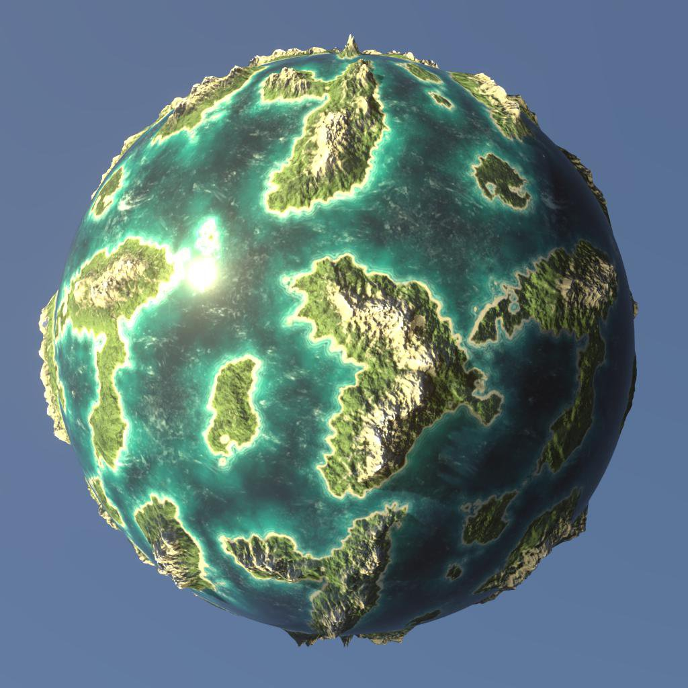

# 3D-Renderer

Die 3D-Ansicht bietet vier Renderer:

* Zwei Versionen des internen 3D-Renderers von Adobe: Rastereffekt für Echtzeit-Visualisierung mit Unterstützung für Schatten und GPU-Pathtracer zum präzisen Rendern von Schatten, Reflexionen, komplexen Materialeigenschaften und mehr.
* Zwei veraltete Renderer von Drittanbietern: OpenGL und NVIDIA&#39;s Iray.

>[!NOTE]
>
> Halten Sie die Grafiktreiber auf dem neuesten Stand!
> 
> Die neuen 3D-Renderer werden regelmäßig aktualisiert, und einige dieser Aktualisierungen erfordern aktuelle GPU-Treiber. Bitte aktualisieren Sie die GPU-Treiber Ihres Systems auf die neueste Version, um die beste Zuverlässigkeit und Unterstützung von Rendering-Funktionen zu erhalten.
> 
> Hier finden Sie Treiber: [NVIDIA](https://www.nvidia.com/Download/index.aspx?lang=en-us) [AMD](https://www.amd.com/en/support) [Intel](https://downloadcenter.intel.com/product/80939/Graphics-Drivers)

+++ Vergleich von Rasterbildern und GPU-Pfadfindern

<table>
  <tr>
    <td>
      
       <i>Rasterizer</i>
    </td>
    <td>
      
       <i>GPU-Pathtracer</i>
    </td>
  </tr>
</table>

+++

Der 3D-Renderer von Adobe ist von Grund auf für die Unterstützung moderner Technologien wie [MaterialX](https://materialx.org/) Szenensprache und die [USD](https://openusd.org/release/index.html) Szenenbeschreibung erstellt und bietet vollständige visuelle Konsistenz im gesamten Substance 3D-Ökosystem.

Dank der Abhängigkeit von USD kann das Adobe-Plugin [USDFileFormat](https://github.com/adobe/USD-Fileformat-plugins) genutzt werden, um viele 3D-Szenenformate wie FBX und GLTF zu importieren und diese vollständig zu rendern, einschließlich Materialien, Texturen, Kameras und Lichter.

+++ Szenenimport: Rasterizer und OpenGL im Vergleich

<table>
  <tr>
    <td>
      
       <i>Rasterizer</i>
    </td>
    <td>
      
       <i>OpenGL</i>
    </td>
  </tr>
</table>

+++

>[!TIP]
>
> Sie können den standardmäßig verwendeten Renderer auswählen, wenn Sie eine neue 3D-Ansicht im Abschnitt &quot;[&quot;3D-Ansicht&quot; der Projekteinstellungen &quot;](../../../interface/preferences-window/project-settings/project-settings.md)&quot; starten.

## Rastern

+++ Parameter

|                                                                 |                                                                                                                                                                                                                                                                             |
|-----------------------------------------------------------------|-----------------------------------------------------------------------------------------------------------------------------------------------------------------------------------------------------------------------------------------------------------------------------|
| **Beispiele** Gleitkomma | Gibt die Anzahl der Pixel-Samples an, die berechnet werden müssen, bevor das Bild als konvergiert gilt. |
| **Deckkraft der Verdeckung** Gleitend | Gibt den Wert der Deckkraft für die Umgebungsverdeckung an. |
| **Versatz aktivieren** Boolescher Wert | Gibt an, ob Versatz aktiviert werden soll. |
| **Schwellenwert für Versatz** Gleitkommawert | Legt einen Schwellenwert zum Aktivieren/Deaktivieren der GPU-Tesselierung fest. |
| **Rückseitenauslesung aktivieren** Boolescher Wert | Ein echter Wert ermöglicht das Keulen von Dreiecksgittern, deren Normale von der Kamera abgewandt sind. Ein falscher Wert deaktiviert die Rückseitenauslesung. |
| **Diagnosemodus** Ganze Zahl | Gibt den Diagnosemodus vor, der gerendert werden soll. |
| **Rasterizer-Schattenmodus** Ganze Zahl | Gibt die Technik zum Rendern von Schatten an:<ul data-preserve-html="true"> <li data-preserve-html="true"><i>Keine Schatten:</i> Es werden keine Schatten gerendert.</li> <li data-preserve-html="true"><i>Voxel marschierte:</i> März-Schattenstrahlen in eine voxelisierte Szene.</li> </ul> |
| **Rasterizer-Schattenbeispielanzahl** Ganze Zahl | Legt fest, wie viele Schattenstrahlen pro Pixel verfolgt werden. |
| **Rasterizer-Schattendeckkraft** Gleitend | Legt die Deckkraft der Schatten fest, von 0,0 (keine Schatten) bis 1,0 (volle Schatten). |
| **Für die Rasterizer-Reihenfolge unabhängige Transparenz aktiviert** Boolescher Wert | Berücksichtigt beim Rendern nicht die Reihenfolge der transparenten Flächen. Dadurch wird eine gewisse Genauigkeit für ein schnelleres Rendern transparenter Oberflächen eingebüßt. |
| **SSS für Rasterzeichen aktivieren** Boolescher Wert | Schaltet den Effekt Volumenstreuung um. |
| **Rasterizer SSS-Beispielanzahl** Ganzzahl | Gibt an, wie viele Samples pro Pixel für die Rendering-Volumenstreuung aufgenommen werden. |
| **Rasterakkumulations-Antialiasing aktivieren** Boolesche Wert | Schaltet das Akkumulations-Antialiasing um, das die Smoothness oder Kanten im gerenderten Bild verbessert, indem Renderings durcheinander gerendert und die lokale Durchschnittsfarbe jedes Pixels kumulativ berechnet wird. D.h. es sammelt Werte, aus denen ein Mittelwert berechnet wird. |
| **Rasterizer voxel Raster Resolution** Ganzzahl | Legt die Auflösung des Voxel-Rasters fest, der beim Marschieren des Voxels durch den Raster verwendet wird.   Höhere Werte führen zu präziseren Schatten auf Kosten der Leistung. |
| **Anzahl der IBL-Laufzeitbeispiele für Rasterizer** Ganzzahl | Gibt an, wie viele Samples verwendet werden, um die Specular-Reflexionen von IBL zu berechnen, wenn die Technik auf `runtimeSampled` festgelegt ist. |

+++

+++ Grundebene

|                               |                                                                                                                                                              |
|-------------------------------|--------------------------------------------------------------------------------------------------------------------------------------------------------------|
| **Boolesche Wert aktiviert** | Schaltet den Boden in der gerenderten Szene um. |
| **Height** Fließkommazahl | Steuert den Height-Versatz der Boden-Ebene.   Bei der Erstellung wird erwartet, dass dem Wert basierend auf der Skala der Szene die entsprechende Voreinstellung Baking geführt wird. |
| **Schattenintensität** Fließkommazahl | Wenn &quot;Schatten&quot; aktiviert ist, wird die Deckkraft der Geworfen Boden auf der Schattenebene von 0,0 (keine Schatten) bis 1,0 (Vollschatten) gesteuert. |

+++

{zoomable="yes"}

## GPU-Pathtracer

+++ Parameter

|                                                     |                                                                                                                                                                                                                                                                                                                                                                                                                                                                                                                                                                                                                                                                                                                               |
|-----------------------------------------------------|-------------------------------------------------------------------------------------------------------------------------------------------------------------------------------------------------------------------------------------------------------------------------------------------------------------------------------------------------------------------------------------------------------------------------------------------------------------------------------------------------------------------------------------------------------------------------------------------------------------------------------------------------------------------------------------------------------------------------------|
| **Beispiele** Gleitkomma | Gibt die Anzahl der Pixel-Samples an, die berechnet werden müssen, bevor das Bild als konvergiert gilt. |
| **Versatz aktivieren** Boolescher Wert | Gibt an, ob Versatz aktiviert werden soll. |
| **Schwellenwert für Versatz** Gleitkommawert | Legt einen Schwellenwert zum Aktivieren/Deaktivieren der GPU-Tesselierung fest. |
| **Rückseitenauslesung aktivieren** Boolescher Wert | Ein echter Wert ermöglicht das Keulen von Dreiecksgittern, deren Normale von der Kamera abgewandt sind. Ein falscher Wert deaktiviert die Rückseitenauslesung. |
| **Ganzzahl für Pixelzyklustyp** | Gibt die Technik an, die zum Verringern der Rechenauflösung für interaktives Rendering verwendet werden soll:<ul data-preserve-html="true"> <li data-preserve-html="true"><i>Kein Durchlauf:</i> Deaktiviert den Pixeldurchlauf und berechnet jedes vollständige Pixelmuster.</li> <li data-preserve-html="true"><i>Optimales Gerät:</i> Wählt die ideale Auflösung für den Pixelzyklus basierend auf dem Gerät aus, das zum Rendern verwendet wird.</li> <li data-preserve-html="true"><i>4x4:</i> Samples 1/16 der Pixel pro Zyklusdurchgang.</li> <li data-preserve-html="true"><i>8x8:</i> Samples 1/64 der Pixel pro Zyklusdurchgang.</li><li data-preserve-html="true"><i>Blue Rauschen:</i> Samples adaptiv eine Anzahl von Rahmen und teilen sie auf eine objektive Pixelrate.</li> </ul> |
| **Diagnosemodus** Ganze Zahl | Gibt den Diagnosemodus vor, der gerendert werden soll. |
| **Hintergrund durch Übertragung anzeigen** Boolesche Wert | Ein echter Wert ermöglicht es, das Hintergrundbild durch transmissive oder refraktive Objekte zu sehen.   Wenn dieser Wert falsch ist, zeigen transmissive-Objekte das gebrochene Bild der Umgebung der Szene. |

+++

+++ Grundebene

|                                    |                                                                                                                                                                  |
|------------------------------------|------------------------------------------------------------------------------------------------------------------------------------------------------------------|
| **Boolesche Wert aktiviert** | Schaltet den Boden in der gerenderten Szene um. |
| **Height** Fließkommazahl | Steuert den Height-Versatz der Boden-Ebene.   Bei der Erstellung wird erwartet, dass dem Wert basierend auf der Skala der Szene die entsprechende Voreinstellung Baking geführt wird. |
| **Schattenintensität** Fließkommazahl | Wenn &quot;Schatten&quot; aktiviert ist, wird die Deckkraft der Geworfen Boden auf der Schattenebene von 0,0 (keine Schatten) bis 1,0 (Vollschatten) gesteuert. |
| **Lokale Beleuchtung aktivieren** Boolesche Wert | Steuert, ob die direkte Beleuchtung durch lokale Lichter zu Schattenfängern beiträgt. |
| **Reflexionen aktivieren** Boolesche Wert | Steuert die Sichtbarkeit aller Reflexionen auf der Ebene des Bodens. |
| **Fließkommazahl der Deckkraft der Spiegelungen** | Wenn Reflexionen aktiviert sind, wird die Deckkraft der Reflexionen zwischen 0,0 (keine Reflexionen) und 1,0 (vollständige Reflexionen) gesteuert. |
| **Rauheit der Spiegelungen** Fließkommazahl | Wenn Reflexionen aktiviert sind, wird die Rauheit des Materials der Boden-Ebene gesteuert, die zu den Reflexionen beiträgt, von 0,0 (vollständig glänzend) bis 1,0 (vollständig rau). |

+++

{zoomable="yes"}

## OpenGL

Der OpenGL-Renderer bietet schnelles Echtzeit-Rendering, wobei je nach Anwendungsfall standardmäßig einige Shader verfügbar sind: finden Sie in der Liste unten.

+++ OpenPBR

Ein Materialmodell mit wachsender Unterstützung, das von großen Branchenakteuren, einschließlich Adobe, unterstützt wird und über die meisten Funktionen verfügt.

Zur Visualisierung des Heights stehen zwei Techniken zur Verfügung:

<b>Parallax Verdeckung</b> - Fakes Height-Versatz ohne Änderung der Geometrie durch lokalisierte UV-Verformung und Verdeckung.

<b>Tesselation + Versatz</b> - Unterteilt die Geometrie und verschiebt die Scheitelpunkte entlang ihrer Normalen.

Weitere Informationen zu OpenPBR in Designer [finden Sie hier](../material-properties/material-properties.md#openpbr).

+++

+++ Adobe-Standardmaterial

Adobe ist standardisierter Shader. Sorgt für ein korrektes Aussehen zwischen allen Adobe Substance 3D-Anwendungen und unterstützt eine Vielzahl von Funktionen.

Zur Visualisierung des Heights stehen zwei Techniken zur Verfügung:

<b>Parallax Verdeckung</b> - Fakes Height-Versatz ohne Änderung der Geometrie durch lokalisierte UV-Verformung und Verdeckung.

<b>Tesselation + Versatz</b> - Unterteilt die Geometrie und verschiebt die Scheitelpunkte entlang ihrer Normalen.

Das Adobe Standard Material ist in [diesem Abschnitt](https://experienceleague.adobe.com/en/docs/substance-3d/general-knowledge/asm/adobe-standard-material) unserer Dokumentation ausführlich dokumentiert.

+++

+++ AxF SVBRDF

Ein Shader zum Visualisieren von Materialien, die aus [AxF-Dateien](../../../resources/axf-appearance-exchange/axf-appearance-exchange-format.md) extrahiert wurden, und zum Verwenden der <b>SVBRDF</b>-Darstellung.

Zur Visualisierung des Heights stehen zwei Techniken zur Verfügung:

<b>Parallax Verdeckung</b> - Fakes Height-Versatz ohne Änderung der Geometrie durch lokalisierte UV-Verformung und Verdeckung.

<b>Tesselation + Versatz</b> - Unterteilt die Geometrie und verschiebt die Scheitelpunkte entlang ihrer Normalen.

Dieser Shader ist derzeit *in Bearbeitung* und bietet einen Überblick über die Merkmale der Material, sollte jedoch nicht für Feinanpassungen verwendet werden, und einige Funktionen werden noch nicht unterstützt.

+++

+++ Blinn

&quot;Alte Generation&quot;, nicht PBR richtiger Shader. Verwendet Diffuse-, Specular- und Glanz-Kanäle neben Standardkanälen wie Deckkraft, Height und Normal.

Zur Visualisierung des Heights stehen zwei Techniken zur Verfügung:

<b>Parallax Verdeckung</b> - Fakes Height-Versatz ohne Änderung der Geometrie durch lokalisierte UV-Verformung und Verdeckung.

<b>Tesselation + Versatz</b> - Unterteilt die Geometrie und verschiebt die Scheitelpunkte entlang ihrer Normalen.

+++

+++ Lambert

Sehr einfacher Lambert-Lichtschattierer, unterstützt nur Diffuse-Kanal. Verwendet das alte Punktlichtsystem und unterstützt keine HDR-Bildbeleuchtung.

+++

+++ Gitterinformationen

Debuggen Sie unlit shader, um die folgenden Geometriedaten zu visualisieren:

* Normale

* Tangent

* Binormal

* UV

* UV-Wiederholung

* Vertexfarben

* Position (Weltraum)

Die Visualisierung ist auf [0, 1] geklemmt. Es ist daher nicht möglich, eine direkte Ablesung von Werten außerhalb dieses Bereichs auf dem Bildschirm zu erhalten.

+++

+++ Metallische Rauheit

PBR-Standardmaterial für das Modell &quot;Metallische Raueit&quot;. Verwendet die Kanäle &quot;Grundfarbe&quot;, &quot;Metallisch&quot; und &quot;Raueit&quot;.

Zur Visualisierung des Heights stehen zwei Techniken zur Verfügung:

<b>Parallax Verdeckung</b> - Fakes Height-Versatz ohne Änderung der Geometrie durch lokalisierte UV-Verformung und Verdeckung.

<b>Tesselation + Versatz</b> - Unterteilt die Geometrie und verschiebt die Scheitelpunkte entlang ihrer Normalen.

+++

+++ Metallische Rauhigkeit - beschichtet

Beschichtetes PBR-Material für das Modell Metallic Roughness. Verwendet Basisfarbe, Metallic- und Raueitskanäle sowie zusätzliche &quot;Coat&quot;-Kanäle.

Zur Visualisierung des Heights stehen zwei Techniken zur Verfügung:

<b>Parallax Verdeckung</b> - Fakes Height-Versatz ohne Änderung der Geometrie durch lokalisierte UV-Verformung und Verdeckung.

<b>Tesselation + Versatz</b> - Unterteilt die Geometrie und verschiebt die Scheitelpunkte entlang ihrer Normalen.

+++

+++ Metallische Raueit - SSS

PBR-Material für das Modell &quot;Metallische Raueit&quot;, das auf die Oberfläche verteilt wird. Verwendet Basisfarbe, Metall- und Raueitskanäle sowie zusätzliche Streukanäle.

Zur Visualisierung des Heights stehen zwei Techniken zur Verfügung:

<b>Parallax Verdeckung</b> - Fakes Height-Versatz ohne Änderung der Geometrie durch lokalisierte UV-Verformung und Verdeckung.

<b>Tesselation + Versatz</b> - Unterteilt die Geometrie und verschiebt die Scheitelpunkte entlang ihrer Normalen.

+++

+++ Spiegelglanz

PBR-Standardmaterial für das Specular Glossiness Model. Verwendet Diffuse-, Specular- und Glossiness-Kanäle.

Zur Visualisierung des Heights stehen zwei Techniken zur Verfügung:

<b>Parallax Verdeckung</b> - Fakes Height-Versatz ohne Änderung der Geometrie durch lokalisierte UV-Verformung und Verdeckung.

<b>Tesselation + Versatz</b> - Unterteilt die Geometrie und verschiebt die Scheitelpunkte entlang ihrer Normalen.

+++

+++ Unlit

Unlit Debug Shader zur Visualisierung von Texturmaps ohne Beleuchtung. Verwendet nur einen Farbkanal.

+++

Designer bietet außerdem die Möglichkeit, eigene Shader für den OpenGL-Renderer [ mithilfe von GLSLFX-Dateien zu konfigurieren](../../../interface/3d-view/glslfx-shaders/glslfx-shaders.md).

>[!IMPORTANT]
> 
> Dieser Renderer ist **veraltet**: Es wird keine neuen Funktionen erhalten und in einer zukünftigen Version von Designer ausgemustert.

{zoomable="yes"}
