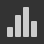

# 3D-Ansicht

In der 3D-Ansicht können Sie Ihre Materialien mit benutzerdefinierten Gittern und gerenderten PBR-Materialien anzeigen und verstehen. Wie bei allen Substance 3D Designer-Fenstern funktioniert es über Kontextmenüoptionen und Drag &amp; Drop-Vorgänge mit anderen Fenstern zusammen.

Die 3D-Ansicht bietet außerdem zwei Hauptmethoden zum Rendern von Materialien in 3D-Szenen:
* Schnelle Visualisierung in Echtzeit mit den Renderern **Rasterizer** und **OpenGL**
* Raytraced-Renderer mit hoher Qualität mit **GPU-Pathtracer**-Renderer

Weitere Informationen: [3D-Renderer](3d-renderers/3d-renderers.md)

+++ Das Andock der 3D-Ansicht

+++

## Viewport-Interaktionen

Im folgenden Abschnitt wird erläutert, wie Sie allgemeine Aktionen kurz durchführen, zusammen mit einem animierten GIF, um den Prozess zu veranschaulichen.

### Navigation

Kamera und Umgebung der 3D-Ansicht können auf drei Arten verändert werden:

* <b>Orbit:</b> LMB+Ziehen
* <b>Balance</b>: MMB+Ziehen/Strg+RMB+Ziehen
* <b>Zoom</b>: Bildlauf mit Mausrad/RMB + Ziehen
* <b>Umgebung drehen:</b> ⇧+RMB+Ziehen
* <b>Fokus auf ausgewähltes Gitter:</b> F (Fokus auf gesamte Szene, wenn keine Auswahl vorhanden ist)
* <b>Kreispunktlicht 1:</b> Strg+⇧+LMB+Ziehen
* <b>Punktlicht 1 näher zum Ursprung bzw. von diesem weg bewegen:</b> Strg+⇧+RMB+Ziehen
* <b>Kameraumlaufposition zurücksetzen:</b> R
* <b>Kameraumlaufposition und Eigenschaften zurücksetzen:</b> ⇧+R

Verwenden eines Trackpads (nur macOS)

* <b>Kreisen:</b> Wischen mit zwei Fingern
* <b>Schwenken:</b> ⇧+Wischen mit zwei Fingern
* <b>Zoom: </b>Zwei Finger zusammenziehen/⌘ + Zwei Finger wischen
* <b>Umgebung drehen:</b> ⇧+Wischen mit zwei Fingern

>[!NOTE]
>
> Zoomrichtung
> 
> Jede der Zoommethoden ist invers:
> 
> * Das Mausrad nach oben *zieht* die Szene näher
> * RMB und Ziehen nach oben *schiebt* die Szene weg
> 
> Die Zoomrichtung kann in den [Voreinstellungen](../../interface/preferences-window/preferences-window.md) umgekehrt werden.

### Auswählen und Fokussieren

Sie können mit Gittern direkt im Viewport interagieren:

<b>Halten Sie ⇧ gedrückt und klicken Sie auf LMB in einem Gitter, um ein Gitter auszuwählen.</b> Ausgewählte Gitter haben einen blauen Umriss.

<b>Drücken Sie F, um sich auf ein ausgewähltes Gitter zu konzentrieren</b>. Durch Fokussieren eines Gitters bewegt sich die Kamera, um es einzurahmen und um es herum zu kreisen.

<b>Klicken Sie auf RMB, während ein Gitter ausgewählt ist</b>, um auf seine [Materialaktionen](#material-actions) in einem Kontextmenü zuzugreifen.

<b>Drücken Sie die Esc-Taste, um die Auswahl aufzuheben.</b> Der Cursor muss sich nicht im Gitter befinden.

{zoomable="yes"}

*Auswählen, Fokussieren, Auswahl aufheben*

{zoomable="yes"}

*Auswählen, Kontextmenü*

>[!NOTE]
>
> Diese Aktionen sind für den veralteten [OpenGL](../../interface/3d-view/3d-renderers/3d-renderers.md)-Renderer nicht verfügbar.

### Ändern der Umgebungsbeleuchtung (IBL)

Designer funktioniert standardmäßig mit bildbasierter Beleuchtung (IBL). Eine Bitmap mit hohem Dynamikbereich wird zum Rendern der Umgebungsbeleuchtung verwendet.

Sie können diese Umgebung um Ihr 3D-Objekt drehen oder voreingestellte oder benutzerdefinierte HDR-Lichtumgebungen laden. Bitte beachten Sie, dass Ihre HDR-Bilder eine äquirektanguläre Projektion verwenden und eine Präzision von 32-Bit-Gleitkommawerten haben sollten.

⇧+RMB+Ziehen <b> dreht die Umgebung </b> in der 3D-Ansicht.

Um eine präzise Drehung festzulegen, verwenden Sie <b>Umgebung > Bearbeiten</b> in der oberen Symbolleiste der 3D-Ansicht und ändern Sie den Schieberegler <b>Drehwinkel</b> im Eigenschaftenfenster.

Um eine voreingestellte HDR-Lichtumgebung zu verwenden, klicken Sie in der [Bibliothek](../../interface/the-library/the-library.md) auf den Abschnitt <b> HDRI-Umgebungen</b> der Kategorie <b>3D-Ansicht, und ziehen Sie dann eines der Symbole per Drag &amp; Drop in die 3D-Ansicht.</b>

Um Ihre eigene, benutzerdefinierte HDR-Lichtumgebung zu verwenden, importieren Sie ein HDR-Bild, indem Sie die Datei per Drag &amp; Drop in ein Paket im Explorer-Fenster ziehen (<b>Datei verknüpfen</b>, wenn Sie dazu aufgefordert werden). Ziehen Sie dann die Ressource per Drag-and-Drop und wählen Sie <b>Breiten-/Längenpanorama</b> als Ziel aus.

### Punktlichter

Wechseln Sie zu <b>Licht > Eigenschaften bearbeiten</b>, um Punktlichter in Ihrer Szene umzuschalten.

Punktlicht 1 kann durch Halten von LMB oder RMB und Ziehen im Darstellungsfenster im Beleuchtungsmodus um den Ursprung der Szene bewegt werden. 

Im Kameramodus , Sie können auch vorübergehend in den Beleuchtungsmodus wechseln, indem Sie Strg+⇧ in Kombination mit den Maustasten gedrückt halten.

## Daten in der 3D-Ansicht anzeigen

### Substance-Graphen

In der 3D-Ansicht können Sie ganze Materialien als vollständiges Material anzeigen. Dies ist die gängigste Arbeitsweise und passt die [Verwendungsattribute auf Ausgabeknoten](../../compositing-graphs/nodes-reference-for-com/atomic-nodes/output/output.md) an die relevanten Texturschlitze des 3D-Ansichtsmaterials an. Das bedeutet, dass Ihre Ausgaben korrekt eingestellt werden müssen (mithilfe von Vorlagen wird dies sichergestellt) und dass Sie Material/Viewport-Shader-Unterstützung ausgewählt haben.

Sie können alle Ausgaben eines Diagramms anzeigen, indem Sie auf *RMB* in einem leeren Bereich in der [Diagrammansicht](../../interface/the-graph-view/the-graph-view.md) klicken und im Kontextmenü die Option **Ausgaben in 3D-Ansicht anzeigen** auswählen.

Sie können auch die Ausgaben eines Diagramms anzeigen, ohne es öffnen zu müssen, indem Sie auf RMB in einer Diagrammressource im [Explorer](../the-explorer-window/the-explorer-window.md)-Dock klicken und die Option **Ausgaben in 3D-Ansicht anzeigen** im Kontextmenü auswählen.

Alternativ zum Kontextmenü des Grafen können Sie dasselbe Ergebnis erzielen, indem Sie den Graf aus dem [Explorer](../the-explorer-window/the-explorer-window.md)-Dock in die 3D-Ansicht ziehen.

Wenn *einen Graf* lädt, werden seine Ausgaben standardmäßig automatisch in der 3D-Ansicht angewendet. Sie können dieses Verhalten in den [Voreinstellungen](../../interface/preferences-window/preferences-window.md) deaktivieren. Gehen Sie zu **Bearbeiten > Voreinstellungen > Graf > Allgemein** und deaktivieren Sie die Option **Ausgaben in 3D anzeigen, wenn Sie eine Option für Graf** öffnen.

>[!NOTE]
>
> **Mehrere Materialsteckplätze**
> 
> Wenn Sie benutzerdefinierte Gitter mit mehr als einem einzelnen Material verwenden, werden Sie aufgefordert, den Materialschlitz auszuwählen, dem das Material zugewiesen werden soll. Klicken Sie bei einer der oben genannten Methoden auf einen Steckplatz, um Ihre Auswahl zu bestätigen. Weitere Informationen zu Materialien und deren Zuordnung finden Sie im Abschnitt unten.

### Einzelne Knoten-/Diagrammausgabe

Sie können nur eine einzelne Ausgabe in einem beliebigen verfügbaren Materialkanal in der [3D-Ansicht](https://substance3d.adobe.com/) anzeigen. Dies wird weniger häufig verwendet, ist aber gut für die Vorschau von Schnelltests oder einzelnen Knoten ohne Ausgabe geeignet.

Sie können einen beliebigen Knoten anzeigen, nicht nur Ausgabeknoten, indem Sie mit der rechten Maustaste auf den Knoten in der [Diagrammansicht](../../interface/the-graph-view/the-graph-view.md) klicken und <b>Ansicht in 3D-Ansicht</b> auswählen. Ihnen wird eine Liste mit verfügbaren Kanälen angezeigt, denen der Knoten zugewiesen werden kann. Klicken Sie zum Bestätigen auf eine beliebige Option.

Sie können auch *RMB* verwenden, um einen beliebigen Knoten per Drag &amp; Drop aus der Diagrammansicht in die 3D-Ansicht zu ziehen. Ihnen wird eine Liste mit verfügbaren Kanälen angezeigt, denen der Knoten zugewiesen werden kann. Klicken Sie zum Bestätigen auf eine beliebige Option.

Sie können jede einzelne Diagrammausgabe anzeigen, indem Sie die Diagrammressource im [Explorer](../the-explorer-window/the-explorer-window.md)-Dock erweitern und diese Ausgabe mit *LMB* in die 3D-Ansicht ziehen. Ihnen wird eine Liste mit verfügbaren Kanälen angezeigt, denen der Knoten zugewiesen werden kann. Klicken Sie zum Bestätigen auf eine beliebige Option.

## (benutzerdefinierte) 3D-Szenen anzeigen

Designer bietet eine Vielzahl an vordefinierten Gitterfunktionen. Diese Gitter haben einheitliche, verwendbare UV-Koordinaten und eignen sich für die meisten Szenarien zum Kacheln von Texturen. Auch das Importieren und Anzeigen eigener 3D-Meshes ist möglich.\
Wählen Sie eines der Standardgitter über das Dropdownmenü <b>Szene</b> in der oberen Leiste aus.

Wechseln Sie für benutzerdefinierte 3D-Szenen zum Abschnitt [Arbeiten mit 3D-Szenen](../../working-with-3d-scenes/working-with-3d-scenes.md).

## Shader-Eigenschaften ändern

In Designer sind standardmäßig einige verschiedene [Shader](../../glossary/glossary.md) verfügbar, und jeder Shader verfügt über Optionen, die über die reinen Textur-Kanäle hinausgehen. Sie können einzeln konfiguriert werden.

Beachten Sie, dass sich die Shader in den [3D-Renderern von Designer](../../interface/3d-view/3d-renderers/3d-renderers.md) unterscheiden, und beim Wechseln der Renderer werden nur die mit einer Bezeichnung &quot;Allgemein&quot; markierten Einstellungen übernommen.

Um den aktuellen Shader zu ändern, gehen Sie zu <b>. Das Menü &#39;</b>Materials&#39; öffnet dann das Untermenü für das Material, das Sie bearbeiten möchten.

Um beispielsweise die Eigenschaft &quot;Height-Skalierung&quot; für das Material &quot;Standard&quot; in der Szene &quot;Ebene (hochauflösend)&quot; anzupassen, gehen Sie zu &quot;Material&quot; > &quot;Standard&quot; > &quot;Eigenschaften bearbeiten&quot;. Suchen Sie dann die Eigenschaft &quot;Height scale&quot; im Eigenschaften-Dock.

Schattierungen können mit den Aktionen &#39;Material zurücksetzen&#39; oder &#39;Auf Szene zurücksetzen&#39; im Untermenü zurückgesetzt werden. Wenn Sie Substance-Graphausgaben in der 3D-Ansicht angezeigt haben, müssen Sie sie erneut anwenden.

>[!NOTE]
>
> Tessellation
> 
> Die Eigenschaft &quot;Tessellation&quot; variiert je nach ausgewähltem 3D-Renderer:
> 
> * <b>Rasterizer/GPU-Pathtracer:</b> In den Renderereinstellungen (&quot;Renderer&quot; > &quot;Einstellungen bearbeiten&quot;) befindet sich und wirkt sich auf die *gesamte Szene aus*.
> * <b>OpenGL:</b> befindet sich in den Material-Eigenschaften und wirkt sich auf das Material aus.

## Szene exportieren

Erfahren Sie mehr über das Exportieren von 3D-Szenen in [dieser Seite](../../working-with-3d-scenes/exporting-scenes/exporting-scenes.md).

### Tessellierten Mesh exportieren (nur OpenGL-Renderer)

Sie können den Mesh aus <b>3D-Ansichten</b> in eine Datei in den Formaten <b>OBJ</b>, <b>FBX</b> oder <b>PLY</b> exportieren. Wenn der Versatz *Tessellation* aktiviert ist, wird die Unterteilung der Geometrie in den exportierten Mesh Baking geführt.

Die Scheitelpunkt-Normalen des Original-Meshs stimmen jedoch möglicherweise nicht mit seiner neuen verschobenen Form überein, was bedeutet, dass der verschobene Mesh möglicherweise nicht korrekt gerendert wird. Sie haben zwei Möglichkeiten, dies zu verwalten:

* Verwenden Sie den Mesh *Normalen-Map*, der die richtigen Normalen bereitstellt.
* *Berechnen Sie die Normalen des Meshs* beim Exportieren mithilfe der Mesh-Normal-Map erneut. Das bedeutet, dass diese Normalen in den exportierten Mesh Baking geführt werden und die Normalen-Map nicht mehr erforderlich ist.

Um den 3D-Ansicht-Mesh zu exportieren, gehen Sie zu <b>Szene > Tessellierten Mesh exportieren...</b>, legen Sie Ihre Auswahl bezüglich der Neuberechnung von Normalen fest, und wählen Sie dann einen Speicherort, einen Namen und ein Dateiformat für den exportierten Mesh aus.

>[!NOTE]
>
> Diese Funktion ist *nicht verfügbar* auf **macOS**.

>[!IMPORTANT]
>
> Einige Vorbehalte
> 
> Wenn der ursprüngliche Mesh über mehrere Material und/oder UV-Satz verfügt, werden diese *in ein* zusammengeführt.
> 
> Die Dauer des Exportvorgangs und die resultierende Dateigröße hängen von der Anzahl der Mesh-Dreiecke und dem *Tessellationen-Faktor* ab. Je nach integriertem Speicherpool der GPU können hohe Tessellation-Faktorwerte zu Instabilität führen.
> 
> Allerdings sollte die Pixelanzahl des tessellierten Meshs im *selben Bereich* liegen wie die Pixelanzahl der *Height*-Scheitelpunkt.
> 
> Ein Mesh mit höherer Dichte als der Höhen-Map kann bei Verwendung der <b>Phong</b>-Tessellation einen etwas glatteren Mesh bewirken. Sie sollten jedoch darauf achten, dass der Mesh zuerst mit den erforderlichen Höhen-Map-Details exportiert wird und dann bei Bedarf den exportierten Mesh in einer anderen Software verfeinert wird.

>[!WARNING]
>
> **TDR (nur Windows)**
> 
> Für diese Funktion muss die <b>Zeitüberschreitungserkennung und -wiederherstellung (TDR)</b> mit den empfohlenen Werten in [dieser Seite](https://experienceleague.adobe.com/en/docs/substance-3d-painter/using/technical-support/technical-issues/gpu-issues/gpu-drivers-crash-with-long-computations-tdr-crash) unserer Dokumentation übereinstimmen, wie in den [technischen Anforderungen](../../getting-started/system-requirements/system-requirements.md) von Designer angegeben.

## Menüleiste

Die Menüleiste enthält 7 Menüs mit Optionen für die 3D-Ansicht. unten finden Sie eine Übersicht aller verfügbaren Optionen.

+++Szene
Das Menü <b>Szene</b> behandelt die angezeigte Geometrie (3D-Ressource) und die Zustände der 3D-Ansicht. 3D-Ressourcen geben nur den Mesh frei, die Szenen sind Lichter, Kamera und zugehörige Einstellungen und können den Mesh auch zusammen mit anderen Elementen enthalten.

<b>Bearbeiten: </b>Lädt Szene-Optionen im Bereich [Eigenschaften](../../interface/properties/properties.md). Ermöglicht es Ihnen, die Sichtbarkeit des 3D-Mesh zu wechseln.

<b>Standardprimitive:</b> Zeigt einen der folgenden einfachen 3D-Mesh in der 3D-Ansicht an.

* Würfel

* Zylinder

* Hohlkasten

* Innerer Kasten

* Fläche

* Fläche (hochauflösend)

* Kugel

<b>Erweiterte Grundelemente:</b> Zeigt einen der folgenden 3D-Mesh in der 3D-Ansicht an.

* Tuch

* Mat.-Ball

* Abgerundeter Würfel

* Abgerundeter Zylinder

* Kugel mit 2-facher Kachelung

* Torus

<b>UV in 2D-Ansicht anzeigen:</b> Aktiviert die Anzeige der UVs für den aktuell ausgewählten Mesh als Überlagerung in der [2D-Ansicht](../2d-view/2d-view.md).

<b>3D-Ressource aus aktueller Szene erstellen...:</b> Erstellt eine neue [3D-Szene-Ressource](../../resources/3d-scene-resource/3d-scene-resource.md) in einem Paket aus der aktuellen Szene.

<b>Statusdatei laden..: </b>Lädt eine extern gespeicherte [Szene-Statusdatei](../../working-with-3d-scenes/working-with-3d-scenes.md) (\*.sbsscn). Ersetzt den 3D-Mesh nicht, lädt nur Einstellungen für 3D-Renderer, Kamera und Lichter.

<b>Statusdatei mit Mesh laden...:</b> Lädt eine extern gespeicherte [Szenen-Statusdatei &#x200B;](../../working-with-3d-scenes/working-with-3d-scenes.md) (\*.sbsscn). Lädt die Einstellungen für den 3D-Renderer, die Kamera, die Lichter sowie die Referenzinformationen in der 3D-Szene. .

<b>Statusdatei speichern..: </b>Speichern Sie den aktuellen Status der 3D-Ansicht in einer [Szene-Statusdatei](../../working-with-3d-scenes/working-with-3d-scenes.md) (\*.sbsscn).

<b>Aktuellen Status als Standard speichern: </b>Legen Sie den aktuellen Status der 3D-Ansicht als [Szene-Statusdatei](../../working-with-3d-scenes/working-with-3d-scenes.md) fest, die standardmäßig beim Erstellen neuer 3D- verwendet werden soll. Diese Datei wird bei jedem Zurücksetzen oder Initialisieren der 3D-Ansicht geladen und kann in den [Projekteinstellungen](../../interface/preferences-window/project-settings/project-settings.md) festgelegt werden.

<b>Szene exportieren:</b> *(Nur Rasterizer/GPU-Pathtracer-Renderer)* Exportiert die aktuelle Szene als [abgeflachte Szene](../../working-with-3d-scenes/exporting-scenes/exporting-scenes.md), in der nur die Ergebnis-Szene geschrieben wird und alle Verweise auf die Original-Szene verloren gehen. Der Inhalt der exportierten Szene hängt von den Funktionen ab, die vom ausgewählten Exportformat unterstützt werden.\
Verfügbare Formate: STL, FBX, GLB, GLTF, PLY, USDC, USD, USDA, USDZ, OBJ.

<b>Szene mit Ebenen exportieren:</b> *(Nur Rasterbildausgabe/GPU-Pathtracer-Renderer)*Exportiert die aktuelle Szene als [Szene mit Ebenen](../../working-with-3d-scenes/exporting-scenes/exporting-scenes.md), wobei alle Änderungen an der Originaldatei in separaten Szenen in einem nicht destruktiven Arbeitsablauf gespeichert werden. Dies ist nur für USD Dateiformate verfügbar.\
Verfügbare Formate sind: USDC, USD, USDA.

<b>Tesselierte Geometrie exportieren:</b> *(Nur OpenGL-Renderer)* Exportiert die aktuelle Szene mit der Tessellation als Rohgeometrie (siehe Abschnitt &quot;Szene exportieren&quot;).

<b>Szene zurücksetzen: </b>Setzt die 3D-Ansicht auf die Standardeinstellungen zurück.

Einige Software-Updates können die Art und Weise ändern, wie Szene-Statusdateien gespeichert/geladen werden.

Wenn die Szene *nicht korrekt aus der Szene wiederhergestellt wurde*, wird empfohlen, den gewünschten Status der Szene manuell festzulegen und die Dateistatusdatei *erneut zu exportieren*.

+++

+++Materialien
Das Menü &quot;<b>Materials</b>&quot; ändert sich basierend auf dem geladenen 3D-Mesh und dem verwendeten Renderer.

Das Menü &quot;Materials&quot; enthält eine Liste aller Materials, die einem Mesh in der Szene zugewiesen sind. Jedes Material, das im Menü &quot;Materialien&quot; aufgelistet ist, verfügt über ein Untermenü mit Material-Aktionen:

<b>Bearbeiten</b> - Einstellungen des aktuellen Materials im Eigenschaftenfenster bearbeiten.

<b>Shaders-Liste</b> - Alle [Shaders](../../glossary/glossary.md), die für den aktuellen [3D-Renderer &#x200B;](../../interface/3d-view/3d-renderers/3d-renderers.md) verfügbar sind.

<b>Definition laden..: </b>(Nur OpenGL-Renderer) Ermöglicht das Laden eigener benutzerdefinierter [GLSLFX-Shader.](../../interface/3d-view/glslfx-shaders/glslfx-shaders.md) Der Shader wird der obigen Liste hinzugefügt.

<b>Allgemeine Parameter zurücksetzen:</b> Setzt alle Parameter zurück, die für alle Shader gelten. Wenn Sie beispielsweise zwischen Rasterprogramm/GPU-Pathtracer und OpenGL-Renderer wechseln, werden mehrere Parameterwerte im [Adobe Standard Material](https://experienceleague.adobe.com/en/docs/substance-3d/general-knowledge/asm/adobe-standard-material) übertragen.

<b>Umbenennen:</b> Ändern Sie die Beschriftung für dieses Material.

<b>Material zurücksetzen:</b> Setzt alle Shader-Parameter auf ihre Standardwerte zurück. Wenn Texturen an einen der Sampler des Shader angeschlossen sind, werden sie getrennt.

<b>Material auf Szene zurücksetzen: </b>*(nur Rasterbildner/GPU-Pathtracer-Renderer)* Setzt alle Eigenschaften für [überschriebene Materialien](../../working-with-3d-scenes/overriding-scene-mat/overriding-scene-materials.md) auf ihre Originalwerte aus der Szene zurück, einschließlich der Originalwerte (falls vorhanden) der Texturen.

<b>Hinzufügen: </b>Fügt der Liste ein neues Material hinzu. Er ist standardmäßig nicht verwendet und kann [&#x200B; mit einem Szene-Material &#x200B;](../../working-with-3d-scenes/overriding-scene-mat/overriding-scene-materials.md) über den [Szene-Browser &#x200B;](../../interface/3d-view/scene-browser/scene-browser.md) verbunden sein.

+++

+++Lichter
Das Menü <b>Licht</b> behandelt nur ältere Umgebungs- und Punktlichter. Diese Lichter sind nicht PBR-konform und liefern nicht die gleichen qualitativ hochwertigen Ergebnisse wie HDR. bildbasiertes Rendering.

<b>Bearbeiten:</b> Bearbeiten Sie einzelne Einstellungen für das Umgebungslicht und die beiden Punktlichter.

<b>Lichter zurücksetzen:</b> setzt die Lichteigenschaften auf den Standardzustand zurück.

+++

+++Kamera
Mit dem Menü <b>Kamera</b> können Sie die Einstellungen für die Kamera ändern, vordefinierte Winkel auswählen und die in einer benutzerdefinierten 3D-Mesh-Kamera gespeicherten Winkel laden.

<b>Eigenschaften bearbeiten:</b> öffnet die Standardeinstellungen der Kamera im Eigenschaftendock.

<b>Fokus: </b>(F) Legt den Fokus der standardmäßigen Kamera auf den aktuell ausgewählten Mesh. d. h., der Mesh wird Rahmen und die Kamera wird am Drehpunkt ausgerichtet. Wenn keine aktive Auswahl vorhanden ist, wird der globale Begrenzungsrahmen der Szene verwendet.

<b>Szene-Kameras:</b> Wenn die Szenen eine oder mehrere Kameras enthalten, werden diese hier aufgelistet und ihre Einstellungen werden als Vorgaben verwendet, die auf die Standardeinstellungen der Szene angewendet werden sollen.

<b>Ansichtspunkte:</b> Vorkonfigurierter Ansichtspunkt für die standardmäßige Kamera. Diese wirken sich nur auf die Transformation der Kamera aus (Position und Drehung).

* Standard: Ein Weitwinkelfoto von der linken Vorderseite der Objekte.

* Rückseite

* Unten

* Vorderseite

* Linksbündig

* Rechtsbündig

* Oben

<b>Rendern speichern...:</b> (Alt+S) Speichert das aktuell gerenderte Image auf der Festplatte mit der in den Renderereigenschaften angegebenen Auflösung oder mit den Eigenschaften der Standardauflösung, wenn eine überschreibende Kamera eingerichtet wurde.

<b>Rendern in Zwischenablage kopieren:</b> (Alt+C) Kopiert das aktuell gerenderte Bild in die Zwischenablage, um es in einen externen Bildeditor einzufügen.

<b>Position zurücksetzen:</b> (R) Setzt die Position der Kamera zurück.

<b>Ausgewähltes Zurücksetzen:</b> (Umschalt+R) Setzt die Position und die Eigenschaften der Kamera zurück.

+++

+++Umgebung
Im Menü <b>Umgebung</b> können Sie die Einstellungen für die HDRI-Umgebung ändern, die zum Beleuchten von PBR-korrekten Materialien verwendet wird.

<b>Eigenschaften bearbeiten:</b> Ermöglicht den Zugriff auf die HDR-Umgebungseinstellungen, die für die Beleuchtung in PBR verwendet werden. Insbesondere kannst du die Sichtbarkeit ein- und ausschalten, die Belichtung in einer Vorschau ändern und die Drehung mit einem präzisen Schieberegler festlegen.

<b>Umgebung zurücksetzen:</b> Setzt alle Umgebungseigenschaften auf die Standardeinstellungen zurück.

+++

+++Anzeige
Mit dem Anzeigemenü können Sie Ansichtsmodi, Helfer und Informationen für die gerenderte Szene ein- und ausschalten:

<b>Achse:</b> Schaltet die Anzeige der 3D-Achse im Viewport um.

<b>Raster:</b> Schaltet die Anzeige der Weltfreundin um.

<b>Auflösung:</b> Schaltet die Anzeige eines kleinen Auflösungszählers um.

<b>Szenenstatistiken:</b> Schaltet die Anzeige von Szenenstatistiken um, z. B. Polycount, Materialanzahl, statische Netzanzahl usw.

<b>Renderzeit:</b> Die Zeit zum Berechnen eines Beispiels für das gesamte Bild.

<b>Samples:</b> Die Anzahl von Pixelproben, die für Akkumulations-Antialiasing (Rasterizer) oder Pfadverfolgung (GPU-Pathtracer) berechnet wurden.

<b>Rückseitenkeulung:</b> Wenn Sie diese Option deaktivieren, können Sie eine Netzfläche von *beiden Seiten* sehen. Die Option funktioniert in Kombination mit Drahtgitter

<b>Begrenzungsrahmen:</b> schaltet die Anzeige des Begrenzungsrahmens des Gitters um.

<b>Drahtgitter:</b> schaltet die Anzeige des Gitter-Drahtgitter um.

<b>Licht:</b> schaltet die Anzeige der Hilfslinien für die Punktlichter um.

<b>Tangentenraum &quot;Scheitelpunkt&quot;:</b> zeigt die Tangenten-, binormalen und normalen Vektoren für alle Scheitelpunkte als farbige Gizmos an.

Einige dieser Optionen sind als Schaltflächen-Umschalter in der Szenen-Symbolleiste verfügbar.

+++

+++Renderer
Mit dem Menü <b>Renderer</b> können Sie 3D-Renderer wechseln und über die Aktion <b>Eigenschaften bearbeiten</b> auf die Eigenschaften des aktuellen 3D-Renderers zugreifen.

Die verfügbaren Renderer und ihre Einstellungen sind in [dieser dedizierten Seite](../../interface/3d-view/3d-renderers/3d-renderers.md) dokumentiert.

+++

## Szenen-Symbolleiste

Die Symbolleiste **Szene**, die sich standardmäßig am linken Rand der 3D-Ansicht befindet, bietet Steuerelemente zum Anzeigen und Interagieren mit der Szene.

Außerdem können Sie auf das Popup-Fenster &quot;[Versatz&quot; &quot;](displacement/displacement.md)&quot; und das Dock &quot;[Szenenbrowser&quot; &quot;](scene-browser/scene-browser.md)&quot; zugreifen.

>[!NOTE]
>
> Die Symbolleiste kann um das Dock **3D View** mit dem am weitesten links befindlichen *Handle*, dargestellt durch drei parallele Linien, *neu* positioniert werden.

### Anzeigeoptionen

#### Oben

 

 <b>Szenenbrowser</b>

Zeigt eine Hierarchie aller Elemente in einer 3D-Szene an.

>[!INFO]
>
>Der Szenenbrowser und seine Features werden ausführlich in [der dedizierten Seite &#x200B;](../../interface/3d-view/scene-browser/scene-browser.md) behandelt.

 <b>Auswählen</b>

Aktiviert die direkte Auswahl von Gittern in der Szene.

<code>LMB</code> Wählen Sie ein Gitter in der Szene aus.

Wählt einzelne Gitter in der Szene aus. Ausgewählte Gitter haben eine blaue Kontur im Ansichtsfenster und werden im [Szenenbrowser](../../interface/3d-view/scene-browser/scene-browser.md) hervorgehoben.

Für ausgewählte Gitter ist ein Kontextmenü verfügbar, das durch Klicken auf <code>RMB angezeigt werden kann.</code>.

Gitter können auch im Kamera- oder Lichtmodus ausgewählt werden, indem Sie <code>Umschalt+LMB drücken.</code>.

 

 <b>Kamera</b>

Ermöglicht die direkte Steuerung der Kamera in der Szene.

<code>LMB</code> Drehen Sie die Kamera um ihr Ziel. <code>RMB</code> Verschiebe die Kamera näher zum Ziel bzw. weiter vom Ziel entfernt.

 

 <b>Umgebung anzeigen</b>

Mit dieser Schaltfläche können Sie die Anzeige der Umgebung der Szene umschalten. Die gleiche Einstellung finden Sie im Eigenschaften-Dock, nachdem Sie in der Menüleiste der 3D-Ansicht zu <b>Umgebung > Bearbeiten</b> gewechselt sind.

 

 <b>Licht</b>

Ermöglicht die direkte Steuerung des Punktlichts 1 in der Szene.

<code>LMB</code> Drehen Sie die Kamera um den Ursprung der Szene. <code>RMB</code> Bewege das Licht näher zum Ursprung der Szene oder weiter davon entfernt.

 

 <b>Rendereinstellungen</b>

Zeigt die Einstellungen des aktuellen Renderers im Dock [Eigenschaften](../properties/properties.md) an.

 

 <b>Pathtracer aktivieren</b>

Schaltet die Auswahl des [GPU-Pathtracer](3d-renderers/3d-renderers.md#gpu-pathtracer)-Renderers um.

 

 <b>Schatten aktivieren</b>

Schaltet das Rendern von Echtzeitschatten im [Rasterizer](3d-renderers/3d-renderers.md#rasterizer)-Renderer um.

 

 <b>Grundebene aktivieren</b>

Schaltet das Rendern der Grundebene in den Renderern [Rasterizer](3d-renderers/3d-renderers.md#rasterizer) und [GPU-Pathtracer](3d-renderers/3d-renderers.md#gpu-pathtracer) um.

 

 <b>Versatz</b>

Zeigt das Popup-Fenster [Versatz](displacement/displacement.md) an.

 

#### Unten

 

 <b>Raster</b>

Schaltet die Anzeige des Weltrasters um.

 

 <b>Szenenstatistiken</b>

Schaltet die Anzeige von Szenenstatistiken um, wie z. B. Polycount, Materialanzahl, statische Meshes-Anzahl, usw.

 

 <b>Achse</b>

Schaltet die Anzeige der 3D-Achse im Viewport um.

 

#### Nur OpenGL-Renderer

 

 <b>Rückseitenkeulung</b>

Wenn Sie diese Option deaktivieren, wird eine Gitterfläche von *beiden Seiten* angezeigt. Die Option funktioniert in Kombination mit Drahtgitter.

 

 <b>Begrenzungsrahmen</b>

Schaltet die Anzeige des Begrenzungsrahmens des Gitters um.

 

 <b>Tangentialraum Scheitelpunkt</b>

Zeigt die Tangenten-, binormalen und normalen Vektoren für alle Scheitelpunkte als farbige Gizmos an.

 

 <b>Drahtgitter</b>

Schaltet die Anzeige des Gitters als Drahtgitter um.

## Symbolleiste anzeigen

Mit der Symbolleiste <b>Anzeigen</b>, die sich standardmäßig am *unteren* des Bereichs <b>3D-Ansicht</b> befindet, können Sie steuern, wie das gerenderte Bild im Ansichtsfenster angezeigt wird.

>[!NOTE]
>
> Die Symbolleiste kann um das Dock **3D View** mit dem am weitesten links befindlichen *Handle*, dargestellt durch drei parallele Linien, *neu* positioniert werden.

### 3D-Render-AOVs

<table style="margin-top: 32px; margin-bottom: 32px">
    <tr style="border: 0; vertical-align: top">
        <td style="border: 0">
            
Sie können verschiedene <a href="../../glossary/glossary.md#aov">AOVs</a> mit der Schaltfläche  <b>3D-Rendering-AOVs</b> anzeigen.

            
Mit AOVs können Sie Gitter- und Materialinformationen isoliert für fokussierte Arbeit und Debugging auswerten.

            
Einige AOVs enthalten <i>HDR-Werte</i>, die im Viewport auf 1 (reinweiß) oder 0 (rein schwarz) festgeklemmt sind. Um den gesamten Wertebereich zu überprüfen, können Sie ein 3D-Rendering des AOV in ein Bilddateiformat exportieren, das HDR-Werte unterstützt, z. B. <code>.exr</code>. Verwenden Sie die Menüoption <code>Camera > Save render...</code>, um das aktuelle AOV zu exportieren.

            
<i>Hinweis:</i> AOVs sind nur verfügbar, wenn der Rasterbildmodus und der GPU-Pathtracer <a href="./3d-renderers/3d-renderers.md">3D-Renderer verwendet werden</a>.

        </td>
        <td style="width: 33%; border: 0">
            
        </td>
    </tr>
</table>

### Farbkanäle

Sie können einen einzelnen Kanal des Bildes mithilfe der Schaltfläche  <b>Farbkanäle</b> anzeigen. Dadurch wird ein Kombinationsfeld geöffnet, in dem Sie auswählen können, welcher der Kanäle <b>Red</b>, <b>Green</b> und <b>Blue</b> angezeigt werden soll. Das normale Erscheinungsbild des Bildes mit allen Kanälen wird wiederhergestellt, indem die Option <b>RGB</b> ausgewählt wird.

Das *Symbol* der <b>Farbkanäle</b>-Schaltfläche *ändert sich* in Abhängigkeit von den derzeit angezeigten Kanälen.

### Farbraum

Für die genaueste Farbdarstellung werden Bilder standardmäßig in einem *Farbraum* angezeigt, der dem vom *Monitor* verwendeten Farbraum entspricht.

Die verfügbaren Steuerelemente hängen vom Farbmanagementmodus ab, der in den [Projekteinstellungen](../../interface/preferences-window/project-settings/project-settings.md) festgelegt wurde. Weitere Informationen zu diesen Steuerelementen finden Sie im Abschnitt [Farbmanagement](../../color-management/color-management.md) auf dieser Seite.
