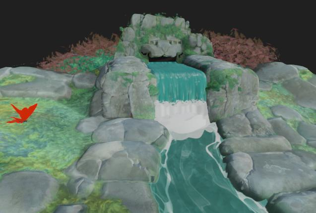
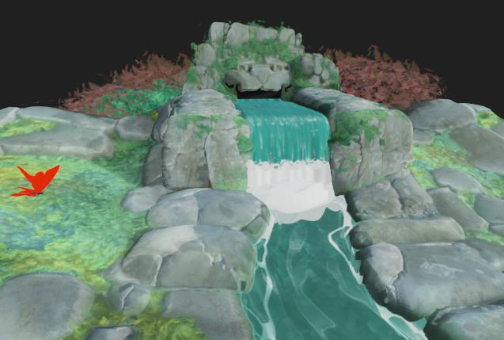

# Post-Effekte

{zoomable="yes"}

In den Kameraeigenschaften können Sie Nachbearbeitungseffekte aktivieren, um das Rendering zu verbessern, oder bestimmte Materialeigenschaften überprüfen.

Diese Effekte werden intern entwickelt und sind nur für die Rasterizer- und GPU-Pathtracer [renderers](../../../../interface/3d-view/3d-renderers/3d-renderers.md) verfügbar.

Jeder Post-Effekt, der zum Zeitpunkt des Speicherns von [3D-Szenenressourcen](../../../../resources/3d-scene-resource/3d-scene-resource.md) oder [Szenenstatusdateien](../../../../working-with-3d-scenes/working-with-3d-scenes.md) aktiviert ist, wird als Teil des Szenenstatus gespeichert.

<table>
<tr style="border: 0;">
<td style="border: 0;" valign="top">

## Ton-Mapping

</td>
<td style="border: 0;" valign="top">

### Bloom

</td>
<td style="border: 0;" valign="top">

### Feldtiefe

</td>
<td style="border: 0;" valign="top">

</td>
</tr>
</table>

## Ton-Mapping

Ordnet die Farben des Renderings gemäß bestimmten Algorithmen und/oder Nachschlagetabellen (LUT) neu zu.

So können Sie die Farbkonsistenz zwischen Anwendungen verbessern. Zum Beispiel ist der AgX-Farbtonzuweiser auch in Blender verfügbar.

+++Reinhard

<table>
  <tr>
    <td>
      
       <i>Vorher</i>
    </td>
    <td>
      
       <i>Nach</i>
    </td>
  </tr>
</table>

+++

+++Atan

<table>
  <tr>
    <td>
      
       <i>Vorher</i>
    </td>
    <td>
      
       <i>Nach</i>
    </td>
  </tr>
</table>

+++

+++Exp

<table>
  <tr>
    <td>
      
       <i>Vorher</i>
    </td>
    <td>
      
       <i>Nach</i>
    </td>
  </tr>
</table>

+++

+++Protokoll

<table>
  <tr>
    <td>
      
       <i>Vorher</i>
    </td>
    <td>
      
       <i>Nach</i>
    </td>
  </tr>
</table>

+++

+++Asse

<table>
  <tr>
    <td>
      
       <i>Vorher</i>
    </td>
    <td>
      
       <i>Nach</i>
    </td>
  </tr>
</table>

+++

+++Hejl

<table>
  <tr>
    <td>
      
       <i>Vorher</i>
    </td>
    <td>
      
       <i>Nach</i>
    </td>
  </tr>
</table>

+++

+++Neutral

<table>
  <tr>
    <td>
      
       <i>Vorher</i>
    </td>
    <td>
      
       <i>Nach</i>
    </td>
  </tr>
</table>

+++

+++Agx

<table>
  <tr>
    <td>
      
       <i>Vorher</i>
    </td>
    <td>
      
       <i>Nach</i>
    </td>
  </tr>
</table>

+++

+++Pbr neutral

<table>
  <tr>
    <td>
      
       <i>Vorher</i>
    </td>
    <td>
      
       <i>Nach</i>
    </td>
  </tr>
</table>

+++

## Bloom

Simuliert den Effekt in der Kamera, wenn Lichtstreifen von sehr hellen Bereichen nach außen auf Bereiche mit geringerem Lichteinfall treffen.

Die Wirkung wird durch die Beleuchtung, die Belichtung der Kamera und die emissive-Materials der Szene beeinflusst.

+++Schwellenwert
Die Luminanz, über der die Blüte sichtbar sein soll.

*Links: 1.0 / Rechts: 4.0*

<table>
  <tr>
    <td>
      
       <i>Vorher</i>
    </td>
    <td>
      
       <i>Nach</i>
    </td>
  </tr>
</table>

+++

+++Abnahme
Die Blütendämpfungsrampe, bei der ein niedrigerer Wert zu einem kürzeren Blütenradius führt.

*Links: 1.0 / Rechts: 0.6*

<table>
  <tr>
    <td>
      
       <i>Vorher</i>
    </td>
    <td>
      
       <i>Nach</i>
    </td>
  </tr>
</table>

+++

+++Tonwertkorrektur
Die Intensität der Blüte. Ein höherer Wert führt zu helleren, ausgeprägteren Lichträndern.

*Links: 8.0 / Rechts: 2.0*

<table>
  <tr>
    <td>
      
       <i>Vorher</i>
    </td>
    <td>
      
       <i>Nach</i>
    </td>
  </tr>
</table>

+++

+++Farbverschiebung
Verschiebt den Farbton der von der Blüte betroffenen Bereiche in Richtung wärmerer Farben.

*Links: 0.0 / Rechts: 0,8*

<table>
  <tr>
    <td>
      
       <i>Vorher</i>
    </td>
    <td>
      
       <i>Nach</i>
    </td>
  </tr>
</table>

+++

## Feldtiefe

Simuliert ein optisches Phänomen, das durch Kameras verursacht wird, bei denen Objekte, die näher und weiter als die Fokusentfernung sind, unscharf werden.

Der Effekt wird sowohl von den Parametern &quot;F-Stopp&quot; als auch &quot;Fokusabstand&quot; der Kamera beeinflusst.

>[!TIP]
>
> Um den Fokus auf die Kamera schnell anzupassen, platzieren Sie den Cursor an der Stelle, an der sich die Szene im Fokus befinden soll, und drücken Sie Strg+LMB (Windows) bzw. Befehl+LMB (macOS), um den Fokusabstand automatisch auf diese Stelle einzustellen.

+++Max. Radius
Der maximale Radius des Weichzeichnungseffekts.

*Links: 32.0 / Rechts: 4.0*

<table>
  <tr>
    <td>
      
       <i>Vorher</i>
    </td>
    <td>
      
       <i>Nach</i>
    </td>
  </tr>
</table>

+++

+++Stärke der Komposition
Die Stärke des Weichzeichnungseffekts von der Fokusentfernung nach außen.

*Links: 0.2 / Rechts: 0,05*

<table>
  <tr>
    <td>
      
       <i>Vorher</i>
    </td>
    <td>
      
       <i>Nach</i>
    </td>
  </tr>
</table>

+++

+++Longitudinale Aberration
Die Intensität der Aberration, die außerhalb des Fokusabstands auftritt.

Die Aberration simuliert, wie unterschiedliche Wellenlängen eine leicht unterschiedliche Brennweite haben. Die Farben scheinen versetzt zu sein und weisen subtile Fokusunterschiede auf.

*Links: 0,0 / RIght: 1.0*

<table>
  <tr>
    <td>
      
       <i>Vorher</i>
    </td>
    <td>
      
       <i>Nach</i>
    </td>
  </tr>
</table>

+++

+++Achromatische Aberration
Gibt an, ob die Aberration achromatisch sein soll, d. h., dass einige oder alle Farben die gleiche Brennweite haben.

Dadurch wirkt der Weichzeichnungseffekt gleichmäßiger verteilt.

*Links: Wahr/Rechts: False*

<table>
  <tr>
    <td>
      
       <i>Vorher</i>
    </td>
    <td>
      
       <i>Nach</i>
    </td>
  </tr>
</table>

+++

+++Katzenaugeneffekt
Aktiviert den Augeneffekt der Katze in der Szene. Damit wird simuliert, wie schräg einfallendes Licht nicht auf die Scheibe einfällt, sondern in ein unebenes Oval, was zu Verzerrung führt.

Dieser Effekt ist bei höheren Blendenwerten, d. h. bei niedrigeren Blendenwerten, ausgeprägter.

*Links: Wahr/Rechts: False*

<table>
  <tr>
    <td>
      
       <i>Vorher</i>
    </td>
    <td>
      
       <i>Nach</i>
    </td>
  </tr>
</table>

+++
