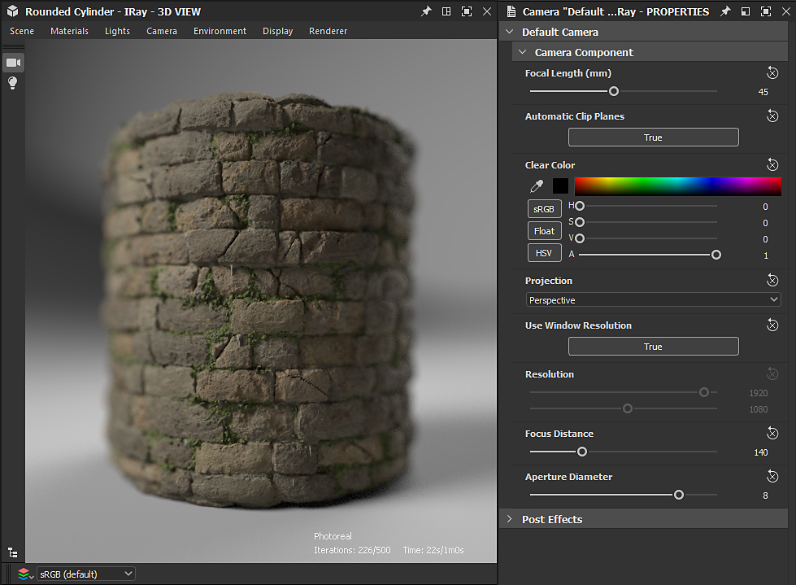
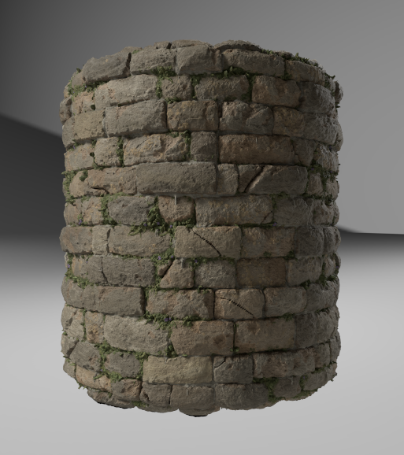
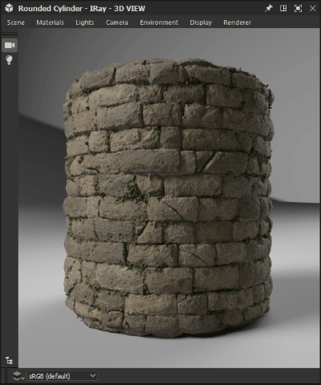

# Iray

Auf dieser Seite wird der Iray-Renderer angezeigt, der im 3D-Ansichtsfenster von [Substance 3D Designer](https://www.adobe.com/products/substance3d-designer.html) verfügbar ist und interaktive Pfadverfolgung für fotorealistisches Rendering mit CPU- und/oder GPU-Beschleunigung (nur Nvidia-GPUs) bietet.

>[!WARNING]
> 
> Der Iray-Renderer und alle zugehörigen Funktionen wurden in Version 16.0.0 aus Designer entfernt.
> 
> Weitere Informationen: [Lebensende von MDL-Diagrammen und Irays](../../../technical-issues/mdl-graph-iray-eol/mdl-graph-iray-eol.md)

<table>
<tr style="border: 0;">
<td style="border: 0;" valign="top">

## Überblick

<b>Iray</b> ist eine hochgradig *interaktive* und intuitive physikalisch basierte Rendering-Technologie, die *fotorealistische Bilder* erzeugt, indem das physikalische Verhalten von Licht und Materialien simuliert wird. Weitere Informationen finden Sie auf der [Nvidia Iray](https://www.nvidia.com/en-us/design-visualization/iray/)-Webseite.

</td>
<td style="border: 0;" valign="top">

</td>
</tr>

<tr style="border: 0;">
<td style="border: 0;" valign="top">

Da die 3D-Ansicht den *progressiven Renderer* von Iray verwendet, wird ein Bild erzeugt, sobald für jedes Pixel mindestens ein Sample ausgeführt wurde. Das Image wird *automatisch aktualisiert*, wenn Iterationen zum Aufnehmen ausgeführt werden, was dazu führt, dass ein anfängliches grobes Image auf jeder Iteration *sauberer wird*.

Der Renderer ist im Bedienfeld [3D-Ansicht](../../../interface/3d-view/3d-view.md) verfügbar: Öffnen Sie das Menü <b>Renderer</b> und wählen Sie die Option <b>Iray</b> aus, um den in diesem 3D-Ansichtsfenster verwendeten Renderer in Iray zu ändern.\
Durch das Wechseln zum Iray-Renderer &quot;*&quot; werden die verfügbaren Optionen &quot;*&quot; in einigen der 3D-Ansichtsmenüs geändert. Diese Änderungen werden im Abschnitt <b>3D-Ansicht</b> unten erläutert.

Standardmäßig beginnt das progressive Rendering, sobald der Iray-Renderer ausgewählt ist. Der Rendervorgang wird ausgeführt, bis *eine* dieser Bedingungen erfüllt ist:

* Die *maximale Anzahl von Samples* wird ausgeführt.
* Das *-Renderzeitlimit* ist erreicht.

Weitere Informationen zum Anpassen dieser Bedingungen finden Sie im Abschnitt <b>Renderer</b> auf dieser Seite.

</td>
<td style="border: 0;" valign="top">

*Material: [Mittelalterliche Burgmauer](https://oggyart.artstation.com/projects/Xnzx0a)* *von [Mark Foreman](https://www.artstation.com/oggyart)* *in unseren [Substance 3D-Medien](https://substance3d.adobe.com/assets)* *Bibliotheken* verfügbar

</td>
</tr>
</table>

>[!WARNING]
>
> Nur die *eine* Iray-Renderinginstanz kann jederzeit ausgeführt werden.\
> Wenn also ein 3D-Ansichtsfenster diesen Renderer verwendet, ist das Menü **Renderer** in anderen 3D-Ansichtsfenstern *deaktiviert* und dieser standardmäßig auf den **OpenGL**-Renderer eingestellt.

## 3D-Anzeigeoptionen

### Szene

Wählen Sie im Menü <b>Szene</b> die Option <b>Bearbeiten</b> aus, um Iray-spezifische Eigenschaften der Szene im Bereich <b>Eigenschaften</b> zu finden.

* <b>Ist aktiviert:</b> Wenn auf *False* festgelegt, wird das Objekt ausgeblendet und *trägt* nicht mehr zur Szene bei.

Komponente anzeigen

* <b>Ist sichtbar</b>: Bei der Einstellung *Falsch* ist das Objekt ausgeblendet, aber *trägt noch* zur Szene bei - d. h. reflektierendes Licht, absorbierendes Licht und projizierende Schatten.

Mesh-Anzeigekomponente

* Unterteilung
  * <b>Methode</b>: Verfahren zur verfahrenstechnischen Unterteilung des Meshs in eine feinere Geometrie
    * *Keine*: Keine Unterteilung erfolgt
    * *Parametrisch*: Unterteilt den Mesh in `4^x` Dreiecke, wobei `x` der von diesem Parameter angegebene Wert ist
    * *Länge*: Unterteilt den Mesh, bis alle Kanten eine Länge (im Objektraum) aufweisen, die unter dem Wert liegt, der mit dem Parameter &quot;Mindestlänge&quot; festgelegt wurde
  * <b>Mindestlänge</b>: Unterteilt den Mesh, bis alle Kanten eine Länge unterhalb dieses angegebenen Werts im Objektraum haben (gilt nur für die *Length*-Methode)
  * <b>Zahl</b>: Die Anzahl der Unterteilungsmethoden, die auf den Mesh angewendet werden sollen (gilt nur für die *Parametric*-Iteration).

>[!WARNING]
>
> Durch das Unterteilen des Meshs *wird seine Verarbeitungszeit exponentiell erhöht* vor und während des Renderns. Wir empfehlen, *konservativ* mit den eingegebenen Werten zu sein.\
> Achten Sie darauf, *hohe* **Anzahl**-Werte für die Parametric-Methode und *niedrige* **Mindestlänge**-Werte für die Length-Methode zu verwenden.

### Materialien

Da Iray auf dem [MDL-Bibliotheksmodell](https://www.nvidia.com/en-us/design-visualization/technologies/material-definition-language/) basiert, das von NVIDIA entwickelt wurde, werden verfügbare Material für Szene-Material durch die MDL-Schattierung ersetzt, die von Designer geladen wurde. Diese Bibliothek wird aus den folgenden Quellen erstellt:

* Die in der Installation von Designer enthaltenen MDL-Dateien
* Die MDL-Dateien wurden in den [ Verzeichnissen gefunden, die vom Benutzer ](../../../interface/preferences-window/project-settings/project-settings.md) in den geladenen [Projektdateien](../../../pipeline-and-project-con/project-configuration-fil/project-configuration-files-sbsprj.md) aufgeführt sind.
* Die [NVIDIA vMaterials](https://developer.nvidia.com/vmaterials)-Bibliothek, wenn sie installiert ist

>[!NOTE]
>
> Weitere Informationen zum MDL-Schattierung-Modell finden Sie im [MDL-Handbuch](http://mdlhandbook.com/), das von NVIDIA geschrieben und gepflegt wurde.

<table>
<tr style="border: 0;">
<td style="border: 0;" valign="top">

Die kumulative Liste der geladenen MDL-Materials ist im Menü <b>Materials</b> unter einem der aufgelisteten Untermenüs der Materials verfügbar, wie in der Abbildung rechts gezeigt.

Wenn ein [MDL-Diagramm](../../../mdl-graphs/creating-an-mdl-graph/creating-an-mdl-graph.md) in Designer geladen wird, kann es außerdem auf jedes beliebige Material in der Szene angewendet werden. An dieser Stelle wird sie der Liste der verfügbaren MDL-Material hinzugefügt.

Weitere wichtige Optionen in diesem Menü sind:

* Wählen Sie die Option <b>Bearbeiten</b>, um auf die *gelegt Eingaben der MDL* im Bereich <b>Eigenschaften</b> zuzugreifen, und passen Sie das Material nach Bedarf an.
* <b>Laden...Mit der Option </b> können Sie *eine MDL-Datei manuell laden*, die der kumulativen Liste hinzugefügt und in der Szene angewendet werden soll.
* Die Exportvorgabe <b>...Die Option </b> öffnet das Dialogfeld <b>MDL-Material-Vorgabe exportieren</b>, in dem Sie eine voreingestellte MDL-3D-Ansicht mit den aktuellen Einstellungen exportieren können, die in der Datendatei angewendet werden.

</td>
<td style="border: 0;" valign="top">

</td>
</tr>
</table>

>[!NOTE]
>
> Beim Laden eines **MDL-Diagramms** wird der 3D-Ansichts-Renderer *automatisch auf **Iray*** umgeschaltet, um es zu laden und anzuwenden.

### Kamera

Der Hauptunterschied zwischen OpenGL und Iray in Bezug auf die Kamera besteht darin, wie *die Tiefe des Felds* verwaltet wird. Da Iray ein physikalisch präziser Renderer ist, erfolgt die Tiefe des Felds &quot;natürlich&quot; in Abhängigkeit von der *Blende* der Kamera.

Die folgenden Parameter sind in den Eigenschaften der Kamera verfügbar, wenn der Iray-Renderer ausgewählt ist:

* <b>Fokusentfernung</b>: der Abstand zur Kamera des Fokuspunkts, d. h. die Stelle, an der das Bild am schärfsten ist
* <b>Durchmesser der Blende</b>: der Wert, der die Blende der Kamera bestimmt. Je niedriger der Wert, desto schärfer sind die Bildelemente vor und nach dem Fokuspunkt - einfacher ausgedrückt steuert dieser Wert die Stärke der Tiefe des Feldeffekts

### Umgebung

Öffnen Sie das Menü <b>Umgebung</b>, und wählen Sie die Option <b>Bearbeiten</b> aus, um die Umgebungseigenschaften im Bereich <b>Eigenschaften</b> anzuzeigen.

Die folgenden Eigenschaften sind verfügbar:

Kuppel

* <b>Kuppel Typ </b>: legt die Objekte fest, die die Szene einschließen, auf die die Textur der Umgebung projiziert wird.
  * *Unendliche Kugel*: unendliche kugelförmige Umgebung
  * *Boden*: unendliche kugelförmige Umgebung, aber mit einer strukturierten Boden-Ebene
  * *Sphäre*: kugelförmige Kuppel mit endlicher Größe und benutzerdefiniertem Radius
  * *Kugel mit Boden*: kugelförmige Kuppel mit endlicher Größe mit benutzerdefiniertem Radius, bei der der untere Teil der Umgebung auf die Ebene projiziert wird, die den oberen und unteren Teil der Kugel trennt
  * *Box mit Boden*: kastenförmige Kuppel mit endlicher Größe, angepasster Breite, individuellem Height und individueller Länge, wobei der untere Teil der Umgebung auf die Ebene projiziert wird, die den oberen und unteren Teil der Kiste trennt
* <b>Drehwinkel</b>: steuert den Drehwinkel der Kuppel um die *Y-Achse*
* <b>Radius</b>: den Kugelradius (gilt nur für die Kuppeln *Sphere* und *Kugel mit Boden*)
* <b>Breite</b>: die Breite des Felds (gilt nur für die *Box mit dem Kuppel-Typ Boden*)
* <b>Height</b>: das Height des Felds (gilt nur für die *Box mit dem Kuppel-Typ Boden*)
* <b>Länge</b>: die Länge des Felds (gilt nur für die *Box mit dem Typ Boden* Kuppel)
* <b>Visualisieren</b>: aktiviert eine Falschfarbenüberlagerung der Umgebungsgeometrie mit begrenzter Größe. Dies kann verwendet werden, um die Geometrie an der Projektion der aufgenommenen Umgebungs-Map auszurichten (gilt nur für die Kuppeln *Sphere*, *Kugel mit Boden* und *Box mit Boden*).

>[!NOTE]
>
> Bei Kuppeln mit begrenzter Größe sollte die gesamte Szene *in der Kuppel* eingeschlossen sein.

Kuppel Boden\
Die folgenden Parameter gelten für die Kuppeln *Boden*, *Kugel mit Boden* und *Box mit Boden*:

* **Boden**: aktiviert die Ebene des Bodens
* **Position**: die Ursprungsposition der endlichen Kuppel (gilt auch für den Typ der *Sphere*-Kuppel)
* **Reflexionsgrad**: die Deckkraft und den Farbton des Bodens, wobei Schwarz bedeutet, dass die Spiegelung nicht sichtbar ist.
* **Glanz**: der Glanz der Reflexion des Bodens
* **Schattenintensität**: die Deckkraft des auf dem Boden Geworfen Schattens
* **Texturen-Skalierung**: steuert die Größe der Projektion der Umgebungs-Textur auf dem Boden (gilt auch für den Typ der *Sphere*-Kuppel).

Die Auswirkungen einiger dieser Einstellungen werden im Folgenden veranschaulicht:

+++Umgebung anzeigen

<table>
  <tr>
    <td>
      
       <i>Vorher</i>
    </td>
    <td>
      
       <i>Nach</i>
    </td>
  </tr>
</table>

+++

+++Grundebene aktivieren

<table>
  <tr>
    <td>
      
       <i>Vorher</i>
    </td>
    <td>
      
       <i>Nach</i>
    </td>
  </tr>
</table>

+++

+++Umgebung drehen

+++

+++Boden-Ebene anpassen

+++

+++Anpassen der unendlichen Kugel
")

+++

+++Schachtelungsrahmen anpassen
")

+++

### Anzeige

Diese Optionen zeigen eine *Textüberlagerung* auf dem gerenderten Bild mit nützlichen Informationen zum Rendering an.

* <b>Verstrichene Zeit</b>: Die Dauer des Renderns in Sekunden. Dieser Timer und der Rendervorgang werden beide angehalten, wenn eine der Endbedingungen erfüllt ist.
* <b>Iterationen</b>: Die Anzahl der durchgeführten Iterationen. Dieser Zähler und der Rendervorgang werden beide angehalten, wenn eine der Endbedingungen erfüllt ist.
* <b>Rendermethode </b>: Der verwendete Renderpfad. Für die meisten Zwecke auf einem lokalen Computer wird Fotoreal verwendet
* <b>Auflösung</b>: Effektive Rendering-Auflösung. Wenn die Option &quot;Fensterauflösung verwenden&quot; in den Bildeigenschaften auf &quot;Falsch&quot; gesetzt ist, wird das Kamera-Seitenverhältnis automatisch an das Auflösungsverhältnis angepasst
* <b>Szene-Statistiken</b>: Eine Liste von Statistiken, die sich auf die gerenderte Szene beziehen, einschließlich der Anzahl der Dreiecke und der Anzahl der Materialien neben anderen Daten.

{width="512px"}

### Renderer

Öffnen Sie das Menü &quot;<b>Renderer</b>&quot;, und wählen Sie die Option &quot;<b>Bearbeiten</b>&quot; aus, um die Renderereigenschaften im Bereich &quot;<b>Eigenschaften</b>&quot; anzuzeigen.

Progressives Rendering

* <b>Min. Beispiele</b>: Die Mindestanzahl von Samples pro Pixel, die vor dem Berücksichtigen von Kriterien zum Beenden des progressiven Renderings berechnet werden müssen
* <b>Max. Samples</b>: Wenn diese Anzahl von Samples pro Pixel gerendert wurde, stoppen Sie das progressive Rendering automatisch
* <b>Maximale Zeit (Sekunden)</b>: Zeit in Sekunden, nach der das progressive Rendering automatisch beendet werden sollte
* <b>Kaustischer Sampler aktiviert</b>: Erweitern Sie den Standardprobenehmer um einen dedizierten kaustischen Probennehmer. Kaustiken sind das Ergebnis des Lichtdurchtritts durch ein nicht deckendes Objekt und sind daher nur erforderlich, wenn ein [MDL](../../../mdl-graphs/creating-an-mdl-graph/creating-an-mdl-graph.md)-Material, das die Lichtdurchlässigkeit unterstützt, auf ein beliebiges Objekt in der Szene angewendet wird
* <b>Firefly-Filter aktiviert</b>: aktivieren Sie den Filter &quot;firefly&quot;, der einen vordefinierten Algorithmus verwendet, um fireflies im berechneten Bild zu entfernen, während das Rendering voranschreitet. Firefly sind visuelle Artefakte, bei denen *Pixel* in einem Bild isoliert sind, die *merklich heller* sind als ihre Nachbarn, und die das Ergebnis unzureichender Strahlproben sind, um die Lichtverteilung genau zu bestimmen
* Nachdenderer\
  Der Iray-Renderer verwendet den [NVIDIA Optix AI-Accelerated Denoiser](https://developer.nvidia.com/optix-denoiser)-Algorithmus für die iterative hochwertige Denomisierung des Bildes beim Rendern.

  * <b>Aktiviert</b>: ermöglicht, dass ein vordefinierter *Denisierungsalgorithmus* bei einer festgelegten Rendering-Iteration ausgelöst wird und bis zum *Ende* des Renderings aktiv ist.
  * <b>Iteration starten</b>: Wenn der Denoiser aktiviert ist, legt diese Option die Iteration fest, mit der der Denoiser-Prozess beginnt. Dadurch kann verhindert werden, dass der Performance-Overhead des Denoisers die Interaktivität beeinflusst, z. B. beim Bewegen der Kamera. Außerdem sind die ersten Iterationen aufgrund unzureichender Konvergenz oft nicht als Eingabe für den Denoiser geeignet, was zu unbefriedigenden Ergebnissen führt.

Die Auswirkungen einiger dieser Einstellungen werden in den folgenden Bildvergleichen gezeigt:

+++Kaustik-Probenehmer

<table>
  <tr>
    <td>
      
       <i>Vorher</i>
    </td>
    <td>
      
       <i>Nach</i>
    </td>
  </tr>
</table>

+++

+++Firefly-Filter

<table>
  <tr>
    <td>
      
       <i>Vorher</i>
    </td>
    <td>
      
       <i>Nach</i>
    </td>
  </tr>
</table>

+++

+++Nachdenomisierer

<table>
  <tr>
    <td>
      
       <i>Vorher</i>
    </td>
    <td>
      
       <i>Nach</i>
    </td>
  </tr>
</table>

+++

*Material: Dickglas MDL* *verfügbar in den MDL-Kerndefinitionen* *von NVIDIA*

## Hardwarebeschleunigung

Der Iray-Renderer bietet ausschließlich Hardwarebeschleunigung auf NVIDIA-GPUs, was die folgenden Vorteile bietet:

* Deutliche Erhöhung der Rendering-Geschwindigkeit
* [Optix AI-Accelerated Denising](https://developer.nvidia.com/optix-denoiser) (siehe &quot;Post-Denoiser&quot; im Abschnitt <b>Renderer</b> dieser Seite)

Sie können die Hardware, die von Iray für das Rendern verwendet werden soll, im Abschnitt <b>3D-Ansicht</b> des Fensters [Voreinstellungen](../../../interface/preferences-window/preferences-window.md) auswählen (siehe Abbildung rechts).

Wenn eine unterstützte GPU erkannt wird, wird sie in diesem Abschnitt aufgeführt, standardmäßig *automatisch ausgewählt* und die CPU ist nicht ausgewählt. Jede manuelle Änderung überschreibt dieses automatische Verhalten, sodass Ihre benutzerdefinierten Änderungen für zukünftige Sitzungen gespeichert werden.

>[!NOTE]
>
> Wenn eine unterstützte GPU erkannt und aufgelistet wird, wird dringend empfohlen, *die CPU nicht ausgewählt zu lassen*, da die Verwendung der CPU für das Iray-Rendering *erhebliche Auswirkungen* auf die Gesamtleistung und die Reaktionsfähigkeit der Anwendung hat.

>[!WARNING]
>
> Die GPU-Hardwarebeschleunigung verwendet die [NVIDIA CUDA](https://developer.nvidia.com/cuda-zone)-Technologie. Stellen Sie sicher, dass Ihr *-Grafiktreiber auf dem neuesten Stand ist*, um die beste Kompatibilität und Zuverlässigkeit zu erzielen. Suchen Sie hier den neuesten Treiber für Ihre NVIDIA-GPU .\
> Für Konfigurationen mit mehreren GPUs wird empfohlen, SLI *zu deaktivieren* und nur eine GPU auszuwählen, um die beste Zuverlässigkeit zu erzielen.

