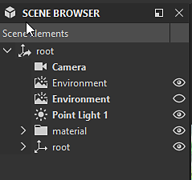

# Szenenbrowser

Im Szenen-Browser der 3D-Ansicht sind alle Elemente der Szene und ihre Hierarchie aufgelistet.

Es bietet Steuerelemente zum Auswählen von Objekten, zum Umschalten ihrer Sichtbarkeit sowie zum Auswählen, welches Material [&#x200B; ein Szene-Material überschreiben soll](../../../working-with-3d-scenes/overriding-scene-mat/overriding-scene-materials.md).

Da Designer [USD](https://openusd.org/release/index.html) für die Beschreibung und Verwaltung seiner Szenen verwendet, befinden sich die Terminologie und Konzepte in dieser Szene.

Sie wird angezeigt, indem Sie auf die dedizierte Umschaltfläche &quot;&quot; in der Symbolleiste &quot;[3D View Szene&quot; klicken.](../../../interface/3d-view/3d-view.md)

{zoomable="yes"}

<table>
<tr style="border: 0;">
<td style="border: 0;" valign="top">

## Szenenbaum

</td>
<td style="border: 0;" valign="top">

### Umschalten von Objekten in der Szene

</td>
<td style="border: 0;" valign="top">

### Verbundene Material

</td>
</tr>
</table>

## Szenenbaum

<table>
<tr style="border: 0;">
<td width="100.00%" style="border: 0;" valign="top">

Der Szene-Browser zeigt eine Liste von Objekten an, die in einer hierarchischen Baumstruktur angeordnet sind.

Objekte werden anderen Objekten übergeordnet, bis zum Stamm der Szene. Ein übergeordnetes Objekt verfügt über eine Pfeilschaltfläche, mit der die Liste der ihm untergeordneten Objekte ein- oder ausgeblendet wird.

</td>
<td width="33.33%" style="border: 0;" valign="top">

{zoomable="yes"}

</td>
</tr>
</table>

Lassen Sie den Cursor einige Sekunden auf einem Element in der Struktur, um eine QuickInfo mit den folgenden Informationen anzuzeigen:

* <b>Pfad:</b> Der vollständige Pfad des Objekts in der Szene.
* <b>TypeName:</b> Der USD des Objekts.
* <b>Dokumentation:</b> Ausführliche Informationen zum Objekt als USD Szene.

Mesh verfügen über zusätzliche Informationen: Anzahl der Scheitelpunkt, Anzahl der Flächen und Anzahl der UV.

### Von Designer hinzugefügte Objekte

<table>
<tr style="border: 0;">
<td width="100.00%" style="border: 0;" valign="top">

Designer fügt jeder geladenen Szene einige Objekte hinzu. Von Designer hinzugefügte Objekte sind mit <b>bold</b> gekennzeichnet.

Bei Verwendung des Editors ... in den Menüs &quot;Lights&quot;, &quot;Kamera&quot; und &quot;Environment&quot; festgelegt sind, handelt es sich um die Objekte, die bearbeitet werden, unabhängig davon, ob andere Lights, Kameras oder Umgebungen in der Szene vorhanden sind.

Diese Objekte sind in der Szene enthalten, wenn [&#x200B; &#x200B;](../../../working-with-3d-scenes/exporting-scenes/exporting-scenes.md) exportiert hat.

</td>
<td width="33.33%" style="border: 0;" valign="top">

{zoomable="yes"}

</td>
</tr>
</table>

* <b>Kamera:</b> Die Standardkamera der Szene. Dies ist die einzige Kamera, mit der Sie in Designer interagieren können. Alle Kameras, die in einer geladenen Szene enthalten sind, werden als Vorgaben für die Standardkamera hinzugefügt.
* <b>Umgebung:</b> Die Standardumgebung der Szene. Jede auf die Umgebung der Szene angewendete Textur wird nur auf diese Umgebung angewendet. Ebenso wirkt sich das Drehen der Umgebung nur auf diese Umgebung aus.\
  Wenn eine geladene Szene eine oder mehrere Umgebungslichter enthält ([DomeLight](https://openusd.org/release/user_guides/schemas/usdLux/DomeLight.html) in USD), wird die Standardumgebung automatisch deaktiviert, um die Umgebungsbeleuchtung der Szene nicht zu beeinträchtigen.
* <b>Punktlicht #:</b> Wenn eines der Punktlichter von Designer unter &quot;Lichtquellen&quot; > &quot;Eigenschaften bearbeiten&quot; aktiviert ist, wird jedes Punktlicht der Szene hinzugefügt.

## Umschalten von Objekten in der Szene

### Alle Typen

Jedes Objekt kann in der Szene aktiviert und deaktiviert werden. Wenn diese Option deaktiviert ist, wird ein Objekt nicht mehr zur Szene hinzugefügt: es wirft keine Schatten, strahlt oder reflektiert Licht.

Der Status eines übergeordneten Objekts wird auf seine untergeordneten Objekte übertragen. Wenn Sie also ein übergeordnetes Objekt deaktivieren, werden auch seine untergeordneten Objekte deaktiviert.

Die Sichtbarkeit eines Objekts kann durch Klicken auf die Augenschaltfläche &quot;&quot; oder über das Kontextmenü umgeschaltet werden. Das Menü bietet einige weitere Aktionen zum Verwalten der Sichtbarkeit von Szenenobjekten:

* <b>Ausblenden:</b> Deaktivieren Sie das ausgewählte Objekt.
* <b>Anzeigen:</b> Aktivieren Sie das ausgewählte Objekt.

Einige Aktionen wirken sich insbesondere auf die Sichtbarkeit von Gittern aus:

* <b>Nur anzeigen:</b> Deaktivieren aller Gitter außer dem ausgewählten und den zugehörigen untergeordneten Gittern.
* <b>Alle anzeigen:</b> Aktivieren Sie alle Gitter.

Übergeordnete Objekte verfügen über diese zusätzlichen Aktionen:

* <b>Untergeordnete Elemente ausblenden:</b> Alle untergeordneten Elemente des ausgewählten Objekts werden rekursiv deaktiviert.
* <b>Untergeordnete Elemente anzeigen:</b> Aktivieren Sie alle untergeordneten Elemente des ausgewählten Objekts rekursiv.
* <b>Alle untergeordneten Elemente erweitern:</b> Erweitern Sie alle untergeordneten Listen unter dem ausgewählten Objekt rekursiv.
* <b>Alle untergeordneten Elemente reduzieren:</b> Reduzieren aller untergeordneten Listen unter dem ausgewählten Objekt, rekursiv.

{zoomable="yes"}

### Umgebungen

Die Sichtbarkeit eines beliebigen Umgebungslichts (DomeLight) kann wie andere Objekte aktiviert und deaktiviert werden.

Wenn ein Umgebungslicht deaktiviert ist, wird auch sein Lichtbeitrag zur Szene deaktiviert.

Wenn mehr als ein Umgebungslicht aktiviert ist, werden seine Beleuchtungsbeiträge *kumulativ* hinzugefügt.

{zoomable="yes"}

### Lichter

Dasselbe gilt für alle Lampen in der Szene: können einzeln aktiviert und deaktiviert werden.

{zoomable="yes"}

## Verbundene Material

Mit dem Szene-Browser können Sie auch alle außer Kraft gesetzten Material mit einem anderen Material verbinden, das von Designer im Menü [Materialien](../../../interface/3d-view/3d-view.md) der 3D-Ansicht aufgelistet wird.

<table>
<tr style="border: 0;">
<td style="border: 0;" valign="top">

Bei den von Designer aufgelisteten Materialien handelt es sich um die Material-Objekte in der Szene, die auf mindestens einem Mesh verwendet werden.

Wenn [diese Material überschreiben](../../../working-with-3d-scenes/overriding-scene-mat/overriding-scene-materials.md), wird von Designer eine Kopie mit einem numerischen Suffix erstellt.

Ein überschriebenes Material bietet ein zusätzliches Element in seinem Kontextmenü: Das Untermenü &quot;[Verbundenes Material](../../../working-with-3d-scenes/overriding-scene-mat/overriding-scene-materials.md)&quot; listet alle anderen verfügbaren Material auf, mit denen dieses Material überschrieben werden kann.

</td>
<td style="border: 0;" valign="top">

{zoomable="yes"}

</td>
</tr>
</table>
