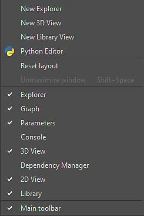
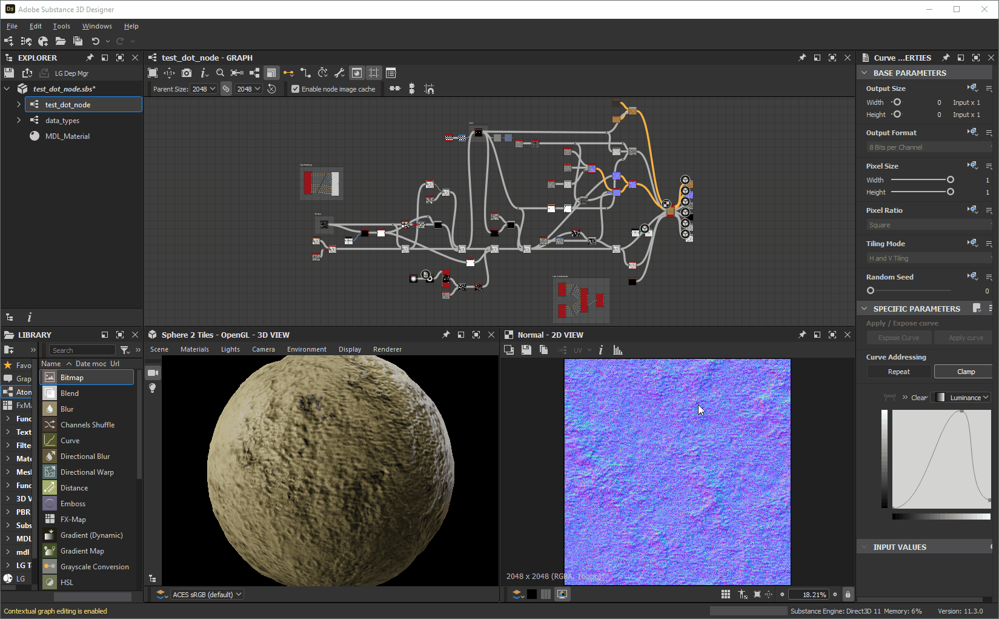

# Anpassen des Arbeitsbereichs

Auf dieser Seite werden die Möglichkeiten zum Anordnen der Bedienfelder in der [Adobe Substance 3D Designer-Benutzeroberfläche](https://www.adobe.com/de/products/substance3d-designer.html) und zum Optimieren Ihrer Arbeitsabläufe beschrieben.

<table>
<tr style="border: 0;">
<td width="100.00%" style="border: 0;" valign="top">

## Windows-Menü

In diesem Menü können Sie die Hauptelemente der Benutzeroberfläche von Designer verwalten. Jede Option wird im Abschnitt <b>Windows</b> von [dieser Seite](../the-main-toolbar/the-main-toolbar.md) zur Hauptsymbolleiste beschrieben. Hier stellen wir weitere Konzepte zu diesem Menü zur Verfügung.

### Anzeigen/Ausblenden einer Ansicht

Um ein bestimmtes Schnittstellenelement ein- oder auszublenden, klicken Sie im Menü *Windows* auf seinen Namen. Die angezeigten Elemente haben ein -Häkchen.

### Ein Dock mit einer Ansicht füllen

In Designer ist ein Dock ein *Container, der vom Inhalt getrennt ist*. Dies bedeutet, dass ein <b>Library</b>-Dock vorhanden und leer sein kann, da es keine Library *view* enthält.

Mit den Optionen <b>Neuer Explorer</b>, <b>Neue 3D-Ansicht</b> und <b>Neue Bibliotheksansicht</b> werden Ansichten erstellt, die entsprechend dem aktuellen Status der Benutzeroberfläche platziert werden:

* Wenn ein leeres Dock verfügbar ist, wird die neue Ansicht *in diesem erstellt*
* Wenn leere Docks *nicht* verfügbar sind, wird ein *neues Dock* erstellt, das die neue Ansicht enthält.

</td>
<td width="33.33%" style="border: 0;" valign="top">

</td>
</tr>
</table>

## Skalieren von Docks

Die Größe von Docks kann durch Verschieben der Kanten angepasst werden. Die Größe anderer Docks wird dynamisch an die Größe angepasst.

## Bewegte Docks

Ein beliebiges Dock kann mithilfe der Titelleiste ** um das Hauptfenster verschoben werden. Je nach Position, an die das Dock verschoben wird, werden die Docks entsprechend skaliert.

## Tabulatordocks

Docks können in Registerkarten gestapelt werden. Dies ist nützlich, um Bildschirmfläche oder aggregierte Ansichten zu speichern, die in irgendeiner Weise miteinander in Beziehung stehen.

Sie können Docks mit der Tabulatortaste verschieben, indem Sie ein Dock mit der Titelleiste *über ein vorhandenes Dock* verschieben, z. B. Docks werden nicht skaliert oder verschoben, aber um das Zieldock wird ein *Frame* angezeigt.

## Ausdocken

Ein Dock kann in einem *schwebenden Fenster* abgedockt werden, dessen Größe geändert und aus dem Hauptfenster verschoben werden kann, einschließlich in eine andere Anzeige.

Dies kann auf zwei Arten erfolgen:

* Das Dock wird mit der Titelleiste ** verschoben und entweder *aus dem Hauptfenster* oder in einem Bereich des Hauptfensters, der *kein Dock* ist, platziert. Sie können dieses Dock erneut andocken, indem Sie es entweder an ein anderes Dock *im Hauptfenster* verschieben oder auf die Schaltfläche <b> &quot;Redock</b>&quot; klicken.
* Klicken auf die Schaltfläche <b> Undock</b>. Ein Dock, das mit dieser Methode abgedockt wurde, kann nur *angedockt* werden, indem auf die Schaltfläche <b> Redock</b> geklickt wird.

## Maximieren von Docks

Jedes Dock kann maximiert werden, damit es in den Bereich oder das *übergeordnete Fenster* passt:

* Angedockte Docks erstrecken sich über den gesamten Bereich des *Hauptfensters*, mit Ausnahme der Titelleiste, der Hauptsymbolleiste und der Statusleiste.
* Nicht angedockte Docks werden über die gesamte *Anzeige* verteilt.

Docks können auf zwei Arten maximiert werden:

* Platzieren des *-Cursors über dem Dock* und Drücken der Tastenkombination <b>Umschalt+Leertaste</b>
* Klicken auf die Schaltfläche <b> Maximieren</b>

Maximierte Docks können auf die Größe und den Ort minimiert werden, an dem sie *gehalten haben, bevor sie maximiert werden*. Dafür gibt es drei Möglichkeiten:

* Platzieren des *-Cursors über dem Dock* und Drücken der Tastenkombination <b>Umschalt+Leertaste</b>
* Klicken auf die Schaltfläche <b> Minimieren</b>
* Öffnen des Menüs <b>Windows</b> und Auswählen der Option <b>Fenster nicht maximieren</b>

>[!NOTE]
>
> Nur *ein* Dock kann gleichzeitig maximiert werden.

>[!IMPORTANT]
>
> Wenn ein Dock maximiert ist, können einige Verhalten der Benutzeroberfläche abweichen:
> 
> * Docks, die automatisch angezeigt/aktualisiert werden, werden im Hintergrund angezeigt (z. B. Eigenschaften, 2D-Ansicht).
> * Menüelemente sind *deaktiviert* im Menü **Windows**
> * Schaltflächen sind *deaktiviert* in der Titelleiste des Docks
> * Ein im Hauptfenster *maximiertes Dock darf nicht mit der Titelleiste* verschoben werden.

## Anheften von Docks

Das Anheften eines Docks *verhindert, dass es mit anderem Inhalt oder einer anderen Ansicht aufgefüllt wird*.

Wenn ein Dock angeheftet ist, erstellt jeder zukünftige Inhalt, der in seinem angezeigt werden soll, stattdessen *ein neues Dock*, um es zu hosten. Dieses neue Dock wird nicht angeheftet und kann daher neue Inhalte aktualisieren und hosten.

Um ein Dock anzuheften, klicken Sie auf die Schaltfläche  <b>Anheften</b>. Sie können es dann *lösen*, indem Sie die  <b>lösen</b>-Schaltfläche verwenden, um es erneut *verfügbar* zu machen, um neue Inhalte zu hosten.

*Es können mehrere* Docks gleichzeitig angeheftet werden, einschließlich mehrerer Docks des *gleichen Typs*.

Das Anheften von Docks bietet folgende Möglichkeiten:

* Anzeigen und Anpassen von Eigenschaften mehrerer Knoten gleichzeitig
* Anzeigen von zwei oder mehr Bitmaps gleichzeitig
* Gleichzeitiges Arbeiten an mehreren Graphen

## Schließende Docks

Ein beliebiges Dock kann durch Klicken auf die Schaltfläche  <b>Schließen</b> geschlossen werden.

## Oberflächenlayout zurücksetzen

Die gesamte Benutzeroberfläche kann auf das Standardlayout zurückgesetzt werden, indem Sie das Menü <b>Windows</b> öffnen und die Option <b>Layout zurücksetzen</b> auswählen.

Ihr Anzeigestatus wird ebenfalls zurückgesetzt, was bedeutet, dass geschlossene Docks *erneut geöffnet* (z. B. 3D-Ansicht) und angezeigte Docks *geschlossen* (z. B. Konsole, Abhängigkeitsmanager, von Plug-ins erstellte Docks) sein können.

