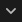
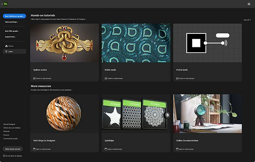

# Startbildschirm

Der <b>Startbildschirm<b> </b></b> begrüßt Sie, wenn Sie Substance 3D Designer starten. Es hilft Ihnen, mit Ihren Projekten zu beginnen und auf nützliche Links zuzugreifen.

<table>
<tr style="border: 0;">
<td width="100.00%" style="border: 0;" valign="top">

Um den Startbildschirm zu schließen, verwenden Sie die Schaltfläche <b>Zurück</b> oben links oder die Schaltfläche <b>Startbildschirm schließen</b> unten links. Mit einem Kontrollkästchen direkt darunter können Sie die automatische Anzeige des Startbildschirms nach dem Starten von Designer ein- und ausschalten.

</td>
<td width="16.67%" style="border: 0;" valign="top">

</td>
</tr>
</table>

{width="512px"}

## Startseite

Der Abschnitt  <b>Startseite</b> enthält ein Banner mit einem hervorgehobenen Vorschlag für die weitere Verwendung von Designer.\
Dieses Banner kann mit der Schaltfläche  <b>Vorschläge ausblenden</b> auf der rechten Seite ausgeblendet werden.

Unten bietet eine Liste der zuletzt geladenen Dateien unter der Kopfzeile <b>Zuletzt verwendet</b> schnellen Zugriff auf die zuletzt geladenen Projekte, von den zuletzt geladenen bis zu den ältesten.

Zuletzt verwendete Dateien können mithilfe des Eingabefelds <b>Filter</b> oben rechts in der Liste gefiltert werden. &quot;Filterung&quot; stimmt mit einer beliebigen Zeichenfolge überein, die im Dateinamen eines Projekts vorhanden ist.

>[!TIP]
>
> Lassen Sie den Cursor einige Sekunden auf einem Eintrag, um den vollständigen Pfad der Datei anzuzeigen.

{width="512px"}

## Lernen

Der Abschnitt  <b>Training</b> bietet nützliche Lernressourcen, mit denen Sie Substance 3D Designer besser verstehen können.

Diese Ressourcen werden als Kartenlinks aufgelistet und wie folgt gruppiert:

* <b>In den praktischen Übungen</b> werden die neuesten Funktionen behandelt.
* <b>Weitere Ressourcen</b> sammelt Ressourcen, die Sie möglicherweise nützlich finden, um regelmäßig zu den folgenden Themen zurückzukehren:
  * [Die ersten Schritte in Designer](https://substance3d.adobe.com/tutorials/courses/First-Steps-with-Substance-3D-Designer/youtube-VyFgpitTsYg) sind unser Referenz-Tutorial für Einsteiger.
  * [QuickInfos](https://substance3d.adobe.com/tutorials/courses/Designer-Quicktips/youtube-Q9mEcCWsOQc) ist eine kuratierte Wiedergabeliste mit Techniken zum Erstellen von Materialien, Mustern, Filtern usw.;
  * Mit [Onlinedokumentation](../../home/home.md) gelangen Sie zu dieser Dokumentation.

{width="512px"}

## Neuerungen

Die Schaltfläche  <b>Neue Funktionen</b> oben rechts auf dem Bildschirm zeigt einen Bildschirm mit den wichtigsten Funktionen an, die in Ihrer Designer-Version hinzugefügt wurden, sowie einen Link zu den vollständigen [Versionshinweisen](../../release-notes/release-notes.md) für diese Version.

## Projekt starten

Auf der linken Seite des Bildschirms finden Sie eine Liste mit Tastaturbefehlen zum Erstellen eines neuen Diagramms in einem neuen Paket:

* <b>Neues Substance-Diagramm:</b> Öffnet das Fenster [Neues Substance-Diagramm](../../compositing-graphs/creating-compositing-gra/creating-a-substance-compositing-graph.md);
* <b>Paket öffnen:</b> Ermöglicht das Laden eines vorhandenen Pakets;
* <b>Import AxF:</b> Startet einen [AxF-Importarbeitsablauf](../../resources/axf-appearance-exchange/axf-appearance-exchange-format.md).

{width="256px"}

## Verknüpfungen

Unten links auf dem Bildschirm werden nützliche Links wie folgt aufgeführt:

* <b>Info zu Designer:</b> Zeigt den Bildschirm &quot;Info zu Designer&quot; an (siehe oben);
* <b>Onlinedokumentation:</b> Öffnet eine Webseite zu [dieser Dokumentation](../../home/home.md);
* <b>Website:</b> Öffnet eine Webseite zur Substance 3D Designer [Produktseite](https://www.adobe.com/de/products/substance3d-designer.html);
* <b>Foren:</b> Öffnet eine Webseite für die [Support Community](https://community.adobe.com/t5/substance-3d-designer/ct-p/ct-substance-3d-designer?page=1&sort=latest_replies&filter=all&lang=all&tabid=discussions) von Substance 3D Designer.
* <b>Community-Assets:</b> Öffnet eine Webseite zu Substance 3D [Community-Assets](https://substance3d.adobe.com/community-assets/).
