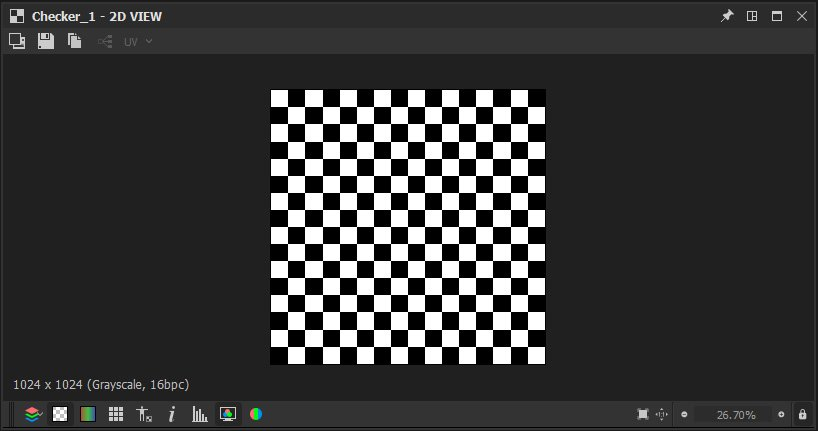
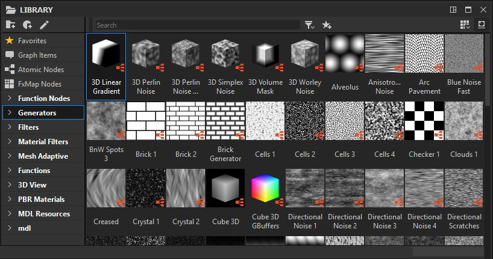

# Arbeitsbereich

Der Arbeitsbereich ist in separate Bereiche aufgeteilt, die als <b>Docks</b> bezeichnet werden. Diese können [skaliert, verschoben und abgedockt](../interface/customizing-your-wor/customizing-your-workspace.md) des Hauptfensters von Designer in ein schwebendes Dock verschoben werden.

Hier ist das Standarddock-Layout von Designer:

<table>
<tr style="border: 0;">
<td style="border: 0;" valign="top">

<b>1</b> Hauptmenü und Symbolleiste

<b>2</b> Explorer

<b>3</b> Diagrammansicht

</td>
<td style="border: 0;" valign="top">

<b>4</b> Eigenschaften

<b>5</b> 2D-Ansicht

</td>
<td style="border: 0;" valign="top">

<b>6</b> 3D-Ansicht

<b>7</b> Bibliothek

</td>
</tr>
</table>

>[!NOTE]
>
> Schnittstellenskalierung
> 
> Designer bezieht die spezifische Skalierung der Benutzeroberflächenelemente *vom Betriebssystem*. Daher sollten alle Anpassungen an der Skalierung der Benutzeroberfläche in den Anzeigeeinstellungen des Betriebssystems vorgenommen werden.
> 
> Um sicherzustellen, dass die Anzeigeeinstellungen in Designer korrekt angewendet werden, *melden Sie sich von* Ihrer Betriebssystembenutzersitzung ab und melden Sie sich nach Änderung dieser Einstellungen wieder an.

<table>
<tr style="border: 0;">
<td style="border: 0;" valign="top">

## Hauptmenü und Symbolleiste

Mit der Hauptsymbolleiste können Sie auf zusätzliche Menüs zugreifen, z. B. auf das Fenster [Voreinstellungen](../interface/preferences-window/preferences-window.md), und es gibt einige Schaltflächen, mit denen Sie schnell ein neues Substance-Diagramm und -Paket erstellen können.

</td>
<td style="border: 0;" valign="top">

</td>
</tr>
</table>

* <b>Datei: </b>Ermöglicht das Erstellen neuer Pakete und Ressourcen sowie das Speichern und Schließen von Paketen, an denen Sie gerade arbeiten. Funktionen aus diesem Menü sind auch als Schnellschaltflächen in dieser Symbolleiste verfügbar.
* <b>Bearbeiten: </b>Bietet Funktionen zum Rückgängigmachen und Wiederholen (unten als Schnellschaltflächen verfügbar) sowie Zugriff auf [Voreinstellungen](../interface/preferences-window/preferences-window.md) für die Anpassung in der Tiefe.
* <b>Extras:</b> Steuert das Substance Engine und ermöglicht den Zugriff auf den Plug-in-Manager.
* <b>Windows:</b> Ermöglicht das Ein- und Ausblenden der Fenster (einige sind standardmäßig ausgeblendet). Sie können das Fensterlayout auf die Standardeinstellungen zurücksetzen.
* <b>Hilfe: </b>Bietet Zugriff auf zusätzliche Informationen und Online-Ressourcen, wie z. B. die Substance Academy oder diese Dokumentationswebsite.

## Explorer

[Das Explorer-Fenster &quot;](the-explorer-window/the-explorer-window.md)&quot; ist die Hauptinteraktion mit Dateien und Ressourcen jeder Art. Es bietet mehr Optionen als das Menü &quot;Datei&quot; auf der Hauptsymbolleiste. Hier können Sie jede Arbeitssitzung starten und beenden.

## Diagrammansicht

[Das Graphansicht-Dock ](../interface/the-graph-view/the-graph-view.md) ist das wichtigste Fenster in Substance 3D Designer. Es zeigt die Knotennetzwerke eines beliebigen Grafen an, der in Designer verfügbar ist ([Substance-Graf](../compositing-graphs/substance-compositing-graphs.md), [Substance-Funktions-Graf](../function-graphs/function-graphs.md), [FX-Map-Graf](../function-graphs/fxmaps/fxmaps.md)), und ermöglicht das Erstellen und Bearbeiten dieser .

## Eigenschaften

Das [Eigenschaften-Dock](properties/properties.md) ist das technisch ausgereifteste Fenster. Es ist immer kontextsensitiv und enthält Schieberegler, Dropdown-Listen und andere Elemente, die das Verhalten einer ausgewählten Ressource oder eines ausgewählten Knotens ändern.

## 2D-Ansicht

[Die 2D-Ansicht ](../interface/2d-view/2d-view.md) ist das einfachste Vorschauwerkzeug. Es arbeitet eng mit der Grafik zusammen: Wenn Sie auf einen Knoten in der Diagrammansicht doppelklicken, wird das visuelle Ergebnis in der 2D-Ansicht angezeigt.

## 3D-Ansicht

[Die 3D-Ansicht](../interface/3d-view/3d-view.md) ist das interaktivste und fortschrittlichste Vorschaufenster. Im Gegensatz zur 2D-Ansicht werden verschiedene Ausgabemaps verwendet, um das gesamte Material zu rendern. Das bedeutet, dass alle dargestellten Kanäle angezeigt werden, z. B. &quot;Grundfarbe&quot;, &quot;Normal&quot; und &quot;Raueit&quot;.

## Bibliothek

[Das Bibliotheks-Dock ](../interface/the-library/the-library.md) bietet standardmäßig Zugriff auf alle Inhalte, die in der Designer-Bibliothek enthalten sind, sowie auf Ihre [benutzerdefinierten Inhalte](../interface/the-library/managing-custom-content/managing-custom-content-and-filters.md).

