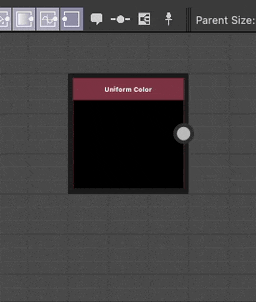

# Kommentar

<table>
<tr style="border: 0;">
<td width="25.00%" style="border: 0;" valign="top">

</td>
<td width="100.00%" style="border: 0;" valign="top">

Ein Kommentar ist einfach ein frei schwebender Text, der an einer beliebigen Stelle in einem Graf platziert werden kann.

Sie dient dazu, Teile eines Grafen zu kommentieren und zu erklären. Die <b>Description</b>-Eigenschaft enthält den angezeigten Text.

</td>
</tr>
</table>

>[!NOTE]
>
> Kommentare werden automatisch umbrochen, um die Standfläche im Graf zu minimieren.

## Kommentare erstellen

Der Standardkommentartyp wird unabhängig von den Knoten im Graf platziert.

Es kann auf folgende Weise erstellt werden:

+++Knotenmenü
Drücken Sie die <b>Leertaste</b> in der Graphansicht, um das <b>Knotenmenü</b> zu öffnen, und wählen Sie das Element &quot;Kommentar&quot; in der Liste aus.

Geben Sie &quot;comment&quot; in das Suchfeld ein, um das Element anzuzeigen und es schneller zu finden.

+++

+++Tastaturbefehl
Wenn ein Tastaturkommentar dem Element &quot;Tastaturbefehl&quot; in den [Voreinstellungen](../../../../interface/preferences-window/preferences-window.md) zugeordnet ist, drücken Sie diesen Tastaturbefehl, wenn die Graphansicht den Fokus hat.

+++

+++Kontextmenü
Drücken Sie in der Graphansicht <b>RMB</b> für ein beliebiges Objekt oder in einem leeren Bereich und wählen Sie die Option <b>Kommentar hinzufügen</b> aus.

+++

+++Graf-Symbolleiste
Klicken Sie in der Symbolleiste &quot;Graphansicht&quot; auf die Schaltfläche &quot;Kommentar&quot; in der <b>Node-Palette</b>.

+++

+++Bibliothek
Wählen Sie in der Bibliothek die Kategorie <b>Kommentarelemente</b> aus, ziehen Sie dann das Element &#39;Graf&#39; und legen Sie es in der Graphansicht ab.

+++

>[!TIP]
>
> Wenn ein Kommentar erstellt wird, erhält die Eigenschaft &quot;Beschreibung&quot; automatisch den Fokus, sodass Sie den Text des Kommentars sofort bearbeiten können.

## Übergeordnete Kommentare

<table>
<tr style="border: 0;">
<td width="100.00%" style="border: 0;" valign="top">

Ein übergeordneter Kommentar ist ein Kommentar, der *an einen bestimmten Graf* im Knoten angehängt ist. Wenn der Knoten verschoben wird, folgt der Kommentar, und wenn der Knoten gelöscht wird, wird der Kommentar ebenfalls gelöscht.

Kommentare, die erstellt werden, wenn derzeit ein *einzelner*-Knoten ausgewählt ist, oder über das Kontextmenü eines einzelnen Knotens, sind diesem Knoten übergeordnet.

</td>
<td width="33.33%" style="border: 0;" valign="top">

</td>
</tr>
</table>

## HTML-Formatierung

Der Text kann mit HTML-Tags formatiert werden. Diese Formatierung wird mithilfe der Schaltfläche  <b>HTML-Markup</b> in der Eigenschaft <b>Beschreibung</b> des Kommentars umgeschaltet.

>[!TIP]
>
> Weitere Informationen zu dieser Funktion finden Sie im Abschnitt <b>Beschreibung</b> der Dokumentation [Frames](../../../../interface/the-graph-view/graph-items/frame/frame.md).

