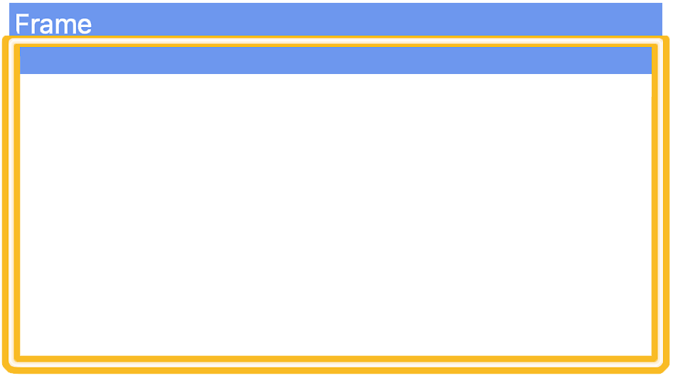
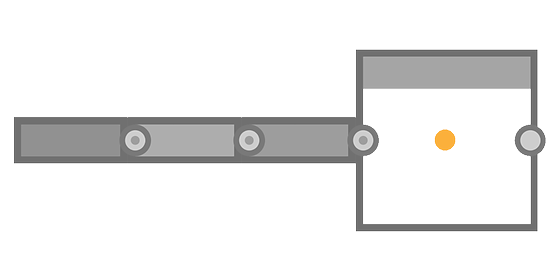

# Rahmen

<table>
<tr style="border: 0;">
<td width="25.00%" style="border: 0;" valign="top">


</td>
<td width="100.00%" style="border: 0;" valign="top">

Ein Rahmen erleichtert die Lesbarkeit und das Layout von Diagrammen, indem er Objekte in diesem Diagramm visuell gruppiert und es Ihnen ermöglicht, alle diese Objekte einfach zusammen zu verschieben.

So können z. B. Rahmen benannt und eingefärbt werden, sodass die Struktur des Graphen bei der Übersicht deutlich hervortritt. Dies ist eine große Hilfe, wenn die Komplexität eines Graphen zunimmt.

Sie können auch mit Anmerkungen versehen werden und dienen somit als Dokumentationswerkzeug, um zu erklären, warum einige Knoten auf eine bestimmte Weise eingerichtet wurden.

</td>
</tr>
</table>

## Erscheinungsbild

Abhängig von der Position des Mauszeigers oder davon, ob er Teil einer Auswahl ist, präsentiert sich ein Frame in verschiedenen visuellen Stilen, sodass Sie wissen, ob und wie Sie damit interagieren können.

+++Standard
Standardmäßig ist der Rahmen ein Rechteck mit abgerundeten Ecken, das mit der in der Eigenschaft <b>Rahmenfarbe</b> ausgewählten Farbe gefüllt ist. Eine dunklere Schattierung dieser Farbe wird auf die Rahmenkontur angewendet.

Der in der Eigenschaft <b>Titel</b> festgelegte Titel wird in der linken oberen Ecke des Rahmens grau dargestellt.

")


+++

+++Header Hover
Wenn Sie den Mauszeiger über den oberen Rand des Rahmens führen, wird eine Kopfzeile angezeigt.

Zum Verschieben des Rahmens wird die Kopfzeile oder der Titel gezogen.

")


+++

+++Ausgewählt
Nach der Auswahl werden Titel und Umriss des Rahmens weiß hervorgehoben. Die Kontur wird dicker.

")


+++

## Erstellen von Frames

Rahmen können in jedem Diagrammtyp auf eine der folgenden Arten hinzugefügt werden:

+++Knotenmenü
Drücken Sie die <b>Leertaste</b> in der Diagrammansicht, um das <b>Knotenmenü</b> zu öffnen, und wählen Sie das Element &quot;Frame&quot; in der Liste aus.

Geben Sie im Suchfeld &quot;frame&quot; ein, um das Element anzuzeigen und es schneller zu finden.

+++

+++Tastaturbefehl
Wenn dem Element &quot;Frame&quot; in [Voreinstellungen](../../../../interface/preferences-window/preferences-window.md) eine Tastenkombination zugeordnet ist, drücken Sie diese Tastenkombination, wenn die Diagrammansicht den Fokus hat.

+++

+++Kontextmenü
Drücken Sie in der Diagrammansicht <b>RMB</b> für ein beliebiges Objekt oder in einem leeren Raum und wählen Sie die Option <b>Frame</b> hinzufügen aus.

+++

+++Diagrammsymbolleiste
Klicken Sie in der Symbolleiste der Diagrammansicht auf die Schaltfläche &quot;Frame&quot; in der <b>Node-Palette</b>.

+++

+++Bibliothek
Wählen Sie in der Bibliothek die Kategorie <b>Diagrammelemente</b> aus, ziehen Sie dann das Element &quot;Frame&quot; per Drag &amp; Drop in die Diagrammansicht.

+++

### Auswahlrahmen

Wenn beim Erstellen eines Frames eine Auswahl in einem Diagramm aktiv ist, wird dieser Frame automatisch angepasst, damit die ausgewählten Objekte vollständig einbezogen werden.

Vor diesem Hintergrund ist es beim Erstellen von Rahmen mit einem Tastaturbefehl noch schneller, den Inhalt eines Diagramms zu rahmen.

{width="480px"}

>[!TIP]
>
> Wenn ein Frame erstellt wird, erhält seine Eigenschaft &quot;Titel&quot; automatisch den Fokus, sodass Sie den Titel des Frames sofort bearbeiten können.

## Bearbeiten von Frames

<table>
<tr style="border: 0;">
<td style="border: 0;" valign="top">

Frames können <b>verschoben</b> werden, indem der Titel oder die Kopfzeile gezogen wird, und <b>die Größe geändert</b>, indem die Ränder oder Ecken gezogen werden.

In der Abbildung werden die Interaktionsbereiche zum Schwenken (blau) und Skalieren (gelb) hervorgehoben.

</td>
<td style="border: 0;" valign="top">



</td>
</tr>
</table>

<table>
<tr style="border: 0;">
<td style="border: 0;" valign="top">

### Rasterausrichtung

Standardmäßig wird ein Rahmen beim Verschieben oder Ändern der Größe am mittleren Raster ausgerichtet.

Halten Sie die Taste <b>Strg</b> (Windows) bzw. <b>Cmd</b> (macOS) gedrückt, um diese Ausrichtung auf das kleine Raster zu verschieben, um feinere Anpassungen vorzunehmen.

</td>
<td style="border: 0;" valign="top">


</td>
</tr>
</table>

## Eigenschaften

Wenn ein Frame ausgewählt ist, sind die folgenden Eigenschaften im Dock [Eigenschaften](../../../../interface/properties/properties.md) verfügbar:

+++Titel
Der <b>Titel</b>, der oben links im Rahmen liegt. Die Sichtbarkeit des Titels kann mithilfe der <b>Title Visible</b>-Eigenschaft aktiviert oder deaktiviert werden.

Die Größe des Titels kann bei einer minimalen Bildschirmgröße gesperrt werden, sodass der Titel beim Auszoomen aus dem Diagramm lesbar bleibt. Sie können dies tun, indem Sie die Option &quot;Bildtitel&quot; im Dropdown-Menü <b>Informationen</b> in der Symbolleiste [Diagrammansicht](../../../../interface/the-graph-view/the-graph-view.md) aktivieren.

{width="640px"}


+++

+++Beschreibung
Die <b>Beschreibung</b> ist ein optionaler zusätzlicher Textausschnitt, der verwendet werden kann, um den Inhalt des Rahmens zu kommentieren.

Der Text kann mit HTML-Tags formatiert werden. Diese Formatierung wird durch Klicken auf die Schaltfläche  <b>HTML-Markup</b> umgeschaltet.

Weitere Informationen finden Sie im Abschnitt &quot;Beschreibung&quot; weiter unten.

{width="640px"}


+++

+++Color
Die <b>Rahmenfarbe</b> wird verwendet, um den Rahmen in der Diagrammansicht zu füllen. Wählen Sie mit dem Farbwähler eine beliebige Farbe aus.

Der Alphakanal der Farbe steuert die *Deckkraft* des Frames, wobei der Wert 0 bedeutet, dass der Frame vollständig transparent ist.

{width="640px"}


+++

## Beschreibung

Ein Rahmen kann mit einem Text versehen werden, der innerhalb des Rahmens platziert wird. Der Text wird links ausgerichtet und beginnt in der linken oberen Ecke des Rahmens. Verwenden Sie die [Description](#properties)-Eigenschaft des Rahmens, um diesen Text zu bearbeiten.

<table>
<tr style="border: 0;">
<td style="border: 0;" valign="top">

### Standard

Der <b>Titel</b> wird in einer fetten Schrift angezeigt, die sich oben links im Rahmen befindet. Die Sichtbarkeit des Titels kann ein- oder ausgeschaltet werden.

Seine Größe kann bei einer minimalen Bildschirmgröße gesperrt werden, sodass es lesbar bleibt, wenn es aus dem Diagramm heraus zoomt. Sie können dies tun, indem Sie die Option &quot;Bildtitel&quot; im Dropdown-Menü <b>Informationen</b> in der Symbolleiste [Diagrammansicht](../../../../interface/the-graph-view/the-graph-view.md) aktivieren.

</td>
<td style="border: 0;" valign="top">

"){zoomable="yes"}

</td>
</tr>
</table>

<table>
<tr style="border: 0;">
<td style="border: 0;" valign="top">

### HTML-Formatierung

Der Text kann mit HTML-Tags in der <b>Description</b>-Eigenschaft des Rahmens formatiert werden. Die Formatierung muss aktiviert werden, indem die Schaltfläche  <b>HTML-Markup</b> in derselben Eigenschaft verwendet wird.

</td>
<td style="border: 0;" valign="top">

"){zoomable="yes"}

</td>
</tr>
</table>

Sie können dieses Beispiel kopieren und in die Eigenschaft &quot;Beschreibung&quot; des Rahmens einfügen, um diese Funktion selbst zu testen:

```
<h2>HTML formatting</h2>

<p>This is a description formatted using <b>HTML markup</b>.</p>

<p>Formattig text makes it more <i>pleasant</i>, <font color="#CC8822">impactful</font> and <code>clearly structured</code> for users.</p>

<p>  Images are also supported! <sup>How nice!</sup></p>
```


Im Folgenden finden Sie eine Liste hilfreicher Tags zum Formatieren von Text:

+++HTML von Formatierungstags

|  |  |
| --- | --- |
| Fett | &lt;b>...&lt;/b> |
| Kursiv | &lt;i>...&lt;/i> |
| Color | &lt;font color=&quot;#4A567C&quot;>...&lt;/font> |
| Absatz | &lt;p>...&lt;/p> |
| Zeilenumbruch | &lt;br> |
| Überschriften | &lt;h1>...&lt;/h1>, &lt;h2>...&lt;/h2> usw. |
| Bild | &lt;img src=&quot;{path\_to\_image}&quot;> |
| Hochstellen | &lt;sub>...1&lt;/sub> |
| Ungeordnete Liste (Aufzählungszeichen) | &lt;ul> &lt;li>...&quot;&lt;/li> &quot;&lt;li>...&lt;/li> &lt;/ul> |
| Geordnete Liste (Zahlen) | &lt;ol> &lt;li>...&quot;&lt;/li> &quot;&lt;li>...&lt;/li> &lt;/ol> |
| Code | &lt;code>...&lt;/code> |


+++

## Integrationsregeln

Ein Objekt gilt als in einen Rahmen eingeschlossen, wenn es seine Einschlussregel erfüllt. Diese Regeln variieren je nach Objekt und Sonderfall. Sie sind unten aufgeführt.

Das gelbe Symbol in jeder Abbildung stellt den Punkt oder Bereich dar, der vollständig innerhalb der Grenzen eines Rahmens liegen muss, damit ein Objekt in diesen Rahmen aufgenommen werden kann.

+++Knoten
Der <b>Mittelpunkt</b> wird verwendet.

Abzeichen, Verbindungen und Informationen, die unter dem Knoten angezeigt werden, werden alle ignoriert.

Die Knoten können je nach Anzahl der Ein- oder Ausgangsanschlüsse unterschiedliche Height aufweisen.

Wenn Connectors angezeigt oder ausgeblendet, hinzugefügt oder entfernt werden, wird das Height des Knotens vom *Center* aus angepasst.

Daher sollte sich die Position des Mittelpunkts eines Knotens erst ändern, wenn er *absichtlich verschoben wurde*.


Der <b>c</b><b>Einstiegspunkt</b> des *Host*-Knotens wird verwendet.

Der Hostknoten ist der Knoten, an den ein Knoten angedockt ist.

Wenn mehrere Knoten in einer Kette angedockt sind, wird der Hostknoten des letzten angedockten Knotens für die gesamte Kette verwendet.

Abzeichen, Verbindungen und Informationen, die unter dem Knoten angezeigt werden, werden alle ignoriert.




+++

+++Punktknoten
Der <b>Mittelpunkt</b> des Punkts wird verwendet.

Connectors, Portalsymbole und Namen werden ignoriert.


+++

+++Kommentare
Der <b>Mittelpunkt</b> des *Begrenzungsrahmens* des Kommentars (gelbe Kontur) wird verwendet.

Übergeordnete Kommentare folgen nicht den Einschlussregeln für Kommentare.

Stattdessen wird der <b>Mittelpunkt</b> des *übergeordneten*-Knotens verwendet.

Abzeichen, Verbindungen und Informationen, die unter dem Knoten angezeigt werden, werden alle ignoriert.


+++

+++Pins
Der <b>Tipp</b> des Pin-Symbols wird verwendet.


+++

+++Rahmen
Der <b>Begrenzungsrahmen</b> des verschachtelten Rahmens wird verwendet.

Das bedeutet, dass ein verschachtelter Frame vollständig innerhalb der Grenzen eines anderen Frames liegen muss, um in diesen Frame aufgenommen zu werden.

Der Titel wird ignoriert.


+++

## Größe an Inhalt anpassen


Wenn du in deinem Diagramm Anpassungen vornimmst, wird ein Frame möglicherweise nicht mehr elegant an seinen Inhalt angepasst. In diesem Fall ist es möglich, die Position und die Größe des Rahmens automatisch so anzupassen, dass er sich an die Spanne seines Inhalts anpasst, mit einer Auffüllung von einer mittleren Gitterzelle.

Klicken Sie dazu auf <b>RMB</b> in der Titel- oder Kopfzeile des Rahmens - siehe [Darstellung](#appearance) - und wählen Sie im Kontextmenü die Option <b>Größe an Inhalt anpassen</b>.

>[!NOTE]
>
> Die Option ist verfügbar, wenn mindestens *ein*-Diagrammobjekt die [Einschlussregeln](../../../../interface/the-graph-view/graph-items/frame/frame.md) des Rahmens erfüllt.

<table>
<tr style="border: 0;">
<td style="border: 0;" valign="top">

### Einpassen des Beschreibungstextes

Wenn der Rahmen eine Beschreibung enthält, wird seine Position so angepasst, dass nach Möglichkeit ein leerer Bereich neben der Beschreibung verwendet wird.

Wenn kein enthaltenes Objekt in diesen Bereich passt, wird das Height des Rahmens weiter angepasst, um der Beschreibung Rechnung zu tragen.

</td>
<td style="border: 0;" valign="top">

")

</td>
</tr>
</table>

+++Beispiel
"){width="640px"}


+++

## Automatisch erweitern


Wenn das Diagramm wächst, muss der Inhalt der Rahmen möglicherweise neu angeordnet werden. Die Knoten können sich verschieben, um Platz für Ergänzungen zu schaffen, oder die Inhalte müssen möglicherweise weiter voneinander entfernt werden, um die Lesbarkeit zu verbessern.

Um diese Anpassungen zu erleichtern, ist es möglich, einen Frame automatisch zu erweitern, wenn [eingeschlossene Objekte](#inclusion-rules) verschoben werden: Halten Sie <b>Umschalt</b> an einem beliebigen Punkt gedrückt, während Sie ein Objekt verschieben, damit die Frameränder automatisch angepasst werden, damit das Objekt innerhalb seiner Grenzen bleibt.

Dies gilt auch für Auswahlen, die mehrere Objekte enthalten können. In diesem Fall wird der Host-Frame jedes Objekts gleichzeitig angepasst.

Wenn ein Objekt nicht vollständig von den Begrenzungen des Rahmens eingeschlossen ist, aber trotzdem seine [Einschlussregel](#inclusion-rules) erfüllt, wird der Rahmen angepasst, um ihn vollständig mit einer zusätzlichen Auffüllung von einer mittleren Rasterzelle einzuschließen, sobald die <b>Umschalttaste</b> gedrückt wird.

>[!NOTE]
>
> Während die Taste <b>Umschalt</b> während des Verschiebens an einem beliebigen Punkt gedrückt oder losgelassen werden kann, um die automatische Anpassung des Frames auszulösen oder abzubrechen, muss sie *gedrückt werden*, wenn der Verschieben abgeschlossen ist, um die Korrektur effektiv anzuwenden.

+++Beispiel
"){width="640px"}


+++
