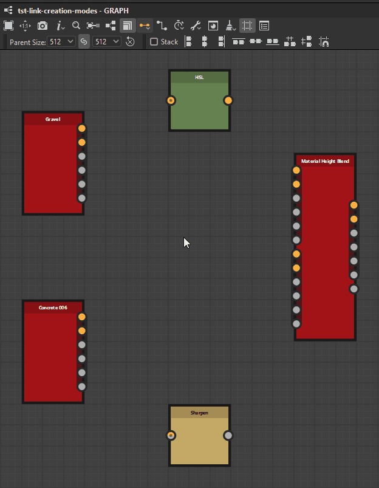

# Verknüpfungserstellungsmodi

In [Substance-Grafen](../../../compositing-graphs/substance-compositing-graphs.md) können Sie Knoten mit einem von 3 <b>Verbindungserstellungsmodi</b> verbinden:

<table>
<tr style="border: 0;">
<td style="border: 0;" valign="top">

{zoomable="yes"}

*Zum Vergrößern klicken*

<b> Standard</b> (1)

Es werden keine Bedingungen erzwungen.

</td>
<td style="border: 0;" valign="top">

{zoomable="yes"}

*Zum Vergrößern klicken*

 <b>Material</b> (2)

Ein- und Ausgänge werden je nach Nutzung abgeglichen.

Wenn nur eine der beiden eine Verwendung hat, wird die Verbindung wie im Standardmodus durchgeführt.

</td>
<td style="border: 0;" valign="top">

{zoomable="yes"}

*Zum Vergrößern klicken*

 <b>Kompaktes Material</b> (3)

Wie Material.

Eingänge und Ausgänge, die zu derselben *Gruppe* gehören, werden ausgeblendet.

</td>
</tr>
</table>

Sie können jederzeit in der Symbolleiste des Grafen zwischen den Modi wechseln, indem Sie auf die Schaltfläche  <b>Link-Erstellungsmodus</b> oder mit den oben aufgeführten Tastaturbefehlen klicken.

In den Modi <b>Material</b> und <b>Kompaktes Material</b> sind Verbindungen zwischen Eingängen und Ausgängen mit *nicht übereinstimmenden Verwendungen* nicht zulässig.

## Die Modi

|  | 

 Standard | 

 Kompakt | 

 Kompaktes Material |
| --- | --- | --- | --- |
| <b>Eingaben</b> | Alle Eingaben sind sichtbar | Alle Eingaben sind sichtbar | Nur 1 Eingabe pro Gruppe |
| <b>Ausgaben</b> | Alle Ausgaben sind sichtbar | Alle Ausgaben sind sichtbar | Nur 1 Ausgabe pro Gruppe |
| <b>Verknüpfungen</b> | Alle Verknüpfungen sind sichtbar | Alle Verknüpfungen sind sichtbar | Nur 1 Link pro Gruppe (grün) |
| <b>Verbindungen</b> | Verknüpfungen werden nacheinander verbunden. | Sie verbinden Verknüpfungen als Gruppe von Materialien mit mehreren Verknüpfungen auf der Grundlage entsprechender Verwendungen.   Wenn eine Verwendung an einem Ende vorhanden ist, ist die Verbindung eine Standardverbindung. | Sie verbinden Verknüpfungen als eine Gruppe von Materialien mit einem Link. |

## Zuweisen von Gruppen

<table>
<tr style="border: 0;">
<td width="100.00%" style="border: 0;" valign="top">

Sie sollten den Knoten <b>Eingabe</b> und <b>Ausgabe</b> des Grafen Gruppen zuweisen, um die Modi <b>Material</b> und <b>Kompaktes Material</b> zu verwenden.

Sie weisen eine Gruppe in den <b>Attributen</b>-Parametern des Knotens zu, indem Sie den Gruppennamen in die <b>Gruppe</b>-Eigenschaft eingeben. Eine Gruppe kann ein beliebiger Zeichenfolgenwert sein, und Verknüpfungen werden gruppiert, wenn sie *exakt denselben* aufweisen, wobei die Groß- und Kleinschreibung beachtet werden muss.

Gruppierte Ein- und Ausgänge eines Grafen werden visuell als *gekennzeichnet, die in einer dunklen Kapsel* in Knoteninstanzen eingeschlossen sind, die auf diesen Graf verweisen.

</td>
<td width="25.00%" style="border: 0;" valign="top">

{zoomable="yes"}

</td>
</tr>
</table>

<table>
<tr style="border: 0;">
<td width="25.00%" style="border: 0;" valign="top">

</td>
<td width="100.00%" style="border: 0;" valign="top">

{zoomable="yes"}

*Zum Vergrößern klicken*

</td>
<td width="25.00%" style="border: 0;" valign="top">

</td>
</tr>
</table>

## Verknüpfungsabgleich mit Verwendung

Sobald die Links gruppiert sind, müssen die einzelnen Eingaben mit den Ausgaben abgeglichen werden. Dies erfolgt über das <b>Usage</b>-Attribut von <b>Input</b>- und <b>Output</b>-Knoten. Wenn die Verwendung zwischen Eingabe- und Ausgabe *mit* übereinstimmt, wird ein Link erstellt. Wenn keine entsprechende Verwendung gefunden wird, wird keine Verknüpfung hergestellt.

<table>
<tr style="border: 0;">
<td width="25.00%" style="border: 0;" valign="top">

</td>
<td width="100.00%" style="border: 0;" valign="top">

{zoomable="yes"}

*Zum Vergrößern klicken*

</td>
<td width="25.00%" style="border: 0;" valign="top">

</td>
</tr>
</table>
