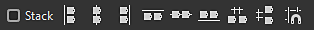

# Werkzeuge zur Knotenausrichtung

{zoomable="yes"}

Mit den Knotenausrichtungs-Tools können Sie Knoten in Diagrammen anordnen, um deren Lesbarkeit und Authoring-Erfahrung zu verbessern. Sie bieten Aktionen zum Ausrichten von Knoten, zum gleichmäßigen Verteilen und zum Ausrichten am Raster.

Sie wirken auf die <b> Knoten, die derzeit nur </b> ausgewählt sind.

>[!NOTE]
>
> Tastaturbefehle
> 
> Einige Aktionen verfügen über Tastaturbefehle für den schnellen Zugriff: H, V und S. Sie werden in der folgenden Aktionsliste zwischen Klammern angezeigt.
> 
> Beachten Sie, dass diese alle [-Tastaturbefehle überschreiben, die Knoten ](../../../interface/preferences-window/preferences-window.md) zugewiesen sind.

## Ausrichtung

Die Knoten können horizontal und vertikal ausgerichtet werden, wobei für jede Achse drei Modi zur Verfügung stehen:

### Horizontale Ausrichtung

<b> Links:</b> Richten Sie die linke Seite der ausgewählten Knoten an der linken Seite des am weitesten links liegenden Knotens aus.

<b> Mitte (H):</b> Richten Sie die horizontale Mitte der ausgewählten Knoten an der horizontalen Mitte des sie umschließenden Begrenzungsrahmens aus.

<b> Rechts:</b> Richten Sie die rechte Seite der ausgewählten Knoten an der rechten Seite des ganz rechts befindlichen Knotens aus.

<table>
<tr style="border: 0;">
<td style="border: 0;" valign="top">

{zoomable="yes"}

*Links*

</td>
<td style="border: 0;" valign="top">

{zoomable="yes"}

*Center*

</td>
<td style="border: 0;" valign="top">

{zoomable="yes"}

*Rechts*

</td>
</tr>
</table>

### Vertikale Ausrichtung

<b> Oben:</b> Richten Sie die obere Seite der ausgewählten Knoten an der oberen Seite des obersten Knotens aus.

<b> Mitte (V):</b> Richten Sie die vertikale Mitte der ausgewählten Knoten an der vertikalen Mitte des sie umschließenden Begrenzungsrahmens aus.

<b> Unten:</b> Richten Sie die untere Seite der ausgewählten Knoten an der unteren Seite des untersten Knotens aus.

<table>
<tr style="border: 0;">
<td style="border: 0;" valign="top">

{zoomable="yes"}

*Oben*

</td>
<td style="border: 0;" valign="top">

{zoomable="yes"}

*Mitte*

</td>
<td style="border: 0;" valign="top">

{zoomable="yes"}

*Unten*

</td>
</tr>
</table>

### Stapeln

Mit der <b>Option </b>Stapel  können Sie <b>Überlappungen </b> bei der Verwendung von Ausrichtungen vermeiden. Diese Option ist standardmäßig aktiviert.

Wenn diese Option aktiviert ist, werden Knoten so weit wie möglich an die Referenzposition verschoben, bis sie mit einem anderen Knoten in der Auswahl kollidieren würden. Dadurch werden sie effektiv in der ausgewählten Achse mit einem Rand von einer mittleren Gitterzelle zwischen jedem Knoten gestapelt.

{zoomable="yes"}

## Distributionen

Knoten können gleichmäßig zwischen den Knoten an jedem Ende der aktuellen Auswahl auf der gewünschten Achse verteilt werden.

<b> Horizontal:</b> Knoten werden gleichmäßig zwischen dem am weitesten links und dem am weitesten rechts befindlichen Knoten in der Auswahl verteilt.

<b> Vertikal:</b> Knoten werden gleichmäßig zwischen dem obersten und dem untersten Knoten in der Auswahl verteilt.

Die Distributionen zielen auf <b>gleichmäßige Abstände</b> zwischen den Knoten ab, unabhängig von ihrer Größe.

Wenn die Mittelpunkte mehrerer Knoten perfekt auf der ausgewählten Achse ausgerichtet sind, bleiben sie erhalten und werden <b>als eins</b> in der Verteilung behandelt. Der *größte* der ausgerichteten Knoten wird für die Berechnung des geraden Abstands verwendet.

Wenn die Gesamtgröße der ausgewählten Knoten größer ist als der auf der ausgewählten Achse verfügbare Platz, kann es zu Überschneidungen kommen.

<table>
<tr style="border: 0;">
<td width="58.33%" style="border: 0;" valign="top">

{zoomable="yes"}

*Horizontal*

</td>
<td width="100.00%" style="border: 0;" valign="top">

{zoomable="yes"}

*Vertikal*

</td>
</tr>
</table>

<table>
<tr style="border: 0;">
<td width="58.33%" style="border: 0;" valign="top">

## Rasterausrichtung

Mit der Aktion <b>Ausrichten (S) </b> wird jeder ausgewählte Knoten so verschoben, dass seine obere linke Ecke auf dem nächstgelegenen Punkt auf dem mittleren Raster liegt.

</td>
<td width="100.00%" style="border: 0;" valign="top">

{zoomable="yes"}

</td>
</tr>
</table>
