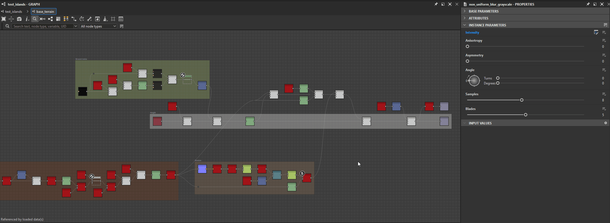

# Knotensucher

{zoomable="yes"}

Mit dem Node Finder-Tool können Sie eine <b>Suche nach Knoten und Variablen</b> mithilfe einer Textabfrage durchführen. Alle Knoten, die nicht mit der Abfrage übereinstimmen, sind abgeblendet, damit die Ergebnisse hervorstechen.

Die Abfrage kann mit einem dieser Kriterien übereinstimmen:

* Ein <b>Bezeichner eines Diagramms </b>, auf das von einem Instanzknoten verwiesen wird
* Ein <b>-Bezeichner eines verfügbar gemachten Parameters oder einer Variablen </b>, die in einer Knotenparameterfunktion verwendet wird.
* <b>UID</b> eines Knotens (eindeutiger Bezeichner)
* Die <b>Bezeichnung</b> eines Knotens

Die Suche kann [Grapheninstanzen](../../../compositing-graphs/creating-compositing-gra/graph-instances-sub-gra/graph-instances-sub-graphs.md) rekursiv durchlaufen, sodass Knoten und Variablen in [Untergraph](../../../compositing-graphs/creating-compositing-gra/graph-instances-sub-gra/graph-instances-sub-graphs.md) gefunden werden können. Wenn Sie sich nicht sicher sind, welchen Begriff Sie genau suchen müssen, ist eine Fuzzy-Suchoption verfügbar, mit der Sie eine Toleranz auf die Abfrage anwenden können.

## Benutzeroberfläche

Der Knotenfinder kann auf zwei Arten aufgerufen werden:

Drücken Sie in der Diagrammansicht die Tasten <b>Strg+F</b> (Windows) bzw. <b>Cmd+F</b> (macOS), um die Symbolleiste des Knotenfinders anzuzeigen und den Fokus automatisch auf das Abfragefeld festzulegen. So können Sie eine schnelle Suche durchführen.

Klicken Sie in der Diagrammansichtssymbolleiste auf die Schaltfläche &quot;<b>Knotensuche&quot; </b>, um die Knotensuche-Symbolleiste anzuzeigen. Nach der Anzeige wird die Symbolleiste nur durch Klicken auf diese Schaltfläche geschlossen.

<b>Durchsucht die Graphen</b>. Mit anderen Worten, eine Suche bleibt aktiv, wenn Diagramme durch diese Aktionen geöffnet werden:

* Instanzknoten: Verweis im Kontext öffnen (Strg+E / Cmd+E) (*Hinweis:* Die Diagrammbearbeitung im Kontext muss unter Bearbeiten > Voreinstellungen > Diagramm aktiviert werden)
* Pixelprozessor: Bearbeitungsfunktion (Strg+E / Befehl+E)
* Value-Prozessor: Bearbeitungsfunktion (Strg+E / Befehl+E)
* FX-Map: FX-Map-Diagramm bearbeiten (Strg+E/Befehl+E)
* Knotenparameter: Funktion bearbeiten

{zoomable="yes"}

### Suchanfrage

{zoomable="yes"}

Die Suchbegriffe können in dieses Feld eingegeben werden und die Pfeilschaltfläche öffnet eine Liste von Abfragevorschlägen, die einige der im aktuellen Kontext verfügbaren Variablen enthalten.

Weitere Informationen zu den Abfragen, die Sie ausführen können, finden Sie unten im Abschnitt [Suchanfrage](#search-query).

### Knotenart

{zoomable="yes"}

Mit diesem Kombinationsfeld können Sie Suchergebnisse filtern, um nur einen bestimmten Knotentyp beizubehalten.

Beachten Sie, dass alle Instanzknoten den Typ *des Knotens* aufweisen - tatsächlich den Typ &#39;instance&#39; -, während elementare Knoten jeweils einen eigenen Typ aufweisen.

+++Knotentyplisten
Die Liste ist kontextabhängig vom aktuellen Graf-Typ.

"){zoomable="yes"}

*Knotentypen für Compositing-Graf*

"){zoomable="yes"}

*Knotentypen für Funktions-Graf*

+++

+++Suchen nach elementaren Knoten
"){zoomable="yes"}

*Suchen nach dem Knotentyp &quot;Levels&quot; in einem Substance-Graf*

+++

+++Suchen nach Instanzknoten
"){zoomable="yes"}

*Es wird nach dem Knotentyp &quot;Instanz&quot; in einem Substance-Graf gesucht*

"){zoomable="yes"}

*Es wird nach dem Knotentyp &quot;Instanz&quot; in einem Substance-Funktions-Graf gesucht*

+++

### Suchoptionen

<table>
<tr style="border: 0;">
<td width="100.00%" style="border: 0;" valign="top">

Die Schaltfläche &quot;<b>Suchoptionen&quot; &quot;</b>&quot; öffnet eine Liste von Einstellungen für die Suche, die aktiviert und deaktiviert werden können.

Weitere Informationen zu diesen Optionen finden Sie unten im Abschnitt &quot;Suchoptionen&quot;.

</td>
<td width="33.33%" style="border: 0;" valign="top">

{zoomable="yes"}

</td>
</tr>
</table>

## Suchanfrage

Um Knoten zu finden, wird eine Textabfrage mit den unten aufgeführten Knoteneigenschaften abgeglichen.

>[!NOTE]
>
> Die Eingabe der Abfrage sollte unter Berücksichtigung der folgenden Einschränkungen erfolgen:
> 
> * Bei der Suche wird nicht zwischen Groß- und Kleinschreibung unterschieden. Beispiel: &quot;my node label&quot; und &quot;My Node Label&quot; geben die gleichen Ergebnisse zurück.
> * Leerräume vor und nach der Abfrage werden ignoriert.
> * Es können nicht mehrere Abfragen gleichzeitig im selben Diagramm ausgeführt werden. Beispielsweise entspricht &quot;Ebenen weichzeichnen&quot; nicht den Knoten &quot;Ebenen&quot; und &quot;Weichzeichnen&quot;. Ebenso werden logische Operatoren nicht unterstützt.

<table>
<tr style="border: 0;">
<td width="100.00%" style="border: 0;" valign="top">

### Instanzdiagramm-Bezeichner

[Instanzknoten](../../../compositing-graphs/creating-compositing-gra/graph-instances-sub-gra/graph-instances-sub-graphs.md) können mit dem <b>Bezeichner</b> der Diagramme gefunden werden, auf die sie verweisen.

</td>
<td width="33.33%" style="border: 0;" valign="top">

{zoomable="yes"}

*Zum Vergrößern auf Bild klicken*

</td>
</tr>
</table>

+++Bezeichner im Explorer
Diagramme werden nach ihrer Kennung im Explorer aufgelistet.

{zoomable="yes"}

+++

+++Kennung in der QuickInfo des Instanzknotens
Die QuickInfo von Instanzknoten enthält die Kennung ihres referenzierten Diagramms.

{zoomable="yes"}

+++

<table>
<tr style="border: 0;">
<td width="100.00%" style="border: 0;" valign="top">

### Verfügbare Parameter und Variablen

Der Bezeichner von [verfügbar gemachten Parametern &#x200B;](../../../compositing-graphs/manage-parameters/exposing-a-parameter/exposing-a-parameter.md) oder eine andere Variable kann direkt durchsucht werden.

</td>
<td width="33.33%" style="border: 0;" valign="top">

{zoomable="yes"}

*Zum Vergrößern auf Bild klicken*

</td>
</tr>
</table>

+++Abfragevorschläge
Das Abfragefeld kann erweitert werden, um eine Liste mit Vorschlägen anzuzeigen.

Dazu gehören [integrierte Variablen](../../../function-graphs/variables/system-variables/system-variables.md), die für den aktuellen Diagrammtyp verfügbar sind, sowie die Bezeichner der exponierten Parameter des Diagramms.

{zoomable="yes"}

Der Bezeichner der angezeigten Parameter kann auch direkt in die [Substance-Diagrammeigenschaften](../../../compositing-graphs/graph-parameters/graph-parameters.md) kopiert oder bearbeitet werden.

{zoomable="yes"}

*Zum Vergrößern auf Bild klicken*

+++

+++Suchen einer Variablen aus einer Konsolenwarnung/einem Konsolenfehler
Wenn ein Diagramm Fehler oder Warnungen enthält, die von einer <b>Variablen</b> ausgelöst wurden, die von einem Knoten verwendet wird, navigieren Sie zu <b>Windows > Console</b>, um die vollständige Fehler-/Warnmeldung anzuzeigen, die die Variable enthält. Anschließend können Sie diese Variable kopieren und in das Abfragefeld &quot;Knotensuche&quot; einfügen, um den Knoten zu finden, der das Problem verursacht.

Variablen können auch mit einem beliebigen Texteditor direkt aus den XML-Daten in der SBS-Datei kopiert werden.

{zoomable="yes"}

+++

+++Knoten abrufen/festlegen
Beim Durchsuchen einer Variablen in einem Diagramm - einschließlich der angezeigten Parameter - werden alle Knoten hervorgehoben, bei denen ein [Get](../../../function-graphs/nodes-reference-for-fun/atomic-function-nodes/get-nodes/get-nodes.md)- oder [Set](../../../function-graphs/fxmaps/using-functions-in-fxmaps/using-the-set-sequence/using-the-set-sequence-nodes.md)-Knoten diese Variable in einer der Parameterfunktionen des Knotens verwendet.

{zoomable="yes"}

+++

<table>
<tr style="border: 0;">
<td width="100.00%" style="border: 0;" valign="top">

### Knoten-UID

Jeder Knoten in einem Diagramm hat eine eindeutige Identifizierungsnummer (UID), mit der nach diesem Knoten gesucht werden kann.

</td>
<td width="33.33%" style="border: 0;" valign="top">

{zoomable="yes"}

*Zum Vergrößern auf Bild klicken*

</td>
</tr>
</table>

+++UID eines Knotens kopieren
Die UID eines Knotens kann über das Kontextmenü in die Zwischenablage kopiert werden.

Die Aktion kopiert die UID in diesem Format:

uid=1234567890

{zoomable="yes"}

+++

+++Durchsuchen einer Knoten-UID aus einer Konsolenwarnung/einem Konsolenfehler
Wenn ein Diagramm Fehler oder Warnungen enthält, die von einem Knoten ausgelöst wurden, rufen Sie Windows > Konsole auf, um die vollständige Fehler-/Warnmeldung anzuzeigen, die die <b>UID</b> des Knotens enthält. Anschließend können Sie diese UID kopieren und in das Abfragefeld &quot;Knotensuche&quot; einfügen, um den Knoten zu finden, der das Problem verursacht.

Knoten-UIDs können auch mit einem beliebigen Texteditor direkt aus den XML-Daten in der SBS-Datei kopiert werden.

{zoomable="yes"}

+++

### Knotenbezeichnung

Knoten können auch mit ihren Beschriftungen gefunden werden.

Die Suche nach bestimmten Knoten ist besonders effektiv, wenn die exakte Bezeichnung mit deaktivierter Fuzzy-Suche verwendet wird.

## Suchoptionen

<table>
<tr style="border: 0;">
<td width="100.00%" style="border: 0;" valign="top">

Mit der <b>Schaltfläche für Suchoptionen </b> können Sie die <b>rekursiven</b>- und <b>Fuzzy</b>-Modi für die Suche nach Knoten umschalten.

Beide können gleichzeitig aktiviert werden.

</td>
<td width="33.33%" style="border: 0;" valign="top">

{zoomable="yes"}

</td>
</tr>
</table>

### Rekursiver Modus

Aktivieren Sie diese Option, damit Suchvorgänge [Grapheninstanzen](../../../compositing-graphs/creating-compositing-gra/graph-instances-sub-gra/graph-instances-sub-graphs.md) durchlaufen, um Ergebnisse von [Untergraphen](../../../compositing-graphs/creating-compositing-gra/graph-instances-sub-gra/graph-instances-sub-graphs.md) einzuschließen.

Diese Option kann bei der Fehlerbehebung in Diagrammen wesentlich sein, wenn Sie einen Knoten anhand seiner UID suchen müssen, die durch eine Warnung oder Fehlermeldung in der Konsole erworben wurde.

{zoomable="yes"}

*In der Abfrage auf der rechten Seite wird der unten stehende Instanzknoten hervorgehoben, da sein referenziertes Diagramm auf der linken Seite Übereinstimmungen mit dieser Abfrage aufweist*

+++Beispiel 1
{zoomable="yes"}

Ein Instanzknoten verweist auf ein Diagramm, in dem mehrere Knoten mit der Abfrage übereinstimmen.

+++

+++Beispiel 2
{zoomable="yes"}

Wenn Sie die Option &quot;Rekursive Suche&quot; aktivieren, wird der Instanzknoten hervorgehoben, der auf ein Diagramm verweist, in dem ein Pixelprozessorknoten eine Variable verwendet, die der Abfrage entspricht.

+++

### Unscharfer Modus

Wenn Sie sich bei der genauen Schreibweise einer Abfrage nicht sicher sind, aktiviert diese Option eine <b>Toleranz</b> in den Ergebnissen.

Beachten Sie, dass die Verwendung dieser Option wahrscheinlich zu unerwünschten Übereinstimmungen führt.

{zoomable="yes"}
