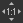

# Graphansicht

Auf dieser Seite wird das Diagrammansichtsdock von Substance 3D Designer angezeigt.

Die Graphansicht ist das Hauptfenster von [Substance 3D Designer](https://www.adobe.com/products/substance3d-designer.html), in dem Sie Ihre Grafen erstellen und bearbeiten. Die Graphansicht umfasst zwei Hauptbereiche: eine Symbolleiste am oberen Rand, die einen schnellen Zugriff auf bestimmte Funktionen sowie auf den Knotenbereich ermöglicht, in dem Graf platziert sind.

Die Graphansicht wird für alle Graf-Typen verwendet, unterscheidet sich jedoch leicht zwischen [Substance-Grafen](../../compositing-graphs/substance-compositing-graphs.md), [Funktions-Grafen](../../function-graphs/function-graphs.md) und [FX-Map-Grafen](../../function-graphs/fxmaps/fxmaps.md), hauptsächlich im Symbolleistenbereich.

## Navigation im Viewport

Die Navigation zum Graf kann mithilfe der folgenden Aktionen erfolgen:

* <b>Schwenken:</b> MB/Strg+RMB
* <b>Zoom:</b> MouseWheel/Alt + RMB

Verwenden eines Trackpads (nur macOS)

* <b>Schwenken: </b>Wischen mit zwei Fingern
* <b>Zoom:</b> Zwei Finger zusammenziehen/Zwei Finger wischen, während Cmd gedrückt wird

>[!NOTE]
>
> Zoomrichtung
> 
> Jede der Zoommethoden ist invers:
> 
> * Das Mausrad nach oben *zieht* die Diagrammansicht näher
> * Alt+RMB und nach oben ziehen *schiebt* die Graphansicht weg
> 
> Die Zoomrichtung kann in den [Voreinstellungen](../../interface/preferences-window/preferences-window.md) umgekehrt werden.

Mit der Taste &quot;F&quot; <b>konzentrieren Sie sich </b> auf den/die ausgewählten Knoten oder den gesamten Graf, falls nichts ausgewählt ist.

Die Navigation kann auch mithilfe der <b>Navigations-Nadeln </b> und der Taste F2 erfolgen (siehe [Graf-Elemente](#graph-items) unten[.](../../interface/the-graph-view/graph-items/graph-items.md)).

## Verschieben von Objekten

Klicken Sie auf LMB für ein Objekt (d. h. einen Graf oder ein Knotenelement), halten Sie den Mauszeiger gedrückt und ziehen Sie ihn, um <b>einen Knoten</b> um den Graf zu verschieben. Wenn mehrere Objekte ausgewählt sind, werden alle ausgewählten Objekte zusammen mit dem Objekt unter dem Cursor verschoben.

Wenn der Cursor <b> beim Verschieben von Objekten einen Rand </b> der Graphansicht erreicht, wird die Ansicht in Cursorrichtung verschoben. Beachten Sie, dass das Schwenken schneller ist, wenn sich der Cursor weiter vom Rahmen entfernt.\
Dies gilt auch für das Zeichnen von Auswahlfeldern über Graphansichten hinweg.

Standardmäßig werden Objekte <b> beim Verschieben an den Raster </b> einrasten. Halten Sie beim Verschieben von Objekten die Strg-Taste (Windows) bzw. die ⌘-Taste (macOS) gedrückt, um diese einrasten zu deaktivieren.

## Graphenelemente

Es stehen mehrere Knotenobjekte zur Verfügung, die das Organisieren und Navigieren des Grafen erleichtern, insbesondere wenn er sich zu einem komplexen Helfer-Netzwerk auswächst, das das Lesen erschweren kann:

Mit <b>Punktknoten</b> können Sie Verbindungen umleiten und zusammenführen. Sie können als <b>Portale</b> verwendet werden, um lange oder unhandliche Verbindungen auszublenden.

Mit <b>Rahmen</b> können Sie Knoten mit einem sichtbaren Titel und einer Farbcodierung gruppieren.

Mit <b>Kommentaren</b> können Sie den Zweck eines Knotens oder einer Knotengruppe verfolgen und andere hilfreiche Anmerkungen machen.

<b>Die Nadeln für die Navigation</b> ermöglichen den schnellen Sprung zu den Zielpunkten im Graf.

>[!NOTE]
>
> Weitere Informationen finden Sie im Abschnitt [Graf items](../../interface/the-graph-view/graph-items/graph-items.md) dieser Dokumentation.

## Kontextmenü für Graf

Wenn Sie auf RMB im leeren Bereich im Graf klicken, wird ein Kontextmenü angezeigt, das die folgenden Optionen enthalten kann:

<b>Knoten hinzufügen:</b> Öffnen Sie das Knotenmenü, um einen Knoten im Graf hinzuzufügen.

<b>Graf hinzufügen:</b> Fügen Sie ein nicht übergeordnetes [Comment](../../interface/the-graph-view/graph-items/graph-items.md)-Kommentarobjekt hinzu.

<b>Rahmen hinzufügen:</b> Ein [Rahmen](../../interface/the-graph-view/graph-items/graph-items.md)-Graf-Objekt hinzufügen;

<b>Nadel hinzufügen:</b> Fügen Sie ein [Nadel](../../interface/the-graph-view/graph-items/graph-items.md)-Graf-Objekt hinzu.

<b>Punktknoten hinzufügen:</b> Fügen Sie einen [Punktknoten](../../interface/the-graph-view/graph-items/graph-items.md) hinzu;

<b>Ausgaben in 3D-Ansicht anzeigen:</b> Weisen Sie einem Material in der [3D-Ansicht alle Ausgaben des Grafen zu](../../interface/3d-view/3d-view.md), indem Sie die Verwendungsarten abgleichen. Weitere Informationen finden Sie unter [Interaktion mit der 3D-Ansicht](#interacting-with-the-3d-view) weiter unten.

<b>Zurücksetzen und Anzeigen von Ausgaben in der 3D-Ansicht:</b> Setzen Sie ein Material in der [3D-Ansicht zurück](../../interface/3d-view/3d-view.md) und weisen Sie diesem Material alle Ausgaben des Grafen zu, indem Sie die Verwendungsarten abgleichen. Weitere Informationen finden Sie unter [Interagieren mit der 3D-Ansicht](#interacting-with-the-3d-view) weiter unten.

<b>Ausgabe in 2D-Ansicht anzeigen:</b> Zeigen Sie eine der Ausgaben des Grafen in der [2D-Ansicht an](../../interface/2d-view/2d-view.md), siehe [Interaktion mit der 2D-Ansicht ](#interacting-with-the-2d-view) weiter unten;

<b>Knoten-Miniaturansichten berechnen:</b> Lösen Sie die Berechnung des Ergebnisses aller Knoten im Graf aus, die im [Bildcache](../../interface/preferences-window/preferences-window.md) gespeichert werden, und verwenden Sie deren erste Ausgabe als Miniaturansicht.

<b>Miniaturknoten löschen:</b> Löschen Sie den [Bildcache](../../interface/preferences-window/preferences-window.md), der das Ergebnis aller Knoten im Graf enthält, wodurch wiederum die Miniaturansichten des Knotens gelöscht werden.

<b>Paket speichern:</b> Speichern Sie das Paket, das diesen Graf enthält.

<b>Einfügen:</b> Fügen Sie die aktuell in die Zwischenablage kopierten Knoten einschließlich ihrer Upstream-Verbindungen an der Cursorposition ein. Befindet sich der Cursor nicht im Viewport &quot;Graphansicht&quot;, werden die Knoten in der Mitte des Viewports platziert.

<b>Ohne Verknüpfung einfügen:</b> Fügen Sie die derzeit in die Zwischenablage kopierten Knoten an der Cursorposition ein, mit Ausnahme der Upstream-Verbindungen. Befindet sich der Cursor nicht im Viewport &quot;Graphansicht&quot;, werden die Knoten in der Mitte des Viewports platziert.

<b>Alle auswählen:</b> Alle Knoten im Graf auswählen;

<b>Vorherige Nadel:</b> Navigieren zum vorherigen [Nadel](../../interface/the-graph-view/graph-items/graph-items.md)-Objekt im Graf;

<b>Nächste Nadel:</b> Navigieren zum nächsten [Nadel](../../interface/the-graph-view/graph-items/graph-items.md)-Objekt im Graf;

<b>Auswahl kopieren:</b> Kopieren der ausgewählten Knoten, Verbindungen und Parameterwerte in die Zwischenablage;

<b>Auswahl löschen:</b> Löschen der ausgewählten Knoten;

<b>Löschen und erneutes Verknüpfen:</b> Löschen Sie die ausgewählten Knoten, und ersetzen Sie sie durch direkte Verbindungen von den Upstream-Knoten zu den Downstream-Knoten, wenn möglich.

<b>Auswahl duplizieren:</b> Duplizieren Sie die ausgewählten Knoten im selben Graf, einschließlich ihrer Upstream-Verbindungen, an der Cursorposition. Befindet sich der Cursor nicht im Viewport &quot;Graphansicht&quot;, werden die Knoten in der Mitte des Viewports platziert.

<b>Auswahl ohne Verknüpfung duplizieren:</b> Duplizieren Sie die ausgewählten Knoten im selben Graf, mit Ausnahme der Upstream-Verbindungen, an der Cursorposition. Befindet sich der Cursor nicht im Viewport &quot;Graphansicht&quot;, werden die Knoten in der Mitte des Viewports platziert.

<b>Upstream-Knoten auswählen:</b> Wählen Sie alle Knoten stromaufwärts der ausgewählten Knoten aus.

<b>Downstream-Knoten auswählen:</b> Wählen Sie alle Knoten unterhalb der ausgewählten Knoten aus.

<b>Verweise austauschen\*:</b> Vertauschen Sie die Verbindungen zwischen den ausgewählten Eingangs- und Ausgangsverbindungen.

<b>Knoten/Auswahl deaktivieren:</b> Deaktivieren Sie die ausgewählten Knoten, sodass sie keine Auswirkungen auf das Ergebnis des Streams haben. Siehe <b>Deaktivieren von Knoten</b> weiter unten.

<b>\*:</b> Nur verfügbar, wenn die Auswahl zwei Verknüpfungen enthält, oder drei Knoten, bei denen zwei der Knoten mit Eingängen desselben dritten Knotens verbunden sind.

## Arbeiten mit Knoten

Graf sind in erster Linie Gefäße für Knotenpunkte, die Daten aufnehmen, generieren und ändern und dann als Ergebnis des Grafen ausgeben können. Die Verwendung von Knoten umfasst die folgenden Konzepte und Aktionen.

### KNOTEN ERSTELLEN UND VERWALTEN

Graf können auf 5 verschiedene Arten in Graf platziert werden, unabhängig vom Knotentyp:

* Klicken oder Ziehen von einem Symbol in der Knotensymbolleiste (siehe unten). Nur [Atomknoten](../../compositing-graphs/nodes-reference-for-com/atomic-nodes/atomic-nodes.md) können auf diese Weise platziert werden.
* Klicken Sie mit der rechten Maustaste auf einen leeren Bereich des Diagramms und wählen Sie <b>Knoten hinzufügen</b>. Nur [Atomknoten](../../compositing-graphs/nodes-reference-for-com/atomic-nodes/atomic-nodes.md) können auf diese Weise platziert werden.
* Ziehen einer Miniatur aus der Bibliotheksansicht in die Diagrammansicht. Diese Methode funktioniert für [alle Knotentypen, einschließlich Knoteninstanzen](../../compositing-graphs/nodes-reference-for-com/node-library/node-library.md).
* Durch Drücken der <b>Leertaste</b>, um auf das <b>Knotenmenü</b> zuzugreifen. Siehe unten.
* Verwenden Sie den Tastaturbefehl, der einem Knoten zugeordnet ist. Die Zuordnung wird im Fenster &quot;[Voreinstellungen&quot; &quot;](../../interface/preferences-window/preferences-window.md)&quot; durchgeführt.

Wenn bei der Auswahl eines anderen Knotens ein Knoten platziert wird, versucht Designer, den neuen Knoten automatisch mit dem alten Knoten zu verbinden.\
Durch diese automatische Verbindung wird der neue Knoten &quot;*&quot; nach &quot;*&quot; immer in den Textfluss eingefügt.

Das Entfernen von Knoten kann auf zwei Arten erfolgen, je nachdem, wie ein verlorener Link behandelt werden soll:

* Wählen Sie einen Knoten aus, und drücken Sie die Entf-Taste, oder klicken Sie mit der rechten Maustaste und wählen Sie <b>Auswahl löschen</b>. Dadurch werden alle bestehenden Verbindungen unterbrochen, was zu Funktionsstörungen führen kann.
* Wählen Sie einen Knoten aus, und drücken Sie die Rücktaste, oder klicken Sie mit der rechten Maustaste und wählen Sie <b>Löschen und </b> erneut verknüpfen. Dies versucht, Verknüpfungen zu halten, wenn möglich, und verhindert fehlerhafte Funktionen.

<table>
<tr style="border: 0;">
<td width="100.00%" style="border: 0;" valign="top">

### Knotenmenü

Durch Drücken von <b>Leertaste</b> in der Diagrammansicht wird das Knotenmenü angezeigt.

Dieses Menü bietet über eine Suchoberfläche Zugriff auf alle Knoten in der [Bibliothek](../../interface/the-library/the-library.md) und lässt Ihre bevorzugten Knoten an oberster Stelle in der Liste erscheinen.

Sie können die Pfeiltasten verwenden, um die Suchergebnisse zu durchsuchen. Die Liste *Schleifen*, sodass die Verwendung der Pfeiltaste &quot;Nach oben&quot; für das erste Element zum letzten Element führt.

Die Suche ist *fuzzy*, was bedeutet, dass kleine Unterschiede im Suchbegriff verzeiht werden. Beispiel: &quot;Farbe&quot; vs. &quot;Farbe&quot;, &quot;Normalisieren&quot; vs. &quot;Normalisieren&quot; usw.

Wenn ein *einzelner*-Knoten im Diagramm ausgewählt ist oder das Knotenmenü durch Ziehen eines Knotenkonnektors gestartet wird, werden die Suchergebnisse basierend auf dem Ausgabetyp automatisch *gefiltert*.\
Für eine Ausgabe vom Typ &quot;Graustufen&quot; werden beispielsweise nur Knoten mit einer [primären Eingabe](../../compositing-graphs/inheritance-compositing/inheritance-in-substance-compositing-graphs.md) vom Typ &quot;Graustufen&quot; aufgelistet.

</td>
<td width="33.33%" style="border: 0;" valign="top">

</td>
</tr>
</table>

### AUSWÄHLEN VON KNOTEN

Sie können einen oder mehrere Knoten auswählen, um sie zu kopieren, zu löschen, sie im Graf zu verschieben usw.

Um einen *einzelnen*-Knoten auszuwählen, platzieren Sie den Cursor auf dem Knoten und klicken Sie auf &quot;LMB&quot;.

Zum Auswählen von *mehreren* Knoten stehen die folgenden Methoden zur Verfügung:

* <b>Eins für Eins:</b> Halten Sie Strg gedrückt und klicken Sie dann auf LMB auf Knoten. Nicht ausgewählte Knoten werden *der Auswahl hinzugefügt*, während ausgewählte Knoten *aus der Auswahl entfernt* werden.
* <b>Auswahlfeld:</b> Klicken Sie auf LMB auf einen leeren Bereich im Graf, *halten Sie den Mauszeiger gedrückt und ziehen Sie*, um ein Auswahlfeld zu zeichnen. Knoten *, die mindestens teilweise* im Feld enthalten sind, werden beim Freigeben von LMB ausgewählt.
* <b>Upstream:</b> Klicken Sie auf RMB auf einem Knoten, und wählen Sie die Option <b>Upstream-Knoten auswählen</b> aus: Der Knoten und alle Knoten, die Teil von Datenströmen sind, die mit den *Eingängen* des Knotens verbunden sind, werden ausgewählt.
* <b>Downstream:</b> Klicken Sie auf RMB auf einem Knoten, und wählen Sie die Option <b>Downstream-Knoten auswählen</b> aus: Der Knoten und alle Knoten, die Teil von Streams sind, die mit den *Ausgaben* des Knotens verbunden sind, werden ausgewählt.

### Kontextmenü des Knotens

Wenn Sie auf RMB auf einem Knoten klicken, wird ein Kontextmenü angezeigt, das die folgenden Optionen enthalten kann:

<b>Ausgabe in 2D-Ansicht anzeigen:</b> Zeigen Sie eine der Ausgaben des Knotens in der [2D-Ansicht an](../../interface/2d-view/2d-view.md), siehe [Interaktion mit der 2D-Ansicht ](#interacting-with-the-2d-view) weiter unten;

<b>In 3D-Ansicht anzeigen</b>: Weisen Sie alle Ausgaben des Knotens einem Material in der [3D-Ansicht](../../interface/3d-view/3d-view.md) zu, indem Sie die Verwendungsarten abgleichen. Weitere Informationen finden Sie unter [Interaktion mit der 3D-Ansicht](#interacting-with-the-3d-view) weiter unten.

<b>Zurücksetzen und Anzeigen in der 3D-Ansicht:</b> Setzen Sie ein Material in der [3D-Ansicht zurück](../../interface/3d-view/3d-view.md) und weisen Sie diesem Material alle Knotenausgaben zu, indem Sie die Verwendungsmöglichkeiten abgleichen. Weitere Informationen finden Sie unter [Interagieren mit der 3D-Ansicht](#interacting-with-the-3d-view) weiter unten.

<b>Ausgabe in 3D-Ansicht anzeigen\*:</b> Zuweisen einer bestimmten Knotenausgabe zu einem Material in der [3D-Ansicht](../../interface/3d-view/3d-view.md) durch Zuordnung von Verwendungen;

<b>Graf hinzufügen:</b> Erstellen Sie ein [Comment](../../interface/the-graph-view/graph-items/graph-items.md)-Knotenobjekt, und überordnen Sie es diesem Knoten;

<b>Rahmen hinzufügen:</b> Erstellen Sie ein [Rahmen](../../interface/the-graph-view/graph-items/graph-items.md)-Knotenobjekt, und passen Sie es an die ausgewählten Graf an.

<b>Informationen in die Zwischenablage kopieren:</b> Kopieren der eindeutigen Identifizierung (UID) des Knotens in die Zwischenablage;

<b>Parameter Gelegt:</b> Zeigt das Dialogfeld &quot;[Knotenparameter Gelegt](../../compositing-graphs/manage-parameters/exposing-a-parameter/exposing-a-parameter.md)&quot; für diesen Knoten an;

<b>Erstellen\*:</b> Erstellen von Eingabe- und/oder Ausgabeknoten für jede Eingabe und/oder Ausgabe dieses Knotens

<b>Verweis öffnen\*:</b> Laden Sie den Graf [, auf den dieser Knoten ](../../compositing-graphs/creating-compositing-gra/graph-instances-sub-gra/graph-instances-sub-graphs.md) verweist, als separate Registerkarte für die Graphansicht.

<b>Verweis im Kontext öffnen\*\*:</b> Laden Sie den Graf [, auf den dieser Knoten ](../../compositing-graphs/creating-compositing-gra/graph-instances-sub-gra/graph-instances-sub-graphs.md) im Kontext des aktuellen Grafen verweist, als Breadcrumb auf der Registerkarte &quot;Vorhandene Graphansicht&quot;.

<b>Graf aus Auswahl erstellen:</b> Kopieren Sie die ausgewählten Knoten in einen neuen Graf.

<b>Auswahl kopieren:</b> Kopieren der ausgewählten Knoten, Verbindungen und Parameterwerte in die Zwischenablage;

<b>Auswahl löschen:</b> Löschen der ausgewählten Knoten;

<b>Löschen und erneutes Verknüpfen:</b> Löschen Sie die ausgewählten Knoten, und ersetzen Sie sie durch direkte Verbindungen von den Upstream-Knoten zu den Downstream-Knoten, wenn möglich.

<b>Auswahl duplizieren:</b> Duplizieren Sie die ausgewählten Knoten im selben Graf, einschließlich der Upstream-Verbindungen.

<b>Auswahl ohne Verknüpfung duplizieren:</b> Duplizieren Sie die markierten Knoten im selben Graf mit Ausnahme der Upstream-Verbindungen.

<b>Upstream-Knoten auswählen:</b> Wählen Sie alle Knoten stromaufwärts der ausgewählten Knoten aus.

<b>Downstream-Knoten auswählen:</b> Wählen Sie alle Knoten unterhalb der ausgewählten Knoten aus.

<b>Verknüpfungen vertauschen\*\*\*:</b> Vertauschen Sie die Verbindungen zwischen den ausgewählten Eingangs- und Ausgangsverbindungen.

<b>Knoten/Auswahl deaktivieren:</b> Deaktivieren Sie den Knoten oder die ausgewählten Knoten, sodass sie keine Auswirkungen auf das Ergebnis des Streams haben. Siehe <b>Deaktivieren von Knoten</b> weiter unten.

<b>\*</b>: Nur für [Knoten der Grapheninstanz ](../../compositing-graphs/creating-compositing-gra/graph-instances-sub-gra/graph-instances-sub-graphs.md) verfügbar.\
<b>\*\*:</b> Nur verfügbar für [Knoten der Grapheninstanz ](../../compositing-graphs/creating-compositing-gra/graph-instances-sub-gra/graph-instances-sub-graphs.md) und wenn die Option <b>Kontextabhängiges Bearbeiten aktivieren</b> in den [Voreinstellungen](../../interface/preferences-window/preferences-window.md) aktiviert ist.\
<b>\*\*\*:</b> Nur verfügbar, wenn die Auswahl zwei Verknüpfungen enthält, oder drei Knoten, bei denen zwei der Knoten mit Eingängen desselben dritten Knotens verbunden sind.

>[!IMPORTANT]
>
> Wenn auf *RMB* geklickt wurde, wenn der Cursor *über einem Knoten* platziert wird, zielen mehrere dieser Kontextmenüoptionen auf den Knoten *that* ab, unabhängig davon, ob andere Knoten derzeit *ausgewählt* im Graf sind.
> 
> Für ein einheitlich vorhersagbares Ergebnis empfiehlt es sich daher, den Cursor immer über dem Knoten zu platzieren, der Teil der Auswahl ist, die Sie tatsächlich mit einer kontextbezogenen Menüaktion anvisieren möchten.

### Knoten verbinden

Die *-Ausgabeknoten* eines Knotens A können mit der *-Eingabeknoten-Verbindung* eines anderen Knotens B verbunden werden, was dazu führt, dass Verbindung B die von A ausgegebenen Daten zur Durchführung ihrer Berechnungen verwendet.

>[!NOTE]
>
> Alle Verbindungen eines Knotens müssen unbedingt mit *nicht* verbunden sein. Lässt man die Verbindungen offen, führt dies zu Folgendem:
> 
> * für eine *Eingabe*-Verbindung: der Knoten auf einen Standardwert zurückgreift, der für diese Eingabe festgelegt wurde;
> * für eine *Ausgabe*-Verbindung: Die Daten werden ignoriert und verworfen, wenn der Graf berechnet wird.

Sie können <b>einen neuen Link erstellen</b>, indem Sie auf LMB in jeder dieser Verbindungen in *beliebiger Reihenfolge* klicken.\
Wenn ein Knoten B erstellt wird, während ein Knoten A ausgewählt ist, wird außerdem der *erste Ausgang* von Knoten A automatisch mit dem *primären Eingang* von Knoten B verbunden.

Die folgenden Vorgänge können für *vorhandene* Links ausgeführt werden:

<b>Löschen:</b> Löschen Sie Verknüpfungen, indem Sie entweder auf LMB auf dem Link klicken und *Löschen*<b>, </b> drücken, oder indem Sie bei gedrückter Alt-Taste auf eine Verbindung klicken, die Verknüpfungen enthält. Wenn Sie bei gedrückter Alt-Taste klicken, werden alle Verknüpfungen auf dieser Verbindung gelöscht.

<b>Duplizieren:</b> Duplizieren Sie Links, indem Sie Strg gedrückt halten, auf LMB auf einer Verbindung klicken und den Cursor ziehen. Klicken Sie auf LMB auf einer anderen Verbindung, um den Link zu verbinden.

<b>Verschieben:</b> Verknüpfungen können abgerufen und von einer Verbindung zu einer anderen verschoben werden, indem Sie die Umschalttaste gedrückt halten, auf LMB auf einer Verbindung klicken und den Cursor ziehen. Klicken Sie auf LMB auf einer anderen Verbindung, um den Link zu verbinden.

### Deaktivieren von Knoten

>[!NOTE]
>
> Dies gilt nur für [Substance-Diagramme](../../compositing-graphs/substance-compositing-graphs.md).

Knoten können deaktiviert werden, sodass sie *keine Auswirkungen* im Graf haben, aber nicht getrennt oder gelöscht werden müssen.

Deaktivierte Knoten verhalten sich wie folgt:

* Sie werden mit dem Kennzeichen &quot; <b>Deaktiviert</b>&quot;*,* einem *gestrichelten Umriss* und einem internen Link mit *Umleitung* anstelle einer Miniaturansicht angezeigt.
* Die Knoten geben die empfangenen Daten in ihrer *Haupteingabe* aus.
* Deaktivierte Knoten können *verkettet* werden.
* Ihre Eigenschaften und Verbindungen sind *nicht geändert*;
* Der deaktivierte Status lautet *Gespeichert* und bleibt sitzungsübergreifend erhalten.
* Beim Veröffentlichen in SBSAR berücksichtigt die resultierende Datei ** den deaktivierten Status der Knoten - d. h., was Sie sehen, ist das, was Sie erhalten.

Sie können einen Knoten oder eine Gruppe ausgewählter Knoten deaktivieren, indem Sie den Tastaturbefehl <b>Umschalt+D</b> verwenden oder indem Sie mit der rechten Maustaste in den Graf klicken und im Kontextmenü die Option <b>Knoten deaktivieren/Auswahl deaktivieren</b> auswählen.

>[!IMPORTANT]
>
> Nur Knoten, die den folgenden Kriterien entsprechen, können deaktiviert werden:
> 
> * Der Knoten hat mindestens *eine Eingabe*.
> * Der Knoten hat nur *eine Ausgabe*.
> * Die *Typen* der Haupteingabe und der Ausgabe müssen *übereinstimmen* - d. h. Graustufen zu Graustufen, Farbe zu Farbe.
> * Alle ausgewählten Knoten müssen den Status &quot;*Gleich&quot; aufweisen* - d. h. alle müssen aktiviert sein, für ihre Aktivierung gilt die gleiche Regel.

{width="512px"}

## Interaktion mit der 2D-Ansicht

>[!NOTE]
>
> Dies gilt nur für [Substance-Diagramme](../../compositing-graphs/substance-compositing-graphs.md).

Um eine Knotenausgabe in der [2D-Ansicht](../../interface/2d-view/2d-view.md) anzuzeigen, doppelklicken Sie auf LMB auf einem Knoten, oder klicken Sie auf RMB auf dem Knoten, und wählen Sie im Kontextmenü die Option [Ausgabe in 2D-Ansicht](#interacting-with-the-2d-view) anzeigen aus. Wenn der Knoten mehr als eine Ausgabe hat, wählen Sie die gewünschte Ausgabe im Untermenü.

Sie können beliebige Diagrammausgaben in der 2D-Ansicht anzeigen, indem Sie auf RMB in einem leeren Bereich in der [Diagrammansicht](https://substance3d.adobe.com/) klicken und die Option [Ausgabe in 2D-Ansicht anzeigen](#interacting-with-the-2d-view) im Kontextmenü auswählen. Wenn der Graph mehr als eine Ausgabe hat, wählen Sie die gewünschte Ausgabe im Untermenü.

## Interaktiv mit der 3D-Ansicht arbeiten

>[!NOTE]
>
> Dies gilt nur für [Substance-Diagramme](../../compositing-graphs/substance-compositing-graphs.md).

Um eine Knotenausgabe in der [3D-Ansicht](../../interface/3d-view/3d-view.md) anzuwenden, klicken Sie auf RMB für einen Knoten und wählen Sie im Kontextmenü die Option <b>In 3D-Ansicht</b> anzeigen. Wenn der Knoten mehr als eine Ausgabe hat, wählen Sie die gewünschte Ausgabe im Untermenü. Wählen Sie dann einen Zielkanal des Shaders aus, der derzeit in der 3D-Ansicht verwendet wird.

(*[Nur Substance-Diagramm](../../compositing-graphs/substance-compositing-graphs.md)*) Sie können alle Diagrammausgaben in der 3D-Ansicht anwenden, indem Sie auf RMB in einem leeren Bereich in der Diagrammansicht klicken und im Kontextmenü die Option <b>Ausgaben in 3D-Ansicht anzeigen</b> auswählen. Stellen Sie sicher, dass mindestens ein [Output](../../compositing-graphs/nodes-reference-for-com/atomic-nodes/output/output.md)-Knoten im Diagramm vorhanden ist und [richtig eingerichtet ist](../../compositing-graphs/nodes-reference-for-com/atomic-nodes/output/output.md).

## Symbolleisten

>[!NOTE]
>
> Die vollständige Liste gilt nur für [Substance-Graphen](../../compositing-graphs/substance-compositing-graphs.md). Andere Diagrammtypen verfügen über einen *begrenzten Satz* dieser Optionen.

### Diagrammwerkzeuge

Die Hauptsymbolleiste befindet sich in jedem Diagrammtyp und bietet allgemeine Funktionen sowie Umschalter für die Sichtbarkeit der anderen Symbolleisten. Sie finden diese Funktionen:

 <b>Fokusauswahl</b> (F)\
Fokusansicht auf Auswahl oder gesamte Szene, wenn Auswahl leer ist.

 <b>Zoom zurücksetzen</b> (Z)\
Bringen Sie den aktuellen Zoomfaktor auf seinen Standardstatus zurück und zentrieren Sie die Ansicht in der Mitte des Diagramms. Das kann ein- oder auszoomen bedeuten.

 <b>Diagrammansicht exportieren\
</b>Exportiert das vollständige Diagramm mit einer Auflösung von 1:1 als Bild. Nützlich, um einen Screenshot Ihres gesamten Grafen zu teilen.

 <b>Knoteninformationen\
</b>*- Verbindung anzeigen:* Schaltet die Anzeige des Namens für jede einzelne Verbindung auf einem Knoten um.\
*- Knotenabzeichen anzeigen:* Schaltet die Knotenabzeichen auf allen Knoten um.\
*- Knotengröße anzeigen:* Schaltet die Knotenauflösung um ([Nur Substance-Diagramm](../../compositing-graphs/substance-compositing-graphs.md)).\
*- Anzeigedauer:* Schaltet die Anzeige von Millisekunden-Zeitangaben für jeden Knoten um ([nur Substance-Diagramm](../../compositing-graphs/substance-compositing-graphs.md)).\
*- Textskalierung beim Auszoomen begrenzen:* Der Text von [Diagrammelementen](../../interface/the-graph-view/graph-items/graph-items.md) bleibt auf einer konstanten Bildschirmgröße über einen Zoomschwellenwert hinaus, wodurch der Text beim Auszoomen klar sichtbar bleibt.

<b> Knotensuche</b> (Strg+F)\
Aktiviert ein Werkzeug, um Knoten, exponierte Parameter und andere Variablen im Diagramm zu finden. Weitere Informationen finden Sie auf der [dedizierten Seite](../../interface/the-graph-view/node-finder/node-finder.md).

 <b>Textfluss hervorheben\
</b>Markieren Sie alle Knoten, die vor oder nach dem aktuell ausgewählten Knoten verbunden sind. Gut zum Nachzeichnen eines komplexen Knotenpfads.

 <b>Node-Palette\
</b>Blendet die Knotensymbolleiste ein oder aus (siehe unten).

 <b>Rechteckverknüpfungen\
</b>Wechseln zwischen abgerundeten oder rechteckigen Verknüpfungen zwischen Knoten. Nicht verfügbar für [FX-Maps.](../../compositing-graphs/nodes-reference-for-com/atomic-nodes/fx-map/fx-map.md)

 <b>Knotenausrichtungstools\
</b>Aktiviert Tools, um ausgewählte Knoten im Graf anzuordnen. Weitere Informationen finden Sie auf der [dedizierten Seite](../../interface/the-graph-view/node-alignment-tools/node-alignment-tools.md).

Nur auf [Substance-Grafen](../../compositing-graphs/substance-compositing-graphs.md):

 <b>Übergeordnete Größe\
</b>Schaltet die Anzeige der übergeordneten Auflösungssteuerungseinstellungen um (siehe unten).

 <b>Link-Erstellungsmodi</b> (1, 2, 3)\
Wählen Sie zwischen den Verbindungserstellungsmodi Standard (1), Material (2) und Compact Material (3), um Knotenverbindungen einzeln oder im Stapel zu verknüpfen. Weitere Informationen finden Sie auf der [dedizierten Seite](../../interface/the-graph-view/link-creation-modes/link-creation-modes.md).

 <b>Zeitsteuerung\
</b>Ermöglicht das Zurücksetzen aller Knoten und das Zurücksetzen aller Zeitpunkte.

 <b>Tools\
</b>*- Bereinigen:* Entfernt alle Knoten, die Teil eines Streams sind, der nicht mit einem [Output](../../compositing-graphs/nodes-reference-for-com/atomic-nodes/output/output.md)-Knoten verbunden ist.\
*- Exportausgaben:* Öffnet die [Bitmapexport-Schnittstelle](../../compositing-graphs/exporting-bitmaps/exporting-bitmaps.md).\
*- Ausgaben erneut exportieren:* Führt den vorherigen Exportvorgang erneut aus.\
*- PSD-Exporteur:* Öffnet die [PSD-Exporteur](../../compositing-graphs/exporting-psd-files/exporting-psd-files.md)-Schnittstelle.

 <b>Knoten-Bildcache\
</b>Schaltet die Anzeige des Bildcache des Knotens um (siehe unten).

 Nicht verwendete Knoten entfernen\
</b>Zeigt Optionen zum Entfernen nicht verwendeter Graf in Knoten an (siehe unten).

### Node-Palette

Die Knotensymbolleiste hängt vom Graf ab:

 
<b>[Substance Graf](../../compositing-graphs/substance-compositing-graphs.md):</b> sehen [elementare Knoten](../../compositing-graphs/nodes-reference-for-com/atomic-nodes/atomic-nodes.md) und [Graf-Elemente](../../interface/the-graph-view/graph-items/graph-items.md).

 
<b>[Graf der Substance-Funktion](../../function-graphs/function-graphs.md):</b> finden [Graf-Elemente](../../interface/the-graph-view/graph-items/graph-items.md).

 
<b>[FX-Map-Graf](../../compositing-graphs/nodes-reference-for-com/atomic-nodes/fx-map/fx-map.md):</b> sehen [Graf-Elemente.](../../interface/the-graph-view/graph-items/graph-items.md)

### Übergeordnete Größe

Diese Symbolleiste ist nur in [Substance-Grafen](../../compositing-graphs/substance-compositing-graphs.md) verfügbar und legt die [Ausgabegröße](../../compositing-graphs/output-size/output-size.md) der *übergeordneten* des Grafen fest. Dies wirkt sich auf die Ausgabegröße des Grafen aus, wenn die *Relativ zum übergeordneten Element* [Vererbung ](../../compositing-graphs/inheritance-compositing/inheritance-in-substance-compositing-graphs.md) verwendet wird.

Horizontale und vertikale Größen sind standardmäßig verknüpft, können jedoch für nicht quadratische Texturen *nicht verknüpft* sein. Die Werte können auch auf den Standardwert 256 x 256 zurückgesetzt werden.

### Zwischenspeicher für Knotenbilder

Dadurch wird die Verwendung des Zwischenspeichers beim Berechnen von Knoten in [Substance-Grafen](../../compositing-graphs/substance-compositing-graphs.md) umgeschaltet.

Wenn ein Knoten berechnet wird, werden seine Ausgabebilder im Speicher gespeichert, d. h. im Cache, sodass sie *wiederverwendet* werden können, wenn der Graf erneut berechnet wird, wenn keine Änderung auf diesen Knoten einwirkt. Dies bedeutet, dass nur der Teil des Grafen neu berechnet wird, der sich tatsächlich ändert.

Das Speicherlimit dieses Cache kann im Abschnitt <b>Allgemein</b> der [Voreinstellungen](../../interface/preferences-window/preferences-window.md) im Abschnitt <b>Speicher</b> geändert werden.

Die Aktivierung dieser Option führt zu einer deutlichen Steigerung der Gesamtreaktivität von Graf-Berechnungen, was mit einer deutlichen Erhöhung der Speichernutzung von Designer einhergeht.

### Nicht verwendete Knoten entfernen

Wenn Sie Graf einarbeiten und ausprobieren, können einige Knoten, die keine Auswirkungen auf das Endergebnis haben, zurückbleiben. Dies sorgt für zusätzlichen Durcheinander und verschwenderische Berechnung, da alle Graf in den ersten Phasen des Knoten-Renderings ausgewertet werden.

Das Tool  Unbenutzte Knoten entfernen</b> löscht alle Knoten, die *nicht* Teil eines Streams sind, der *in einem*-Ausgabeknoten endet. Die einzige Ausnahme sind *Eingabeknoten*, da das Löschen dieser Knoten die Benutzeroberfläche von [Instanzknoten](../../compositing-graphs/creating-compositing-gra/graph-instances-sub-gra/graph-instances-sub-graphs.md), die auf diesen Graf verweisen, ändern würde.

Die erste Option wendet die Bereinigung ausschließlich auf den *aktuellen*-Graf an.

Wenn der aktuelle Graf ein [Substance-Graf](../../compositing-graphs/substance-compositing-graphs.md) ist, ist eine zweite Option aktiviert, mit der Sie *alle Knotenparameterfunktionen* in den Bereinigungsprozess einbeziehen können. Wenn also ein [Funktions-Graf](../../function-graphs/function-graphs.md), der einen Knotenparameterwert steuert, nicht verwendete Knoten enthält, wird dieser Graf ebenfalls nach denselben Regeln bereinigt.

Nach Abschluss der Bereinigung wird ein Berichtsdialogfeld angezeigt. Weitere Details finden Sie in <b>Console</b>, als Protokolle mit dem Tag `GraphCleaner`. Diese Protokolle enthalten die Anzahl der entfernten Knoten pro Graf und Parameterfunktionen.

Die Bereinigung kann für alle betroffenen Graf als *Einzelaktion* rückgängig gemacht werden.
