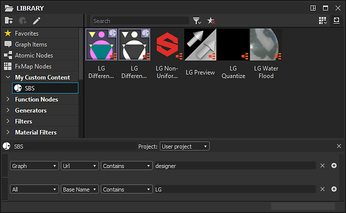
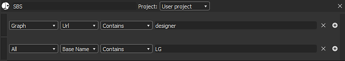

# Verwalten benutzerdefinierter Inhalte und Filter

Auf dieser Seite wird die Methode zum Erstellen von Kategorien und Filtern zum Verwalten benutzerdefinierter Inhalte in der Bibliothek erläutert. Es enthält auch Vorschläge für projektbasierte Arbeitsabläufe.

## Überblick

Nachdem [der Bibliothek &#x200B;](../../../interface/preferences-window/project-settings/project-settings.md) benutzerdefinierte Inhalte hinzugefügt wurden, müssen Sie diese *auffindbar* machen.

Die Bibliothek verwendet eine Anzahl von *Datenpunkten*, um Inhalte zu identifizieren, sie zu filtern und in Suchvorgängen anzuzeigen. Zu diesen Datenpunkten gehören:

* Name
* Erweiterung
* URL (d. h. *Dateiname*)
* Attribute

Sie können Ihre <b>Bibliothek</b> in Kategorien mit bestimmten Filtern organisieren und an die Anforderungen Ihres Projekts anpassen.\
Benutzerdefinierte Kategorien und Filter können *projektspezifisch* sein und in [Projektdateien](../../../interface/preferences-window/project-settings/project-settings.md) (\*.sbsprj) gespeichert werden. Diese Dateien können dann in [Konfigurationsdateien](../../../interface/preferences-window/project-settings/project-settings.md) (\*.sbscfg) zusammengestellt und an ein Team verteilt werden, sodass alle Künstler die* gleichen <b>Bibliothekskategorien</b>* für jedes beliebige Projekt verwenden können.

Das bedeutet, dass Sie mit einer oder mehreren Projektdateien die Ordner festlegen können, welche Inhalte der <b>Bibliothek</b> hinzugefügt werden sollen, sowie die Kategorien und Filter, die diese Inhalte sortieren und organisieren.

## Diagrammattribute

Diagramme, die in [SBS](../../../getting-started/overview/overview.md)- und [SBSAR](../../../getting-started/overview/overview.md)-Dateien enthalten sind, können mithilfe des Datensatzes im Abschnitt [Attribute](../../../compositing-graphs/graph-parameters/graph-parameters.md) der Diagrammeigenschaften *gefiltert und durchsucht* werden. Einige dieser Attribute können auch für andere [Ressourcentypen](../../../resources/resources.md) festgelegt werden.

## Benutzerdefinierte Filter und Ordner

Filter sind einfache boolesche (True/False) Suchparameter, die dazu führen, dass eine Ressource in der Bibliothek angezeigt wird, wenn dieser <b>Filter</b> ausgewählt ist. Ressourcen können alles sein, was in einem Paket enthalten ist. Beachten Sie Folgendes:

* Ein <b>Filter</b> stimmt mit allen Ressourcen unter *allen überwachten Pfaden* überein.
* Ein <b>Filter</b> kann mehrere Bedingungen enthalten. *Alle von ihnen müssen als True* (AND-Bedingung) ausgewertet werden, damit die Ressource unter diesem Filter angezeigt wird.
* Eine [Ressource](../../../resources/resources.md) kann unter mehreren Filtern angezeigt werden. Sie ist *nicht exklusiv* für einen beliebigen Filter.
* Eine [Ressource](../../../resources/resources.md) aus einem überwachten Pfad ist *in der <b>Bibliothek</b> noch verfügbar*, selbst wenn sie *nicht* unter einem <b>Filter</b> ist, indem die <b>Suchfunktion</b> verwendet wird.

### Erstellen von Filtern und Ordnern

Kategorien (d. h. Ordner) und Filter werden mithilfe der folgenden Schaltflächen erstellt und bearbeitet:

<b> Ordner hinzufügen: </b> Erstellt einen erweiterbaren Ordner in der Bibliotheksansicht. *kann keine Unterordner erstellen*.

<b> Filter hinzufügen: </b> Fügt einen neuen Filter im ausgewählten Ordner hinzu. *kann* den vorhandenen Standardordnern keine Filter hinzufügen.

<b> Element bearbeiten: </b> Bearbeitet den aktuell ausgewählten Ordner oder Filter. *kann keine der Eigenschaften der Standardordner und -filter* bearbeiten.

Um *einen Ordner oder Filter zu entfernen*, *klicken Sie mit der rechten Maustaste* darauf und wählen Sie im Kontextmenü die Option <b>Entfernen</b>.

### Bearbeiten von Filtern und Ordnern

<b>Ordner</b> und <b>Filter</b> werden durch die folgenden Daten identifiziert:

* <b>Name</b> wird in der Bibliotheksstrukturansicht angezeigt.
* [Projektkonfigurationsdatei (SBSPRJ)](../../../pipeline-and-project-con/project-configuration-fil/project-configuration-files-sbsprj.md), in der dieses Element gespeichert ist.

>[!WARNING]
>
> Es ist *sehr* wichtig, diese korrekt einzurichten, um sicherzustellen, dass Sie das *richtige Projekt bearbeiten*!

Für **Filter** müssen in der Regel *Bedingungen* eingerichtet sein, um ihren Filterzweck zu erreichen. Diese Bedingungen werden anhand der folgenden Kriterien konfiguriert:

* **Ressourcentyp**: legt einen bestimmten [Ressourcentyp](../../../resources/resources.md) fest, z. B. [Diagramme](../../../compositing-graphs/substance-compositing-graphs.md)
* **Attribut**, auf das die Bedingung angewendet werden soll - siehe Liste oben
* **Bedingungslogik**: lässt den Filter Ergebnisse mit positiven, negativen, partiellen und ganzen Übereinstimmungen einschließen
* **Bedingungsschlüsselwort:** die Zeichenfolge, mit der die **Attribute**- und **Bedingungslogik**-Kriterien getestet werden. Wenn dieses Feld leer bleibt, werden alle Ressourcen einbezogen, die diesen beiden Kriterien entsprechen.

Sie können *Bedingungen hinzufügen oder entfernen* mithilfe der Schaltflächen &quot;**+**&quot; und &quot;**x**&quot; ganz rechts im Schlüsselwort &quot;Bedingung&quot;.

>[!NOTE]
>
> Ein Filter ohne eingerichtete Bedingungen führt dazu, dass *alle* **Bibliotheksinhalte** angezeigt werden.

## Best Practices

### Empfohlen

* Die allgemeine Regel für die Standardbibliothek ist, dass der <b>Ordner</b> im Attribut <b>Kategorie</b> aufgeführt ist, während der Name <b>Filter</b> durch das Attribut <b>Tag</b> bestimmt wird
* Erstellen Sie keine benutzerdefinierten Knoten, die sich mit der Standardbibliothek vermischen, es sei denn, *explizit* möchten, dass sie dies tun. Ihre Knoten *werden* unter Standardfiltern angezeigt, wenn sie übereinstimmen. Sie müssen daher sicherstellen, dass Sie ein *anderes Tagging-/Benennungssystem* verwenden, um dies zu vermeiden.
* Verwenden Sie *eindeutige*, *pro Projekt* Bezeichner. Diese können an beliebigen Stellen platziert werden (z. B. <b>Beschreibung</b>, <b>Kategorie</b> oder <b>Benutzerdaten</b>), solange Sie zwischen allen Projekten *konsistent* sind. Dadurch wird das Suchen und Filtern von Inhalt *nach Projekt* viel einfacher.
* Verwenden Sie das Attribut <b>Autor</b>, um die Person zu verfolgen, die ursprünglich für den Inhalt verantwortlich war, ohne die Versionskontrolldatensätze durchsuchen zu müssen.
* Eine effiziente Methode zum Erstellen von <b>Icons</b> besteht entweder darin, die Option <b>Generieren</b> des Diagrammattributs [Icon](../../../compositing-graphs/graph-parameters/graph-parameters.md) zu verwenden oder ein Diagramm [Vorlage](../../../interface/preferences-window/project-settings/project-settings.md) zum Generieren zu erstellen. Auf diese Weise könnt ihr Konsistenz sicherstellen und wertvolle Arbeit bei der Gestaltung sparen. Alle Standardbibliothekssymbole wurden auf diese Weise in Designer erstellt!

### Verwalten von Inhalten mit unterschiedlichem Umfang

* Sie können Ressourcen zu *vorhandenen Kategorien* hinzufügen, wenn dies sinnvoller ist. Die Verwaltung und Pflege von Filtern wird weniger aufwändig sein, und Sie können einen speziellen Symbolstil verwenden, um *sie voneinander zu unterscheiden*.
* Sie können Ihre Ordner und Filter in einer *globalen* (Studio-Ebene) [Projektkonfigurationsdatei](../../../pipeline-and-project-con/project-configuration-fil/project-configuration-files-sbsprj.md) definieren und ihnen dann Inhalt hinzufügen, indem Sie überwachte Pfade aus *aufeinander folgenden* [Projektdateien](../../../interface/preferences-window/project-settings/project-settings.md) hinzufügen.
* Sie können bestimmte Ordner und Filter für *jedes Projekt* definieren, um sie getrennt zu halten.
* Sie können Methoden aus allen drei oben genannten kombinieren und verwenden: vorhandene Filter verwenden, neue globale Filter definieren und pro Projekt eindeutige Filter erstellen
