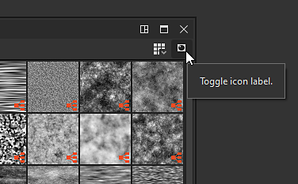

# Die Bibliothek

Auf dieser Seite werden das Bedienfeld &quot;**Library**&quot; von Substance 3D Designer, sein Layout sowie die Tools, die es für die Suche und Filterung von Inhalten bietet, angezeigt.

## Überblick

Das Bedienfeld &quot;<b>Library</b>&quot; ist ein *Ressourcenmanager* mit geteilter Ansicht, in dem Sie alle Ihre *Elemente*, mit denen Sie in Ihrem Graf arbeiten müssen, suchen und zusammenstellen können.

Es überwacht *Ordner* auf Ihrer Festplatte oder über ein Netzwerk, die der Liste der [von der Bibliothek überwachten Pfade](https://docs.substance3d.com/display/SDDOC/Project+Settings#ProjectSettings-proj-libraryLibrary) in den [Projekteinstellungen](../../interface/preferences-window/project-settings/project-settings.md) hinzugefügt wurden. Alle Änderungen in diesen Ordnern - Hinzufügen, Entfernen und Aktualisieren von Inhalten - werden *auf* in die <b>Bibliothek</b> übertragen.

>[!WARNING]
>
> **Über benutzerdefinierte Inhalte**
> 
> Die benutzerdefinierten Ressourcen werden zwar der **Bibliothek** hinzugefügt, sind jedoch aufgrund der für die bestehenden Filterungen festgelegten Kategorienregeln möglicherweise nicht sichtbar. Wir empfehlen, eigene Filter in Ordnern zu erstellen, um sicherzustellen, dass Ihre Inhalte während der Arbeit an Ihren Projekten zuverlässig gefunden werden können.\
> Weitere Informationen finden Sie im Abschnitt [Verwalten von benutzerdefiniertem Inhalt und Filtern](./managing-custom-content/managing-custom-content-and-filters.md) der Dokumentation.

Die **Bibliothek** kann alle Elemente überwachen, die [Ressourcen](../../resources/resources.md) unterstützen:

* Graf von [Substance-Paketen](../../getting-started/overview/overview.md) (SBS) und [Substance-Archiven](../../getting-started/overview/overview.md) (SBSAR)
* [Bitmapbilder](../../resources/bitmap-resource/bitmap-resource.md)
* [Vektorgrafiken](../../resources/vector-graphics-svg-res/vector-graphics-svg-resource.md)
* [Funktionsdiagramme](../../function-graphs/function-graphs.md)
* [AxF-Dateien](../../resources/axf-appearance-exchange/axf-appearance-exchange-format.md)
* [Schriften](../../resources/font-resource/font-resource.md)
* [3D-Szenen](../../resources/3d-scene-resource/3d-scene-resource.md)

Die Jury besteht aus zwei Hauptteilen:

* Der Abschnitt **Kategorien** auf der linken Seite
* Der Abschnitt **Inhalt** auf der rechten Seite

## Kategorien

Der Abschnitt &quot;<b>Kategorie</b>&quot; befindet sich links im Bedienfeld &quot;<b>Bibliothek </b>&quot; und enthält alle Assets &quot;*Kategorien*&quot; (d. h. Ordner) und &quot;*Filter*&quot; als Strukturansicht.\
Sie können auf ein beliebiges Element in dieser Strukturansicht klicken, um seinen Inhalt zusammen mit dem Inhalt von *allen untergeordneten Elementen* anzuzeigen.

### Die Kategorien

Standardkategorien und Filter enthalten alle Elemente, die im Lieferumfang von Designer enthalten sind. Sie können nicht bearbeitet oder entfernt werden.\
Zu den Standardkategorien gehören:

* Favoriten: sammelt alle Assets, die Sie als &quot;Favoriten&quot; markiert haben
* [Diagrammelemente](../../interface/the-graph-view/graph-items/graph-items.md): listet spezielle Objekte zum Organisieren von Diagrammen auf
* [Atomknoten](../../compositing-graphs/nodes-reference-for-com/atomic-nodes/atomic-nodes.md): listet Atomknoten für [Substance Graphen auf](../../compositing-graphs/substance-compositing-graphs.md)
* [FX-Map-Knoten](../../function-graphs/fxmaps/fxmaps.md): enthält Knoten, die für von [FX-Map](../../compositing-graphs/nodes-reference-for-com/atomic-nodes/fx-map/fx-map.md) Knoten berechnete Diagramme spezifisch sind.
* [Funktionsknoten](../../function-graphs/nodes-reference-for-fun/atomic-function-nodes/atomic-function-nodes.md): listet atomare Knoten für [Funktionsdiagramme](../../function-graphs/function-graphs.md) auf.
* [Texturgeneratoren](../../compositing-graphs/nodes-reference-for-com/node-library/texture-generators/texture-generators.md): enthält Knoten, die [Substance-Diagramme](../../compositing-graphs/substance-compositing-graphs.md) darstellen, die Inhalte eigenständig generieren
* [Filter](../../compositing-graphs/nodes-reference-for-com/node-library/filters/filters.md): enthält Knoten, die [Substance-Diagramme](../../compositing-graphs/substance-compositing-graphs.md) darstellen, die eine Eingabe ändern
* [Spline- und Pfadwerkzeuge](../../compositing-graphs/nodes-reference-for-com/node-library/spline-paths-tools/spline-paths-tools.md): Der Katalog von [Spline](../../compositing-graphs/nodes-reference-for-com/node-library/spline-paths-tools/spline-tools/spline-tools.md)- und [Pfaden](../../compositing-graphs/nodes-reference-for-com/node-library/spline-paths-tools/path-tools/path-tools.md)-Knoten
* [SDF-Funktionen](../../function-graphs/nodes-reference-for-fun/function-node-library/function-node-library.md#sdf-functions): umfasst Knoten zum Erstellen von 3D-SDF-Funktionen, die mit den Knoten [Shape splatter v2](../../compositing-graphs/nodes-reference-for-com/node-library/texture-generators/patterns/shape-splatter-v2/shape-splatter-v2.md) und [3D viewer](../../compositing-graphs/nodes-reference-for-com/node-library/filters/effects/3d-viewer/3d-viewer.md) verwendet werden sollen
* [Funktionen](../../function-graphs/nodes-reference-for-fun/function-node-library/function-node-library.md): enthält Knoten, die [Funktionsdiagramme](../../function-graphs/the-function-graph/the-function-graph.md) darstellen.
* [3D-Ansicht](../3d-view/3d-view.md): bietet Inhalte zu Karten, die für bildbasierte Beleuchtung in einer 3D-Szene verwendet werden - z. B. in der [3D-Ansicht](../../interface/3d-view/3d-view.md) -, wie Umgebungskarten und Knoten für das Erstellen von Umgebungskarten.
* PBR-Materialien: Vorgefertigte Materialien, die als Platzhalter zum Testen anderer Knoten, &quot;Rezepte&quot; oder eines benutzerdefinierten Arbeitsbereichs verwendet werden können. Um mehr über Authoring-Materialien zu erfahren, empfehlen wir, sich unsere dedizierten [Materialproben](../../compositing-graphs/creating-compositing-gra/material-samples/material-samples.md) anzusehen.
* [Werte](../../compositing-graphs/nodes-reference-for-com/node-library/values/constant.md): Knoten zum Generieren einfacher Werte in Substance-Graphen.

## Inhalt

Der Inhalt der <b>Bibliothek</b> wird als *Miniaturansichten mit der Bezeichnung* angezeigt. Diese Miniaturansichten haben je nach folgenden Faktoren ein anderes Seitenverhältnis:

* [Substance-Diagramme](../../compositing-graphs/substance-compositing-graphs.md) in [SBS](../../getting-started/overview/overview.md) und [SBSAR](../../getting-started/overview/overview.md)-Dateien werden durch ihre *erste Ausgabe* oder durch ihr *benutzerdefiniertes Symbol* dargestellt, wenn eines vom Autor des Diagramms festgelegt wurde.
* [Bitmaps](../../resources/bitmap-resource/bitmap-resource.md) und [Vektorgrafiken (SVG)](../../resources/vector-graphics-svg-res/vector-graphics-svg-resource.md) werden durch ein *Miniatur-Rendering* der Bitmap selbst dargestellt
* [3D-Szenen](../../resources/3d-scene-resource/3d-scene-resource.md), [Funktionsdiagramme](../../function-graphs/the-function-graph/the-function-graph.md), [Schriftarten](../../resources/font-resource/font-resource.md) und [AxF](../../resources/axf-appearance-exchange/axf-appearance-exchange-format.md)-Dateien werden durch *generische Symbole* für jeden Typ dargestellt.

>[!WARNING]
>
> **Bei Problemen mit Miniaturansichten**
> 
> Unser empfohlener Schritt zur Fehlerbehebung für alle Probleme im Zusammenhang mit Bibliotheksminiaturen (falsches Bild, Rendern bleibt auf dem Aktualisierungssymbol hängen usw.) ist zum manuellen Auslösen einer *Miniaturansichtserneuerung* vorgesehen.\
> Verwenden Sie dazu die Schaltfläche **Miniaturansichten neu erstellen** im Abschnitt [Bibliothek](../../interface/preferences-window/preferences-window.md) des Fensters [Voreinstellungen](../../interface/preferences-window/preferences-window.md).

<table>
<tr style="border: 0;">
<td width="100.00%" style="border: 0;" valign="top">

### Verwenden eines Elements aus der Bibliothek

Um ein Element aus der Bibliothek zu verwenden, ziehen Sie es *per Drag &amp; Drop* an den gewünschten Speicherort.\
Sie können *mehrere* Elemente im Abschnitt <b>Inhalt</b> auswählen, indem Sie die Taste <b>Strg</b> gedrückt halten, während Sie auf Elemente klicken. In diesem Fall platziert der Drag-and-Drop-Vorgang Knoten im Diagramm für die *gesamte Auswahl*.

</td>
<td width="41.67%" style="border: 0;" valign="top">

</td>
</tr>
</table>

### Element anhand des Namens suchen

Mit der Leiste <b>Suche</b>, die sich oben links im Abschnitt <b>Inhalt</b> befindet, können Sie *beliebige Elemente nach Namen* durchsuchen. Wenn Sie auf diese Weise nach Inhalten suchen, wird die aktuelle Auswahl im Abschnitt <b>Kategorien</b> ignoriert, und der *gesamte Inhalt* in der <b>Bibliothek</b> wird durchsucht.\
Sie können die Suchergebnisse nach *Diagrammtyp* filtern, indem Sie  <b>Filtern nach...Symbol </b> neben der Leiste <b>Suche</b>.

>[!NOTE]
>
> Die Suchleiste berücksichtigt den Namen des gesuchten Assets, aber auch *Tags*, die das Asset enthalten kann, oder die *Kategorie*, zu der es gehört.\
> Wenn Sie beispielsweise &quot;*Normal*&quot; eingeben, werden alle Assets aufgelistet, die zum Generieren oder Ändern einer normalen Map verwendet werden können. Dies ist ein guter Weg, um neue Knoten zu entdecken, und damit neue Möglichkeiten!

<table>
<tr style="border: 0;">
<td width="100.00%" style="border: 0;" valign="top">

### Visualisieren von Bibliothekselementen

Mithilfe der Dropdown-Schaltfläche  <b>Anzeigemodus</b> können Sie die Anzeigegröße für Inhaltselemente auswählen.

</td>
<td width="25.00%" style="border: 0;" valign="top">

</td>
</tr>
</table>

<table>
<tr style="border: 0;">
<td style="border: 0;" valign="top">

Mit der Schaltfläche  **Beschriftungen umschalten** können Sie die Beschriftungen der Knoten ein- oder ausblenden.

</td>
<td style="border: 0;" valign="top">

</td>
</tr>
</table>

<table>
<tr style="border: 0;">
<td style="border: 0;" valign="top">

Wenn Sie den Cursor auf einem Inhaltselement platzieren, wird nach kurzer Zeit eine QuickInfo mit einer *Beschreibung* des Elements angezeigt, sofern der Autor eine Beschreibung angegeben hat.\
*Klicken Sie mit der rechten Maustaste* auf das Element, um zusätzliche Informationen anzuzeigen, einschließlich eines Pfads zur Quelldatei für dieses Element.

</td>
<td style="border: 0;" valign="top">

</td>
</tr>
</table>

>[!NOTE]
>
> Für [Instanzknoten](../../compositing-graphs/creating-compositing-gra/graph-instances-sub-gra/graph-instances-sub-graphs.md) - d. h. nicht atomare Knoten ist dieser Pfad ein *Hyperlink*, der die Datei im Dateibrowser des Systems anzeigt.\
> Atomare Knoten verwenden einen speziellen Alias-Pfad (z. B. `graphatomic://`, `structure://`, ...) die nicht angeklickt werden kann, da sie auf eine interne Bibliothek zeigt.

<table>
<tr style="border: 0;">
<td style="border: 0;" valign="top">

### Favoriten

Mit der Schaltfläche  <b>Zu Favoriten hinzufügen</b> können Sie ein beliebiges Element im Abschnitt <b>Inhalt</b> zu Ihrer Liste <b>Favoriten</b> hinzufügen. Mit der Schaltfläche können Sie außerdem *Inhalte* aus dieser Liste entfernen, wenn sie bereits hinzugefügt wurden.\
Wenn Inhalt zu dieser Liste hinzugefügt wird, ist er in der Kategorie <b>Favoriten</b> der <b>Bibliothek</b> verfügbar und wird bei der Suche nach einem Knoten im Diagramm an der *Spitze* der <b>Knoten</b>-Menüliste angezeigt, sofern die Suchbegriffe mit diesem Knoten übereinstimmen.

</td>
<td style="border: 0;" valign="top">

</td>
</tr>
</table>
