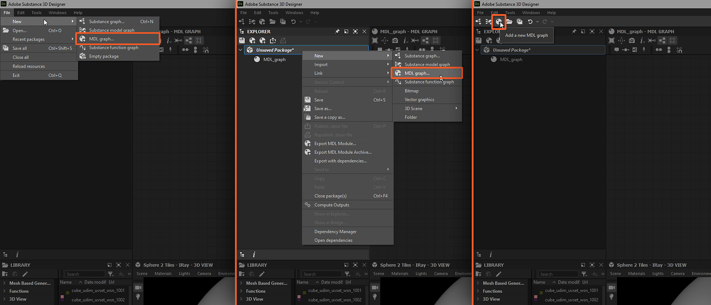
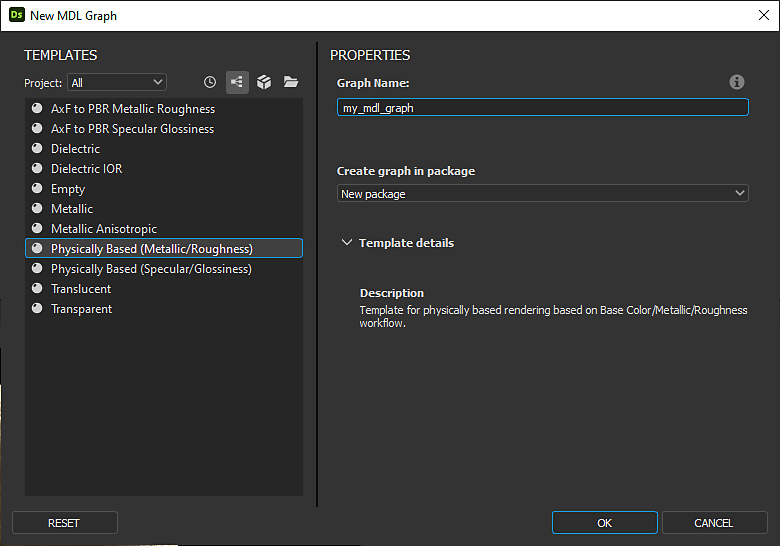

# Erstellen eines MDL-Diagramms

Auf dieser Seite wird das Erstellen eines MDL-Diagramms zum Erstellen von MDL-Materialien in Substance 3D Designer beschrieben.

*Pfade zum Erstellen eines neuen MDL-Diagramms in der Designer-Oberfläche*

## Verfahren zum Erstellen eines MDL-Diagramms

Sie können ein MDL-Diagramm mit einer der folgenden Methoden erstellen:

* Wählen Sie in der *Hauptmenüleiste die Option **Datei > Neu > MDL-Diagramm**&#x200B;aus.*
* Klicken Sie auf die Schaltfläche  **MDL-Diagramm hinzufügen** in der *Hauptsymbolleiste*.
* Klicken Sie mit der rechten Maustaste auf ein *bestehendes Paket* im Bereich **Explorer** und wählen Sie die Option **Neu > MDL-Diagramm** aus

Das Dialogfeld &quot;**Neues MDL-Diagramm**&quot; wird angezeigt (siehe unten).

*Dialogfeld &quot;Neues MDL-Diagramm&quot;*

## Dialogfeld &quot;Neues MDL-Diagramm&quot;

Unabhängig von der Methode zum Erstellen eines neuen MDL-Diagramms wird Ihnen immer das Dialogfeld <b>Neues MDL-Diagramm</b> angezeigt, in dem Sie den neuen Graf konfigurieren können.

### Vorlagen

Im Abschnitt <b> Vorlagen</b> können Sie eine Knotenvorlage auswählen, die vorkonfigurierte Graf enthält, damit Sie schneller mit Ihrem Graf beginnen können. Die vorkonfigurierten Knoten umfassen Ausgabeknoten, einfache Knoten zur Übergabe von Werten an diese Ausgaben - z. B. Einheitliche Farbe und Eingabeknoten je nach Vorlage.

Um von einem vollständig *leeren* Graf zu starten, wählen Sie die <b>leere</b> Vorlage aus.

Mit der Option <b>Projekt</b> können Sie die Vorlagenliste nach Projektdatei filtern. Dadurch ist es leicht, die benutzerdefinierten Vorlagen in den Speicherorten zu finden, die im Abschnitt <b>Allgemein</b> der Projekteinstellungen für die Projektdatei hinzugefügt wurden.

>[!WARNING]
>
> Wenn Sie die falsche Vorlage auswählen, können Sie *nicht* zu einer anderen Vorlage wechseln, nachdem Sie den Graf erstellt haben.\
> Um Ihren bestehenden Graf in eine andere Vorlage zu importieren, können Sie mithilfe der entsprechenden Vorlage einen neuen Graf erstellen und Ihren Graf kopieren und in die neue einfügen. Stellen Sie die Knoten ggf. wieder her, einschließlich des Knotens [Root](../../mdl-graphs/main-mdl-graph-concepts/main-mdl-graph-concepts.md).

Die Vorlagenliste kann in verschiedenen Modi mit den *Schaltflächen* neben dem Kombinationsfeld **Projekt** angezeigt werden:

* **Anzeige zuletzt verwendet**: filtert die Liste, um die zuletzt verwendeten Vorlagen in der Reihenfolge von *zuletzt bis zuletzt* anzuzeigen, wobei das oberste Element das zuletzt verwendete ist
* **Graf anzeigen**: Vorlagen werden nur nach ihrer *Bezeichnung* in der Reihenfolge der [Substance 3D](https://www.adobe.com/de/products/substance3d/3d-augmented-reality.html)-Dateien im Vorlagenverzeichnis angezeigt
* **Substance 3D-Dateien anzeigen**: Vorlagen werden anhand ihrer Bezeichnung als *untergeordnete Elemente der Substance 3D-Datei, zu der sie gehören, angezeigt*. Die Reihenfolge der Dateien im Vorlagenverzeichnis ist dabei identisch.
* **Verzeichnisse anzeigen**: Vorlagen werden anhand ihrer Bezeichnung als *untergeordnete Elemente des Verzeichnisses angezeigt, zu dem sie gehören*, in der Reihenfolge der Dateien im Vorlagenverzeichnis.

### Eigenschaften

Im Abschnitt &quot;<b>Eigenschaften des Grafen &quot;</b>&quot; können Sie grundlegende Informationen zum neuen Graf einrichten. Jede dieser Einstellungen kann später jederzeit geändert werden, aber es ist sinnvoll, zunächst darauf zu achten und diese entsprechend für Ihren Anwendungsfall einzurichten.

* <b>Name des Grafen</b>: die Identifizierung des Grafen. Sie muss für ein bestimmtes Paket eindeutig sein und darf keine Leerzeichen und einige Sonderzeichen enthalten.
* <b>Graf im Paket erstellen</b>: Mit diesem Kombinationsfeld können Sie ein *neues* Paket für den neuen Graf erstellen oder den neuen Graf einem beliebigen *bestehenden* Paket hinzufügen, das bereits im Bereich &quot;Explorer&quot; geladen wurde.\
  Hinweis: Wenn der Erstellungsprozess mit der Methode <b>4</b> (siehe oben) gestartet wird, lautet dieser Parameter *preset* für das vorhandene Paket, von dem aus der Prozess gestartet wurde.
* <b>Vorlagendetails</b>: Dieser Abschnitt enthält einen kurzen Text, der die Merkmale und den Zweck der Vorlage erläutert.
