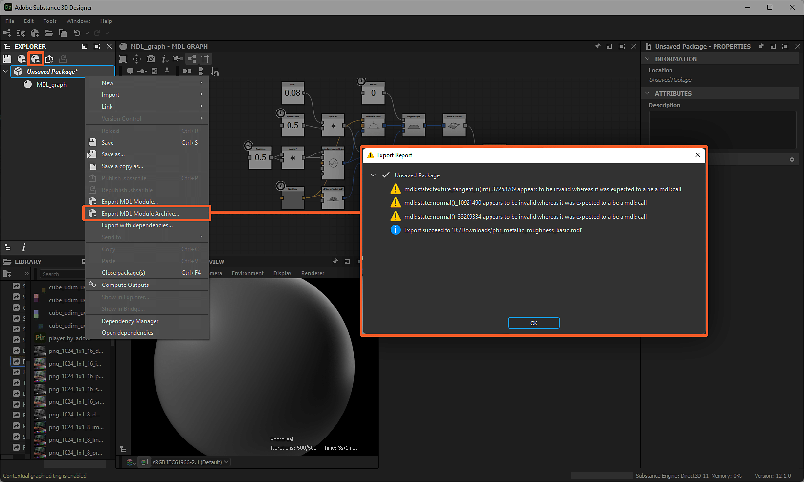

# MDL-Inhalte werden exportiert

Auf dieser Seite werden die Exportprozesse für [MDL-Grafiken](../../mdl-graphs/mdl-graphs.md) und Materialien in Substance 3D Designer beschrieben.

## Überblick

Sobald ein MDL-Material in Designer erstellt wurde, muss es in ein Format exportiert werden, das *die Materialdefinition* tragen kann, und von Renderern gelesen werden, die MDL unterstützen. MDL verwendet proprietäre Formate für Materialdefinitionen, so genannte MDL-Module, die in verschiedenen Formaten geschrieben und verpackt sind und alle aus Designer exportiert werden können.

>[!NOTE]
>
> Alle diese Formate können direkt mit einem *Texteditor* geöffnet werden - manchmal nach dem Entpacken mit einem Archivmanager -, um die von ihnen gehaltene Materialdefinition zu überprüfen.

## MDL-Modul (\*.mdl)

Dies ist das grundlegende Austauschdateiformat für Materialdefinitionen. Ein MDL-Modul definiert Folgendes:

* die Eigenschaften und das Verhalten des Materials
* seine exponierten Parameter und Standardwerte
* ihre Anmerkungen (d. h. Metadaten): Autor, Tags, Kategorien, ...

Das Exportieren eines MDL-Moduls wird auf der Ebene *Paket* ausgeführt. Um ein MDL-Modul für ein bestimmtes Paket zu exportieren, klicken Sie im [Explorer](https://helpx.adobe.com/substance-3d/unlisted/documentation/sddoc/the-explorer-129368147.html) auf die Schaltfläche  <b>MDL-Modul exportieren</b> oder wählen Sie dieselbe Option im Kontextmenü des *Pakets* aus. Wählen Sie einen Zielspeicherort und einen Namen für das exportierte MDL-Modul aus, und das Dialogfeld <b>Bericht exportieren</b> wird mit der Liste der während des Exportvorgangs protokollierten Nachrichten angezeigt.

Das exportierte Modul enthält die Definitionen von *allen* der MDL-Materialien, die durch ein [MDL-Diagramm](../../mdl-graphs/mdl-graphs.md) im Paket definiert sind.

>[!NOTE]
>
> Erfahren Sie mehr über MDL-Module in den Abschnitten 4 und 15 der [MDL-Spezifikation von NVIDIA](https://developer.download.nvidia.com/designworks/mdl-sdk/secure/MDL_spec_1.6.1_16Dec2019.pdf?__token__=exp=1776166178~hmac=38656bc9d8199764568d1fa0d4d945b90c57638ebd37b100a402bdc983e518ee&t=eyJscyI6ImdzZW8iLCJsc2QiOiJodHRwczovL3d3dy5nb29nbGUuY29tLyJ9).

>[!NOTE]
>
> Warnungen nach dieser Vorlage: `x appears to be invalid whereas it was expected to be an mdl::call` wird durch die Art und Weise verursacht, wie MDL-Materialien in MDL-Diagrammen verarbeitet werden, und *sicher sind, um* zu ignorieren.

*Die Pfade &quot;MDL-Modul exportieren&quot; im Explorer und das resultierende Dialogfeld &quot;Bericht exportieren&quot;*

### MDL-Vorgabe (\*.mdl)

Eine MDL-Modulvorgabe ist weitgehend identisch mit dem Modul, auf dem sie basiert, wobei der einzige Unterschied darin besteht, dass sie einen anderen Satz von Standardwerten enthält - weitere Informationen [hier](https://www.migenius.com/doc/realityserver/latest/resources/general/iray/api_reference/iray/html/classmi_1_1neuraylib_1_1IMdl__factory.html#details).

Eine Vorgabe für ein MDL-Material, das einem Szenenmaterial &quot;`my_material`&quot; zugewiesen ist, kann von den folgenden Speicherorten exportiert werden:

* Das Bedienfeld &quot;[Explorer](https://helpx.adobe.com/substance-3d/unlisted/documentation/sddoc/the-explorer-129368147.html)&quot;, indem Sie auf &quot;<b>RMB</b>&quot; in der MDL-Diagrammressource klicken und die Exportvorgabe &quot;<b>&quot; auswählen...Option </b> im Kontextmenü
* Das Bedienfeld [3D-Ansicht](../../interface/3d-view/3d-view.md) mit <b>Materialien > my\_material > Vorgabe exportieren...</b>-Menüoption

Die Menüoption öffnet das Dialogfeld <b>MDL-Materialvorgabe exportieren</b>, das die folgenden Optionen bietet:

* <b>Verzeichnis</b>: Der Zielspeicherort, an den das MDL-Modul exportiert wird
* <b>MDL-Dateiname</b>: Der Name des MDL-Moduls
* <b>Importierte MDL-Module einbetten</b>: Wenn das MDL-Modul auf importierten Modulen basiert - d. h. über Modulabhängigkeiten verfügt, führt das Aktivieren dieser Option dazu, dass die Modulabhängigkeiten in das exportierte MDL-Modul *eingebettet* werden, sodass es effektiv *autark* auf Kosten der Dateigröße und der dynamischen Vererbung ist.

Die exportierte Voreinstellung verwendet die *aktuellen Werte* der Materialparameter in der 3D-Ansicht als *neue Standardwerte*. Diese Werte können mit der Option <b>Materialien > my\_material > Bearbeiten</b> geändert werden, die die exponierten Parameter des Materials im Bedienfeld [Eigenschaften](https://helpx.adobe.com/substance-3d/unlisted/documentation/sddoc/parameters-ui-129368153.html) anzeigt.

>[!WARNING]
>
> Beim Exportieren eines MDL-Moduls aus dem Bedienfeld [Explorer](https://helpx.adobe.com/substance-3d/unlisted/documentation/sddoc/the-explorer-129368147.html) führt dies dazu, dass ein MDL-Modul *alle* MDL-Materialien enthält, die durch ein MDL-Diagramm im Paket definiert sind. Beim Exportieren einer MDL-Vorgabe aus der [3D-Ansicht](../../interface/3d-view/3d-view.md) führt dies dazu, dass ein MDL-Modul *nur* enthält, die Definition der MDL-Materialien, die auf das *ausgewählte Material* im Menü `my_material` in diesem Beispiel angewendet wurden.

*Der Pfad &quot;Exportvorgabe&quot; in der 3D-Ansicht und das resultierende Dialogfeld &quot;MDL-Materialvorgabe exportieren&quot;*

## MDL-Modularchiv (\*.mdr)

Ein MDL-Modularchiv kombiniert MDL-Module (siehe oben) mit Ressourcen wie *Texturen* und Readme-Dateien in einer *einzelnen transportablen Datei*.

Das Exportieren eines MDL-Modularchivs wird auf der Ebene *Paket* ausgeführt. Um ein MDL-Modularchiv für ein bestimmtes Paket zu exportieren, klicken Sie im [Explorer](https://helpx.adobe.com/substance-3d/unlisted/documentation/sddoc/the-explorer-129368147.html) auf die Schaltfläche  <b>MDL-Modularchiv exportieren</b>, oder wählen Sie dieselbe Option im Kontextmenü des *Pakets* aus. Wählen Sie einen Zielspeicherort und einen Namen für das exportierte MDL-Modularchiv aus, und das Dialogfeld <b>Bericht exportieren</b> wird mit der Liste der während des Exportvorgangs protokollierten Nachrichten angezeigt.

Das exportierte Modularchiv enthält ein MDL-Modul, das die Definitionen von *allen* der MDL-Materialien enthält, die durch ein [MDL-Diagramm](../../mdl-graphs/mdl-graphs.md) im Paket definiert sind. Wenn ein [Substance-Diagramm](../../compositing-graphs/substance-compositing-graphs.md) [in ein MDL-Diagramm ](../../mdl-graphs/compositing-graphs-and/substance-compositing-graphs-and-mdl-materials.md) instanziiert und mit einem Stream verbunden ist, der an den [Root](../../mdl-graphs/main-mdl-graph-concepts/main-mdl-graph-concepts.md)-Knoten geht, werden die von ihm ausgegebenen Texturen *im Archiv gespeichert*.

Zusätzlich zu diesen Elementen enthält das Archiv eine <b>MANIFEST</b>-Datei, die die folgenden Metadaten für das MDL-Modularchiv beschreibt:

* `mdl` die zum Exportieren des Modularchivs verwendete MDL-Version - z. B. &quot;1.5&quot;
* `version` die Version des Modularchivs - z.B. &quot;1.0.0&quot;
* `module` den Namen des Modularchivs - z.B. &quot;::pbr\_metallic\_roughness\_basic&quot;
* `exports.material` den Namen der im Modularchiv definierten Materialien - z. B. &quot;::pbr\_metallic\_roughness\_basic::MDL\_graph&quot;

>[!NOTE]
>
> Erfahren Sie mehr über das MDL-Archivdateiformat in Anhang C der [MDL-Spezifikation von NVIDIA](https://developer.download.nvidia.com/designworks/mdl-sdk/secure/MDL_spec_1.6.1_16Dec2019.pdf?__token__=exp=1776166178~hmac=38656bc9d8199764568d1fa0d4d945b90c57638ebd37b100a402bdc983e518ee&t=eyJscyI6ImdzZW8iLCJsc2QiOiJodHRwczovL3d3dy5nb29nbGUuY29tLyJ9).

*Der Pfad &quot;MDL-Modularchiv exportieren&quot; im Explorer und das resultierende Dialogfeld &quot;Bericht exportieren&quot;*

## MDL-gekapseltes Modul (\*.mdle)

MDL-Grafiken mit exponierten Parametern können als gekapselte MDL-Materialien exportiert werden. Durch die *-Kapselung werden Daten* in eine dedizierte Klasse eingeschlossen, sodass auf Daten *nicht direkt zugegriffen werden kann*.

Während Sie beispielsweise noch die Werte der angezeigten Parameter ändern können, um das Verhalten eines Materials zu steuern, ist die *Definition* dieser Parameter *nicht verfügbar* in einem gekapselten MDL-Modul.

Das Exportieren eines gekapselten MDL-Moduls wird im [Explorer](https://helpx.adobe.com/substance-3d/unlisted/documentation/sddoc/the-explorer-129368147.html) auf der MDL-Diagrammebene durchgeführt, indem die Option <b>Als .mdle</b> exportieren im Kontextmenü eines MDL-Diagramms ausgewählt wird. Wählen Sie einen Zielspeicherort und einen Namen für das exportierte MDL-gekapselte Modul aus, und das Dialogfeld <b>Bericht exportieren</b> wird mit der Liste der während des Exportvorgangs protokollierten Meldungen angezeigt.

*Nur* die Materialdefinition für das *ausgewählte MDL-Diagramm* wird in das exportierte gekapselte MDL-Modul aufgenommen.

>[!NOTE]
>
> Erfahren Sie mehr über Definitionen von gekapseltem Material in Abschnitt 13.5 der [MDL-Spezifikation von NVIDIA](https://developer.download.nvidia.com/designworks/mdl-sdk/secure/MDL_spec_1.6.1_16Dec2019.pdf?__token__=exp=1776166178~hmac=38656bc9d8199764568d1fa0d4d945b90c57638ebd37b100a402bdc983e518ee&t=eyJscyI6ImdzZW8iLCJsc2QiOiJodHRwczovL3d3dy5nb29nbGUuY29tLyJ9) und der [MDL SDK API](https://raytracing-docs.nvidia.com/mdl/api/mi_neuray_example_mdle.html).

*Der Pfad &quot;Als Mdle exportieren&quot; im Explorer und das resultierende Dialogfeld &quot;Bericht exportieren&quot;*
