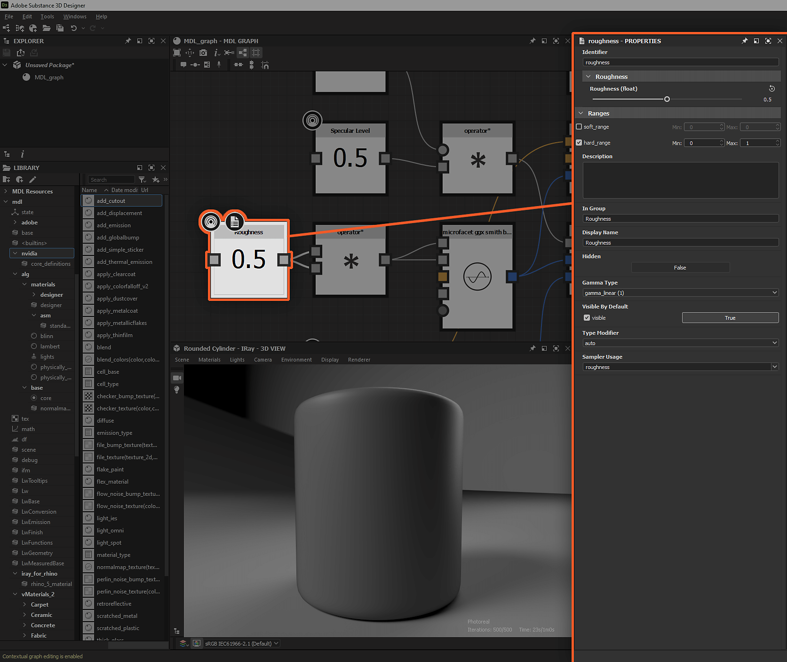

# Verfügbarmachen von Parametern in MDL-Diagrammen

Auf dieser Seite wird erläutert, wie Parameter in MDL-Diagrammen verfügbar gemacht werden, damit sie mit Werten und Texturen verbunden werden können, die von *anderen Knoten* im Diagramm oder von *externen Quellen* bereitgestellt werden.

*Verfügbarer Status der Knoteneingaben*

## Verfügbarmachen von Knoteneingaben

In den meisten Fällen können die *Eingabekonnektoren* der Eigenschaften eines Knotens verfügbar gemacht werden, sodass ihr *Wert von anderen Knoten* im Diagramm festgelegt wird. Dies ist ein *kritischer*-Teil eines Workflows in MDL-Diagrammen und sollte gut verstanden werden.

Wenn ein Knoten in der <b>Diagrammansicht</b> ausgewählt ist, werden seine Eigenschaften im Bereich <b>Eigenschaften</b> angezeigt. Die meisten Eigenschaften werden mit einer Reihe von Schaltflächen rechts neben der jeweiligen Beschriftung aufgelistet:

* **Kopieren Sie den Wert in einen neuen Knoten und verknüpfen Sie ihn mit diesem Parameter**: erstellt einen *Eingabestecker* für diese Eigenschaft und verbindet ihn mit einem *neuen Knoten*, der den aktuellen Wert dieser Eigenschaft ausgibt.
* **Erstellen Sie einen Eingabepin für diesen Parameter**: erstellt einen *Eingabestecker* für diese Eigenschaft.
* **Setzen Sie diesen Parameter auf seinen Standardwert zurück**: Wenn kein Wert mit dem Eingangsconnector dieser Eigenschaft verbunden ist, wird der Wert auf den Standardwert zurückgesetzt

*Manipulieren von Knoteneingaben*

Wenn Sie auf eine der ersten beiden Schaltflächen klicken, wird ein *typisierter Eingangsanschluss* zum Knoten hinzugefügt. Die Eigenschaften des Knotens reagieren auf den *Verbindungsstatus* dieses Connectors:

* **Nicht verbunden**: Der Parameter kann im Bereich **Eigenschaften** noch angepasst werden, und die in diesem Bereich eingegebene Wertangabe ist *angewendet*.
* **Verbunden**: Der Parameter kann im Bereich **Eigenschaften** nicht mehr geändert werden. Der in diesem Bereich eingegebene Wert ist *Ersetzt* durch den vom *Eingangsconnector* empfangenen Wert. Die Eigenschaft kann nicht auf ihren Standardwert zurückgesetzt werden.

Der Eingangsanschluss kann *entfernt* werden, indem Sie erneut auf die Schaltfläche **Eingabeanschluss für diesen Parameter erstellen** klicken. An diesem Punkt kehrt der Eigenschaftswert zu dem Wert zurück, der im Bereich **Eigenschaften** festgelegt wurde.

*Verfügbare Knotenparameter*

## Verfügbarmachen von Diagrammeingaben

In einem MDL-Diagramm wird ein Parameter der Graphenebene ausgesetzt - d. h., er wird als MDL-Materialeingabeparameter angezeigt -, indem der Knoten angezeigt wird, der den Wert ausgibt.

Knoten, die verfügbar gemacht werden können, haben im Kontextmenü die Option <b>Verfügbar machen</b>. In den meisten Fällen sind dies Knoten, die einen Wert oder Daten generieren, z. B. Float-, Color- oder Texturkoordinaten.

*Option &quot;Verfügbar machen&quot; im Kontextmenü eines Knotens*

Der verfügbar gemachte Parameter wird direkt im *freigegebenen Knoten* konfiguriert, nicht in den Eigenschaften des Diagramms. Folgende Eigenschaften der exponierten Parameter sind verfügbar:

* <b>Kennung</b>: der eindeutige Name dieses Eingabeparameters im aktuellen Diagramm
* <b>Standardwert</b>: Der Standardwert für diesen Parameter. Es kann auch als *Vorschau* der Darstellung des Eingabeparameters in Designer verwendet werden. Die Eigenschaften <b>Anzeigename</b>, <b>In Gruppe</b> und <b>Bereiche</b> werden für eine möglichst genaue Vorschau verwendet
* <b>Bereiche</b>:
  * *Soft Range*: Legt den Standardbereich des Widgets fest, das für die Anzeige dieses Parameters verwendet wird, z. B. einen Schieberegler. Diese Eigenschaft ist nur für Schnittstellenzwecke vorhanden und Werte außerhalb des Soft-Bereichs können manuell eingegeben werden
  * *Harter Bereich*: Legt den Bereich der akzeptierten Werte für diesen Parameter fest. Werte unterhalb des Bereichs werden auf den Mindestwert festgeklemmt, während Werte oberhalb des Bereichs auf den Höchstwert festgeklemmt werden. Die Standardwerte und der weiche Bereich des Parameters werden *automatisch angepasst*, damit sie in diesen Bereich passen.
* <b>Beschreibung</b>: Die Beschreibung des Parameters
* <b>In Gruppe </b>: Die Parametergruppe, zu der dieser Eingabeparameter gehört. Wenn nicht leer, wird der Parameter in Designer als Teil eines reduzierbaren Abschnitts angezeigt, der nach der Gruppe benannt ist
* <b>Anzeigename</b>: Der in der Benutzeroberfläche angezeigte Parametername
* <b>Verborgen</b>: Wenn auf &quot;True&quot; festgelegt, ist der Parameter in den Diagrammeingaben und MDL-Materialeigenschaften nicht sichtbar.
* <b>Gammatyp</b>: Das Gamma, das verwendet werden soll, wenn Werte aus einer mit diesem Parameter verbundenen Textur aufgenommen werden
* <b>Standardmäßig sichtbar</b>: Legt die Sichtbarkeit dieses Parameters in MDL-Integrationen fest, wenn einige Parameter ausgeblendet werden können.
* <b>Typmodifizierer</b>: Legt fest, ob der Wert einheitlich oder variabel ist. Bei der Einstellung auto erbt der Parameter diese Eigenschaft von seiner Eingabe (z. B. für einen Float-Wert: gleichmäßig, wenn mit einem Float verbunden, variierend, wenn mit einer Textur verbunden)
* <b>Sampler-Nutzung</b>: Der Bezeichner der Verwendung des Parameters, der zum *Verbinden der entsprechenden Textur* s verwendet wird, wenn mehrere Ausgänge gleichzeitig mit einem MDL-Material verbunden sind. Wenn beispielsweise ein [Substance-Diagramm](../../compositing-graphs/substance-compositing-graphs.md) mit einem MDL-Material in der 3D-Ansicht verbunden wird, werden Texturen anhand ihrer Verwendungskennungen mit den richtigen Eingängen verbunden.

>[!WARNING]
>
> Während Diagrammeingaben auf der Ebene *Knoten* konfiguriert sind, wird ihre Reihenfolge auf der Ebene *Graph* im Abschnitt **Graph Input** der [Graph-Eigenschaften](../../mdl-graphs/creating-an-mdl-graph/creating-an-mdl-graph.md) verwaltet.

*Verfügbarmachen von Knoten in Diagrammeingaben*
