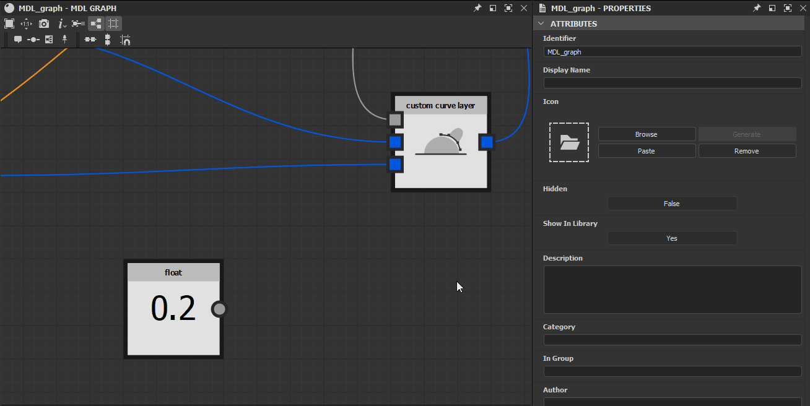

# Legend Parameter in MDL-Diagrammen

Auf dieser Seite wird erläutert, wie Parameter in MDL-Diagrammen gelegt werden, damit sie mit Werten und Texturen verbunden werden können, die von *anderen Graf* oder von *externen Quellen* bereitgestellt werden.

*Gelegt Status der Knoteneingaben*

## Legend Knoteneingänge

In den meisten Fällen können die *Eingabeknoten* der Eigenschaften eines Knotens gelegt werden, sodass ihr *Wert von anderen Verbindungen* im Graf festgelegt wird. Dies ist ein *kritischer*-Teil eines Workflows in MDL-Diagrammen und sollte gut verstanden werden.

Wenn ein Knoten in der <b>Graphansicht</b> ausgewählt wird, werden seine Eigenschaften im Bereich <b>Eigenschaften</b> angezeigt. Die meisten Eigenschaften werden mit einer Reihe von Schaltflächen rechts neben der jeweiligen Beschriftung aufgelistet:

* **Kopieren Sie den Wert in einen neuen Knoten und verknüpfen Sie ihn mit diesem Parameter**: erstellt eine *Eingabeeigenschaft* für diese Verbindung und verbindet sie mit einem *neuen Knoten*, der den aktuellen Wert dieser Eigenschaft ausgibt.
* **Erstellen Sie eine Eingabeparameter-Nadel für diesen Parameter**: erstellt eine *Eingabe-Verbindung* für diese Eigenschaft.
* **Setzen Sie diesen Parameter auf seinen Standardwert zurück**: Wenn kein Wert mit der Eingabeeigenschaft verbunden ist, wird der Wert auf die Verbindung zurückgesetzt.

*Manipulieren von Knoteneingaben*

Wenn Sie auf eine der ersten beiden Schaltflächen klicken, wird eine *eingegebene Verbindung* zum Knoten hinzugefügt. Die Eigenschaften des Knotens reagieren auf den *Verbindungsstatus* dieser Verbindung:

* **Nicht verbunden**: Der Parameter kann im Bereich **Eigenschaften** noch angepasst werden, und die in diesem Bereich eingegebene Wertangabe ist *angewendet*.
* **Verbunden**: Der Parameter kann im Bereich **Eigenschaften** nicht mehr angepasst werden. Der in diesem Bereich eingegebene Wert ist *ersetzt* durch den Wert, der von der *Eingabeeigenschaft* empfangen wird. Die Verbindung kann nicht auf ihren Standardwert zurückgesetzt werden.

Die Eingabe-Verbindung kann *entfernt* werden, indem Sie erneut auf die Schaltfläche **Eingabe-Nadel für diesen Parameter erstellen** klicken. An diesem Punkt kehrt der Eigenschaftswert zu dem Wert zurück, der im Bereich **Eigenschaften** festgelegt wurde.

*Gelegt Knotenparameter*

## Legend Graf-Eingänge

Im MDL-Diagramm wird ein Graf auf Knotenebene gelegt, sodass er als MDL-Material-Eingabeparameter angezeigt wird. Dazu wird der Knoten gelegt, der den Wert ausgibt.

Für Knoten, die gelegt werden können, steht im Kontextmenü die Option <b>Leg</b> zur Verfügung. In den meisten Fällen handelt es sich dabei um Knoten, die einen Wert oder Daten generieren, wie z. B. eine Fließkommazahl-, Farb- oder Textur-Koordinate.

*-Option &quot;Leg&quot; im Kontextmenü eines Knotens*

Der freigelegte Parameter wird direkt im *gelegt Knoten &quot;*&quot; konfiguriert, nicht in den Eigenschaften des Grafen. Die Eigenschaften der freigelegte Parameter sind:

* <b>Identifizierung</b>: der eindeutige Name dieses Eingabeparameters im aktuellen Graf
* <b>Standardwert</b>: Der Standardwert für diesen Parameter. Es kann auch als *Vorschau* des Aussehens des Eingabeparameters in Designer verwendet werden. Die Eigenschaften <b>Anzeigename</b>, <b>In Gruppe</b> und <b>Bereiche</b> werden für eine möglichst genaue Vorschau verwendet
* <b>Bereiche</b>:
  * *Soft Range*: Legt den Standardbereich des Widgets fest, das für die Anzeige dieses Parameters verwendet wird, z. B. einen Schieberegler. Diese Eigenschaft ist nur für Schnittstellenzwecke vorhanden und Werte außerhalb des Soft-Bereichs können manuell eingegeben werden
  * *Harter Bereich*: Legt den Bereich der akzeptierten Werte für diesen Parameter fest. Werte unterhalb des Bereichs werden auf den Mindestwert festgeklemmt, während Werte oberhalb des Bereichs auf den Höchstwert festgeklemmt werden. Die Standardwerte und der weiche Bereich des Parameters werden *automatisch angepasst*, damit sie in diesen Bereich passen.
* <b>Beschreibung</b>: Die Beschreibung des Parameters
* <b>In Gruppe </b>: Die Parametergruppe, zu der dieser Eingabeparameter gehört. Wenn nicht leer, wird der Parameter in Designer als Teil eines reduzierbaren Abschnitts angezeigt, der nach der Gruppe benannt ist
* <b>Anzeigename</b>: Der in der Benutzeroberfläche angezeigte Parametername
* <b>Verborgen</b>: Bei der Einstellung &quot;True&quot; ist der Graf in den Parametereingaben und MDL-Material-Eigenschaften nicht sichtbar.
* <b>Gammatyp</b>: Das Gamma, das verwendet werden soll, wenn Werte aus einer mit diesem Parameter verbundenen Textur abgetastet werden
* <b>Standardmäßig sichtbar</b>: Legt die Sichtbarkeit dieses Parameters in MDL-Integrationen fest, wenn einige Parameter ausgeblendet werden können.
* <b>Typmodifizierer</b>: Legt fest, ob der Wert einheitlich oder variabel ist. Wenn der Parameter auf auto festgelegt ist, erbt er diese Eigenschaft von seiner Eingabe (z. B. für einen Wert für die Fließkommazahl: gleichförmig, wenn sie mit einer Fließkommazahl verbunden sind, variierend, wenn sie mit einer Textur verbunden ist)
* <b>Sampler-Nutzung</b>: Die Identifizierung der Parameterverwendung, die verwendet wird, um *die entsprechenden Texturen* s zu verbinden, wenn mehrere Ausgänge gleichzeitig mit einem MDL-Material verbunden sind. Wenn beispielsweise ein [Substance-Graf](../../compositing-graphs/substance-compositing-graphs.md) mit einem MDL-Material in der 3D-Identifizierung verbunden wird, werden die Texturen an die richtigen Eingänge angeschlossen, indem sie ihren Verwendungsnachweisen entsprechen.

>[!WARNING]
>
> Während die Graf-Eingaben auf der Ebene *node* konfiguriert sind, wird ihre Reihenfolge auf der Ebene *Graf* im Abschnitt **Graf input** der [Graf-Eigenschaften](../../mdl-graphs/creating-an-mdl-graph/creating-an-mdl-graph.md) verwaltet.

*Knoten werden in Graf-Eingaben Gelegt*
